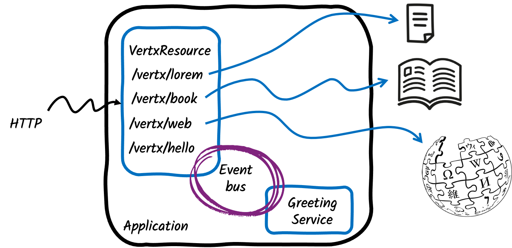

# Using Eclipse Vert.x API from a Quarkus Application

> **Guia oficial:** <https://quarkus.io/guides/vertx>  
> **Fuente:** `docs/src/main/asciidoc/vertx.adoc` en [quarkusio/quarkus@3.38.2](https://github.com/quarkusio/quarkus/blob/3.38.2/docs/src/main/asciidoc/vertx.adoc)  
> **Version documentada:** Quarkus 3.38.2 · **Sincronizado:** 2026-08-17 · **Licencia:** Apache-2.0

[Vert.x](https://vertx.io) is a toolkit for building reactive applications.
As described in the [Quarkus Reactive Architecture](quarkus-reactive-architecture.md), Quarkus uses Vert.x underneath.


Quarkus applications can access and use the Vert.x APIs.

This guide presents how you can build a Quarkus application using:

* the managed instance of Vert.x
* the Vert.x event bus
* the Vert.x Web Client

It’s an introductory guide.
The [Vert.x reference guide](vertx-reference.md) covers more advanced features such as verticles, and native transports.

## Architecture

We are going to build a simple application exposing four HTTP endpoints:

1. `/vertx/lorem` returns the content from a small file
2. `/vertx/book` returns the content from a large file (a book)
3. `/vertx/hello` uses the Vert.x event bus to produce the response
4. `/vertx/web` uses the Vert.x Web Client to retrieve data from Wikipedia



## Solution

We recommend that you follow the instructions in the following sections and create the application step by step.
However, you can go right to the completed example.

Clone the Git repository: `git clone https://github.com/quarkusio/quarkus-quickstarts.git`, or download an [archive](https://github.com/quarkusio/quarkus-quickstarts/archive/main.zip).

The solution is located in the `vertx-quickstart` [directory](https://github.com/quarkusio/quarkus-quickstarts/tree/main/vertx-quickstart).

<dl><dt><strong>💡 TIP: Mutiny</strong></dt><dd>

This guide uses the Mutiny API.
If you are not familiar with Mutiny, check [Mutiny - an intuitive, reactive programming library](mutiny-primer.md).
</dd></dl>

## Bootstrapping the application

Click on [this link](https://code.quarkus.io/?a=quarkus-getting-started-vertx&nc=true&e=rest-jackson&e=vertx) to configure your application.
It selected a few extensions:

* `rest-jackson`, which also brings `rest`. We are going to use it to expose our HTTP endpoints.
* `vertx`, which provides access to the underlying managed Vert.x

Click on the `Generate your application` button, download the zip file and unzip it.
Then, open the project in your favorite IDE.

If you open the generated build file, you can see the selected extensions:

**pom.xml**

```xml
<dependency>
  <groupId>io.quarkus</groupId>
  <artifactId>quarkus-rest-jackson</artifactId>
</dependency>
<dependency>
  <groupId>io.quarkus</groupId>
  <artifactId>quarkus-vertx</artifactId>
</dependency>
```

**build.gradle**

```gradle
implementation("io.quarkus:quarkus-rest-jackson")
implementation("io.quarkus:quarkus-vertx")
```

While you are in your build file, add the following dependency:

**pom.xml**

```xml
<dependency>
  <groupId>io.smallrye.reactive</groupId>
  <artifactId>smallrye-mutiny-vertx-web-client</artifactId>
</dependency>
```

**build.gradle**

```gradle
implementation("io.smallrye.reactive:smallrye-mutiny-vertx-web-client")
```

This dependency provides the Vert.x Web Client, which we will be using to implement the `/web` endpoint.

## Accessing the managed Vert.x instance

Create the `src/main/java/org/acme/VertxResource.java` file.
It will contain our HTTP endpoints.

In this file, copy the following code:

```java
package org.acme;

import io.smallrye.mutiny.Uni;
import io.vertx.mutiny.core.Vertx;

import java.nio.charset.StandardCharsets;

import jakarta.inject.Inject;
import jakarta.ws.rs.GET;
import jakarta.ws.rs.Path;

@Path("/vertx")                        // ①
public class VertxResource {

    private final Vertx vertx;

    @Inject                             // ②
    public VertxResource(Vertx vertx) { // ③
        this.vertx = vertx;             // ④
    }
}
```
1. Declare the root HTTP path.
2. We use constructor injection to receive the managed Vert.x instance. Field injection works too.
3. Receives the Vert.x instance as a constructor parameter
4. Store the managed Vert.x instance into a field.

With this, we can start implementing the endpoints.

## Using Vert.x Core API

The injected Vert.x instance provides a set of APIs you can use.
The one we are going to use in this section is the Vert.x File System.
It provides a non-blocking API to access files.

In the `src/main/resources` directory, create a `lorem.txt` file with the following content:

```text
Lorem ipsum dolor sit amet, consetetur sadipscing elitr, sed diam nonumy eirmod tempor invidunt ut labore et dolore magna aliquyam erat, sed diam voluptua. At vero eos et accusam et justo duo dolores et ea rebum. Stet clita kasd gubergren, no sea takimata sanctus est Lorem ipsum dolor sit amet. Lorem ipsum dolor sit amet, consetetur sadipscing elitr, sed diam nonumy eirmod tempor invidunt ut labore et dolore magna aliquyam erat, sed diam voluptua. At vero eos et accusam et justo duo dolores et ea rebum. Stet clita kasd gubergren, no sea takimata sanctus est Lorem ipsum dolor sit amet.
```

Then, in the `VertxResource` file add the following method:

```java
@GET                                                                                   // ①
@Path("/lorem")
public Uni<String> readShortFile() {                                                   // ②
    return vertx.fileSystem().readFile("lorem.txt")                                    // ③
            .onItem().transform(content -> content.toString(StandardCharsets.UTF_8));  // ④
}
```
1. This endpoint handles HTTP `GET` request on path `/lorem` (so the full path will be `vertx/lorem`)
2. As the Vert.x API is asynchronous, our method returns a `Uni`. The content is written into the HTTP response when the asynchronous operation represented by the Uni completes.
3. We use the Vert.x file system API to read the created file
4. Once the file is read, the content is stored in an in-memory buffer.  We transform this buffer into a String.

In a terminal, navigate to the root of the project and run:

**CLI**

```bash
quarkus dev
```
**Maven**

```bash
./mvnw quarkus:dev
```
**Gradle**

```bash
./gradlew --console=plain quarkusDev
```

In another terminal, run:

```bash
> curl http://localhost:8080/vertx/lorem
```

You should see the content of the file printed in the console.

**❗ IMPORTANT**\
Quarkus provides other ways to serve static files. This is an example made for the guide.

## Using Vert.x stream capability

Reading a file and storing the content in memory works for small files, but not big ones.
In this section, we will see how you can use Vert.x streaming capability.

First, download [War and Peace](https://www.gutenberg.org/files/2600/2600-0.txt) and store it in `src/main/resources/book.txt`.
It’s a 3.2 Mb file, which, while not being huge, illustrates the purpose of streams.
This time, we will not accumulate the file’s content in memory and write it in one batch, but read it chunk by chunk and write these chunks into the HTTP response one by one.

So, you should have the following files in your project:

```text
.
├── mvnw
├── mvnw.cmd
├── pom.xml
├── README.md
├── src
│  └── main
│     ├── docker
│     │  ├── ...
│     ├── java
│     │  └── org
│     │     └── acme
│     │        └── VertxResource.java
│     └── resources
│        ├── application.properties
│        ├── book.txt
│        └── lorem.txt
```
Add the following imports to the `src/main/java/org/acme/VertxResource.java` file:

```java

import io.smallrye.mutiny.Multi;
import io.vertx.core.file.OpenOptions;

```

Add the following method to the `VertxResource` class:

```java
@GET
@Path("/book")
public Multi<String> readLargeFile() {                                               // ①
    return vertx.fileSystem().open("book.txt",                                       // ②
                    new OpenOptions().setRead(true)
            )
            .onItem().transformToMulti(file -> file.toMulti())                       // ③
            .onItem().transform(content -> content.toString(StandardCharsets.UTF_8) // ④
                    + "\n------------\n");                                           // ⑤
}
```
1. This time, we return a Multi as we want to stream the chunks
2. We open the file using the `open` method. It returns a `Uni<AsyncFile>`
3. When the file is opened, we retrieve a `Multi` which will contain the chunks.
4. For each chunk, we produce a String
5. To visually see the chunks in the response, we append a separator

Then, in a terminal, run:

```bash
> curl http://localhost:8080/vertx/book
```

It should retrieve the book content.
In the output you should see the separator like:

```text
...
The little princess had also left the tea table and followed Hélène.

“Wait a moment, I’ll get my work.... Now then, what
------------
 are you
thinking of?” she went on, turning to Prince Hippolyte. “Fetch me my
workbag.”
...
```

## Using the event bus

One of the core features of Vert.x is the [event bus](https://vertx.io/docs/vertx-core/java/#event_bus).
It provides a message-based backbone to your application.
So, you can have components interacting using asynchronous message passing, and so decouple your components.
You can send a message to a single consumer, or dispatch to multiple consumers, or implement a request-reply interaction, where you send a message (request) and expect a response.
This is what we are going to use in this section.
Our `VertxResource` will send a message containing a name to the `greetings` address.
Another component will receive the message and produce the "hello $name" response.
The `VertxResource` will receive the response and return it as the HTTP response.

So, first, add the following imports to the `src/main/java/org/acme/VertxResource.java` file:

```java

import io.vertx.mutiny.core.eventbus.EventBus;
import jakarta.ws.rs.QueryParam;

```

Next, let’s extend our `VertxResource` class with the following code:

```java
@Inject
EventBus bus;                                                   // ①

@GET
@Path("/hello")
public Uni<String> hello(@QueryParam("name") String name) {     // ②
    return bus.<String>request("greetings", name)               // ③
            .onItem().transform(response -> response.body());   // ④
}
```
1. Inject the event bus. Alternatively you can use `vertx.eventBus()`.
2. We receive a _name_ as a query parameter
3. We use the `request` method to initiate the request-reply interaction. We send the name to the "greetings" address.
4. When the response is received, we extract the body and return it as the HTTP response

Now, we need the other side: the component receiving the name and replying.
Create the `src/main/java/org/acme/GreetingService.java` file with the following content:

```java
package org.acme;

import io.quarkus.vertx.ConsumeEvent;

import jakarta.enterprise.context.ApplicationScoped;

@ApplicationScoped                          // ①
public class GreetingService {

    @ConsumeEvent("greetings")              // ②
    public String hello(String name) {      // ③
        return "Hello " + name;             // ④
    }
}
```
1. Declaring a CDI Bean in the Application scope. Quarkus will create a single instance of this class.
2. Use the `@ConsumeEvent` annotation to declare a consumer. It is possible to use the Vert.x API [directly](https://vertx.io/docs/vertx-core/java/#_acknowledging_messages_sending_replies) too.
3. Receive the message payload as a method parameter. The returned object will be the reply.
4. Return the response. This response is sent back to the `VertxResource` class

Let’s try this.
In a terminal, run:

```bash
> curl "http://localhost:8080/vertx/hello?name=bob"
```

You should get the expected `Hello bob` message back.

## Using Vert.x Clients

So far, we have used the Vert.x Core API.
Vert.x offers much more.
It provides a vast ecosystem.
In this section, we will see how you can use the Vert.x Web Client, a reactive HTTP client.

Note that some Quarkus extensions are wrapping Vert.x clients and manage them for you.
That’s the case for the reactive data sources, Redis, mail...
That’s not the case with the Web Client.

Remember, at the beginning of the guide,  we added the `smallrye-mutiny-vertx-web-client` dependency to our `pom.xml` file.
It’s now time to use it.

First, add the following imports to the `src/main/java/org/acme/VertxResource.java` file:

```java

import io.vertx.core.json.JsonArray;
import io.vertx.mutiny.ext.web.client.HttpResponse;
import io.vertx.mutiny.ext.web.client.WebClient;

```

Next, we need to create an instance of `WebClient`.
Extend the `VertxResource` class with the `client` field and the creation of the web client in the constructor:

```java
private final Vertx vertx;
private final WebClient client;            // ①

@Inject
public VertxResource(Vertx vertx) {
    this.vertx = vertx;
    this.client = WebClient.create(vertx); // ②
}
```
1. Store the `WebClient`, so we will be able to use it in our HTTP endpoint
2. Create the `WebClient`. Be sure to use the `io.vertx.mutiny.ext.web.client.WebClient` class

Let’s now implement a new HTTP endpoint that queries the Wikipedia API to retrieve the pages about Quarkus in the different languages.
Add the following method to the `VertxResource` class:

```java
private static final String URL = "https://en.wikipedia.org/w/api.php?action=parse&page=Quarkus&format=json&prop=langlinks";

@GET
@Path("/web")
public Uni<JsonArray> retrieveDataFromWikipedia() {                     // ①
    return client.getAbs(URL).send()                                    // ②
            .onItem().transform(HttpResponse::bodyAsJsonObject)         // ③
            .onItem().transform(json -> json.getJsonObject("parse")     // ④
                                        .getJsonArray("langlinks"));
}
```
1. This endpoint returns a JSON Array. Vert.x provides a convenient way to manipulate JSON Object and Array. More details about these in [the reference guide](vertx-reference.md#using-vert-x-json).
2. Send a `GET` request to the Wikipedia API
3. Once the response is received, extract it as a JSON Object
4. Extract the `langlinks` array from the response.

Then, invoke the endpoint using:

```bash
> curl http://localhost:8080/vertx/web
[{"lang":"de","url":"https://de.wikipedia.org/wiki/Quarkus","langname":"German","autonym":"Deutsch","*":"Quarkus"},{"lang":"fr","url":"https://fr.wikipedia.org/wiki/Quarkus","langname":"French","autonym":"français","*":"Quarkus"}]
```

The response indicates that, in addition to the English page, there are a German and a French page about Quarkus on wikipedia.

## Executing Asynchronous Code From a Blocking Thread

Sometimes it’s necessary to execute an asynchronous code from a blocking thread.
Specifically, to execute the code on a Vert.x thread with an isolated/duplicated Vert.x context.
A typical example is an asynchronous code that needs to leverage the Hibernate Reactive API during application startup.
Quarkus provides the `VertxContextSupport#subscribeAndAwait()` method which subscribes to the supplied `io.smallrye.mutiny.Uni` on a Vert.x duplicated context, then blocks the current thread and waits for the result.

```java
void onStart(@Observes StartupEvent event, Mutiny.SessionFactory sf) {
   VertxContextSupport.subscribeAndAwait(() -> {
      return sf.withTransaction(session -> session.persist(new Person())); 
   });
}
```

**📌 NOTE**\
If necessary, the CDI request context is activated during execution of the asynchronous code.

**🔥 CAUTION**\
`VertxContextSupport#subscribeAndAwait()` must not be called on an event loop!

It is also possible to subscribe to a supplied `io.smallrye.mutiny.Multi` on a Vert.x duplicated context.
In this case, the current thread is not blocked and the supplied subscription logic is used to consume the events.

```java
void onStart(@Observes StartupEvent event, ExternalService service) {
   VertxContextSupport.subscribeWith(() -> service.getFoos(), foo -> {
     // do something useful with foo
   });
}
```

## Going further

This guide introduced how you can use Vert.x APIs from a Quarkus application.
It’s just a brief overview.
If you want to know more, check the [reference guide about Vert.x in Quarkus](vertx-reference.md).

As we have seen, the event bus is the connecting tissue of Vert.x applications.
Quarkus integrates it so different beans can interact with asynchronous messages.
This part is covered in the [event bus documentation](reactive-event-bus.md).

Learn how to implement highly performant, low-overhead database applications on Quarkus with the [Reactive SQL Clients](../03-datos/reactive-sql-clients.md).
