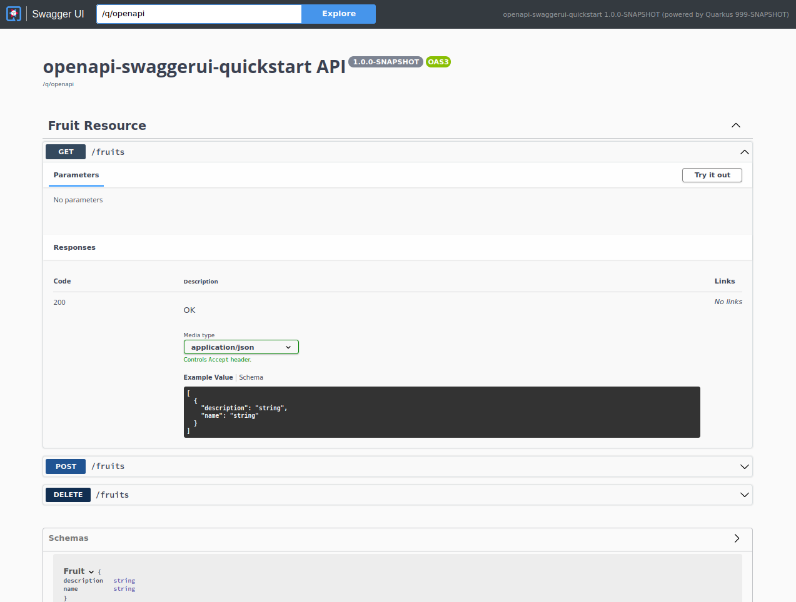
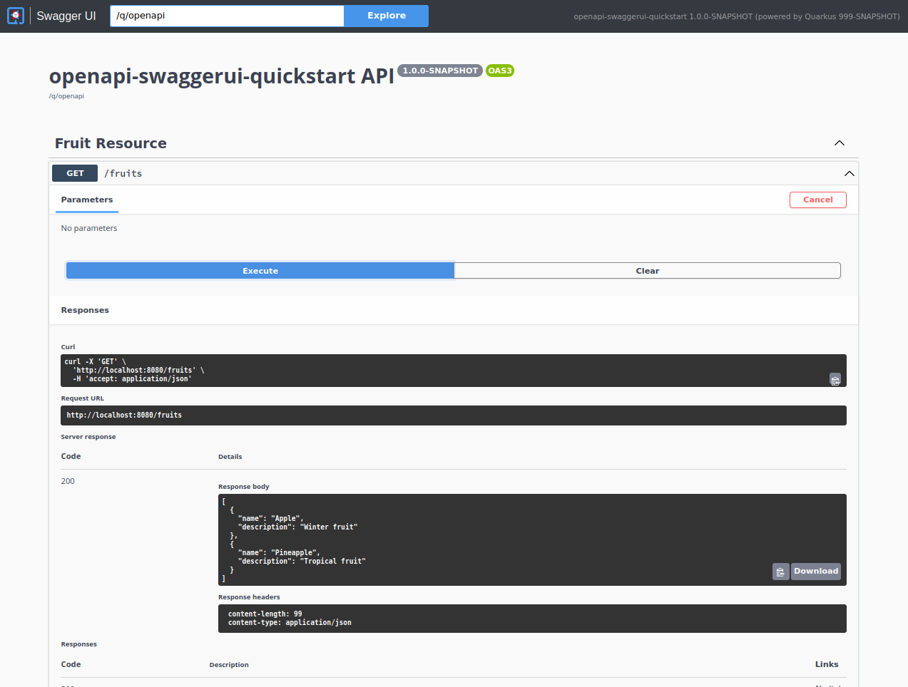

# Using OpenAPI and Swagger UI

> **Guia oficial:** <https://quarkus.io/guides/openapi-swaggerui>  
> **Fuente:** `docs/src/main/asciidoc/openapi-swaggerui.adoc` en [quarkusio/quarkus@3.38.2](https://github.com/quarkusio/quarkus/blob/3.38.2/docs/src/main/asciidoc/openapi-swaggerui.adoc)  
> **Version documentada:** Quarkus 3.38.2 · **Sincronizado:** 2026-08-17 · **Licencia:** Apache-2.0

This guide explains how your Quarkus application can expose its API description through an OpenAPI specification and
how you can test it via a user-friendly UI named Swagger UI.

## Prerequisites

To complete this guide, you need:

* Roughly 15 minutes
* An IDE
* JDK 17+ installed with `JAVA_HOME` configured appropriately
* Apache Maven 3.9.16
* Optionally the [Quarkus CLI](../10-extras/cli-tooling.md) if you want to use it
* Optionally Mandrel or GraalVM installed and [configured appropriately](../08-rendimiento-nativo/building-native-image.md#configuring-graalvm) if you want to build a native executable (or Docker if you use a native container build)

## Architecture

In this guide, we create a straightforward REST application to demonstrate how fast you can expose your API
specification and benefit from a user interface to test it.

## Solution

We recommend that you follow the instructions in the next sections and create the application step by step.
However, you can skip right to the completed example.

Clone the Git repository: `git clone https://github.com/quarkusio/quarkus-quickstarts.git`, or download an [archive](https://github.com/quarkusio/quarkus-quickstarts/archive/main.zip).

The solution is located in the `openapi-swaggerui-quickstart` [directory](https://github.com/quarkusio/quarkus-quickstarts/tree/main/openapi-swaggerui-quickstart).

## Creating the Maven project

First, we need a new project. Create a new project with the following command:

**CLI**

```bash
quarkus create app org.acme:openapi-swaggerui-quickstart \
    --extension='rest-jackson' \
    --no-code
cd openapi-swaggerui-quickstart
```

To create a Gradle project, add the `--gradle` or `--gradle-kotlin-dsl` option.

For more information about how to install and use the Quarkus CLI, see the [Quarkus CLI](../10-extras/cli-tooling.md) guide.

**Maven**

```bash
mvn io.quarkus.platform:quarkus-maven-plugin:3.38.2:create \
    -DprojectGroupId=org.acme \
    -DprojectArtifactId=openapi-swaggerui-quickstart \
    -Dextensions='rest-jackson' \
    -DnoCode
cd openapi-swaggerui-quickstart
```

To create a Gradle project, add the `-DbuildTool=gradle` or `-DbuildTool=gradle-kotlin-dsl` option.

For Windows users:

* If using cmd, (don’t use backward slash `\` and put everything on the same line)
* If using Powershell, wrap `-D` parameters in double quotes e.g. `"-DprojectArtifactId=openapi-swaggerui-quickstart"`

## Expose a REST Resource

We will create a `Fruit` bean and a `FruitResource` REST resource
(feel free to take a look to the [Writing JSON REST services guide](rest-json.md) if your want more details on how to build a REST API with Quarkus).

```java
package org.acme.openapi.swaggerui;

public class Fruit {

    public String name;
    public String description;

    public Fruit() {
    }

    public Fruit(String name, String description) {
        this.name = name;
        this.description = description;
    }
}
```

```java
package org.acme.openapi.swaggerui;

import jakarta.ws.rs.GET;
import jakarta.ws.rs.POST;
import jakarta.ws.rs.DELETE;
import jakarta.ws.rs.Path;
import java.util.Collections;
import java.util.LinkedHashMap;
import java.util.Set;

@Path("/fruits")
public class FruitResource {

    private Set<Fruit> fruits = Collections.newSetFromMap(Collections.synchronizedMap(new LinkedHashMap<>()));

    public FruitResource() {
        fruits.add(new Fruit("Apple", "Winter fruit"));
        fruits.add(new Fruit("Pineapple", "Tropical fruit"));
    }

    @GET
    public Set<Fruit> list() {
        return fruits;
    }

    @POST
    public Set<Fruit> add(Fruit fruit) {
        fruits.add(fruit);
        return fruits;
    }

    @DELETE
    public Set<Fruit> delete(Fruit fruit) {
        fruits.removeIf(existingFruit -> existingFruit.name.contentEquals(fruit.name));
        return fruits;
    }
}
```

You can also create a test:

```java
package org.acme.openapi.swaggerui;

import io.quarkus.test.junit.QuarkusTest;
import org.junit.jupiter.api.Test;

import jakarta.ws.rs.core.MediaType;

import static io.restassured.RestAssured.given;
import static org.hamcrest.CoreMatchers.is;
import static org.hamcrest.Matchers.containsInAnyOrder;

@QuarkusTest
public class FruitResourceTest {

    @Test
    public void testList() {
        given()
                .when().get("/fruits")
                .then()
                .statusCode(200)
                .body("$.size()", is(2),
                        "name", containsInAnyOrder("Apple", "Pineapple"),
                        "description", containsInAnyOrder("Winter fruit", "Tropical fruit"));
    }

    @Test
    public void testAdd() {
        given()
                .body("{\"name\": \"Pear\", \"description\": \"Winter fruit\"}")
                .header("Content-Type", MediaType.APPLICATION_JSON)
                .when()
                .post("/fruits")
                .then()
                .statusCode(200)
                .body("$.size()", is(3),
                        "name", containsInAnyOrder("Apple", "Pineapple", "Pear"),
                        "description", containsInAnyOrder("Winter fruit", "Tropical fruit", "Winter fruit"));

        given()
                .body("{\"name\": \"Pear\", \"description\": \"Winter fruit\"}")
                .header("Content-Type", MediaType.APPLICATION_JSON)
                .when()
                .delete("/fruits")
                .then()
                .statusCode(200)
                .body("$.size()", is(2),
                        "name", containsInAnyOrder("Apple", "Pineapple"),
                        "description", containsInAnyOrder("Winter fruit", "Tropical fruit"));
    }
}
```

## Expose OpenAPI Specifications

Quarkus provides the [SmallRye OpenAPI](https://github.com/smallrye/smallrye-open-api/) extension compliant with the
[MicroProfile OpenAPI](https://github.com/eclipse/microprofile-open-api/)
specification in order to generate your API
[OpenAPI v3 specification](https://spec.openapis.org/oas/v3.1.0.html).

You just need to add the `openapi` extension to your Quarkus application:

**CLI**

```bash
quarkus extension add quarkus-smallrye-openapi
```
**Maven**

```bash
./mvnw quarkus:add-extension -Dextensions='quarkus-smallrye-openapi'
```
**Gradle**

```bash
./gradlew addExtension --extensions='quarkus-smallrye-openapi'
```

This will add the following to your build file:

**pom.xml**

```xml
<dependency>
    <groupId>io.quarkus</groupId>
    <artifactId>quarkus-smallrye-openapi</artifactId>
</dependency>
```

**build.gradle**

```gradle
implementation("io.quarkus:quarkus-smallrye-openapi")
```

Now, we are ready to run our application:

**CLI**

```bash
quarkus dev
```
**Maven**

```bash
./mvnw quarkus:dev
```
**Gradle**

```bash
./gradlew --console=plain quarkusDev
```

Once your application is started, you can make a request to the default `/q/openapi` endpoint:

```shell
$ curl http://localhost:8080/q/openapi
openapi: 3.1.0
info:
  title: Generated API
  version: "1.0"
paths:
  /fruits:
    get:
      responses:
        200:
          description: OK
          content:
            application/json: {}
    post:
      requestBody:
        content:
          application/json:
            schema:
              $ref: '#/components/schemas/Fruit'
      responses:
        200:
          description: OK
          content:
            application/json: {}
    delete:
      requestBody:
        content:
          application/json:
            schema:
              $ref: '#/components/schemas/Fruit'
      responses:
        200:
          description: OK
          content:
            application/json: {}
components:
  schemas:
    Fruit:
      properties:
        description:
          type: string
        name:
          type: string
```

<dl><dt><strong>📌 NOTE</strong></dt><dd>

If you do not like the default endpoint location `/q/openapi`, you can change it by adding the following configuration to your `application.properties`:
```properties
quarkus.smallrye-openapi.path=/swagger
```
</dd></dl>

<dl><dt><strong>📌 NOTE</strong></dt><dd>

You can request the OpenAPI in JSON format using the `format` query parameter. For example:
```properties
/q/openapi?format=json
```
</dd></dl>

Hit `CTRL+C` to stop the application.

## Providing Application Level OpenAPI Annotations

There are some MicroProfile OpenAPI annotations which describe global API information, such as the following:

* API Title
* API Description
* Version
* Contact Information
* License

All of this information (and more) can be included in your Java code by using appropriate OpenAPI annotations
on a Jakarta REST `Application` class.  Because a Jakarta REST `Application` class is not required in Quarkus, you will
likely have to create one.  It can simply be an empty class that extends `jakarta.ws.rs.core.Application`.  This
empty class can then be annotated with various OpenAPI annotations such as `@OpenAPIDefinition`.  For example:

```java
@OpenAPIDefinition(
    tags = {
            @Tag(name="widget", description="Widget operations."),
            @Tag(name="gasket", description="Operations related to gaskets")
    },
    info = @Info(
        title="Example API",
        version = "1.0.1",
        contact = @Contact(
            name = "Example API Support",
            url = "http://exampleurl.com/contact",
            email = "techsupport@example.com"),
        license = @License(
            name = "Apache 2.0",
            url = "https://www.apache.org/licenses/LICENSE-2.0.html"))
)
public class ExampleApiApplication extends Application {
}
```

Another option, that is a feature provided by SmallRye and not part of the specification, is to use configuration to add this global API information.
This way, you do not need to have a Jakarta REST `Application` class, and you can name the API differently per environment.

For example, add the following to your `application.properties`:

```properties
quarkus.smallrye-openapi.info-title=Example API
%dev.quarkus.smallrye-openapi.info-title=Example API (development)
%test.quarkus.smallrye-openapi.info-title=Example API (test)
quarkus.smallrye-openapi.info-version=1.0.1
quarkus.smallrye-openapi.info-description=Just an example service
quarkus.smallrye-openapi.info-terms-of-service=Your terms here
quarkus.smallrye-openapi.info-contact-email=techsupport@example.com
quarkus.smallrye-openapi.info-contact-name=Example API Support
quarkus.smallrye-openapi.info-contact-url=http://exampleurl.com/contact
quarkus.smallrye-openapi.info-license-name=Apache 2.0
quarkus.smallrye-openapi.info-license-url=https://www.apache.org/licenses/LICENSE-2.0.html
```

This will give you similar information as the `@OpenAPIDefinition` example above.

## Enhancing the OpenAPI Schema with Filters

You can change the Generated OpenAPI Schema using one or more filter. Filters can run during build time, or at runtime.

```java
/**
 * Filter to add custom elements
 */
@OpenApiFilter(stages = {OpenApiFilter.RunStage.BUILD, OpenApiFilter.RunStage.RUNTIME_PER_REQUEST}) //<1>
public class MyMultiStageFilter implements OASFilter { //<2>

    private IndexView view;

    public MyMultiStageFilter(IndexView view) { //<3>
        this.view = view;
    }

    @Override
    public void filterOpenAPI(OpenAPI openAPI) { //<4>
        Collection<ClassInfo> knownClasses = this.view.getKnownClasses();
        Info info = OASFactory.createInfo();
        info.setDescription("Created from Annotated Buildtime filter with " + knownClasses.size() + " known indexed classes");
        openAPI.setInfo(info);
    }

}
```
1. Annotate the class with `@OpenApiFilter` and use the `stages` field with one or more of `BUILD`, `RUNTIME_STARTUP`, or `RUNTIME_PER_REQUEST`. This filter runs once during build, and once every time the OpenAPI document is requested.
2. Implement OASFilter and override any of its methods
3. Filters which run during the build of the application - i.e. `BUILD` Stage filters (See also [Advanced interactions of RunStages](#advanced-interactions-of-runstages)) - the Jandex index can be passed in the constructor. During application runtime, the Jandex index will **not** be null. However it will be empty, i.e it won’t contain info about any classes or annotations.
4. Get a hold of the generated `OpenAPI` Schema, and enhance as required

Remember that setting fields on the schema will override what has been generated, you might want to get and add to (so modify). Also know that the generated values might be null, so you will have to check for that.

### Overview of RunStages

| Stage | Meaning |
| --- | --- |
| BUILD | The filter executes at build time. |
| RUNTIME_STARTUP | The filter executes (eagerly) at application startup. |
| RUNTIME_PER_REQUEST | The filter executes each time the OpenAPI document is requested. |
| RUN | DEPRECATED. The filter executes at stage `RUNTIME_STARTUP` if `quarkus.smallrye-openapi.always-run-filter` is set to `false`, or at stage `RUNTIME_PER_REQUEST` if `quarkus.smallrye-openapi.always-run-filter` is set to `true`. (See also [Advanced interactions of RunStages](#advanced-interactions-of-runstages).) |
| BOTH | DEPRECATED. The filter executes as if both the `BUILD` and `RUN` stages were specified. |

**📌 NOTE**\
The `quarkus.smallrye-openapi.always-run-filter` configuration property is deprecated. Annotate your filters with `@OpenApiFilter(stages = OpenApiFilter.RunStage.RUNTIME_PER_REQUEST)` instead.

### Advanced interactions of RunStages

While the `BUILD` RunStage is expected to run at build time - as the name already suggests - there are additional RunStages that also execute at build time.

The `quarkus-smallrye-openapi` extension saves the OpenAPI Document to a file when the `quarkus.smallrye-openapi.store-schema-directory` is configured.
This saved version of the OpenAPI Document is useful for downstream consumers.

To produce an OpenAPI Document which possibly **could** match the one produced during runtime, the `RUN` and `RUNTIME_STARTUP` RunStages are executed at build time - in a separate step from the `BUILD` RunStage.
Any exception which occurs during this additional processing step is ignored, i.e. if one of the filters throws, none will have any effect.

This additional processing step is done even if `quarkus.smallrye-openapi.store-schema-directory` is **NOT** configured.

### The MicroProfile OpenAPI way

The Microprofile OpenAPI specification defines that **one** OASFilter implementation can be specified using the `mp.openapi.filter` configuration property. This filter will be run during RunStage `RUN`.

## Loading OpenAPI Schema From Static Files

Instead of dynamically creating OpenAPI schemas from annotation scanning, Quarkus also supports serving static OpenAPI documents.
The static file to serve must be a valid document conforming to the [OpenAPI specification](https://swagger.io/docs/specification).
An OpenAPI document that conforms to the  OpenAPI Specification is itself a valid JSON object, that can be represented in `yaml` or `json` formats.

To see this in action, we’ll put OpenAPI documentation under `META-INF/openapi.yaml` for our `/fruits` endpoints.
Quarkus also supports alternative [OpenAPI document paths](#open-document-paths) if you prefer.

```yaml
openapi: 3.1.0
info:
  title: Static OpenAPI document of fruits resource
  description: Fruit resources Open API documentation
  version: "1.0"

servers:
  - url: http://localhost:8080/q/openapi
    description: Optional dev mode server description

paths:
  /fruits:
    get:
      responses:
        200:
          description: OK - fruits list
          content:
            application/json: {}
    post:
      requestBody:
        content:
          application/json:
            schema:
              $ref: '#/components/schemas/Fruit'
      responses:
        200:
          description: new fruit resource created
          content:
            application/json: {}
    delete:
      requestBody:
        content:
          application/json:
            schema:
              $ref: '#/components/schemas/Fruit'
      responses:
        200:
          description: OK - fruit resource deleted
          content:
            application/json: {}
components:
  schemas:
    Fruit:
      properties:
        description:
          type: string
        name:
          type: string
```
By default, a request to `/q/openapi` will serve the combined OpenAPI document from the static file and the model generated from application endpoints code.
We can however change this to only serve the static OpenAPI document by adding `mp.openapi.scan.disable=true` configuration into `application.properties`.

Now, a request to `/q/openapi` endpoint will serve the static OpenAPI document instead of the generated one.

<dl><dt><strong><a name="open-document-paths"></a>💡 TIP: About OpenAPI document paths</strong></dt><dd>

Quarkus supports various paths to store your OpenAPI document under. We recommend you place it under `META-INF/openapi.yml`.
Alternative paths are:

* `META-INF/openapi.yaml`
* `META-INF/openapi.yml`
* `META-INF/openapi.json`
* `WEB-INF/classes/META-INF/openapi.yml`
* `WEB-INF/classes/META-INF/openapi.yaml`
* `WEB-INF/classes/META-INF/openapi.json`

Live reload of static OpenAPI document is supported during development. A modification to your OpenAPI document will be picked up on fly by Quarkus.
</dd></dl>

## Changing the OpenAPI version

By default, when the document is generated, the OpenAPI version used will be `3.1.0`. If you use a static file as mentioned above, the version in the file
will be used. You can also define the version in SmallRye using the following configuration:

```properties
quarkus.smallrye-openapi.open-api-version=3.0.4
```

This might be useful if your API goes through a Gateway that needs a certain version.

<dl><dt><strong>📌 NOTE</strong></dt><dd>

Changing the OpenAPI version between `3.0.x` and `3.1.x` versions will result in changes to the rendered document to satisfy the requirements
of the chosen version. A good starting point to learn about the differences between OpenAPI 3.0 and 3.1 is the
[OpenAPI Initiative](https://www.openapis.org/blog/2021/02/16/migrating-from-openapi-3-0-to-3-1-0).
</dd></dl>

## Auto-generation of Operation Id

The [Operation Id](https://swagger.io/docs/specification/paths-and-operations/) can be set using the `@Operation` annotation, and is in many cases useful when using a tool to generate a client stub from the schema.
The Operation Id is typically used for the method name in the client stub. In SmallRye, you can auto-generate this Operation Id by using the following configuration:

```properties
quarkus.smallrye-openapi.operation-id-strategy=METHOD
```

Now you do not need to use the `@Operation` annotation. While generating the document, the method name will be used for the Operation Id.

**The strategies available for generating the Operation Id**

| Property value | Description |
| --- | --- |
| `METHOD` | Use the method name. |
| `CLASS_METHOD` | Use the class name (without the package) plus the method. |
| `PACKAGE_CLASS_METHOD` | Use the class name plus the method name. |

## Generating multiple OpenAPI documents

Multiple OpenAPI documents can be generated. Each document has its own distinct configuration, and can be configured to use a different set of REST resources.

For example, suppose you have resource methods to retrieve users and orders in the application.

```java
@Path("/api")
public class MyResource {
    @Path("/users")
    @GET
    public List<UserDTO> listUsers() {
        // ...
    }

    @Path("/orders")
    @GET
    public List<OrderDTO> listOrders() {
        // ...
    }
}
```

Normally these two resource methods would end up being documented alongside each other in the same OpenAPI document.
These can be visually separated in the same OpenAPI document using tags. For larger deployments with multiple resources, however, this will still lead to:

* A possibly unusable OpenAPI document, as the documentation grows in size with each added resource method
* Potentially increased size or complexity for automatically generated API clients

Therefore, resource methods can be separated into distinct OpenAPI documents. Only a few annotations and a bit of configuration are needed.

The general idea is to group the resource methods into distinct profiles. This is achieved using an `@Extension(name = "x-smallrye-profile-<profile-name>", value = "")` annotation.
The `x-smallrye-profile-` part is a prefix, and `<profile-name>` is a name for the profile which is freely definable.

The resource with added extensions now looks like this:

```java
import org.eclipse.microprofile.openapi.annotations.extensions.Extension;

@Path("/api")
public class MyResource {
    @Path("/users")
    @GET
    @Extension(name = "x-smallrye-profile-user", value = "")
    public List<UserDTO> listUsers() {
        // ...
    }

    @Path("/orders")
    @GET
    @Extension(name = "x-smallrye-profile-order", value = "")
    public List<OrderDTO> listOrders() {
        // ...
    }
}
```

In the application.properties file, add the following build time configuration.

```properties
quarkus.smallrye-openapi.info-title=Combined documentation
quarkus.smallrye-openapi.user.scan-profiles=user ①
quarkus.smallrye-openapi.order.scan-profiles=order
```
1. Note that in this example, both the profile name and the document name match. They are, however, both freely definable.

This will trigger Quarkus to create 3 OpenAPI documents.

* One where all operations are present. By default, served under `/q/openapi`
* One where only the user operations are present. By default, served under `/q/openapi-user`
* One where only the order operations are present. By default, served under `/q/openapi-order`

Exclusions are also possible using `quarkus.smallrye-openapi.<document-name>.scan-exclude-profiles`.

The `@Extension` annotation can be placed on resource classes and resource methods. However, the list of extensions defined at both places will **not** be combined.
The effective extensions of an OpenAPI operation are either the list of extensions from the resource method, or if none are present the list of extensions from the resource class.

Multiple profiles can be specified for the `scan-profiles` and `scan-exclude-profiles` configuration properties.
Multiple profiles can be specified on resource classes and resource methods by using multiple `@Extension` annotations.
The `x-smallrye-profile` extensions are **not** included in the final OpenAPI documents.

### Filtering of operations

As shown in the previous section, a profile for an operation can be defined using an `@Extension`.
Operations are filtered into documents based on their profiles:

* Operations without any profile are always **included**.
* If `scan-exclude-profiles` is configured: operations are **excluded** if any of their profiles match.
* If `scan-profiles` is configured and `scan-exclude-profiles` is **not** configured: operations are **included** only if at least one profile matches the `scan-profiles`.
* If both `scan-exclude-profiles` and `scan-profiles` are configured, **only** `scan-exclude-profiles` is checked.
* If neither is configured: all operations are **included**.

### Cleanup

The generated OpenAPI documents by default include every schema, even those referenced by operations which are excluded.
The following configuration removes any unused schema.

```properties
mp.openapi.extensions.smallrye.remove-unused-schemas.enable=true
```

### Configuration applicability

The default document and all of the named documents support the same configuration.
There is a minor pitfall with the MicroProfile OpenAPI configuration though - MicroProfile-specific configuration properties apply to all documents; see the following examples.

```properties
quarkus.smallrye-openapi.servers=https://api.example.com
```

Config properties which are set for the default document are applied only for the default document, i.e. the OpenAPI document served at `/q/openapi`.

```properties
quarkus.smallrye-openapi.<document-name>.servers=https://api.example.com
```

Config properties which are set for a specific document are applied only for this specific document, i.e. the OpenAPI document served at `/q/openapi-<document-name>`.

```properties
mp.openapi.servers=https://api.example.com
```

MicroProfile OpenAPI config properties are applied to **ALL** OpenAPI documents.

### Filters

By default, OpenAPI filters apply to all documents.
This can be changed by configuring `@OpenApiFilter#documentNames`.

```java
import io.quarkus.smallrye.openapi.OpenApiFilter;
import org.eclipse.microprofile.openapi.OASFilter;

@OpenApiFilter(documentNames = {OpenApiFilter.DEFAULT_DOCUMENT_NAME, "user"}) ①
public class MyFilter implements OASFilter {
    // ...
}
```
1. This filter applies only to the default OpenAPI document, and to the document named `user`.

## Use Swagger UI for development

When building APIs, developers want to test them quickly. [Swagger UI](https://swagger.io/tools/swagger-ui/) is a great tool
permitting to visualize and interact with your APIs.
The UI is automatically generated from your OpenAPI specification.

The Quarkus `smallrye-openapi` extension comes with a `swagger-ui` extension embedding a properly configured Swagger UI page.

<dl><dt><strong>📌 NOTE</strong></dt><dd>

By default, Swagger UI is only available when Quarkus is started in dev or test mode.

If you want to make it available in production too, you can include the following configuration in your `application.properties`:
```properties
quarkus.swagger-ui.always-include=true
```

This is a build time property, it cannot be changed at runtime after your application is built.

</dd></dl>

By default, Swagger UI is accessible at `/q/swagger-ui`.

You can update the `/swagger-ui` sub path by setting the `quarkus.swagger-ui.path` property in your `application.properties`:

```properties
quarkus.swagger-ui.path=my-custom-path
```

<dl><dt><strong>⚠️ WARNING</strong></dt><dd>

The value `/` is not allowed as it blocks the application from serving anything else.
A value prefixed with '/' makes it absolute and not relative.
</dd></dl>

Now, we are ready to run our application:

```bash
./mvnw quarkus:dev
```

You can check the Swagger UI path in your application’s log:

```
00:00:00,000 INFO  [io.qua.swa.run.SwaggerUiServletExtension] Swagger UI available at /q/swagger-ui
```

Once your application is started, you can go to http://localhost:8080/q/swagger-ui and play with your API.

You can visualize your API’s operations and schemas.


You can also interact with your API in order to quickly test it.


Hit `CTRL+C` to stop the application.

### Styling
You can style the swagger ui by supplying your own logo and css.

#### Logo

To supply your own logo, you need to place a file called `logo.png` in `src/main/resources/META-INF/branding`.

This will set the logo for all UIs (not just swagger ui), so in this case also GraphQL-UI and Health-UI (if included).

If you only want to apply this logo to swagger-ui (and not globally to all UIs) call the file `smallrye-open-api-ui.png`
rather than `logo.png`.

#### CSS

To supply your own css that override/enhance style in the html, you need to place a file called `style.css` in `src/main/resources/META-INF/branding`.

This will add that css to all UIs (not just swagger ui), so in this case also GraphQL-UI and Health-UI (if included).

If you only want to apply this style to swagger-ui (and not globally to all UIs) call the file `smallrye-open-api-ui.css`
rather than `style.css`.

For more information on styling, read this blog entry: https://quarkus.io/blog/stylish-api/

### Cross Origin Resource Sharing

If you plan to consume this application from a Single Page Application running on a different domain, you will need to configure CORS (Cross-Origin Resource Sharing). Please read the [CORS filter](security-cors.md#cors-filter) section of the "Cross-origin resource sharing" guide for more details.

### Multiple OpenAPI Documents

Multiple OpenAPI documents will automatically show when they are generated by Quarkus as described in [Generating multiple OpenAPI documents](#generating-multiple-openapi-documents).
By default, Swagger UI renders a dropdown with entries named after their document name. Assuming a default document, an "order" document, and a "user" document are defined, the following entries will be shown:

* \&lt;default>
* order
* user

You may want to change this to more user-friendly names, based on your requirements. For example, changing the options in the dropdown to "Intro", "Order Service", "User Service" would look like this:

```properties
quarkus.swagger-ui.urls."Combined"=/q/openapi
quarkus.swagger-ui.urls."Order Service"=/q/openapi-order
quarkus.swagger-ui.urls."User Service"=/q/openapi-user
```

## Configuration Reference

### MicroProfile OpenAPI

MicroProfile OpenAPI Core configuration is defined in [MicroProfile OpenAPI Specification](https://download.eclipse.org/microprofile/microprofile-open-api-3.1.1/microprofile-openapi-spec-3.1.1.html#_core_configurations).
More information about the MicroProfile OpenAPI annotations can be found in the [MicroProfile OpenAPI API Javadoc](https://download.eclipse.org/microprofile/microprofile-open-api-3.1.1/apidocs/org/eclipse/microprofile/openapi/annotations/package-summary.html).

### OpenAPI

**📌 NOTE**\
La tabla de configuracion generada `quarkus-smallrye-openapi` se produce al construir la documentacion y no existe en el codigo fuente. Consulta la referencia de configuracion en https://quarkus.io/guides/all-config

### Swagger UI

**📌 NOTE**\
La tabla de configuracion generada `quarkus-swagger-ui` se produce al construir la documentacion y no existe en el codigo fuente. Consulta la referencia de configuracion en https://quarkus.io/guides/all-config
