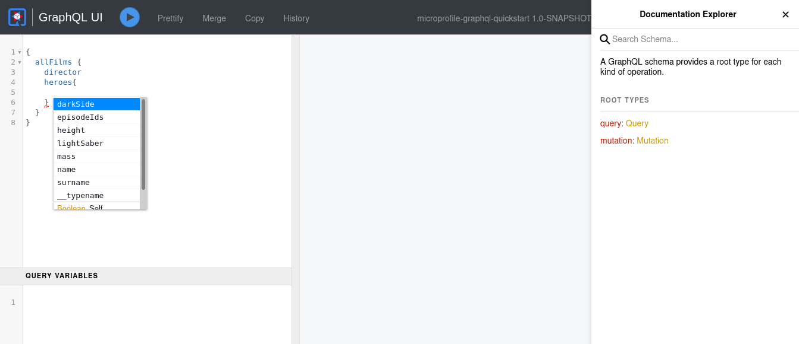

# SmallRye GraphQL

> **Guia oficial:** <https://quarkus.io/guides/smallrye-graphql>  
> **Fuente:** `docs/src/main/asciidoc/smallrye-graphql.adoc` en [quarkusio/quarkus@3.38.2](https://github.com/quarkusio/quarkus/blob/3.38.2/docs/src/main/asciidoc/smallrye-graphql.adoc)  
> **Version documentada:** Quarkus 3.38.2 · **Sincronizado:** 2026-08-17 · **Licencia:** Apache-2.0

This guide demonstrates how your Quarkus application can use [SmallRye GraphQL](https://github.com/smallrye/smallrye-graphql/),
an implementation of the [MicroProfile GraphQL](https://github.com/eclipse/microprofile-graphql/) specification.

As the [GraphQL](https://www.graphql.org/) specification website states:

GraphQL is a query language for APIs and a runtime for fulfilling those queries with your existing data.
GraphQL provides a complete and understandable description of the data in your API,
gives clients the power to ask for exactly what they need and nothing more, makes it easier to evolve APIs over time,
and enables powerful developer tools.

***GraphQL*** was originally developed by ***Facebook*** in 2012 and has been
an open standard since 2015.

GraphQL is not a replacement for REST API specification but merely an
alternative. Unlike REST, GraphQL API’s have the ability to benefit the client by:

* **Preventing Over-fetching and Under-fetching**\
    REST APIs are server-driven fixed data responses that cannot be determined by
    the client. Although the client does not require all the fields the client
    must retrieve all the data hence `Over-fetching`. A client may also require
    multiple REST API calls according to the first call (HATEOAS) to retrieve
    all the data that is required thereby `Under-fetching`.
* **API Evolution**\
    Since GraphQL API’s returns data that are requested by the client adding additional
    fields and capabilities to existing API will not create breaking changes to existing
    clients.

## Prerequisites

To complete this guide, you need:

* Roughly 15 minutes
* An IDE
* JDK 17+ installed with `JAVA_HOME` configured appropriately
* Apache Maven 3.9.16
* Optionally the [Quarkus CLI](../10-extras/cli-tooling.md) if you want to use it
* Optionally Mandrel or GraalVM installed and [configured appropriately](../08-rendimiento-nativo/building-native-image.md#configuring-graalvm) if you want to build a native executable (or Docker if you use a native container build)

## Architecture

In this guide, we build a simple GraphQL application that exposes a GraphQL API
at `/graphql`.

This example was inspired by a popular GraphQL API.

## Solution

We recommend that you follow the instructions in the next sections and create the application step by step.
However, you can go right to the completed example.

Clone the Git repository: `git clone https://github.com/quarkusio/quarkus-quickstarts.git`, or download an [archive](https://github.com/quarkusio/quarkus-quickstarts/archive/main.zip).

The solution is located in the `microprofile-graphql-quickstart` [directory](https://github.com/quarkusio/quarkus-quickstarts/tree/main/microprofile-graphql-quickstart).

## Creating the Maven Project

First, we need a new project. Create a new project with the following command:

**CLI**

```bash
quarkus create app org.acme:microprofile-graphql-quickstart \
    --extension='quarkus-smallrye-graphql' \
    --no-code
cd microprofile-graphql-quickstart
```

To create a Gradle project, add the `--gradle` or `--gradle-kotlin-dsl` option.

For more information about how to install and use the Quarkus CLI, see the [Quarkus CLI](../10-extras/cli-tooling.md) guide.

**Maven**

```bash
mvn io.quarkus.platform:quarkus-maven-plugin:3.38.2:create \
    -DprojectGroupId=org.acme \
    -DprojectArtifactId=microprofile-graphql-quickstart \
    -Dextensions='quarkus-smallrye-graphql' \
    -DnoCode
cd microprofile-graphql-quickstart
```

To create a Gradle project, add the `-DbuildTool=gradle` or `-DbuildTool=gradle-kotlin-dsl` option.

For Windows users:

* If using cmd, (don’t use backward slash `\` and put everything on the same line)
* If using Powershell, wrap `-D` parameters in double quotes e.g. `"-DprojectArtifactId=microprofile-graphql-quickstart"`

This command generates a project, importing the `smallrye-graphql` extension.

If you already have your Quarkus project configured, you can add the `smallrye-graphql` extension
to your project by running the following command in your project base directory:

**CLI**

```bash
quarkus extension add quarkus-smallrye-graphql
```
**Maven**

```bash
./mvnw quarkus:add-extension -Dextensions='quarkus-smallrye-graphql'
```
**Gradle**

```bash
./gradlew addExtension --extensions='quarkus-smallrye-graphql'
```

This will add the following to your build file:

**pom.xml**

```xml
<dependency>
    <groupId>io.quarkus</groupId>
    <artifactId>quarkus-smallrye-graphql</artifactId>
</dependency>
```

**build.gradle**

```gradle
implementation("io.quarkus:quarkus-smallrye-graphql")
```

## Preparing an Application: GraphQL API

In this section we will start creating the GraphQL API.

First, create the following entities representing a film from a galaxy far, far away:

```java
package org.acme.microprofile.graphql;

public class Film {

    public String title;
    public Integer episodeID;
    public String director;
    public LocalDate releaseDate;

}

public class Hero {

    public String name;
    public String surname;
    public Double height;
    public Integer mass;
    public Boolean darkSide;
    public LightSaber lightSaber;
    public List<Integer> episodeIds = new ArrayList<>();

}

enum LightSaber {
    RED, BLUE, GREEN
}
```

**📌 NOTE**\
For readability we use classes with public fields, but classes with private fields with public getters and setters will also work.

The classes we have just created describe the GraphQL schema which is a
set of possible data (objects, fields, relationships) that a client can access.

Let’s continue with an example CDI bean, that would work as a repository:

```java
@ApplicationScoped
public class GalaxyService {

    private List<Hero> heroes = new ArrayList<>();

    private List<Film> films = new ArrayList<>();

    public GalaxyService() {

        Film aNewHope = new Film();
        aNewHope.title = "A New Hope";
        aNewHope.releaseDate = LocalDate.of(1977, Month.MAY, 25);
        aNewHope.episodeID = 4;
        aNewHope.director = "George Lucas";

        Film theEmpireStrikesBack = new Film();
        theEmpireStrikesBack.title = "The Empire Strikes Back";
        theEmpireStrikesBack.releaseDate = LocalDate.of(1980, Month.MAY, 21);
        theEmpireStrikesBack.episodeID = 5;
        theEmpireStrikesBack.director = "George Lucas";

        Film returnOfTheJedi = new Film();
        returnOfTheJedi.title = "Return Of The Jedi";
        returnOfTheJedi.releaseDate = LocalDate.of(1983, Month.MAY, 25);
        returnOfTheJedi.episodeID = 6;
        returnOfTheJedi.director = "George Lucas";

        films.add(aNewHope);
        films.add(theEmpireStrikesBack);
        films.add(returnOfTheJedi);

        Hero luke = new Hero();
        luke.name = "Luke";
        luke.surname = "Skywalker";
        luke.height = 1.7;
        luke.mass = 73;
        luke.lightSaber = LightSaber.GREEN;
        luke.darkSide = false;
        luke.episodeIds.addAll(Arrays.asList(4, 5, 6));

        Hero leia = new Hero();
        leia.name = "Leia";
        leia.surname = "Organa";
        leia.height = 1.5;
        leia.mass = 51;
        leia.darkSide = false;
        leia.episodeIds.addAll(Arrays.asList(4, 5, 6));

        Hero vader = new Hero();
        vader.name = "Darth";
        vader.surname = "Vader";
        vader.height = 1.9;
        vader.mass = 89;
        vader.darkSide = true;
        vader.lightSaber = LightSaber.RED;
        vader.episodeIds.addAll(Arrays.asList(4, 5, 6));

        heroes.add(luke);
        heroes.add(leia);
        heroes.add(vader);

    }

    public List<Film> getAllFilms() {
        return films;
    }

    public Film getFilm(int id) {
        return films.get(id);
    }

    public List<Hero> getHeroesByFilm(Film film) {
        return heroes.stream()
                .filter(hero -> hero.episodeIds.contains(film.episodeID))
                .collect(Collectors.toList());
    }

    public void addHero(Hero hero) {
        heroes.add(hero);
    }

    public Hero deleteHero(int id) {
        return heroes.remove(id);
    }

    public List<Hero> getHeroesBySurname(String surname) {
        return heroes.stream()
                .filter(hero -> hero.surname.equals(surname))
                .collect(Collectors.toList());
    }
}
```

Now, let’s create our first GraphQL API.

Edit the `org.acme.microprofile.graphql.FilmResource` class as following:

```java
@GraphQLApi // ①
public class FilmResource {

    @Inject
    GalaxyService service;

    @Query("allFilms") // ②
    @Description("Get all Films from a galaxy far far away") // ③
    public List<Film> getAllFilms() {
        return service.getAllFilms();
    }
}
```

1. `@GraphQLApi` annotation indicates that the CDI bean will be a GraphQL endpoint
2. `@Query` annotation defines that this method will be queryable with the name `allFilms`
3. Documentation of the queryable method

**💡 TIP**\
 The value of the `@Query` annotation is optional and would implicitly
be defaulted to the method name if absent.

This way we have created our first queryable API which we will later expand.

## Launch

Launch the quarkus application in dev mode:

**CLI**

```bash
quarkus dev
```
**Maven**

```bash
./mvnw quarkus:dev
```
**Gradle**

```bash
./gradlew --console=plain quarkusDev
```

## Introspect

The full schema of the GraphQL API can be retrieved by calling the following:

```bash
curl http://localhost:8080/graphql/schema.graphql
```

The server will return the complete schema of the GraphQL API.

## GraphQL UI

**📌 NOTE**\
Experimental - not included in the MicroProfile specification

GraphQL UI is a great tool permitting easy interaction with your GraphQL APIs.

The Quarkus `smallrye-graphql` extension ships with [GraphiQL](https://github.com/graphql/graphiql/blob/main/packages/graphiql/README.md) and enables it by default in `dev` and `test` modes,
but it can also be explicitly configured for `production` mode as well, by setting the `quarkus.smallrye-graphql.ui.always-include` configuration property to `true`.

The GraphQL UI can be accessed from http://localhost:8080/q/graphql-ui/ .



Have a look at the [Authorization of Web Endpoints](https://quarkus.io/guides/security-authorize-web-endpoints-reference) Guide on how to add/remove security for the GraphQL UI.

## Query the GraphQL API

Now visit the GraphQL UI page that has been deployed in `dev` mode.

Enter the following query to the GraphQL UI and press the `play` button:

```graphql
query allFilms {
  allFilms {
    title
    director
    releaseDate
    episodeID
  }
}
```

Since our query contains all the fields in the `Film` class
we will retrieve all the fields in our response. Since GraphQL API
responses are client determined, the client can choose which fields
it will require.

Let’s assume that our client only requires `title` and `releaseDate`
making the previous call to the API `Over-fetching` of unnecessary
data.

Enter the following query into the GraphQL UI and hit the `play` button:

```graphql
query allFilms {
  allFilms {
    title
    releaseDate
  }
}
```

Notice in the response we have only retrieved the required fields.
Therefore, we have prevented `Over-fetching`.

Let’s continue to expand our GraphQL API by adding the following to the
`FilmResource` class.

```java
    @Query
    @Description("Get a Films from a galaxy far far away")
    public Film getFilm(@Name("filmId") int id) {
        return service.getFilm(id);
    }
```

**⚠️ WARNING**\
Notice how we have excluded the value in the `@Query` annotation.
Therefore, the name of the query is implicitly set as the method name
excluding the `get`.

This query will allow the client to retrieve the film by id, and the `@Name` annotation on the parameter
changes the parameter name to `filmId` rather than the default `id` that it would be if you omit the `@Name` annotation.

Enter the following into the `GraphQL UI` and make a request.

```graphql
query getFilm {
  film(filmId: 1) {
    title
    director
    releaseDate
    episodeID
  }
}
```

The `film` query method requested fields can be determined
as such in our previous example. This way we can retrieve individual
film information.

However, say our client requires both films with filmId `0` and `1`.
In a REST API the client would have to make two calls to the API.
Therefore, the client would be `Under-fetching`.

In GraphQL, it is possible to make multiple queries at once.

Enter the following into the `GraphQL UI` to retrieve two films:

```graphql
query getFilms {
  film0: film(filmId: 0) {
    title
    director
    releaseDate
    episodeID
  }
  film1: film(filmId: 1) {
    title
    director
    releaseDate
    episodeID
  }
}
```

This enabled the client to fetch the required data in a single request.

## Expanding the API

Until now, we have created a GraphQL API to retrieve film data.
We now want to enable the clients to retrieve the `Hero` data of the `Film`.

Add the following to our `FilmResource` class:

```java
    public List<Hero> heroes(@Source Film film) { // ①
        return service.getHeroesByFilm(film);
    }
```

1. Enable `List<Hero>` data to be added to queries that respond with `Film`

By adding this method we have effectively changed the schema of the GraphQL API.
Although the schema has changed the previous queries will still work.
Since we only expanded the API to be able to retrieve the `Hero` data of the `Film`.

Enter the following into the `GraphQL UI` to retrieve the film and hero data.

```graphql
query getFilmHeroes {
  film(filmId: 1) {
    title
    director
    releaseDate
    episodeID
    heroes {
      name
      height
      mass
      darkSide
      lightSaber
    }
  }
}
```

The response now includes the heroes of the film.

### Batching

When you are exposing a `Collection` return like our `getAllFilms`, you might want to use the batch form of the above, to more efficiently fetch
the heroes:

```java
    public List<List<Hero>> heroes(@Source List<Film> films) { // ①
        // Here fetch all hero lists
    }
```

1. Here receive the films as a batch, allowing you to fetch the corresponding heroes.

### Non blocking

Queries can be made reactive by using `Uni` as a return type, or adding `@NonBlocking` to the method:

```java
    @Query
    @Description("Get a Films from a galaxy far far away")
    public Uni<Film> getFilm(int filmId) {
        // ...
    }
```

Or you can use `@NonBlocking`:

```java
    @Query
    @Description("Get a Films from a galaxy far far away")
    @NonBlocking
    public Film getFilm(int filmId) {
        // ...
    }
```

Using `Uni` or `@NonBlocking` means that the request will be executed on Event-loop threads rather than Worker threads.

You can mix Blocking and Non-blocking in one request,

```java
    @Query
    @Description("Get a Films from a galaxy far far away")
    @NonBlocking
    public Film getFilm(int filmId) {
        // ...
    }

    public List<Hero> heroes(@Source Film film) {
        return service.getHeroesByFilm(film);
    }
```

Above will fetch the film on the event-loop threads, but switch to the worker thread to fetch the heroes.

### RunOnVirtualThread

Queries can be run on a virtual thread by adding `@RunOnVirtualThread` to the method:

```java
    @Query
    @Description("Get a Films from a galaxy far far away")
    @RunOnVirtualThread
    public Film getFilm(int filmId) {
        // ...
    }
```

Please note the general guidelines for using [virtual threads](../01-fundamentos/virtual-threads.md)

## Abstract Types

The current schema is simple with only two concrete types, `Hero` and `Film`.
Now we want to expand our API with additional types and add some abstractions
that make interacting with them easy for clients.

### Interfaces

Let’s give our heroes some allies.

First, create a new entity to represent our `Ally`.

```java
public class Ally {

    public String name;
    public String surname;
    public Hero partner;
}
```

Update the `GalaxyService` to have some allies.

```java
    private List<Ally> allies = new ArrayList();

    public GalaxyService() {
        // ...

        Ally jarjar = new Ally();
        jarjar.name = "Jar Jar";
        jarjar.surname = "Binks";
        allies.add(jarjar);
    }

    public List<Ally> getAllAllies() {
        return allies;
    }
```

Let’s also update `FilmResource` to allow clients to query for all allies:

```java
    @Query
    public List<Ally> allies() {
        return service.getAllAllies();
    }
```

Enter the following into the `GraphQL UI` and make a request.

```graphql
query getAllies {
    allies {
        name
        surname
    }
}
```

Notice that `Ally` has a some of the same fields as a `Hero`.
To better make queries easier for clients, let’s create an abstraction for any character.

Create a new Java interface that defines our common character traits.

```java
public interface Character {

    // ①
    String getName();
    String getSurname();
}
```

1. Getters defined in an interface will define the GraphQL fields that it contains

Now, update our `Hero` and `Ally` entities to implement this interface.

```java
public class Hero implements Character {
    // ...

    // ①
    public String getName() {
        return name;
    }

    // ①
    public String getSurname() {
        return surname;
    }
}

public class Ally implements Character {
    // ...

    // ①
    public String getName() {
        return name;
    }

    // ①
    public String getSurname() {
        return surname;
    }
}
```

1. Because interfaces can’t define fields, we have to implement the getters

By adding an interface and updating existing entities to implement it, we have effectively changed the schema.
The updated schema will now include the new `Ally` type and `Character` interface.

```graphql
# ①
interface Character {
    name: String
    surname: String
}

# ②
type Ally implements Character {
    name: String
    surname: String
    partner: Hero
}

# ③
type Hero implements Character {
    name: String
    surname: String
    # ...
}
```

1. The `Character` interface was defined with the getters as fields
2. The `Ally` type was added and it implements `Character`
3. The `Hero` type was updated to implement `Character`

Update our `GalaxyService` to provide all characters.

```java
    public List<Character> getAllCharacters() {
        List<Character> characters = new ArrayList<>();
        characters.addAll(heroes);
        characters.addAll(allies);
        return characters;
    }
```

Now we can allow clients to query for all characters, not just heroes.

Add the following to our `FilmResource` class:

```java
    @Query
    @Description("Get all characters from a galaxy far far away")
    public List<Character> characters() {
        return service.getAllCharacters();
    }
```

Enter the following into the `GraphQL UI` and make a request.

```graphql
query getCharacters {
    characters {
        name
        surname
    }
}
```

### Unions

**📌 NOTE**\
Experimental - not included in the MicroProfile specification

So far, our API has only allowed us to query directly for an entity or list of entities.
Now we want to allow clients to search all of our entities.
While `Hero` and `Ally` have a shared abstract type of `Character`, there is no abstraction that also includes `Film`.

First, create this new abstract type representing the possible return types for a search result.

```java
package org.acme.microprofile.graphql;

import io.smallrye.graphql.api.Union;

@Union // ①
public interface SearchResult {

}
```

1. `@Union` is required to indicate this Java interface represents a GraphQL union, not a GraphQL interface

**💡 TIP**\
The Java interface representing the GraphQL union does not have to be empty,
but any getters defined will not explicitly change the GraphQL schema.

Update our entities to implement `SearchResult`:

```java
public class Film implements SearchResult {
    // ...
}

public interface Character implements SearchResult {
    // ...
}

public class Hero implements Character {
    // ...
}

public class Ally implements Character {
    // ...
}
```

Update `GalaxyService` to provide search:

```java
    public List<SearchResult> search(String query) {
        List<SearchResult> results = new ArrayList<>();
        List<Film> matchingFilms = films.stream()
            .filter(film -> film.title.contains(query)
                || film.director.contains(query))
            .collect(Collectors.toList());
        results.addAll(matchingFilms);
        List<Character> matchingCharacters = getAllCharacters().stream()
            .filter(character -> character.getName().contains(query)
                || character.getSurname().contains(query))
            .collect(Collectors.toList());
        results.addAll(matchingCharacters);
        return results;
    }
```

Add the following to our `FilmResource` class:

```java
    @Query
    @Description("Search for heroes or films")
    public List<SearchResult> search(String query) {
        return service.search(query);
    }
```

Enter the following into the `GraphQL UI` and make a request.

```graphql
query searchTheGalaxy {
    search(query: "a") {
        ... on Film {
            title
            director
        }
        ... on Character {
            name
            surname
        }
    }
}
```

**📌 NOTE**\
We are able to use the `Character` interface because the `SearchResult` union contains members that implement it.

## Mutations

Mutations are used when data is created, updated or deleted.

Let’s now add the ability to add and delete heroes to our GraphQL API.

Add the following to our `FilmResource` class:

```java
    @Mutation
    public Hero createHero(Hero hero) {
        service.addHero(hero);
        return hero;
    }

    @Mutation
    public Hero deleteHero(int id) {
        return service.deleteHero(id);
    }
```

Enter the following into the `GraphQL UI` to insert a `Hero`:

```graphql
mutation addHero {
  createHero(hero: {
      name: "Han",
      surname: "Solo"
      height: 1.85
      mass: 80
      darkSide: false
      episodeIds: [4, 5, 6]
  	}
  )
  {
    name
    surname
  }
}
```

By using this mutation we have created a `Hero` entity in our service.

Notice how in the response we have retrieved the `name` and `surname`
of the created Hero. This is because we selected to retrieve
these fields in the response within the `{ }` in the mutation query.
This can easily be a server side generated field that the client may require.

Let’s now try deleting an entry:

```graphql
mutation DeleteHero {
  deleteHero(id :3){
    name
    surname
  }
}
```

Similar to the `createHero` mutation method we also retrieve the `name` and
`surname` of the hero we have deleted which is defined in `{ }`.

## Subscriptions

Subscriptions allow you to subscribe to a query. It allows you to receive events and is using web sockets.
See the [GraphQL over WebSocket Protocol](https://github.com/enisdenjo/graphql-ws/blob/master/PROTOCOL.md) spec for more details.

Example: We want to know when new Heroes are being created:

```java

    BroadcastProcessor<Hero> processor = BroadcastProcessor.create(); // ①

    @Mutation
    public Hero createHero(Hero hero) {
        service.addHero(hero);
        processor.onNext(hero); // ②
        return hero;
    }

    @Subscription
    public Multi<Hero> heroCreated(){
        return processor; // ③
    }

```

1. The `Multi` processor that will broadcast any new ``Hero``es
2. When adding a new `Hero`, also broadcast it
3. Make the stream available in the schema and as a WebSocket during runtime

Any client that now connect to the `/graphql` WebSocket connection will receive events on new Heroes being created:

```graphql

subscription ListenForNewHeroes {
  heroCreated {
    name
    surname
  }
}

```

## Creating Queries by fields

Queries can also be done on individual fields. For example, let’s
create a method to query heroes by their last name.

Add the following to our `FilmResource` class:

```java
    @Query
    public List<Hero> getHeroesWithSurname(@DefaultValue("Skywalker") String surname) {
        return service.getHeroesBySurname(surname);
    }
```

By using the `@DefaultValue` annotation we have determined that the surname value
will be `Skywalker` when the parameter is not provided.

Test the following queries with the `GraphQL UI`:

```graphql
query heroWithDefaultSurname {
  heroesWithSurname{
    name
    surname
    lightSaber
  }
}
query heroWithSurnames {
  heroesWithSurname(surname: "Vader") {
    name
    surname
    lightSaber
  }
}
```

## Context

You can get information about the GraphQL request anywhere in your code, using this experimental, SmallRye specific feature:

```java
@Inject
Context context;
```

or as a parameter in your method if you are in the `GraphQLApi` class, for instance:

```java
    @Query
    @Description("Get a Films from a galaxy far far away")
    public Film getFilm(Context context, int filmId) {
        // ...
    }
```

The context object allows you to get:

* the original request (Query/Mutation)
* the arguments
* the path
* the selected fields
* any variables

This allows you to optimize the downstream queries to the datastore.

See the [JavaDoc](https://javadoc.io/doc/io.smallrye/smallrye-graphql-api/latest/io/smallrye/graphql/api/Context.html) for more details.

### GraphQL-Java

This context object also allows you to fall down to the underlying [graphql-java](https://www.graphql-java.com/) features by using the leaky abstraction:

```java
DataFetchingEnvironment dfe = context.unwrap(DataFetchingEnvironment.class);
```

You can also get access to the underlying `graphql-java` during schema generation, to add your own features directly:

```java
public GraphQLSchema.Builder addMyOwnEnum(@Observes GraphQLSchema.Builder builder) {

    // Here add your own features directly, example adding an Enum
    GraphQLEnumType myOwnEnum = GraphQLEnumType.newEnum()
            .name("SomeEnum")
            .description("Adding some enum type")
            .value("value1")
            .value("value2").build();

    return builder.additionalType(myOwnEnum);
}
```

By using the `@Observer` you can add anything to the Schema builder.

**📌 NOTE**\
For the Observer to work, you need to enable events. In `application.properties`, add the following: `quarkus.smallrye-graphql.events.enabled=true`.

## Adapting

### Adapt to Scalar

Another SmallRye specific experimental feature, allows you to map an existing scalar (that is mapped by the implementation to a certain Java type) to another type,
or to map complex object, that would typically create a `Type` or `Input` in GraphQL, to an existing scalar.

#### Adapting an existing Scalar to another type:

```java
public class Movie {

    @AdaptToScalar(Scalar.Int.class)
    Long idLongThatShouldChangeToInt;

    // ....
}
```

Above will adapt the `Long` java type to an `Int` Scalar type, rather than the [default](https://download.eclipse.org/microprofile/microprofile-graphql-1.0/microprofile-graphql.html#scalars) `BigInteger`.

#### Adapting a complex object to a Scalar type:

```java
public class Person {

    @AdaptToScalar(Scalar.String.class)
    Phone phone;

    // ....
}
```

This will, rather than creating a `Type` or `Input` in GraphQL, map to a String scalar.

To be able to do the above, the `Phone` object needs to have a constructor that takes a String (or `Int` / `Date` / etc.),
or have a setter method for the String  (or `Int` / `Date` / etc.),
or have a `fromString` (or `fromInt` / `fromDate` - depending on the Scalar type) static method.

For example:

```java
public class Phone {

    private String number;

    // Getters and setters....

    public static Phone fromString(String number) {
        Phone phone = new Phone();
        phone.setNumber(number);
        return phone;
    }
}
```

See more about the `@AdaptToScalar` feature in the [JavaDoc](https://javadoc.io/static/io.smallrye/smallrye-graphql-api/1.5.0/io/smallrye/graphql/api/AdaptToScalar.html).

### Adapt with

Another option for more complex cases is to provide an Adapter. You can then do the mapping yourself in the adapter.

See more about the `AdaptWith` feature in the [JavaDoc](https://javadoc.io/static/io.smallrye/smallrye-graphql-api/1.5.0/io/smallrye/graphql/api/AdaptWith.html).

For example:

```java
    public class Profile {
        // Map this to an email address
        @AdaptWith(AddressAdapter.class)
        public Address address;

        // other getters/setters...
    }

    public class AddressAdapter implements Adapter<EmailAddress, Address> {

        @Override
        public Address from(EmailAddress email) {
            Address a = new Address();
            a.addressType = AddressType.email;
            a.addLine(email.getValue());
            return a;
        }

        @Override
        public EmailAddress to(Address address) {
            if (address != null && address.addressType != null && address.addressType.equals(AddressType.email)) {
                return new EmailAddress(address.lines.get(0));
            }
            return null;
        }
    }

```

**📌 NOTE**\
`@JsonbTypeAdapter` is also supported.

### Built-in support for Maps

By default, due to the fact that maps are hard to model in a schema (as the keys and values can be dynamic at runtime) GraphQL does not support maps by default.
Using the above adaption, `Map` support is added for Quarkus and are mapped to an `Entry<Key,Value>` with an optional key parameter.
This allows you to return a map, and optionally query it by key.

Example:

```java

    @Query
    public Map<ISO6391, Language> language() {
        return languageService.getLanguages();
    }

    public enum ISO6391 {
        af,
        en,
        de,
        fr
    }

    public class Language {
        private ISO6391 iso6391;
        private String nativeName;
        private String enName;
        private String please;
        private String thankyou;

        // Getters & Setters
    }

```

**📌 NOTE**\
The key and value object can be any of Enum, Scalar or Complex object

You can now query the whole map with all the fields:

```graphql
{
  language{
    key
    value {
      enName
      iso6391
      nativeName
      please
      thankyou
    }
  }
}
```

This will return a result like this for example:

```json
{
  "data": {
    "language": [
      {
        "key": "fr",
        "value": {
          "enName": "french",
          "iso6391": "fr",
          "nativeName": "français",
          "please": "s'il te plaît",
          "thankyou": "merci"
        }
      },
      {
        "key": "af",
        "value": {
          "enName": "afrikaans",
          "iso6391": "af",
          "nativeName": "afrikaans",
          "please": "asseblief",
          "thankyou": "dankie"
        }
      },
      {
        "key": "de",
        "value": {
          "enName": "german",
          "iso6391": "de",
          "nativeName": "deutsch",
          "please": "bitte",
          "thankyou": "danke dir"
        }
      },
      {
        "key": "en",
        "value": {
          "enName": "english",
          "iso6391": "en",
          "nativeName": "english",
          "please": "please",
          "thankyou": "thank you"
        }
      }
    ]
  }
}
```

You can also query by key

```graphql
{
  language (key:af){
    value {
      please
      thankyou
    }
  }
}
```

That will return only that value in the map:

```json
{
  "data": {
    "language": [
      {
        "value": {
          "please": "asseblief",
          "thankyou": "dankie"
        }
      }
    ]
  }
}
```

**📌 NOTE**\
The default map adapter can to overridden with our own implementation.

## Error code

You can add an error code on the error output in the GraphQL response by using the (SmallRye specific) `@ErrorCode`:

```java
@ErrorCode("some-business-error-code")
public class SomeBusinessException extends RuntimeException {
    // ...
}
```

When `SomeBusinessException` occurs, the error output will contain the Error code:

```graphql
{
    "errors": [
        {
            "message": "Unexpected failure in the system. Jarvis is working to fix it.",
            "locations": [
                {
                    "line": 2,
                    "column": 3
                }
            ],
            "path": [
                "annotatedCustomBusinessException"
            ],
            "extensions": {
                "exception": "io.smallrye.graphql.test.apps.error.api.ErrorApi$AnnotatedCustomBusinessException",
                "classification": "DataFetchingException",
                "code": "some-business-error-code" ①
            }
        }
    ],
    "data": {
        ...
    }
}
```

1. The error code

## JavaScript Client

When `quarkus.smallrye-graphql.js-client.enabled` is set to `true`, the extension generates a JavaScript client library and a typed proxy module as web resources at build time. These can be imported via the standard [import map](https://developer.mozilla.org/en-US/docs/Web/HTML/Element/script/type/importmap) convention when using [Web Dependency Locator](https://quarkus.io/guides/web-dependency-locator).

### Enabling the Client

Add to `application.properties`:

```properties
quarkus.smallrye-graphql.js-client.enabled=true
```

This generates two resources:

| Resource | Purpose |
| --- | --- |
| `@quarkus/graphql` | Reusable `GraphQLClient` class with `query()`, `mutate()`, and `subscribe()` methods |
| `@quarkus/graphql-api` | Typed proxy with exports for each GraphQL query, mutation, and subscription |

### Using the Typed Proxy

The generated proxy exports `Queries`, `Mutations`, and `Subscriptions` objects, plus the underlying `client` instance:

```javascript
import { client, Queries, Mutations } from '@quarkus/graphql-api';

// Call a query
const data = await Queries.allBooks();

// Call a query with variables
const result = await Queries.book({ id: 42 });

// Call a mutation
const created = await Mutations.createBook({ title: 'Quarkus in Action' });
```

Each function accepts a `variables` object matching the GraphQL operation’s arguments. The GraphQL query string, including the selection set, is generated automatically at build time.

### Subscriptions

Subscription operations return a `Subscription` object:

```javascript
import { Subscriptions } from '@quarkus/graphql-api';

const sub = Subscriptions.onBookCreated()
    .onData(data => console.log('New book:', data))
    .onError(err => console.error('Error:', err))
    .onComplete(() => console.log('Stream completed'));

// Cancel later
await sub.cancel();
```

Subscriptions use the `graphql-transport-ws` WebSocket subprotocol.

### Using the Client Library Directly

For more control, import the `GraphQLClient` class directly:

```javascript
import { GraphQLClient } from '@quarkus/graphql';

const client = new GraphQLClient({ endpoint: '/graphql' });

// Custom query
const data = await client.query(`
    query {
        allBooks {
            title
            author { name }
        }
    }
`);
```

## Conclusion

SmallRye GraphQL enables clients to retrieve the exact data that is
required preventing `Over-fetching` and `Under-fetching`.

The GraphQL API can be expanded without breaking previous queries enabling easy
API `evolution`.

## Configuration Reference

**📌 NOTE**\
La tabla de configuracion generada `quarkus-smallrye-graphql` se produce al construir la documentacion y no existe en el codigo fuente. Consulta la referencia de configuracion en https://quarkus.io/guides/all-config
