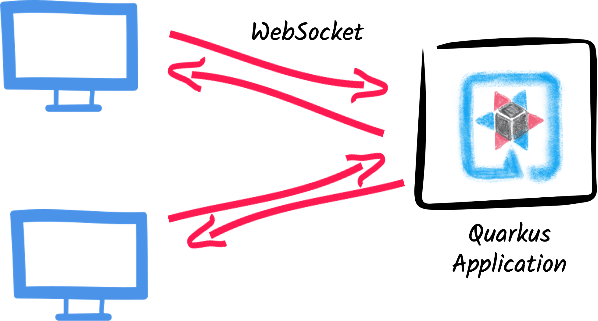
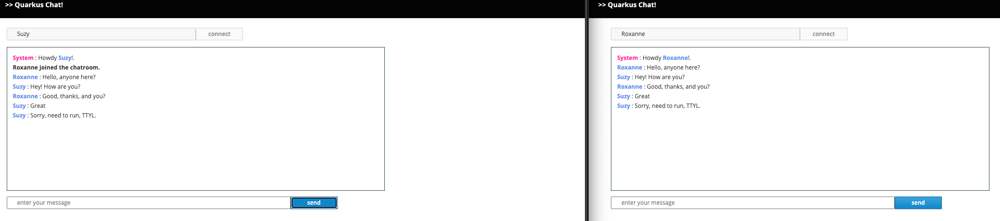

# Getting started with WebSockets Next

> **Guia oficial:** <https://quarkus.io/guides/websockets-next-tutorial>  
> **Fuente:** `docs/src/main/asciidoc/websockets-next-tutorial.adoc` en [quarkusio/quarkus@3.38.2](https://github.com/quarkusio/quarkus/blob/3.38.2/docs/src/main/asciidoc/websockets-next-tutorial.adoc)  
> **Version documentada:** Quarkus 3.38.2 · **Sincronizado:** 2026-08-17 · **Licencia:** Apache-2.0

This guide explains how your Quarkus application can utilize web sockets to create interactive web applications.
In this guide, we will develop a very simple chat application using web sockets to receive and send messages to the other connected users.

## Prerequisites

To complete this guide, you need:

* Roughly 15 minutes
* An IDE
* JDK 17+ installed with `JAVA_HOME` configured appropriately
* Apache Maven 3.9.16
* Optionally the [Quarkus CLI](../10-extras/cli-tooling.md) if you want to use it
* Optionally Mandrel or GraalVM installed and [configured appropriately](../08-rendimiento-nativo/building-native-image.md#configuring-graalvm) if you want to build a native executable (or Docker if you use a native container build)

## Quarkus WebSockets vs. Quarkus WebSockets Next

This guide uses the `quarkus-websockets-next` extension.
This extension is a new implementation of the WebSocket API that is more efficient and easier to use than the original `quarkus-websockets` extension. The original `quarkus-websockets` extension is still available and will continue to be supported.

Unlike `quarkus-websockets`, `quarkus-web-socket-next` does NOT implement [Jakarta WebSocket](https://jakarta.ee/specifications/websocket/).
Instead, it provides a simplified and more modern API that is easier to use.
It is also designed to work efficiently with Quarkus' reactive programming model and the Quarkus' networking layer.

## What you’ll learn

* How to use the `quarkus-websockets-next` extension
* How to declare a web socket endpoint
* How to send and receive messages using web sockets
* How to broadcast messages to all connected users
* How to be notified of new connections and disconnections
* How to use _path parameters_ in web socket URLs

## Architecture

In this guide, we create a straightforward chat application using web sockets to receive and send messages to the other connected users.



## Solution

We recommend that you follow the instructions in the next sections and create the application step by step.
However, you can skip right to the completed example.

Clone the Git repository: `git clone https://github.com/quarkusio/quarkus-quickstarts.git`, or download an [archive](https://github.com/quarkusio/quarkus-quickstarts/archive/main.zip).

The solution is located in the `websockets-next-quickstart` [directory](https://github.com/quarkusio/quarkus-quickstarts/tree/main/websockets-next-quickstart).

## Creating the Maven project

First, we need a new project. Create a new project with the following command:

**CLI**

```bash
quarkus create app org.acme:websockets-next-quickstart \
    --extension='websockets-next' \
    --no-code
cd websockets-next-quickstart
```

To create a Gradle project, add the `--gradle` or `--gradle-kotlin-dsl` option.

For more information about how to install and use the Quarkus CLI, see the [Quarkus CLI](../10-extras/cli-tooling.md) guide.

**Maven**

```bash
mvn io.quarkus.platform:quarkus-maven-plugin:3.38.2:create \
    -DprojectGroupId=org.acme \
    -DprojectArtifactId=websockets-next-quickstart \
    -Dextensions='websockets-next' \
    -DnoCode
cd websockets-next-quickstart
```

To create a Gradle project, add the `-DbuildTool=gradle` or `-DbuildTool=gradle-kotlin-dsl` option.

For Windows users:

* If using cmd, (don’t use backward slash `\` and put everything on the same line)
* If using Powershell, wrap `-D` parameters in double quotes e.g. `"-DprojectArtifactId=websockets-next-quickstart"`

This command generates the project (without any classes) and imports the `websockets-next` extension.

If you already have your Quarkus project configured, you can add the `websockets-next` extension
to your project by running the following command in your project base directory:

**CLI**

```bash
quarkus extension add websockets-next
```
**Maven**

```bash
./mvnw quarkus:add-extension -Dextensions='websockets-next'
```
**Gradle**

```bash
./gradlew addExtension --extensions='websockets-next'
```

This will add the following to your build file:

**pom.xml**

```xml
<dependency>
    <groupId>io.quarkus</groupId>
    <artifactId>quarkus-websockets-next</artifactId>
</dependency>
```

**build.gradle**

```gradle
implementation("io.quarkus:quarkus-websockets-next")
```

## Declaring a WebSocket endpoint

Our application contains a single class that handles the web sockets.
Create the `org.acme.websockets.ChatWebSocket` class in the `src/main/java` directory.
Copy the following content into the created file:

```java
package org.acme.websockets;

import io.quarkus.websockets.next.OnClose;
import io.quarkus.websockets.next.OnOpen;
import io.quarkus.websockets.next.OnTextMessage;
import io.quarkus.websockets.next.WebSocket;
import io.quarkus.websockets.next.WebSocketConnection;
import jakarta.inject.Inject;

@WebSocket(path = "/chat/{username}")  // ①
public class ChatWebSocket {

    // Declare the type of messages that can be sent and received
    public enum MessageType {USER_JOINED, USER_LEFT, CHAT_MESSAGE}
    public record ChatMessage(MessageType type, String from, String message) {
    }

    @Inject
    WebSocketConnection connection;  // ②

    @OnOpen(broadcast = true)       // ③
    public ChatMessage onOpen() {
        return new ChatMessage(MessageType.USER_JOINED, connection.pathParam("username"), null);
    }

    @OnClose                    // ④
    public void onClose() {
        ChatMessage departure = new ChatMessage(MessageType.USER_LEFT, connection.pathParam("username"), null);
        connection.broadcast().sendTextAndAwait(departure);
    }

    @OnTextMessage(broadcast = true)  // ⑤
    public ChatMessage onMessage(ChatMessage message) {
        return message;
    }

}
```
1. Declares the web socket endpoint and configure the path. Note that the path can contain a path parameter: `username`.
2. A _session scoped bean_ that represents the connection to the client. It allows sending messages programmatically and retrieve the path parameters.
3. This method is called when a new client connects. The `broadcast = true` attribute indicates that the returned message should be sent to all connected clients.
4. This method is called when a client disconnects. The method uses the `WebSocketConnection` to broadcast a message to all remaining connected clients.
5. This method is called when a client sends a message. The `broadcast = true` attribute indicates that the returned message should be sent to all connected clients. Here, we just returns the received (text) message.

As you can see, Quarkus handles the web socket lifecycle and message handling using annotations.
It also serializes and deserializes messages using JSON automatically.

## A slick web frontend

All chat applications need a _nice_ UI, well, this one may not be that nice, but does the work.
Quarkus automatically serves static resources contained in the `META-INF/resources` directory.
Create the `src/main/resources/META-INF/resources` directory and copy this [index.html](https://github.com/quarkusio/quarkus-quickstarts/blob/main/websockets-next-quickstart/src/main/resources/META-INF/resources/index.html) file in it.

## Run the application

Now, let’s see our application in action. Run it with:

**CLI**

```bash
quarkus dev
```
**Maven**

```bash
./mvnw quarkus:dev
```
**Gradle**

```bash
./gradlew --console=plain quarkusDev
```

Then open your 2 browser windows to http://localhost:8080/:

1. Enter a name in the top text area (use 2 different names).
2. Click on connect
3. Send and receive messages



As usual, the application can be packaged using:

**CLI**

```bash
quarkus build
```
**Maven**

```bash
./mvnw install
```
**Gradle**

```bash
./gradlew build
```

And executed using `java -jar target/quarkus-app/quarkus-run.jar`.

You can also build the native executable using:

**CLI**

```bash
quarkus build --native
```
**Maven**

```bash
./mvnw install -Dnative
```
**Gradle**

```bash
./gradlew build -Dquarkus.native.enabled=true
```

## Conclusion

This short getting started guide has shown you how to create a simple chat application using the `quarkus-websockets-next` extension.
Learn more about this extension on the [dedicated reference guide](websockets-next-reference.md).
