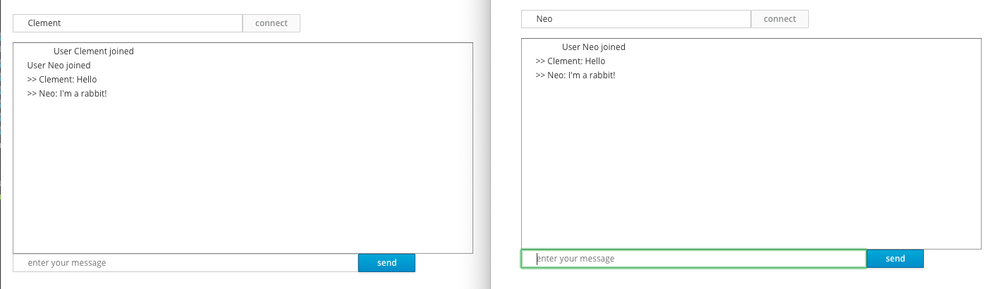

# Using WebSockets with Undertow

> **Guia oficial:** <https://quarkus.io/guides/websockets>  
> **Fuente:** `docs/src/main/asciidoc/websockets.adoc` en [quarkusio/quarkus@3.38.2](https://github.com/quarkusio/quarkus/blob/3.38.2/docs/src/main/asciidoc/websockets.adoc)  
> **Version documentada:** Quarkus 3.38.2 · **Sincronizado:** 2026-08-17 · **Licencia:** Apache-2.0

This guide explains how your Quarkus application can utilize web sockets to create interactive web applications,
in the context of an Undertow-based Quarkus application, or if you rely on [Jakarta WebSocket](https://jakarta.ee/specifications/websocket/).

<dl><dt><strong>💡 TIP</strong></dt><dd>

If you don’t use Undertow or [Jakarta WebSocket](https://jakarta.ee/specifications/websocket/),
it is recommended to use the more modern [WebSockets Next extensions](websockets-next-tutorial.md).
</dd></dl>

Because it’s the _canonical_ web socket application, we are going to create a simple chat application.

## Prerequisites

To complete this guide, you need:

* Roughly 15 minutes
* An IDE
* JDK 17+ installed with `JAVA_HOME` configured appropriately
* Apache Maven 3.9.16
* Optionally the [Quarkus CLI](../10-extras/cli-tooling.md) if you want to use it
* Optionally Mandrel or GraalVM installed and [configured appropriately](../08-rendimiento-nativo/building-native-image.md#configuring-graalvm) if you want to build a native executable (or Docker if you use a native container build)

## Architecture

In this guide, we create a straightforward chat application using web sockets to receive and send messages to the other connected users.


## Solution

We recommend that you follow the instructions in the next sections and create the application step by step.
However, you can skip right to the completed example.

Clone the Git repository: `git clone https://github.com/quarkusio/quarkus-quickstarts.git`, or download an [archive](https://github.com/quarkusio/quarkus-quickstarts/archive/main.zip).

The solution is located in the `websockets-quickstart` [directory](https://github.com/quarkusio/quarkus-quickstarts/tree/main/websockets-quickstart).

## Creating the Maven project

First, we need a new project. Create a new project with the following command:

**CLI**

```bash
quarkus create app org.acme:websockets-quickstart \
    --extension='websockets' \
    --no-code
cd websockets-quickstart
```

To create a Gradle project, add the `--gradle` or `--gradle-kotlin-dsl` option.

For more information about how to install and use the Quarkus CLI, see the [Quarkus CLI](../10-extras/cli-tooling.md) guide.

**Maven**

```bash
mvn io.quarkus.platform:quarkus-maven-plugin:3.38.2:create \
    -DprojectGroupId=org.acme \
    -DprojectArtifactId=websockets-quickstart \
    -Dextensions='websockets' \
    -DnoCode
cd websockets-quickstart
```

To create a Gradle project, add the `-DbuildTool=gradle` or `-DbuildTool=gradle-kotlin-dsl` option.

For Windows users:

* If using cmd, (don’t use backward slash `\` and put everything on the same line)
* If using Powershell, wrap `-D` parameters in double quotes e.g. `"-DprojectArtifactId=websockets-quickstart"`

This command generates the project (without any classes) and imports the `websockets` extension.

If you already have your Quarkus project configured, you can add the `websockets` extension
to your project by running the following command in your project base directory:

**CLI**

```bash
quarkus extension add websockets
```
**Maven**

```bash
./mvnw quarkus:add-extension -Dextensions='websockets'
```
**Gradle**

```bash
./gradlew addExtension --extensions='websockets'
```

This will add the following to your build file:

**pom.xml**

```xml
<dependency>
    <groupId>io.quarkus</groupId>
    <artifactId>quarkus-websockets</artifactId>
</dependency>
```

**build.gradle**

```gradle
implementation("io.quarkus:quarkus-websockets")
```

**📌 NOTE**\
If you only want to use the WebSocket client you should include `quarkus-websockets-client` instead.

## Handling web sockets

Our application contains a single class that handles the web sockets.
Create the `org.acme.websockets.ChatSocket` class in the `src/main/java` directory.
Copy the following content into the created file:

```java
package org.acme.websockets;

import java.util.Map;
import java.util.concurrent.ConcurrentHashMap;

import jakarta.enterprise.context.ApplicationScoped;
import jakarta.websocket.OnClose;
import jakarta.websocket.OnError;
import jakarta.websocket.OnMessage;
import jakarta.websocket.OnOpen;
import jakarta.websocket.server.PathParam;
import jakarta.websocket.server.ServerEndpoint;
import jakarta.websocket.Session;

@ServerEndpoint("/chat/{username}")         // ①
@ApplicationScoped
public class ChatSocket {

    Map<String, Session> sessions = new ConcurrentHashMap<>(); // ②

    @OnOpen
    public void onOpen(Session session, @PathParam("username") String username) {
        broadcast("User " + username + " joined");
        sessions.put(username, session);
    }

    @OnClose
    public void onClose(Session session, @PathParam("username") String username) {
        sessions.remove(username);
        broadcast("User " + username + " left");
    }

    @OnError
    public void onError(Session session, @PathParam("username") String username, Throwable throwable) {
        sessions.remove(username);
        broadcast("User " + username + " left on error: " + throwable);
    }

    @OnMessage
    public void onMessage(String message, @PathParam("username") String username) {
        broadcast(">> " + username + ": " + message);
    }

    private void broadcast(String message) {
        sessions.values().forEach(s -> {
            s.getAsyncRemote().sendObject(message, result ->  {
                if (result.getException() != null) {
                    System.out.println("Unable to send message: " + result.getException());
                }
            });
        });
    }

}
```
1. Configures the web socket URL
2. Stores the currently opened web sockets

## A slick web frontend

All chat applications need a _nice_ UI, well, this one may not be that nice, but does the work.
Quarkus automatically serves static resources contained in the `META-INF/resources` directory.
Create the `src/main/resources/META-INF/resources` directory and copy this [index.html](https://github.com/quarkusio/quarkus-quickstarts/blob/main/websockets-quickstart/src/main/resources/META-INF/resources/index.html) file in it.

## Run the application

Now, let’s see our application in action. Run it with:

**CLI**

```bash
quarkus dev
```
**Maven**

```bash
./mvnw quarkus:dev
```
**Gradle**

```bash
./gradlew --console=plain quarkusDev
```

Then open your 2 browser windows to http://localhost:8080/:

1. Enter a name in the top text area (use 2 different names).
2. Click on connect
3. Send and receive messages



As usual, the application can be packaged using:

**CLI**

```bash
quarkus build
```
**Maven**

```bash
./mvnw install
```
**Gradle**

```bash
./gradlew build
```

And executed using `java -jar target/quarkus-app/quarkus-run.jar`.

You can also build the native executable using:

**CLI**

```bash
quarkus build --native
```
**Maven**

```bash
./mvnw install -Dnative
```
**Gradle**

```bash
./gradlew build -Dquarkus.native.enabled=true
```

You can also test your web socket applications using the approach detailed [here](https://github.com/quarkusio/quarkus-quickstarts/blob/main/websockets-quickstart/src/test/java/org/acme/websockets/ChatTest.java).

## WebSocket Clients

Quarkus also contains a WebSocket client. You can call `ContainerProvider.getWebSocketContainer().connectToServer` to create a websocket connection. By default, the `quarkus-websockets` artifact includes both client and server support. However, if you only want the client you can include `quarkus-websockets-client` instead.

When you connect to the server you can either pass in the Class of the annotated client endpoint you want to use, or an instance of `jakarta.websocket.Endpoint`. If you
are using the annotated endpoint then you can use the exact same annotations as you can on the server, except it must be annotated with `@ClientEndpoint` instead of
`@ServerEndpoint`.

The example below shows the client being used to test the chat endpoint above.

```java
package org.acme.websockets;

import java.net.URI;
import java.util.concurrent.LinkedBlockingDeque;
import java.util.concurrent.TimeUnit;

import jakarta.websocket.ClientEndpoint;
import jakarta.websocket.ContainerProvider;
import jakarta.websocket.OnMessage;
import jakarta.websocket.OnOpen;
import jakarta.websocket.Session;

import org.junit.jupiter.api.Assertions;
import org.junit.jupiter.api.Test;

import io.quarkus.test.common.http.TestHTTPResource;
import io.quarkus.test.junit.QuarkusTest;

@QuarkusTest
public class ChatTest {

    private static final LinkedBlockingDeque<String> MESSAGES = new LinkedBlockingDeque<>();

    @TestHTTPResource("/chat/stu")
    URI uri;

    @Test
    public void testWebsocketChat() throws Exception {
        try (Session session = ContainerProvider.getWebSocketContainer().connectToServer(Client.class, uri)) {
            Assertions.assertEquals("CONNECT", MESSAGES.poll(10, TimeUnit.SECONDS));
            Assertions.assertEquals("User stu joined", MESSAGES.poll(10, TimeUnit.SECONDS));
            session.getAsyncRemote().sendText("hello world");
            Assertions.assertEquals(">> stu: hello world", MESSAGES.poll(10, TimeUnit.SECONDS));
        }
    }

    @ClientEndpoint
    public static class Client {

        @OnOpen
        public void open(Session session) {
            MESSAGES.add("CONNECT");
            // Send a message to indicate that we are ready,
            // as the message handler may not be registered immediately after this callback.
            session.getAsyncRemote().sendText("_ready_");
        }

        @OnMessage
        void message(String msg) {
            MESSAGES.add(msg);
        }

    }

}
```

## More WebSocket Information

The Quarkus WebSocket implementation is an implementation of [Jakarta Websockets](https://jakarta.ee/specifications/websocket/).
