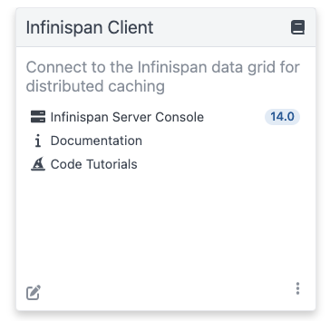
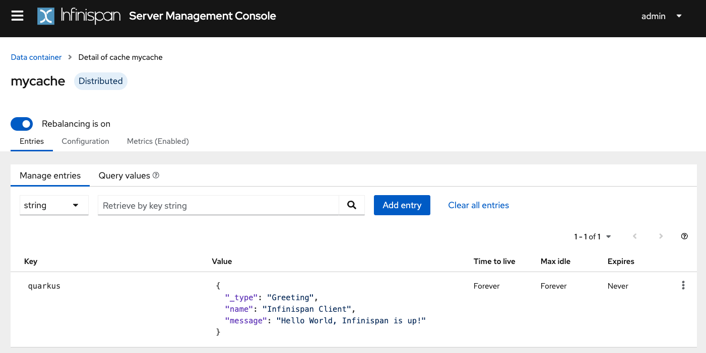

# Using the Infinispan Client

> **Guia oficial:** <https://quarkus.io/guides/infinispan-client>  
> **Fuente:** `docs/src/main/asciidoc/infinispan-client.adoc` en [quarkusio/quarkus@3.38.2](https://github.com/quarkusio/quarkus/blob/3.38.2/docs/src/main/asciidoc/infinispan-client.adoc)  
> **Version documentada:** Quarkus 3.38.2 · **Sincronizado:** 2026-08-17 · **Licencia:** Apache-2.0

This guide demonstrates how your Quarkus application can connect to an Infinispan server using the Infinispan Client extension.

## Prerequisites

To complete this guide, you need:

* Roughly 15 minutes
* An IDE
* JDK 17+ installed with `JAVA_HOME` configured appropriately
* Apache Maven 3.9.16
* Optionally the [Quarkus CLI](../10-extras/cli-tooling.md) if you want to use it
* Optionally Mandrel or GraalVM installed and [configured appropriately](../08-rendimiento-nativo/building-native-image.md#configuring-graalvm) if you want to build a native executable (or Docker if you use a native container build)
* A working Docker environment

## Architecture
In this guide, we are going to expose a Greeting Rest API to create and display greeting messages by using
the [Infinispan RemoteCache API](https://infinispan.org/docs/stable/titles/hotrod_java/hotrod_java.html#remotecache_api)
and `getAsync` and `putAsync` operations.

We’ll be using the Quarkus Infinispan Client extension to connect to interact with Infinispan.

## Solution
We recommend that you follow the instructions in the next sections and create the application step by step.
However, you can go right to the completed example.

Clone the Git repository: `git clone https://github.com/quarkusio/quarkus-quickstarts.git`, or download an [archive](https://github.com/quarkusio/quarkus-quickstarts/archive/main.zip).

The solution is located in the `infinispan-client-quickstart` [directory](https://github.com/quarkusio/quarkus-quickstarts/tree/main/infinispan-client-quickstart).

## Creating the Maven Project

First, we need a new project. Create a new project with the following command:

**CLI**

```bash
quarkus create app org.acme:infinispan-client-quickstart \
    --extension='infinispan-client,rest' \
    --no-code
cd infinispan-client-quickstart
```

To create a Gradle project, add the `--gradle` or `--gradle-kotlin-dsl` option.

For more information about how to install and use the Quarkus CLI, see the [Quarkus CLI](../10-extras/cli-tooling.md) guide.

**Maven**

```bash
mvn io.quarkus.platform:quarkus-maven-plugin:3.38.2:create \
    -DprojectGroupId=org.acme \
    -DprojectArtifactId=infinispan-client-quickstart \
    -Dextensions='infinispan-client,rest' \
    -DnoCode
cd infinispan-client-quickstart
```

To create a Gradle project, add the `-DbuildTool=gradle` or `-DbuildTool=gradle-kotlin-dsl` option.

For Windows users:

* If using cmd, (don’t use backward slash `\` and put everything on the same line)
* If using Powershell, wrap `-D` parameters in double quotes e.g. `"-DprojectArtifactId=infinispan-client-quickstart"`

This command generates a new project, importing the Infinispan Client extension.

If you already have your Quarkus project configured, you can add the `infinispan-client` extension
to your project by running the following command in your project base directory:

**CLI**

```bash
quarkus extension add infinispan-client
```
**Maven**

```bash
./mvnw quarkus:add-extension -Dextensions='infinispan-client'
```
**Gradle**

```bash
./gradlew addExtension --extensions='infinispan-client'
```

This will add the following to your build file:

**pom.xml**

```xml
<dependency>
    <groupId>io.quarkus</groupId>
    <artifactId>quarkus-infinispan-client</artifactId>
</dependency>
```

**build.gradle**

```gradle
implementation("io.quarkus:quarkus-infinispan-client")
annotationProcessor 'org.infinispan.protostream:protostream-processor:4.6.1.Final' ①
```
1. Mandatory in the Gradle build to enable the generation of the files in the annotation based serialization

## Creating the Greeting POJO
We are going to model our increments using the `Greeting` POJO.
Create the `src/main/java/org/acme/infinispan/client/Greeting.java` file, with the following content:

```java
package org.acme.infinispan.client;

import org.infinispan.protostream.annotations.Proto;

@Proto //<1>
public record Greeting(String name, String message) {} //<2>
```
1. You only need an annotation to tag the record to be marshalled by Protostream

Note that we are not going to use Java serialization. [Protostream](https://github.com/infinispan/protostream) is
a serialization library based on Protobuf data format part of Infinispan. Using an annotation based API, we
will store our data in Protobuf format.

## Creating the Greeting Schema
We are going to create our serialization schema using the `GreetingSchema` interface.
Create the `src/main/java/org/acme/infinispan/client/GreetingSchema.java` file, with the following content:

```java
package org.acme.infinispan.client;

import org.infinispan.protostream.GeneratedSchema;
import org.infinispan.protostream.annotations.ProtoSchema;

@ProtoSchema(includeClasses = Greeting.class) // ①
public interface GreetingSchema extends GeneratedSchema { // ②
}
```
1. Includes the `Greeting` pojo with the `@ProtoSchema` annotation
2. Extends `GeneratedSchema` Protostream API interface

The Protobuf Schema that will be generated and used both on client and Infinispan Server side, will have
the following content:

```protobuf
// File name: GreetingSchema.proto
// Generated from : org.acme.infinispan.client.GreetingSchema

syntax = "proto3";

message Greeting {

   optional string name = 1;

   optional string message = 2;
}
```

<dl><dt><strong>❗ IMPORTANT</strong></dt><dd>

You must include the Protostream annotations processor in your build file.
Starting with Java 24, schema generation will not work unless this annotation processor
is explicitly added.

**Maven**

```bash
<plugin>
    <artifactId>maven-compiler-plugin</artifactId>
    <version>${compiler-plugin.version}</version>
    <configuration>
        <annotationProcessorPaths>
            <path>
                <groupId>org.infinispan.protostream</groupId>
                <artifactId>protostream-processor</artifactId>
            </path>
        </annotationProcessorPaths>
    </configuration>
</plugin>
```

**build.gradle**

```gradle
annotationProcessor 'org.infinispan.protostream:protostream-processor:6.0.7' ①
```
</dd></dl>

## Creating the Infinispan Greeting Resource
Create the `src/main/java/org/acme/infinispan/client/InfinispanGreetingResource.java` file, with the following content:

```java
package org.acme.infinispan.client;

import io.quarkus.infinispan.client.Remote;
import jakarta.inject.Inject;
import jakarta.ws.rs.GET;
import jakarta.ws.rs.POST;
import jakarta.ws.rs.Path;
import org.infinispan.client.hotrod.RemoteCache;

import java.util.concurrent.CompletionStage;

@Path("/greeting")
public class InfinispanGreetingResource {

    @Inject
    @Remote("mycache") // ①
    RemoteCache<String, Greeting> cache; //<2>

    @POST
    @Path("/{id}")
    public CompletionStage<String> postGreeting(String id, Greeting greeting) {
        return cache.putAsync(id, greeting) // ③
              .thenApply(g -> "Greeting done!")
              .exceptionally(ex -> ex.getMessage());
    }

    @GET
    @Path("/{id}")
    public CompletionStage<Greeting> getGreeting(String id) {
        return cache.getAsync(id); // ④
    }
}
```
1. Use the `@Remote` annotation to use a cache. If the cache does not exist, will be created with a
default configuration **on first access**.
2. Inject the `RemoteCache`
3. Put the greeting id as a key and the Greeting pojo as a value
4. Get the greeting by id as the key

## Creating the test class

Edit the `pom.xml` file to add the following dependency:

```xml
<dependency>
    <groupId>io.rest-assured</groupId>
    <artifactId>rest-assured</artifactId>
    <scope>test</scope>
</dependency>
```

Create the `src/test/java/org/acme/infinispan/client/InfinispanGreetingResourceTest.java` file with the following content:

```java
package org.acme.infinispan.client;

import io.quarkus.test.junit.QuarkusTest;
import io.restassured.http.ContentType;
import org.junit.jupiter.api.Test;

import static io.restassured.RestAssured.given;
import static org.hamcrest.CoreMatchers.is;

@QuarkusTest
class InfinispanGreetingResourceTest {

    @Test
    public void testHelloEndpoint() {
        given()
              .contentType(ContentType.JSON)
              .body("{\"name\":\"Infinispan Client\",\"message\":\"Hello World, Infinispan is up!\"}")
              .when()
              .post("/greeting/quarkus")
              .then()
              .statusCode(200);

        given()
                .when().get("/greeting/quarkus")
                .then()
                .statusCode(200)
                .body(is("{\"name\":\"Infinispan Client\",\"message\":\"Hello World, Infinispan is up!\"}"));
    }
}
```

## Get it running

We just need to run the application using:

**CLI**

```bash
quarkus dev
```
**Maven**

```bash
./mvnw quarkus:dev
```
**Gradle**

```bash
./gradlew --console=plain quarkusDev
```

We should have the Infinispan server running thanks to the Dev Services.
We can access the Dev Services UI through `http://localhost:8080/q/dev/`.
The Dev UI should display the Infinispan UI Panel.



<dl><dt><strong>💡 TIP</strong></dt><dd>

Click on the Web Console link and log using `admin` and `password` default credentials.
Quarkus has uploaded into the Schemas Tab the Protobuf Schema that is needed to marshall on the server the
Greeting POJO with Protobuf.
Check the [Infinispan Dev Services Guide](https://quarkus.io/guides/infinispan-dev-services) to learn more.
</dd></dl>

## Interacting with the Greeting Service
As we have seen above, the Greeting API exposes two Rest endpoints.
In this section we are going to see how to create and display a greeting message.

### Creating a Greeting Message
With the following command, we will create a greeting message with the id `quarkus`.

```bash
curl -X POST http://localhost:8080/greeting/quarkus -H "Content-Type: application/json" -d '{"name" : "Infinispan Client", "message":"Hello World, Infinispan is up!"}'
```

The service should respond with a `Greeting added!` message.

### Displaying a Greeting Message
With the following command, we will display the greeting message with the id `quarkus`.
```bash
curl  http://localhost:8080/greeting/quarkus
```

The service should respond with the following json content.

```json
{
  "name" : "Infinispan Client",
  "message" : "Hello World, Infinispan is up!"
}
```

### Display the cache and content with the Infinispan Server Console

If a requested cache does not exist, Quarkus creates a cache with a Default configuration on first access.
We should be able to reaload the Infinispan Server Console and display the content of the Cache.
The Infinispan Server Console uses the [Infinispan Server REST API](https://infinispan.org/docs/stable/titles/rest/rest.html).
The content can be displayed in JSON thanks to the Protobuf Encoding that converts to JSON format.



## Configuring for production

At this point, Quarkus uses the Infinispan Dev Service to run an Infinispan server and configure the application.
However, in production, you will run your own Infinispan (or Red Hat Data Grid).

Let’s start an Infinispan server on the port 11222 using:

```shell
docker run -it -p 11222:11222 -e USER="admin" -e PASS="password" quay.io/infinispan/server:latest
```

Then, open the `src/main/resources/application.properties` file and add:

```properties
%prod.quarkus.infinispan-client.hosts=localhost:11222 ①
%prod.quarkus.infinispan-client.username=admin ②
%prod.quarkus.infinispan-client.password=password ③
```
1. Sets Infinispan Server address list, separated with semicolons
2. Sets the authentication username
3. Sets the authentication password

## Packaging and running in JVM mode

You can run the application as a conventional jar file.

First, we will need to package it:

**CLI**

```bash
quarkus build
```
**Maven**

```bash
./mvnw install
```
**Gradle**

```bash
./gradlew build
```

**📌 NOTE**\
This command will start an Infinispan instance to execute the tests.

Then run it:

```bash
java -jar target/quarkus-app/quarkus-run.jar
```

## Running Native

You can also create a native executable from this application without making any
source code changes. A native executable removes the dependency on the JVM:
everything needed to run the application on the target platform is included in
the executable, allowing the application to run with minimal resource overhead.

Compiling a native executable takes a bit longer, as GraalVM performs additional
steps to remove unnecessary codepaths. Use the  `native` profile to compile a
native executable:

**CLI**

```bash
quarkus build --native
```
**Maven**

```bash
./mvnw install -Dnative
```
**Gradle**

```bash
./gradlew build -Dquarkus.native.enabled=true
```

Once the build is finished, you can run the executable with:

```bash
./target/infinispan-client-quickstart-1.0.0-SNAPSHOT-runner
```

## Going further

To learn more about the Quarkus Infinispan extension, check [the Infinispan Client extension reference guide](infinispan-client-reference.md).
