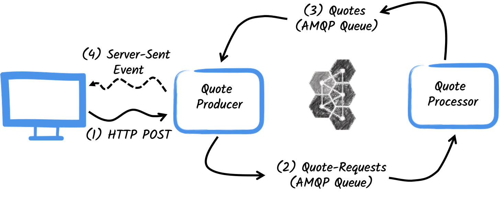
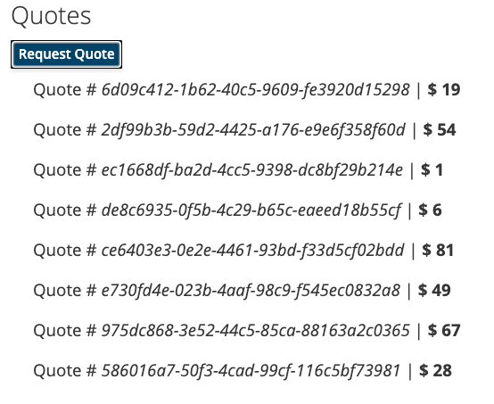

# Getting Started to Quarkus Messaging with AMQP 1.0

> **Guia oficial:** <https://quarkus.io/guides/amqp>  
> **Fuente:** `docs/src/main/asciidoc/amqp.adoc` en [quarkusio/quarkus@3.38.2](https://github.com/quarkusio/quarkus/blob/3.38.2/docs/src/main/asciidoc/amqp.adoc)  
> **Version documentada:** Quarkus 3.38.2 · **Sincronizado:** 2026-08-17 · **Licencia:** Apache-2.0

This guide demonstrates how your Quarkus application can utilize Quarkus Messaging to interact with AMQP 1.0.

**❗ IMPORTANT**\
If you want to use RabbitMQ, you should use the [Quarkus Messaging RabbitMQ extension](rabbitmq.md).
Alternatively, if you want to use RabbitMQ with AMQP 1.0 you need to enable the AMQP 1.0 plugin in the RabbitMQ broker;
check the [connecting to RabbitMQ](https://smallrye.io/smallrye-reactive-messaging/smallrye-reactive-messaging/3.9/amqp/amqp.html#amqp-rabbitmq)
documentation.

## Prerequisites

To complete this guide, you need:

* Roughly 15 minutes
* An IDE
* JDK 17+ installed with `JAVA_HOME` configured appropriately
* Apache Maven 3.9.16
* Docker and Docker Compose or [Podman](https://quarkus.io/guides/podman), and Docker Compose
* Optionally the [Quarkus CLI](../10-extras/cli-tooling.md) if you want to use it
* Optionally Mandrel or GraalVM installed and [configured appropriately](../08-rendimiento-nativo/building-native-image.md#configuring-graalvm) if you want to build a native executable (or Docker if you use a native container build)

## Architecture

In this guide, we are going to develop two applications communicating with an AMQP broker.
We will use [Artemis](https://activemq.apache.org/components/artemis/), but you can use any AMQP 1.0 broker.
The first application sends a _quote request_ to an AMQP queue and consumes messages from the _quote_ queue.
The second application receives the _quote request_ and sends a _quote_ back.



The first application, the `producer`, will let the user request some quotes over an HTTP endpoint.
For each quote request, a random identifier is generated and returned to the user, to put the quote request on _pending_.
At the same time, the generated request id is sent over the `quote-requests` queue.



The second application, the `processor`, in turn, will read from the `quote-requests` queue, put a random price to the quote, and send it to a queue named `quotes`.

Lastly, the `producer` will read the quotes and send them to the browser using server-sent events.
The user will therefore see the quote price updated from _pending_ to the received price in real-time.

## Solution

We recommend that you follow the instructions in the next sections and create applications step by step.
However, you can go right to the completed example.

Clone the Git repository: `git clone https://github.com/quarkusio/quarkus-quickstarts.git`, or download an [archive](https://github.com/quarkusio/quarkus-quickstarts/archive/main.zip).

The solution is located in the `amqp-quickstart` [directory](https://github.com/quarkusio/quarkus-quickstarts/tree/main/amqp-quickstart).

## Creating the Maven Project

First, we need to create two projects: the _producer_ and the _processor_.

To create the _producer_ project, in a terminal run:

**CLI**

```bash
quarkus create app org.acme:amqp-quickstart-producer \
    --extension='rest-jackson,messaging-amqp' \
    --no-code
```

To create a Gradle project, add the `--gradle` or `--gradle-kotlin-dsl` option.

For more information about how to install and use the Quarkus CLI, see the [Quarkus CLI](../10-extras/cli-tooling.md) guide.

**Maven**

```bash
mvn io.quarkus.platform:quarkus-maven-plugin:3.38.2:create \
    -DprojectGroupId=org.acme \
    -DprojectArtifactId=amqp-quickstart-producer \
    -Dextensions='rest-jackson,messaging-amqp' \
    -DnoCode

```

To create a Gradle project, add the `-DbuildTool=gradle` or `-DbuildTool=gradle-kotlin-dsl` option.

For Windows users:

* If using cmd, (don’t use backward slash `\` and put everything on the same line)
* If using Powershell, wrap `-D` parameters in double quotes e.g. `"-DprojectArtifactId=amqp-quickstart-producer"`

This command creates the project structure and selects the two Quarkus extensions we will be using:

1. Quarkus REST (formerly RESTEasy Reactive) and its Jackson support to handle JSON payloads
2. The Reactive Messaging AMQP connector

To create the _processor_ project, from the same directory, run:

**CLI**

```bash
quarkus create app org.acme:amqp-quickstart-processor \
    --extension='messaging-amqp' \
    --no-code
```

To create a Gradle project, add the `--gradle` or `--gradle-kotlin-dsl` option.

For more information about how to install and use the Quarkus CLI, see the [Quarkus CLI](../10-extras/cli-tooling.md) guide.

**Maven**

```bash
mvn io.quarkus.platform:quarkus-maven-plugin:3.38.2:create \
    -DprojectGroupId=org.acme \
    -DprojectArtifactId=amqp-quickstart-processor \
    -Dextensions='messaging-amqp' \
    -DnoCode

```

To create a Gradle project, add the `-DbuildTool=gradle` or `-DbuildTool=gradle-kotlin-dsl` option.

For Windows users:

* If using cmd, (don’t use backward slash `\` and put everything on the same line)
* If using Powershell, wrap `-D` parameters in double quotes e.g. `"-DprojectArtifactId=amqp-quickstart-processor"`

At that point, you should have the following structure:

```text
.
├── amqp-quickstart-processor
│  ├── README.md
│  ├── mvnw
│  ├── mvnw.cmd
│  ├── pom.xml
│  └── src
│     └── main
│        ├── docker
│        ├── java
│        └── resources
│           └── application.properties
└── amqp-quickstart-producer
   ├── README.md
   ├── mvnw
   ├── mvnw.cmd
   ├── pom.xml
   └── src
      └── main
         ├── docker
         ├── java
         └── resources
            └── application.properties
```

Open the two projects in your favorite IDE.

## The Quote object

The `Quote` class will be used in both `producer` and `processor` projects.
For the sake of simplicity, we will duplicate the class.
In both projects, create the `src/main/java/org/acme/amqp/model/Quote.java` file, with the following content:

```java
package org.acme.amqp.model;

import io.quarkus.runtime.annotations.RegisterForReflection;

@RegisterForReflection
public class Quote {

    public String id;
    public int price;

    /**
    * Default constructor required for Jackson serializer
    */
    public Quote() { }

    public Quote(String id, int price) {
        this.id = id;
        this.price = price;
    }

    @Override
    public String toString() {
        return "Quote{" +
                "id='" + id + '\'' +
                ", price=" + price +
                '}';
    }
}
```

JSON representation of `Quote` objects will be used in messages sent to the AMQP queues
and also in the server-sent events sent to browser clients.

Quarkus has built-in capabilities to deal with JSON AMQP messages.

<dl><dt><strong>📌 NOTE: @RegisterForReflection</strong></dt><dd>

The `@RegisterForReflection` annotation instructs Quarkus to keep the class, its fields, and methods when creating a native executable.
This is crucial when we later run our applications as native executables within containers.
Without this annotation, the native compilation process would discard the fields and methods during the dead-code elimination phase, which would lead to runtime errors.
More details about the `@RegisterForReflection` annotation can be found on  the [native application tips](../08-rendimiento-nativo/writing-native-applications-tips.md#registerForReflection) page.
</dd></dl>

## Sending quote request

Inside the `producer` project, locate the generated  `src/main/java/org/acme/amqp/producer/QuotesResource.java` file, and update the content to be:

```java
package org.acme.amqp.producer;

import java.util.UUID;

import jakarta.ws.rs.GET;
import jakarta.ws.rs.POST;
import jakarta.ws.rs.Path;
import jakarta.ws.rs.Produces;
import jakarta.ws.rs.core.MediaType;

import org.acme.amqp.model.Quote;
import org.eclipse.microprofile.reactive.messaging.Channel;
import org.eclipse.microprofile.reactive.messaging.Emitter;

import io.smallrye.mutiny.Multi;

@Path("/quotes")
public class QuotesResource {

    @Channel("quote-requests") Emitter<String> quoteRequestEmitter; // ①

    /**
     * Endpoint to generate a new quote request id and send it to "quote-requests" AMQP queue using the emitter.
     */
    @POST
    @Path("/request")
    @Produces(MediaType.TEXT_PLAIN)
    public String createRequest() {
        UUID uuid = UUID.randomUUID();
        quoteRequestEmitter.send(uuid.toString()); // ②
        return uuid.toString();
    }
}
```
1. Inject a Reactive Messaging `Emitter` to send messages to the `quote-requests` channel.
2. On a post request, generate a random UUID and send it to the AMQP queue using the emitter.

The `quote-requests` channel is going to be managed as a AMQP queue, as that’s the only connector on the classpath.
If not indicated otherwise, like in this example, Quarkus uses the channel name as AMQP queue name.
So, in this example, the application sends messages to the `quote-requests` queue.

**💡 TIP**\
When you have multiple connectors, you would need to indicate which connector you want to use in the application configuration.

## Processing quote requests

Now let’s consume the quote request and give out a price.
Inside the `processor` project, locate the `src/main/java/org/acme/amqp/processor/QuoteProcessor.java` file and add the following:

```java
package org.acme.amqp.processor;

import java.util.Random;

import jakarta.enterprise.context.ApplicationScoped;

import org.acme.amqp.model.Quote;
import org.eclipse.microprofile.reactive.messaging.Incoming;
import org.eclipse.microprofile.reactive.messaging.Outgoing;

import io.smallrye.reactive.messaging.annotations.Blocking;

/**
 * A bean consuming data from the "request" AMQP queue and giving out a random quote.
 * The result is pushed to the "quotes" AMQP queue.
 */
@ApplicationScoped
public class QuoteProcessor {

    private Random random = new Random();

    @Incoming("requests")       // ①
    @Outgoing("quotes")         // ②
    @Blocking                   // ③
    public Quote process(String quoteRequest) throws InterruptedException {
        // simulate some hard-working task
        Thread.sleep(200);
        return new Quote(quoteRequest, random.nextInt(100));
    }
}
```
1. Indicates that the method consumes the items from the `requests` channel
2. Indicates that the objects returned by the method are sent to the `quotes` channel
3. Indicates that the processing is _blocking_ and cannot be run on the caller thread.

The `process` method is called for every AMQP message from the `quote-requests` queue, and will send a `Quote` object to the `quotes` queue.

Because we want to consume messages from the `quotes-requests` queue into the `requests` channel, we need to configure this association.
Open the `src/main/resources/application.properties` file and add:

```properties
mp.messaging.incoming.requests.address=quote-requests
```

The configuration properties are structured as follows:

`mp.messaging.[outgoing|incoming].{channel-name}.property=value`

In our case, we want to configure the `address` attribute to indicate the name of the queue.

## Receiving quotes

Back to our `producer` project.
Let’s modify the `QuotesResource` to consume quotes, bind it to an HTTP endpoint to send events to clients:

```java
import io.smallrye.mutiny.Multi;
//...

@Channel("quotes") Multi<Quote> quotes;     // ①

/**
 * Endpoint retrieving the "quotes" queue and sending the items to a server sent event.
 */
@GET
@Produces(MediaType.SERVER_SENT_EVENTS) // ②
public Multi<Quote> stream() {
    return quotes; // ③
}
```
1. Injects the `quotes` channel using the `@Channel` qualifier
2. Indicates that the content is sent using `Server Sent Events`
3. Returns the stream (_Reactive Stream_)

## The HTML page

Final touch, the HTML page reading the converted prices using SSE.

Create inside the `producer` project `src/main/resources/META-INF/resources/quotes.html` file, with the following content:

```html
<!DOCTYPE html> <html lang="en"> <head> <meta charset="UTF-8"> <title>Quotes</title>

    <link rel="stylesheet" type="text/css"
          href="https://cdnjs.cloudflare.com/ajax/libs/patternfly/3.24.0/css/patternfly.min.css">
    <link rel="stylesheet" type="text/css"
          href="https://cdnjs.cloudflare.com/ajax/libs/patternfly/3.24.0/css/patternfly-additions.min.css">
</head>
<body>
<div class="container">
    <div class="card">
        <div class="card-body">
            <h2 class="card-title">Quotes</h2>
            <button class="btn btn-info" id="request-quote">Request Quote</button>
            <div class="quotes"></div>
        </div>
    </div>
</div>
</body>
<script src="https://code.jquery.com/jquery-3.6.0.min.js"></script>
<script>
    $("#request-quote").click((event) => {
        fetch("/quotes/request", {method: "POST"})
        .then(res => res.text())
        .then(qid => {
            var row = $(`<h4 class='col-md-12' id='${qid}'>Quote # <i>${qid}</i> | <strong>Pending</strong></h4>`);
            $(".quotes").append(row);
        });
    });
    var source = new EventSource("/quotes");
    source.onmessage = (event) => {
      var json = JSON.parse(event.data);
      $(`#${json.id}`).html(function(index, html) {
        return html.replace("Pending", `\$\xA0${json.price}`);
      });
    };
</script>
</html>
```

Nothing spectacular here.
On each received quote, it updates the page.

## Get it running

You just need to run both applications using:

```bash
> mvn -f amqp-quickstart-producer quarkus:dev
```

And, in a separate terminal:

```bash
> mvn -f amqp-quickstart-processor quarkus:dev
```

Quarkus starts an AMQP broker automatically, configures the application, and shares the broker instance between different applications.
See [Dev Services for AMQP](amqp-dev-services.md) for more details.

Open `http://localhost:8080/quotes.html` in your browser and request some quotes by clicking the button.

## Running in JVM or Native mode

When not running in dev or test mode, you will need to start your AMQP broker.
You can follow the instructions from the [Apache ActiveMQ Artemis website](https://activemq.apache.org/components/artemis/documentation/latest/using-server.html) or create a `docker-compose.yaml` file with the following content:

```yaml 
version: '2'

services:

  artemis:
    image: quay.io/arkmq-org/arkmq-org-broker:artemis.2.55.0
    ports:
      - "8161:8161"
      - "61616:61616"
      - "5672:5672"
    environment:
      AMQ_USER: quarkus
      AMQ_PASSWORD: quarkus
    networks:
      - amqp-quickstart-network

  producer:
    image: quarkus-quickstarts/amqp-quickstart-producer:1.0-${QUARKUS_MODE:-jvm}
    build:
      context: amqp-quickstart-producer
      dockerfile: src/main/docker/Dockerfile.${QUARKUS_MODE:-jvm}
    environment:
      AMQP_HOST: artemis
      AMQP_PORT: 5672
    ports:
      - "8080:8080"
    networks:
      - amqp-quickstart-network

  processor:
    image: quarkus-quickstarts/amqp-quickstart-processor:1.0-${QUARKUS_MODE:-jvm}
    build:
      context: amqp-quickstart-processor
      dockerfile: src/main/docker/Dockerfile.${QUARKUS_MODE:-jvm}
    environment:
      AMQP_HOST: artemis
      AMQP_PORT: 5672
    networks:
      - amqp-quickstart-network

networks:
  amqp-quickstart-network:
    name: amqp-quickstart
```

Note how the AMQP broker location is configured.
The `amqp.host` and `amqp.port` (`AMQP_HOST` and `AMQP_PORT` environment variables) properties configure location.

First, make sure you stopped the applications, and build both applications in JVM mode with:

```bash
> mvn -f amqp-quickstart-producer clean package
> mvn -f amqp-quickstart-processor clean package
```

Once packaged, run `docker compose up --build`.
The UI is exposed on http://localhost:8080/quotes.html

To run your applications as native, first we need to build the native executables:

```bash
> mvn -f amqp-quickstart-producer package -Dnative  -Dquarkus.native.container-build=true
> mvn -f amqp-quickstart-processor package -Dnative -Dquarkus.native.container-build=true
```

The `-Dquarkus.native.container-build=true` instructs Quarkus to build Linux 64bits native executables, who can run inside containers.
Then, run the system using:

```bash
> export QUARKUS_MODE=native
> docker compose up --build
```

As before, the UI is exposed on http://localhost:8080/quotes.html

## Going further

This guide has shown how you can interact with AMQP 1.0 using Quarkus.
It utilizes [SmallRye Reactive Messaging](https://smallrye.io/smallrye-reactive-messaging) to build data streaming applications.

If you did the Kafka quickstart, you have realized that it’s the same code.
The only difference is the connector configuration and the JSON mapping.
