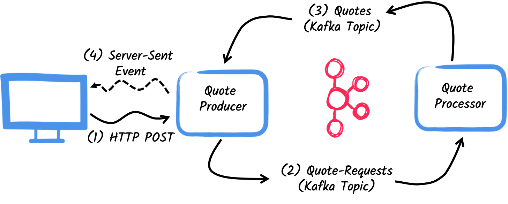
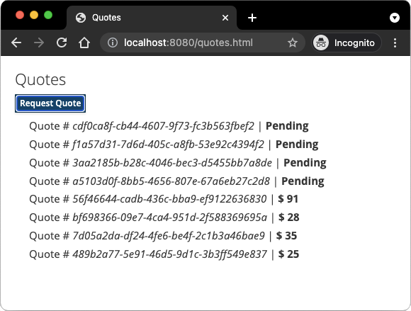

# Getting Started with Quarkus Messaging and Apache Kafka

> **Guia oficial:** <https://quarkus.io/guides/kafka-getting-started>  
> **Fuente:** `docs/src/main/asciidoc/kafka-getting-started.adoc` en [quarkusio/quarkus@3.38.2](https://github.com/quarkusio/quarkus/blob/3.38.2/docs/src/main/asciidoc/kafka-getting-started.adoc)  
> **Version documentada:** Quarkus 3.38.2 · **Sincronizado:** 2026-08-17 · **Licencia:** Apache-2.0

In this guide, you will build two applications that exchange messages through Apache Kafka using Quarkus Messaging: a _producer_ that sends quote requests and a _processor_ that replies with prices.

## Prerequisites

To complete this guide, you need:

* Roughly 15 minutes
* An IDE
* JDK 17+ installed with `JAVA_HOME` configured appropriately
* Apache Maven 3.9.16
* Docker and Docker Compose or [Podman](https://quarkus.io/guides/podman), and Docker Compose
* Optionally the [Quarkus CLI](../10-extras/cli-tooling.md) if you want to use it
* Optionally Mandrel or GraalVM installed and [configured appropriately](../08-rendimiento-nativo/building-native-image.md#configuring-graalvm) if you want to build a native executable (or Docker if you use a native container build)

## Architecture

The two applications communicate via Kafka.
The first application sends a _quote request_ to Kafka and consumes Kafka messages from the _quote_ topic.
The second application receives the _quote request_ and sends a _quote_ back.



The first application, the _producer_, will let the user request some quotes over an HTTP endpoint.
For each quote request a random identifier is generated and returned to the user, to mark the quote request as _pending_.
At the same time, the generated request id is sent over a Kafka topic `quote-requests`.



The second application, the _processor_, will read from the `quote-requests` topic, put a random price to the quote, and send it to a Kafka topic named `quotes`.

Lastly, the _producer_ will read the quotes and send them to the browser using server-sent events.
The user will therefore see the quote price updated from _pending_ to the received price in real-time.

## Solution

Follow the instructions below to create the applications step by step.
You can also go directly to the completed example.

Clone the Git repository: `git clone https://github.com/quarkusio/quarkus-quickstarts.git`, or download an [archive](https://github.com/quarkusio/quarkus-quickstarts/archive/main.zip).

The solution is located in the `kafka-quickstart` [directory](https://github.com/quarkusio/quarkus-quickstarts/tree/main/kafka-quickstart).

## Creating the Maven Project

First, create two projects: the _producer_ and the _processor_.

To create the _producer_ project, in a terminal run:

**CLI**

```bash
quarkus create app org.acme:kafka-quickstart-producer \
    --extension='rest-jackson,messaging-kafka' \
    --no-code
```

To create a Gradle project, add the `--gradle` or `--gradle-kotlin-dsl` option.

For more information about how to install and use the Quarkus CLI, see the [Quarkus CLI](../10-extras/cli-tooling.md) guide.

**Maven**

```bash
mvn io.quarkus.platform:quarkus-maven-plugin:3.38.2:create \
    -DprojectGroupId=org.acme \
    -DprojectArtifactId=kafka-quickstart-producer \
    -Dextensions='rest-jackson,messaging-kafka' \
    -DnoCode

```

To create a Gradle project, add the `-DbuildTool=gradle` or `-DbuildTool=gradle-kotlin-dsl` option.

For Windows users:

* If using cmd, (don’t use backward slash `\` and put everything on the same line)
* If using Powershell, wrap `-D` parameters in double quotes e.g. `"-DprojectArtifactId=kafka-quickstart-producer"`

This command creates the project structure and selects two Quarkus extensions:

1. Quarkus REST (formerly RESTEasy Reactive) and its Jackson support (to handle JSON) to serve the HTTP endpoint.
2. The Kafka connector for Reactive Messaging

To create the _processor_ project, from the same directory, run:

**CLI**

```bash
quarkus create app org.acme:kafka-quickstart-processor \
    --extension='messaging-kafka' \
    --no-code
```

To create a Gradle project, add the `--gradle` or `--gradle-kotlin-dsl` option.

For more information about how to install and use the Quarkus CLI, see the [Quarkus CLI](../10-extras/cli-tooling.md) guide.

**Maven**

```bash
mvn io.quarkus.platform:quarkus-maven-plugin:3.38.2:create \
    -DprojectGroupId=org.acme \
    -DprojectArtifactId=kafka-quickstart-processor \
    -Dextensions='messaging-kafka' \
    -DnoCode

```

To create a Gradle project, add the `-DbuildTool=gradle` or `-DbuildTool=gradle-kotlin-dsl` option.

For Windows users:

* If using cmd, (don’t use backward slash `\` and put everything on the same line)
* If using Powershell, wrap `-D` parameters in double quotes e.g. `"-DprojectArtifactId=kafka-quickstart-processor"`

At that point, you should have the following structure:

```text
.
├── kafka-quickstart-processor
│  ├── README.md
│  ├── mvnw
│  ├── mvnw.cmd
│  ├── pom.xml
│  └── src
│     └── main
│        ├── docker
│        ├── java
│        └── resources
│           └── application.properties
└── kafka-quickstart-producer
   ├── README.md
   ├── mvnw
   ├── mvnw.cmd
   ├── pom.xml
   └── src
      └── main
         ├── docker
         ├── java
         └── resources
            └── application.properties
```

Open the two projects in your IDE.

<dl><dt><strong>💡 TIP: Dev Services</strong></dt><dd>

No need to start a Kafka broker in dev mode or for tests.
Quarkus starts one automatically.
See [Dev Services for Kafka](kafka-dev-services.md) for details.
</dd></dl>

## The Quote object

The `Quote` class is used in both the _producer_ and _processor_ projects.
For simplicity, duplicate the class.
In both projects, create the `src/main/java/org/acme/kafka/model/Quote.java` file, with the following content:

```java
package org.acme.kafka.model;

public class Quote {

    public String id;
    public int price;

    /**
    * Default constructor required for Jackson serializer
    */
    public Quote() { }

    public Quote(String id, int price) {
        this.id = id;
        this.price = price;
    }

    @Override
    public String toString() {
        return "Quote{" +
                "id='" + id + '\'' +
                ", price=" + price +
                '}';
    }
}
```

JSON representation of `Quote` objects will be used in messages sent to the Kafka topic
and also in the server-sent events sent to web browsers.
Quarkus has built-in capabilities to deal with JSON Kafka messages and automatically generates the required serializers and deserializers.

## Sending quote request

Inside the _producer_ project, create the `src/main/java/org/acme/kafka/producer/QuotesResource.java` file and add the following content:

```java
package org.acme.kafka.producer;

import java.util.UUID;

import jakarta.ws.rs.POST;
import jakarta.ws.rs.Path;
import jakarta.ws.rs.Produces;
import jakarta.ws.rs.core.MediaType;

import org.eclipse.microprofile.reactive.messaging.Channel;
import org.eclipse.microprofile.reactive.messaging.Emitter;

@Path("/quotes")
public class QuotesResource {

    @Channel("quote-requests")
    Emitter<String> quoteRequestEmitter; // ①

    /**
     * Endpoint to generate a new quote request id and send it to "quote-requests" Kafka topic using the emitter.
     */
    @POST
    @Path("/request")
    @Produces(MediaType.TEXT_PLAIN)
    public String createRequest() {
        UUID uuid = UUID.randomUUID();
        quoteRequestEmitter.send(uuid.toString()); // ②
        return uuid.toString(); // ③
    }
}
```
1. Inject a Reactive Messaging `Emitter` to send messages to the `quote-requests` channel.
2. On a post request, generate a random UUID and send it to the Kafka topic using the emitter.
3. Return the same UUID to the client.

The `quote-requests` channel is managed as a Kafka topic, as that’s the only connector on the classpath.
If not indicated otherwise, like in this example, Quarkus uses the channel name as topic name.
So, in this example, the application writes into the `quote-requests` topic.
Quarkus also configures the serializer automatically, because it finds that the `Emitter` produces `String` values.

**💡 TIP**\
When you have multiple connectors, you need to indicate which connector to use in the application configuration.

## Processing quote requests

Now consume the quote request and give out a price.
Inside the _processor_ project, create the `src/main/java/org/acme/kafka/processor/QuotesProcessor.java` file and add the following content:

```java
package org.acme.kafka.processor;

import java.util.Random;

import jakarta.enterprise.context.ApplicationScoped;

import org.acme.kafka.model.Quote;
import org.eclipse.microprofile.reactive.messaging.Incoming;
import org.eclipse.microprofile.reactive.messaging.Outgoing;

import io.smallrye.reactive.messaging.annotations.Blocking;

/**
 * A bean consuming data from the "quote-requests" Kafka topic (mapped to "requests" channel) and giving out a random quote.
 * The result is pushed to the "quotes" Kafka topic.
 */
@ApplicationScoped
public class QuotesProcessor {

    private Random random = new Random();

    @Incoming("requests") // ①
    @Outgoing("quotes")   // ②
    @Blocking             // ③
    public Quote process(String quoteRequest) throws InterruptedException {
        // simulate some hard working task
        Thread.sleep(200);
        return new Quote(quoteRequest, random.nextInt(100));
    }
}

```
1. Indicates that the method consumes the items from the `requests` channel.
2. Indicates that the objects returned by the method are sent to the `quotes` channel.
3. Indicates that the processing is _blocking_ and cannot be run on the caller thread.

For every Kafka _record_ from the `quote-requests` topic, Reactive Messaging calls the `process` method, and sends the returned `Quote` object to the `quotes` channel.
In this case, configure the channels in the `application.properties` file:

```properties
%dev.quarkus.http.port=8081

# Configure the incoming `quote-requests` Kafka topic
mp.messaging.incoming.requests.topic=quote-requests
mp.messaging.incoming.requests.auto.offset.reset=earliest
```

The configuration properties are structured as follows:

`mp.messaging.[outgoing|incoming].{channel-name}.property=value`

The `channel-name` segment must match the value set in the `@Incoming` and `@Outgoing` annotation:

* `quote-requests` -> Kafka topic from which the quote requests are read
* `quotes` -> Kafka topic to which the quotes are written

<dl><dt><strong>📌 NOTE</strong></dt><dd>

More details about this configuration is available on the [Producer configuration](https://kafka.apache.org/documentation/#producerconfigs) and [Consumer configuration](https://kafka.apache.org/documentation/#consumerconfigs) section from the Kafka documentation. These properties are configured with the prefix `kafka`.
An exhaustive list of configuration properties is available in [Kafka Reference Guide - Configuration](kafka.md#kafka-configuration).
</dd></dl>

`mp.messaging.incoming.requests.auto.offset.reset=earliest` instructs the application to start reading the topics from the first offset, when there is no committed offset for the consumer group.
In other words, it will also process messages sent before the processor application started.

There is no need to set serializers or deserializers.
Quarkus detects them, and if none are found, generates them using JSON serialization.

## Receiving quotes

Back to the _producer_ project.
Modify the `QuotesResource` to consume quotes from Kafka and send them back to the client via Server-Sent Events:

```java
import io.smallrye.mutiny.Multi;

...

@Channel("quotes")
Multi<Quote> quotes; // ①

/**
 * Endpoint retrieving the "quotes" Kafka topic and sending the items to a server sent event.
 */
@GET
@Produces(MediaType.SERVER_SENT_EVENTS) // ②
public Multi<Quote> stream() {
    return quotes; // ③
}
```
1. Injects the `quotes` channel using the `@Channel` qualifier
2. Indicates that the content is sent using `Server Sent Events`
3. Returns the stream (_Reactive Stream_)

No need to configure anything, as Quarkus will automatically associate the `quotes` channel to the `quotes` Kafka topic.
It will also generate a deserializer for the `Quote` class.

<dl><dt><strong>💡 TIP</strong></dt><dd>

**Message serialization in Kafka**

In this example we used Jackson to serialize/deserialize Kafka messages.
For more options on message serialization, see [Kafka Reference Guide - Serialization](kafka.md#kafka-serialization).

A contract-first approach using a schema registry is strongly recommended.
See the [Using Apache Kafka with Schema Registry and Avro](kafka-schema-registry-avro.md) guide
or the [Using Apache Kafka with Schema Registry and JSON Schema](kafka-schema-registry-json-schema.md) guide.
</dd></dl>

## The HTML page

The final piece is an HTML page that requests quotes and displays the prices received over SSE.

Inside the _producer_ project, create the `src/main/resources/META-INF/resources/quotes.html` file with the following content:

```html
<!DOCTYPE html>
<html lang="en">
<head>
    <meta charset="UTF-8">
    <title>Prices</title>

    <link rel="stylesheet" type="text/css"
          href="https://cdnjs.cloudflare.com/ajax/libs/patternfly/3.24.0/css/patternfly.min.css">
    <link rel="stylesheet" type="text/css"
          href="https://cdnjs.cloudflare.com/ajax/libs/patternfly/3.24.0/css/patternfly-additions.min.css">
</head>
<body>
<div class="container">
    <div class="card">
        <div class="card-body">
            <h2 class="card-title">Quotes</h2>
            <button class="btn btn-info" id="request-quote">Request Quote</button>
            <div class="quotes"></div>
        </div>
    </div>
</div>
</body>
<script src="https://code.jquery.com/jquery-3.6.0.min.js"></script>
<script>
    $("#request-quote").click((event) => {
        fetch("/quotes/request", {method: "POST"})
        .then(res => res.text())
        .then(qid => {
            var row = $(`<h4 class='col-md-12' id='${qid}'>Quote # <i>${qid}</i> | <strong>Pending</strong></h4>`);
            $(".quotes").prepend(row);
        });
    });

    var source = new EventSource("/quotes");
    source.onmessage = (event) => {
      var json = JSON.parse(event.data);
      $(`#${json.id}`).html((index, html) => {
        return html.replace("Pending", `\$\xA0${json.price}`);
      });
    };
</script>
</html>
```

When the user clicks the button, an HTTP request is made to request a quote, and a pending quote is added to the list.
On each quote received over SSE, the corresponding item in the list is updated.

## Get it running

Run both applications.
In one terminal, run:

```bash
mvn -f producer quarkus:dev
```

In another terminal, run:

```bash
mvn -f processor quarkus:dev
```

Quarkus starts a Kafka broker automatically, configures the application and shares the Kafka broker instance between different applications.
See [Dev Services for Kafka](kafka-dev-services.md) for more details.

Open `http://localhost:8080/quotes.html` in your browser and request some quotes by clicking the button.

## Running in JVM or Native mode

When not running in dev or test mode, you will need to start your Kafka broker.
You can follow the instructions from the [Apache Kafka website](https://kafka.apache.org/quickstart) or create a `docker-compose.yaml` file with the following content:

```yaml
services:

  kafka:
    image: quay.io/strimzi/kafka:latest-kafka-4.1.0
    command: [
      "sh", "-c",
      "./bin/kafka-storage.sh format --standalone -t $$(./bin/kafka-storage.sh random-uuid) -c ./config/server.properties && ./bin/kafka-server-start.sh ./config/server.properties --override advertised.listeners=$${KAFKA_ADVERTISED_LISTENERS}"
    ]
    ports:
      - "9092:9092"
    environment:
      LOG_DIR: "/tmp/logs"
      KAFKA_ADVERTISED_LISTENERS: 'PLAINTEXT://kafka:9092'
    networks:
      - kafka-quickstart-network

  producer:
    image: quarkus-quickstarts/kafka-quickstart-producer:1.0-${QUARKUS_MODE:-jvm}
    build:
      context: producer
      dockerfile: src/main/docker/Dockerfile.${QUARKUS_MODE:-jvm}
    depends_on:
      - kafka
    environment:
      KAFKA_BOOTSTRAP_SERVERS: kafka:9092
    ports:
      - "8080:8080"
    networks:
      - kafka-quickstart-network

  processor:
    image: quarkus-quickstarts/kafka-quickstart-processor:1.0-${QUARKUS_MODE:-jvm}
    build:
      context: processor
      dockerfile: src/main/docker/Dockerfile.${QUARKUS_MODE:-jvm}
    depends_on:
      - kafka
    environment:
      KAFKA_BOOTSTRAP_SERVERS: kafka:9092
    networks:
      - kafka-quickstart-network

networks:
  kafka-quickstart-network:
    name: kafkaquickstart
```

Make sure you first build both applications in JVM mode with:

```bash
mvn -f producer package
mvn -f processor package
```

Once packaged, run `docker-compose up`.

**📌 NOTE**\
This is a development cluster, do not use in production.

You can also build and run the applications as native executables.
First, compile both applications as native:

```bash
mvn -f producer package -Dnative -Dquarkus.native.container-build=true
mvn -f processor package -Dnative -Dquarkus.native.container-build=true
```

Run the system with:

```bash
export QUARKUS_MODE=native
docker-compose up --build
```

## Going further

This guide demonstrated how to interact with Kafka using Quarkus and [SmallRye Reactive Messaging](https://smallrye.io/smallrye-reactive-messaging) to build data streaming applications.

For the full list of features and configuration options, see the [Reference guide for Apache Kafka Extension](kafka.md).

**📌 NOTE**\
The Quarkus Kafka extension also supports [using Kafka clients directly](kafka.md#kafka-bare-clients).
