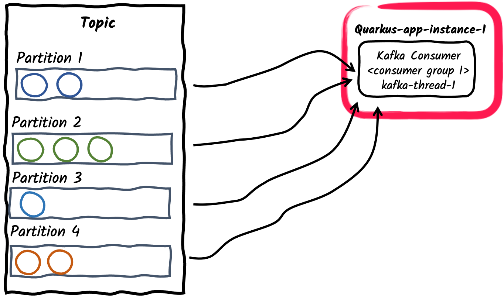
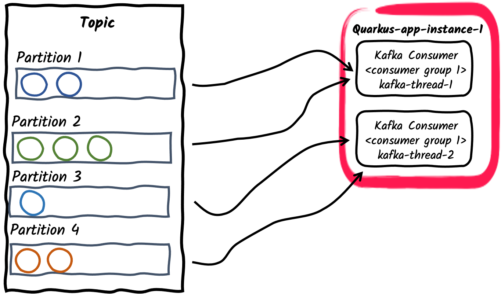
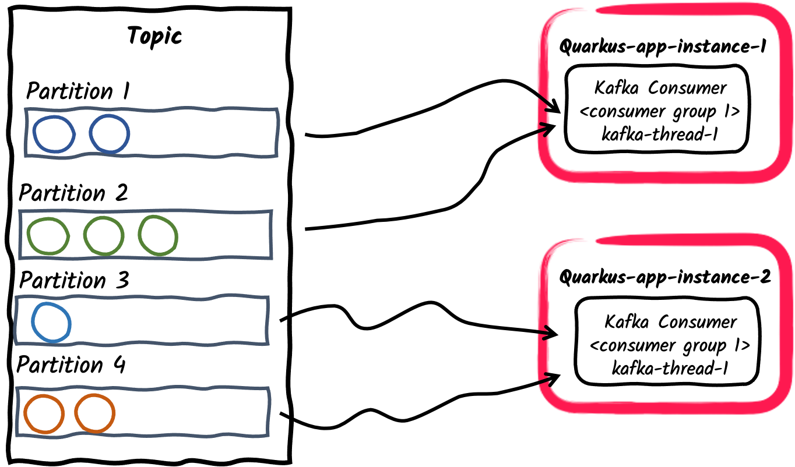
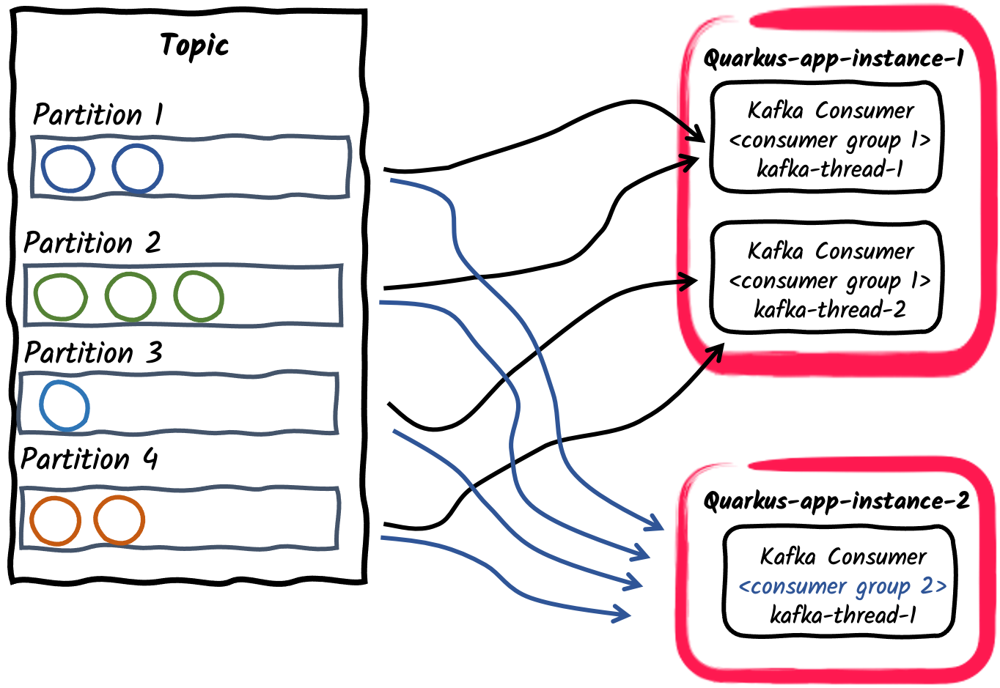
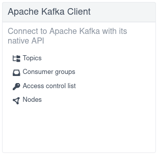
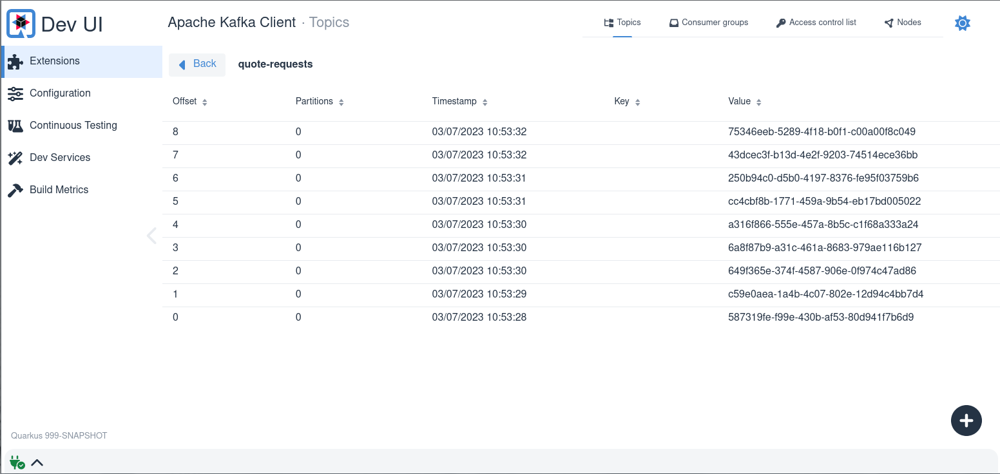

# Apache Kafka Reference Guide

> **Guia oficial:** <https://quarkus.io/guides/kafka>  
> **Fuente:** `docs/src/main/asciidoc/kafka.adoc` en [quarkusio/quarkus@3.38.2](https://github.com/quarkusio/quarkus/blob/3.38.2/docs/src/main/asciidoc/kafka.adoc)  
> **Version documentada:** Quarkus 3.38.2 · **Sincronizado:** 2026-08-17 · **Licencia:** Apache-2.0

This reference guide demonstrates how your Quarkus application can utilize Quarkus Messaging to interact with Apache Kafka.

## Introduction

[Apache Kafka](https://kafka.apache.org) is a popular open-source distributed event streaming platform.
It is used commonly for high-performance data pipelines, streaming analytics, data integration, and mission-critical applications.
Similar to a message queue, or an enterprise messaging platform, it lets you:

* **publish** (write) and **subscribe** to (read) streams of events, called _records_.
* **store** streams of records durably and reliably inside _topics_.
* **process** streams of records as they occur or retrospectively.

And all this functionality is provided in a distributed, highly scalable, elastic, fault-tolerant, and secure manner.

## Quarkus Extension for Apache Kafka

Quarkus provides support for Apache Kafka through [SmallRye Reactive Messaging](https://smallrye.io/smallrye-reactive-messaging/) framework.
Based on Eclipse MicroProfile Reactive Messaging specification 2.0, it proposes a flexible programming model bridging CDI and event-driven.

<dl><dt><strong>📌 NOTE</strong></dt><dd>

This guide provides an in-depth look on Apache Kafka and SmallRye Reactive Messaging framework.
For a quick start take a look at [Getting Started to Quarkus Messaging with Apache Kafka](kafka-getting-started.md).
</dd></dl>

You can add the `messaging-kafka` extension to your project by running the following command in your project base directory:

**CLI**

```bash
quarkus extension add messaging-kafka
```
**Maven**

```bash
./mvnw quarkus:add-extension -Dextensions='messaging-kafka'
```
**Gradle**

```bash
./gradlew addExtension --extensions='messaging-kafka'
```

This will add the following to your build file:

**pom.xml**

```xml
<dependency>
    <groupId>io.quarkus</groupId>
    <artifactId>quarkus-messaging-kafka</artifactId>
</dependency>
```

**build.gradle**

```gradle
implementation("io.quarkus:quarkus-messaging-kafka")
```

<dl><dt><strong>📌 NOTE</strong></dt><dd>

The extension includes `kafka-clients` version 4.1.1 as a transitive dependency and is compatible with Kafka brokers version 2.x and above.
</dd></dl>

## Configuring SmallRye Kafka Connector

Because SmallRye Reactive Messaging framework supports different messaging backends like Apache Kafka, AMQP, Apache Camel, JMS, MQTT, etc., it employs a generic vocabulary:

* Applications send and receive **messages**. A message wraps a _payload_ and can be extended with some _metadata_. With the Kafka connector, a _message_ corresponds to a Kafka _record_.
* Messages transit on **channels**. Application components connect to channels to publish and consume messages. The Kafka connector maps _channels_ to Kafka _topics_.
* Channels are connected to message backends using **connectors**. Connectors are configured to map incoming messages to a specific channel (consumed by the application) and collect outgoing messages sent to a specific channel. Each connector is dedicated to a specific messaging technology. For example, the connector dealing with Kafka is named `smallrye-kafka`.

A minimal configuration for the Kafka connector with an incoming channel looks like the following:

```properties
%prod.kafka.bootstrap.servers=kafka:9092 ①
mp.messaging.incoming.prices.connector=smallrye-kafka ②
```
1. Configure the broker location for the production profile. You can configure it globally or per channel using `mp.messaging.incoming.$channel.bootstrap.servers` property.
In dev mode and when running tests, [Dev Services for Kafka](#dev-services-for-kafka) automatically starts a Kafka broker.
When not provided this property defaults to `localhost:9092`.
2. Configure the connector to manage the prices channel. By default, the topic name is same as the channel name. You can configure the topic attribute to override it.

**📌 NOTE**\
The `%prod` prefix indicates that the property is only used when the application runs in prod mode (so not in dev or test). Refer to the [Profile documentation](../01-fundamentos/config-reference.md#profiles) for further details.

<dl><dt><strong>💡 TIP: Connector auto-attachment</strong></dt><dd>

If you have a single connector on your classpath, you can omit the `connector` attribute configuration.
Quarkus automatically associates _orphan_ channels to the (unique) connector found on the classpath.
_Orphans_ channels are outgoing channels without a downstream consumer or incoming channels without an upstream producer.

This auto-attachment can be disabled using:

```properties
quarkus.messaging.auto-connector-attachment=false
```
</dd></dl>

## Receiving messages from Kafka

Continuing from the previous minimal configuration, your Quarkus application can receive message payload directly:

```java
import org.eclipse.microprofile.reactive.messaging.Incoming;

import jakarta.enterprise.context.ApplicationScoped;

@ApplicationScoped
public class PriceConsumer {

    @Incoming("prices")
    public void consume(double price) {
        // process your price.
    }

}
```

There are several other ways your application can consume incoming messages:

**Message**

```java
@Incoming("prices")
public CompletionStage<Void> consume(Message<Double> msg) {
    // access record metadata
    var metadata = msg.getMetadata(IncomingKafkaRecordMetadata.class).orElseThrow();
    // process the message payload.
    double price = msg.getPayload();
    // Acknowledge the incoming message (commit the offset)
    return msg.ack();
}
```

The `Message` type lets the consuming method access the incoming message metadata and handle the acknowledgment manually.
We’ll explore different acknowledgment strategies in [Commit Strategies](#commit-strategies).

If you want to access the Kafka record objects directly, use:

**ConsumerRecord**

```java
@Incoming("prices")
public void consume(ConsumerRecord<String, Double> record) {
    String key = record.key(); // Can be `null` if the incoming record has no key
    String value = record.value(); // Can be `null` if the incoming record has no value
    String topic = record.topic();
    int partition = record.partition();
    // ...
}
```

`ConsumerRecord` is provided by the underlying Kafka client and can be injected directly to the consumer method.
Another simpler approach consists in using `Record`:

**Record**

```java
@Incoming("prices")
public void consume(Record<String, Double> record) {
    String key = record.key(); // Can be `null` if the incoming record has no key
    String value = record.value(); // Can be `null` if the incoming record has no value
}
```

`Record` is a simple wrapper around key and payload of the incoming Kafka record.

Alternatively, your application can inject a `Multi` in your bean and subscribe to its events as the following example:

```java
import io.smallrye.mutiny.Multi;
import org.eclipse.microprofile.reactive.messaging.Channel;

import jakarta.inject.Inject;
import jakarta.ws.rs.GET;
import jakarta.ws.rs.Path;
import jakarta.ws.rs.Produces;
import jakarta.ws.rs.core.MediaType;
import org.jboss.resteasy.reactive.RestStreamElementType;

@Path("/prices")
public class PriceResource {

    @Inject
    @Channel("prices")
    Multi<Double> prices;

    @GET
    @Path("/prices")
    @RestStreamElementType(MediaType.TEXT_PLAIN)
    public Multi<Double> stream() {
        return prices;
    }
}
```

This is a good example of how to integrate a Kafka consumer with another downstream,
in this example exposing it as a Server-Sent Events endpoint.

<dl><dt><strong>📌 NOTE</strong></dt><dd>

When consuming messages with `@Channel`, the application code is responsible for the subscription.
In the example above, the Quarkus REST (formerly RESTEasy Reactive) endpoint handles that for you.
</dd></dl>

Following types can be injected as channels:

```java
@Inject @Channel("prices") Multi<Double> streamOfPayloads;

@Inject @Channel("prices") Multi<Message<Double>> streamOfMessages;

@Inject @Channel("prices") Publisher<Double> publisherOfPayloads;

@Inject @Channel("prices") Publisher<Message<Double>> publisherOfMessages;
```

As with the previous `Message` example, if your injected channel receives payloads (`Multi<T>`), it acknowledges the message automatically, and support multiple subscribers.
If you injected channel receives Message (`Multi<Message<T>>`), you will be responsible for the acknowledgment and broadcasting.
We will explore sending broadcast messages in [Broadcasting messages on multiple consumers](#broadcasting-messages-on-multiple-consumers).

<dl><dt><strong>❗ IMPORTANT</strong></dt><dd>

Injecting `@Channel("prices")` or having `@Incoming("prices")` does not automatically configure the application to consume messages from Kafka.
You need to configure an inbound connector with `mp.messaging.incoming.prices...` or have an `@Outgoing("prices")` method somewhere in your application (in which case, `prices` will be an in-memory channel).
</dd></dl>

### Blocking processing

Reactive Messaging invokes your method on an I/O thread.
See the [Quarkus Reactive Architecture documentation](../01-fundamentos/quarkus-reactive-architecture.md) for further details on this topic.
But, you often need to combine Reactive Messaging with blocking processing such as database interactions.
For this, you need to use the `@Blocking` annotation indicating that the processing is _blocking_ and should not be run on the caller thread.

For example, The following code illustrates how you can store incoming payloads to a database using Hibernate with Panache:

```java
import io.smallrye.reactive.messaging.annotations.Blocking;
import org.eclipse.microprofile.reactive.messaging.Incoming;

import jakarta.enterprise.context.ApplicationScoped;
import jakarta.transaction.Transactional;

@ApplicationScoped
public class PriceStorage {

    @Incoming("prices")
    @Transactional
    public void store(int priceInUsd) {
        Price price = new Price();
        price.value = priceInUsd;
        price.persist();
    }

}
```

The complete example is available in the `kafka-panache-quickstart` [directory](https://github.com/quarkusio/quarkus-quickstarts/tree/main/kafka-panache-quickstart).

<dl><dt><strong>📌 NOTE</strong></dt><dd>

There are 2 `@Blocking` annotations:

1. `io.smallrye.reactive.messaging.annotations.Blocking`
2. `io.smallrye.common.annotation.Blocking`

They have the same effect.
Thus, you can use both.
The first one provides more fine-grained tuning such as the worker pool to use and whether it preserves the order.
The second one, used also with other reactive features of Quarkus, uses the default worker pool and preserves the order.

Detailed information on the usage of `@Blocking` annotation can be found in [SmallRye Reactive Messaging – Handling blocking execution](https://smallrye.io/smallrye-reactive-messaging/latest/concepts/blocking/).
</dd></dl>

<dl><dt><strong>💡 TIP: @RunOnVirtualThread</strong></dt><dd>

For running the blocking processing on Java _virtual threads_, see the [Quarkus Virtual Thread support with Reactive Messaging documentation](messaging-virtual-threads.md).
</dd></dl>

<dl><dt><strong>💡 TIP: @Transactional</strong></dt><dd>

If your method is annotated with `@Transactional`, it will be considered _blocking_ automatically, even if the method is not annotated with `@Blocking`.
</dd></dl>

### Acknowledgment Strategies

All messages received by a consumer must be acknowledged.
In the absence of acknowledgment, the processing is considered in error.
If the consumer method receives a `Record` or a payload, the message will be acked on method return, also known as `Strategy.POST_PROCESSING`.
If the consumer method returns another reactive stream or `CompletionStage`, the message will be acked when the downstream message is acked.
You can override the default behavior to ack the message on arrival (`Strategy.PRE_PROCESSING`),
or do not ack the message at all (`Strategy.NONE`) on the consumer method as in the following example:

```java
@Incoming("prices")
@Acknowledgment(Acknowledgment.Strategy.PRE_PROCESSING)
public void process(double price) {
    // process price
}
```

If the consumer method receives a `Message`, the acknowledgment strategy is `Strategy.MANUAL`
and the consumer method is in charge of ack/nack the message.

```java
@Incoming("prices")
public CompletionStage<Void> process(Message<Double> msg) {
    // process price
    return msg.ack();
}
```

As mentioned above, the method can also override the acknowledgment strategy to `PRE_PROCESSING` or `NONE`.

### Commit Strategies

When a message produced from a Kafka record is acknowledged, the connector invokes a commit strategy.
These strategies decide when the consumer offset for a specific topic/partition is committed.
Committing an offset indicates that all previous records have been processed.
It is also the position where the application would restart the processing after a crash recovery or a restart.

Committing every offset has performance penalties as Kafka offset management can be slow.
However, not committing the offset often enough may lead to message duplication if the application crashes between two commits.

The Kafka connector supports three strategies:

* `throttled` keeps track of received messages and commits an offset of the latest acked message in sequence (meaning, all previous messages were also acked).
This strategy guarantees at-least-once delivery even if the channel performs asynchronous processing.
The connector tracks the received records and periodically (period specified by `auto.commit.interval.ms`, default: 5000 ms) commits the highest consecutive offset.
The connector will be marked as unhealthy if a message associated with a record is not acknowledged in `throttled.unprocessed-record-max-age.ms` (default: 60000 ms).
Indeed, this strategy cannot commit the offset as soon as a single record processing fails.
If `throttled.unprocessed-record-max-age.ms` is set to less than or equal to `0`, it does not perform any health check verification.
Such a setting might lead to running out of memory if there are "poison pill" messages (that are never acked).
This strategy is the default if `enable.auto.commit` is not explicitly set to true.
* `checkpoint` allows persisting consumer offsets on a ***state store***, instead of committing them back to the Kafka broker.
Using the `CheckpointMetadata` API, consumer code can persist a _processing state_ with the record offset to mark the progress of a consumer.
When the processing continues from a previously persisted offset, it seeks the Kafka consumer to that offset and also restores the persisted state, continuing the stateful processing from where it left off.
The checkpoint strategy holds locally the processing state associated with the latest offset, and persists it periodically to the state store (period specified by `auto.commit.interval.ms` (default: 5000)).
The connector will be marked as unhealthy if no processing state is persisted to the state store in `checkpoint.unsynced-state-max-age.ms` (default: 10000).
If `checkpoint.unsynced-state-max-age.ms` is set to less than or equal to 0, it does not perform any health check verification.
For more information, see [Stateful processing with Checkpointing](#stateful-processing-with-checkpointing)
* `latest` commits the record offset received by the Kafka consumer as soon as the associated message is acknowledged (if the offset is higher than the previously committed offset).
This strategy provides at-least-once delivery if the channel processes the message without performing any asynchronous processing. Specifically, the offset of the most recent acknowledged 
message will always be committed, even if older messages have not finished being processed. In case of an incident such as a crash, processing would restart after the last commit, leading 
to older messages never being successfully and fully processed, which would appear as message loss.
This strategy should not be used in high load environment, as offset commit is expensive. However, it reduces the risk of duplicates.
* `ignore` performs no commit. This strategy is the default strategy when the consumer is explicitly configured with `enable.auto.commit` to true.
It delegates the offset commit to the underlying Kafka client.
When `enable.auto.commit` is `true` this strategy ***DOES NOT*** guarantee at-least-once delivery.
SmallRye Reactive Messaging processes records asynchronously, so offsets may be committed for records that have been polled but not yet processed.
In case of a failure, only records that were not committed yet will be re-processed.

<dl><dt><strong>❗ IMPORTANT</strong></dt><dd>

The Kafka connector disables the Kafka auto commit when it is not explicitly enabled. This behavior differs from the traditional Kafka consumer.
If high throughput is important for you, and you are not limited by the downstream, we recommend to either:

* use the `throttled` policy,
* or set `enable.auto.commit` to true and annotate the consuming method with `@Acknowledgment(Acknowledgment.Strategy.NONE)`.
</dd></dl>

SmallRye Reactive Messaging enables implementing custom commit strategies.
See [SmallRye Reactive Messaging documentation](https://smallrye.io/smallrye-reactive-messaging/latest/kafka/receiving-kafka-records/#acknowledgement) for more information.

### Error Handling Strategies

If a message produced from a Kafka record is nacked, a failure strategy is applied. The Kafka connector supports the following strategies:

* `fail`: fail the application, no more records will be processed (default strategy). The offset of the record that has not been processed correctly is not committed.
* `ignore`: the failure is logged, but the processing continue. The offset of the record that has not been processed correctly is committed.
* `dead-letter-queue`: the offset of the record that has not been processed correctly is committed, but the record is written to a Kafka dead letter topic.
* `delayed-retry-topic`: the failed record is sent to delayed retry topics for later reprocessing, with configurable delays and maximum retries.

The strategy is selected using the `failure-strategy` attribute.

In the case of `dead-letter-queue`, you can configure the following attributes:

* `dead-letter-queue.topic`: the topic to use to write the records not processed correctly, default is `dead-letter-topic-$channel`, with `$channel` being the name of the channel.
* `dead-letter-queue.key.serializer`: the serializer used to write the record key on the dead letter queue. By default, it deduces the serializer from the key deserializer.
* `dead-letter-queue.value.serializer`: the serializer used to write the record value on the dead letter queue. By default, it deduces the serializer from the value deserializer.

The record written on the dead letter queue contains a set of additional headers about the original record:

* **dead-letter-reason**: the reason of the failure
* **dead-letter-cause**: the cause of the failure if any
* **dead-letter-topic**: the original topic of the record
* **dead-letter-partition**: the original partition of the record (integer mapped to String)
* **dead-letter-offset**: the original offset of the record (long mapped to String)

SmallRye Reactive Messaging enables implementing custom failure strategies.
See [SmallRye Reactive Messaging documentation](https://smallrye.io/smallrye-reactive-messaging/latest/kafka/receiving-kafka-records/#acknowledgement) for more information.

#### Retrying processing

You can combine Reactive Messaging with [SmallRye Fault Tolerance](https://github.com/smallrye/smallrye-fault-tolerance), and retry processing if it failed:

```java
@Incoming("kafka")
@Retry(delay = 10, maxRetries = 5)
public void consume(String v) {
   // ... retry if this method throws an exception
}
```

You can configure the delay, the number of retries, the jitter, etc.

If your method returns a `Uni` or `CompletionStage`, you need to add the `@NonBlocking` annotation:

```java
@Incoming("kafka")
@Retry(delay = 10, maxRetries = 5)
@NonBlocking
public Uni<String> consume(String v) {
   // ... retry if this method throws an exception or the returned Uni produce a failure
}
```

**📌 NOTE**\
The `@NonBlocking` annotation is only required with SmallRye Fault Tolerance 5.1.0 and earlier.
Starting with SmallRye Fault Tolerance 5.2.0 (available since Quarkus 2.1.0.Final), it is not necessary.
See [SmallRye Fault Tolerance documentation](https://smallrye.io/docs/smallrye-fault-tolerance/5.2.0/usage/extra.html#_non_compatible_mode) for more information.

The incoming messages are acknowledged only once the processing completes successfully.
So, it commits the offset after the successful processing.
If the processing still fails, even after all retries, the message is _nacked_ and the failure strategy is applied.

#### Handling Deserialization Failures

When a deserialization failure occurs, you can intercept it and provide a failure strategy.
To achieve this, you need to create a bean implementing `DeserializationFailureHandler<T>` interface:

```java
@ApplicationScoped
@Identifier("failure-retry") // Set the name of the failure handler
public class MyDeserializationFailureHandler
    implements DeserializationFailureHandler<JsonObject> { // Specify the expected type

    @Override
    public JsonObject decorateDeserialization(Uni<JsonObject> deserialization, String topic, boolean isKey,
            String deserializer, byte[] data, Headers headers) {
        return deserialization
                    .onFailure().retry().atMost(3)
                    .await().atMost(Duration.ofMillis(200));
    }
}
```

To use this failure handler, the bean must be exposed with the `@Identifier` qualifier and the connector configuration must specify the attribute `mp.messaging.incoming.$channel.[key|value]-deserialization-failure-handler` (for key or value deserializers).

The handler is called with details of the deserialization, including the action represented as `Uni<T>`.
On the deserialization `Uni` failure strategies like retry, providing a fallback value or applying timeout can be implemented.

If you don’t configure a deserialization failure handler and a deserialization failure happens, the application is marked unhealthy.
You can also ignore the failure, which will log the exception and produce a `null` value.
To enable this behavior, set the `mp.messaging.incoming.$channel.fail-on-deserialization-failure` attribute to `false`.

If the `fail-on-deserialization-failure` attribute is set to `false` and the `failure-strategy` attribute is `dead-letter-queue` the failed record will be sent to the corresponding **dead letter queue** topic.

### Consumer Groups

In Kafka, a consumer group is a set of consumers which cooperate to consume data from a topic.
A topic is divided into a set of partitions.
The partitions of a topic are assigned among the consumers in the group, effectively allowing to scale consumption throughput.
Note that each partition is assigned to a single consumer from a group.
However, a consumer can be assigned multiple partitions if the number of partitions is greater than the number of consumer in the group.

Let’s explore briefly different producer/consumer patterns and how to implement them using Quarkus:

1. **Single consumer thread inside a consumer group**

   This is the default behavior of an application subscribing to a Kafka topic: Each Kafka connector will create a single consumer thread and place it inside a single consumer group.
   Consumer group id defaults to the application name as set by the `quarkus.application.name` configuration property.
   It can also be set using the `kafka.group.id` property.

   
2. **Multiple consumer threads inside a consumer group**

   For a given application instance, the number of consumers inside the consumer group can be configured using `mp.messaging.incoming.$channel.concurrency` property.
   The partitions of the subscribed topic will be divided among the consumer threads.
   Note that if the `concurrency` value exceed the number of partitions of the topic, some consumer threads won’t be assigned any partitions.

   

   <dl><dt><strong>📌 NOTE: Deprecation</strong></dt><dd>

   The [concurrency attribute](https://smallrye.io/smallrye-reactive-messaging/latest/concepts/incoming-concurrency/)
   provides a connector agnostic way for non-blocking concurrent channels and replaces the Kafka connector specific `partitions` attribute.
   The `partitions` attribute is therefore deprecated and will be removed in future releases.
   </dd></dl>
3. **Multiple consumer applications inside a consumer group**

   Similar to the previous example, multiple instances of an application can subscribe to a single consumer group, configured via `mp.messaging.incoming.$channel.group.id` property, or left default to the application name.
   This in turn will divide partitions of the topic among application instances.

   
4. **Pub/Sub: Multiple consumer groups subscribed to a topic**

   Lastly different applications can subscribe independently to same topics using different **consumer group ids**.
   For example, messages published to a topic called _orders_ can be consumed independently on two consumer applications, one with `mp.messaging.incoming.orders.group.id=invoicing` and second with `mp.messaging.incoming.orders.group.id=shipping`.
   Different consumer groups can thus scale independently according to the message consumption requirements.

   

<dl><dt><strong>📌 NOTE</strong></dt><dd>

A common business requirement is to consume and process Kafka records in order.
The Kafka broker preserves order of records inside a partition and not inside a topic.
Therefore, it is important to think about how records are partitioned inside a topic.
The default partitioner uses record key hash to compute the partition for a record, or when the key is not defined, chooses a partition randomly per batch or records.

During normal operation, a Kafka consumer preserves the order of records inside each partition assigned to it.
SmallRye Reactive Messaging keeps this order for processing, unless `@Blocking(ordered = false)` is used (see [Blocking processing](#blocking-processing)).

When using `@Blocking(ordered = false)`, you can still enforce ordering guarantees with the `ordered` channel attribute:

* `ordered=partition`: records from the same partition are processed sequentially, but different partitions can be processed concurrently.
* `ordered=key`: records with the same key are processed sequentially, regardless of partition.

```properties
mp.messaging.incoming.your-channel.ordered=key
```

Note that due to consumer rebalances, Kafka consumers only guarantee at-least-once processing of single records, meaning that uncommitted records _can_ be processed again by consumers.
</dd></dl>

#### Consumer Rebalance Listener

Inside a consumer group, as new group members arrive and old members leave, the partitions are re-assigned so that each member receives a proportional share of the partitions.
This is known as rebalancing the group.
To handle offset commit and assigned partitions yourself, you can provide a consumer rebalance listener.
To achieve this, implement the `io.smallrye.reactive.messaging.kafka.KafkaConsumerRebalanceListener` interface and expose it as a CDI bean with the `@Idenfier` qualifier.
A common use case is to store offset in a separate data store to implement exactly-once semantic, or starting the processing at a specific offset.

The listener is invoked every time the consumer topic/partition assignment changes.
For example, when the application starts, it invokes the `partitionsAssigned` callback with the initial set of topics/partitions associated with the consumer.
If, later, this set changes, it calls the `partitionsRevoked` and `partitionsAssigned` callbacks again, so you can implement custom logic.

Note that the rebalance listener methods are called from the Kafka polling thread and ***will*** block the caller thread until completion.
That’s because the rebalance protocol has synchronization barriers, and using asynchronous code in a rebalance listener may be executed after the synchronization barrier.

When topics/partitions are assigned or revoked from a consumer, it pauses the message delivery and resumes once the rebalance completes.

If the rebalance listener handles offset commit on behalf of the user (using the `NONE` commit strategy),
the rebalance listener must commit the offset synchronously in the partitionsRevoked callback.
We also recommend applying the same logic when the application stops.

Unlike the `ConsumerRebalanceListener` from Apache Kafka, the `io.smallrye.reactive.messaging.kafka.KafkaConsumerRebalanceListener` methods pass the Kafka Consumer and the set of topics/partitions.

In the following example we set up a consumer that always starts on messages from at most 10 minutes ago (or offset 0).
First we need to provide a bean that implements `io.smallrye.reactive.messaging.kafka.KafkaConsumerRebalanceListener` and is annotated with `io.smallrye.common.annotation.Identifier`.
We then must configure our inbound connector to use this bean.

```java
package inbound;

import io.smallrye.common.annotation.Identifier;
import io.smallrye.reactive.messaging.kafka.KafkaConsumerRebalanceListener;
import org.apache.kafka.clients.consumer.Consumer;
import org.apache.kafka.clients.consumer.OffsetAndTimestamp;
import org.apache.kafka.clients.consumer.TopicPartition;

import jakarta.enterprise.context.ApplicationScoped;
import java.util.Collection;
import java.util.HashMap;
import java.util.Map;
import java.util.logging.Logger;

@ApplicationScoped
@Identifier("rebalanced-example.rebalancer")
public class KafkaRebalancedConsumerRebalanceListener implements KafkaConsumerRebalanceListener {

    private static final Logger LOGGER = Logger.getLogger(KafkaRebalancedConsumerRebalanceListener.class.getName());

    /**
     * When receiving a list of partitions, will search for the earliest offset within 10 minutes
     * and seek the consumer to it.
     *
     * @param consumer   underlying consumer
     * @param partitions set of assigned topic partitions
     */
    @Override
    public void onPartitionsAssigned(Consumer<?, ?> consumer, Collection<TopicPartition> partitions) {
        long now = System.currentTimeMillis();
        long shouldStartAt = now - 600_000L; //10 minute ago

        Map<TopicPartition, Long> request = new HashMap<>();
        for (TopicPartition partition : partitions) {
            LOGGER.info("Assigned " + partition);
            request.put(partition, shouldStartAt);
        }
        Map<TopicPartition, OffsetAndTimestamp> offsets = consumer.offsetsForTimes(request);
        for (Map.Entry<TopicPartition, OffsetAndTimestamp> position : offsets.entrySet()) {
            long target = position.getValue() == null ? 0L : position.getValue().offset();
            LOGGER.info("Seeking position " + target + " for " + position.getKey());
            consumer.seek(position.getKey(), target);
        }
    }

}
```

```java
package inbound;

import org.apache.kafka.clients.consumer.ConsumerRecord;
import org.eclipse.microprofile.reactive.messaging.Acknowledgment;
import org.eclipse.microprofile.reactive.messaging.Incoming;
import org.eclipse.microprofile.reactive.messaging.Message;

import jakarta.enterprise.context.ApplicationScoped;
import java.util.concurrent.CompletableFuture;
import java.util.concurrent.CompletionStage;

@ApplicationScoped
public class KafkaRebalancedConsumer {

    @Incoming("rebalanced-example")
    @Acknowledgment(Acknowledgment.Strategy.NONE)
    public CompletionStage<Void> consume(Message<ConsumerRecord<Integer, String>> message) {
        // We don't need to ACK messages because in this example,
        // we set offset during consumer rebalance
        return CompletableFuture.completedFuture(null);
    }

}
```

To configure the inbound connector to use the provided listener, we either set the consumer rebalance listener’s identifier:
`mp.messaging.incoming.rebalanced-example.consumer-rebalance-listener.name=rebalanced-example.rebalancer`

Or have the listener’s name be the same as the group id:

`mp.messaging.incoming.rebalanced-example.group.id=rebalanced-example.rebalancer`

Setting the consumer rebalance listener’s name takes precedence over using the group id.

#### Using unique consumer groups

If you want to process all the records from a topic (from its beginning), you need:

1. to set `auto.offset.reset = earliest`
2. assign your consumer to a consumer group not used by any other application.

Quarkus generates a UUID that changes between two executions (including in dev mode).
So, you are sure no other consumer uses it, and you receive a new unique group id every time your application starts.

You can use that generated UUID as the consumer group as follows:

```properties
mp.messaging.incoming.your-channel.auto.offset.reset=earliest
mp.messaging.incoming.your-channel.group.id=${quarkus.uuid}
```

**❗ IMPORTANT**\
If the `group.id` attribute is not set, it defaults the `quarkus.application.name` configuration property.

#### Manual topic-partition assignment

The `assign-seek` channel attribute allows manually assigning topic-partitions to a Kafka incoming channel,
and optionally seek to a specified offset in the partition to start consuming records.
If `assign-seek` is used, the consumer will not be dynamically subscribed to topics,
but instead will statically assign the described partitions.
In manual topic-partition rebalancing doesn’t happen and therefore rebalance listeners are never called.

The attribute takes a list of triplets separated by commas: `<topic>:<partition>:<offset>`.

For example, the configuration

```properties
mp.messaging.incoming.data.assign-seek=topic1:0:10, topic2:1:20
```

assigns the consumer to:

* Partition 0 of topic 'topic1', setting the initial position at offset 10.
* Partition 1 of topic 'topic2', setting the initial position at offset 20.

The topic, partition, and offset in each triplet can have the following variations:

* If the topic is omitted, the configured topic will be used.
* If the offset is omitted, partitions are assigned to the consumer but won’t be sought to offset.
* If offset is 0, it seeks to the beginning of the topic-partition.
* If offset is -1, it seeks to the end of the topic-partition.

### Receiving Kafka Records in Batches

By default, incoming methods receive each Kafka record individually.
Under the hood, Kafka consumer clients poll the broker constantly and receive records in batches, presented inside the `ConsumerRecords` container.

In **batch** mode, your application can receive all the records returned by the consumer **poll** in one go.

To achieve this you need to specify a compatible container type to receive all the data:

```java
@Incoming("prices")
public void consume(List<Double> prices) {
    for (double price : prices) {
        // process price
    }
}
```

The incoming method can also receive `Message<List<Payload>>`, `Message<ConsumerRecords<Key, Payload>>`, and `ConsumerRecords<Key, Payload>` types.
They give access to record details such as offset or timestamp:

```java
@Incoming("prices")
public CompletionStage<Void> consumeMessage(Message<ConsumerRecords<String, Double>> records) {
    for (ConsumerRecord<String, Double> record : records.getPayload()) {
        String payload = record.getPayload();
        String topic = record.getTopic();
        // process messages
    }
    // ack will commit the latest offsets (per partition) of the batch.
    return records.ack();
}

```

Note that the successful processing of the incoming record batch will commit the latest offsets for each partition received inside the batch.
The configured commit strategy will be applied for these records only.

Conversely, if the processing throws an exception, all messages are _nacked_, applying the failure strategy for all the records inside the batch.

<dl><dt><strong>📌 NOTE</strong></dt><dd>

Quarkus autodetects batch types for incoming channels and sets batch configuration automatically.
You can configure batch mode explicitly with `mp.messaging.incoming.$channel.batch` property.
</dd></dl>

### Share Groups (Kafka Queues)

<dl><dt><strong>❗ IMPORTANT</strong></dt><dd>

Kafka Share Groups require Apache Kafka 4.2+ brokers and are an early access feature in Kafka.
</dd></dl>

Share Groups ([KIP-932](https://cwiki.apache.org/confluence/display/KAFKA/KIP-932%3A+Queues+for+Kafka)) provide a queue-like consumption model for Kafka topics.
Unlike consumer groups, records are distributed across share consumers without explicit partition assignment -- the broker handles distribution of records and acquisition locks automatically.
This provides queue-style workloads where records are processed by any available consumer with at-least-once delivery semantics.

#### Enabling Share Groups

To enable share group consumption, set the `share-group` attribute on the incoming channel:

```properties
mp.messaging.incoming.queue.connector=smallrye-kafka
mp.messaging.incoming.queue.topic=prices
mp.messaging.incoming.queue.value.deserializer=org.apache.kafka.common.serialization.DoubleDeserializer
mp.messaging.incoming.queue.share-group=true
```

Consuming messages works like any other incoming channel:

```java
@ApplicationScoped
public class KafkaShareGroupConsumer {

    @Incoming("queue")
    public void consume(double price) {
        // process price
    }
}
```

#### Per-record Acknowledgement

Share groups support three acknowledgement types:

* ***ACCEPT***: Record processed successfully (default on ack).
* ***RELEASE***: Record failed processing and is eligible for re-delivery to another consumer.
* ***REJECT***: Permanent rejection with no re-delivery.

You can control the acknowledgement per record using `ShareGroupAcknowledgement` metadata:

```java
@Incoming("queue")
@Outgoing("processed")
public String consume(double msg, ShareGroupAcknowledgement ack) {
    try {
        // successful processing is ACCEPT
        return process(msg);
    } catch (TransientException e) {
        ack.release();
    } catch (Exception e) {
        ack.reject();
    }
    // Skip publishing message
    return null;
}
```

#### Acquisition Lock Renewal

Each acquired record has a time-limited acquisition lock managed by the broker.
The connector tracks in-processing records and periodically renews their locks to prevent re-delivery.
The `share-group.unprocessed-record-max-age.ms` attribute controls this behavior:

```properties
mp.messaging.incoming.queue.share-group=true
mp.messaging.incoming.queue.share-group.unprocessed-record-max-age.ms=30000
```

When enabled (default: `60000`), records still in processing are periodically renewed with the broker.
If a record exceeds this timeout, the health check reports a failure.
Set to `0` to disable monitoring and automatic renewal.

#### Batch Mode

Share groups support batch consumption.
Enable it by setting `batch=true` alongside `share-group=true`:

```properties
mp.messaging.incoming.queue.share-group=true
mp.messaging.incoming.queue.batch=true
```

With per-record acknowledgement control, each record inside a batch can be individually acknowledged using `IncomingKafkaRecordBatchMetadata`:

```java
@Incoming("queue")
public void consume(ConsumerRecords<String, String> batch, IncomingKafkaRecordBatchMetadata metadata) {
    for (var record : batch) {
        ShareGroupAcknowledgement ack = metadata.getMetadataForRecord(record, ShareGroupAcknowledgement.class);
        String event = record.value();
        if (event.startsWith("INVALID")) {
            Log.warnf("[Batch] Rejecting invalid event: %s", event);
            ack.reject();
        } else {
            Log.infof("[Batch] Accepted event: %s", event);
            ack.accept();
        }
    }
}
```

#### Incompatible Configuration

When `share-group=true`, the following attributes are ignored:
`pattern`, `assign-seek`, `partitions`, `commit-strategy`, `failure-strategy`, and `consumer-rebalance-listener.name`.

### Stateful processing with Checkpointing

<dl><dt><strong>❗ IMPORTANT</strong></dt><dd>

The `checkpoint` commit strategy is an experimental feature and can change in the future.
</dd></dl>

SmallRye Reactive Messaging `checkpoint` commit strategy allows consumer applications to process messages in a stateful manner, while also respecting Kafka consumer scalability.
An incoming channel with `checkpoint` commit strategy persists consumer offsets on an external
[state store](#state-stores), such as a relational database or a key-value store.
As a result of processing consumed records, the consumer application can accumulate an internal state for each topic-partition assigned to the Kafka consumer.
This local state will be periodically persisted to the state store and will be associated with the offset of the record that produced it.

This strategy does not commit any offsets to the Kafka broker, so when new partitions get assigned to the consumer,
i.e. consumer restarts or consumer group instances scale,
the consumer resumes the processing from the latest _checkpointed_ offset with its saved state.

The `@Incoming` channel consumer code can manipulate the processing state through the `CheckpointMetadata` API.
For example, a consumer calculating the moving average of prices received on a Kafka topic would look the following:

```java
package org.acme;

import java.util.concurrent.CompletionStage;

import jakarta.enterprise.context.ApplicationScoped;

import org.eclipse.microprofile.reactive.messaging.Incoming;
import org.eclipse.microprofile.reactive.messaging.Message;

import io.smallrye.reactive.messaging.kafka.KafkaRecord;
import io.smallrye.reactive.messaging.kafka.commit.CheckpointMetadata;

@ApplicationScoped
public class MeanCheckpointConsumer {

    @Incoming("prices")
    public CompletionStage<Void> consume(Message<Double> record) {
        // Get the `CheckpointMetadata` from the incoming message
        CheckpointMetadata<AveragePrice> checkpoint = CheckpointMetadata.fromMessage(record);

        // `CheckpointMetadata` allows transforming the processing state
        // Applies the given function, starting from the value `0.0` when no previous state exists
        checkpoint.transform(new AveragePrice(), average -> average.update(record.getPayload()), /* persistOnAck */ true);

        // `persistOnAck` flag set to true, ack will persist the processing state
        // associated with the latest offset (per partition).
        return record.ack();
    }

    static class AveragePrice {
        long count;
        double mean;

        AveragePrice update(double newPrice) {
            mean += ((newPrice - mean) / ++count);
            return this;
        }
    }
}
```

The `transform` method applies the transformation function to the current state, producing a changed state and registering it locally for checkpointing.
By default, the local state is persisted to the state store periodically, period specified by `auto.commit.interval.ms`, (default: 5000).
If `persistOnAck` flag is given, the latest state is persisted to the state store eagerly on message acknowledgment.
The `setNext` method works similarly directly setting the latest state.

The checkpoint commit strategy tracks when a processing state is last persisted for each topic-partition.
If an outstanding state change can not be persisted for `checkpoint.unsynced-state-max-age.ms` (default: 10000), the channel is marked unhealthy.

#### State stores

State store implementations determine where and how the processing states are persisted.
This is configured by the `mp.messaging.incoming.[channel-name].checkpoint.state-store` property.
The serialization of state objects depends on the state store implementation.
In order to instruct state stores for serialization can require configuring the class name of state objects using `mp.messaging.incoming.[channel-name].checkpoint.state-type` property.

Quarkus provides following state store implementations:

* `quarkus-redis`: Uses the [`quarkus-redis-client`](../03-datos/redis-reference.md) extension to persist processing states.
Jackson is used to serialize processing state in Json. For complex objects it is required to configure the `checkpoint.state-type` property with the class name of the object.
By default, the state store uses the default redis client, but if a [named client](../03-datos/redis-reference.md#default-and-named-clients) is to be used, the client name can be specified using the `mp.messaging.incoming.[channel-name].checkpoint.quarkus-redis.client-name` property.
Processing states will be stored in Redis using the key naming scheme `[consumer-group-id]:[topic]:[partition]`.

For example the configuration of the previous code would be the following:

```properties
mp.messaging.incoming.prices.group.id=prices-checkpoint
# ...
mp.messaging.incoming.prices.commit-strategy=checkpoint
mp.messaging.incoming.prices.checkpoint.state-store=quarkus-redis
mp.messaging.incoming.prices.checkpoint.state-type=org.acme.MeanCheckpointConsumer.AveragePrice
# ...
# if using a named redis client
mp.messaging.incoming.prices.checkpoint.quarkus-redis.client-name=my-redis
quarkus.redis.my-redis.hosts=redis://localhost:7000
quarkus.redis.my-redis.password=<redis-pwd>
```

* `quarkus-hibernate-reactive`: Uses the [`quarkus-hibernate-reactive`](../03-datos/hibernate-reactive.md) extension to persist processing states.
Processing state objects are required to be a Jakarta Persistence entity and extend the `CheckpointEntity` class,
which handles object identifiers composed of the consumer group id, topic and partition.
Therefore, the class name of the entity needs to be configured using the `checkpoint.state-type` property.

For example the configuration of the previous code would be the following:

```properties
mp.messaging.incoming.prices.group.id=prices-checkpoint
# ...
mp.messaging.incoming.prices.commit-strategy=checkpoint
mp.messaging.incoming.prices.checkpoint.state-store=quarkus-hibernate-reactive
mp.messaging.incoming.prices.checkpoint.state-type=org.acme.AveragePriceEntity
```

With `AveragePriceEntity` being a Jakarta Persistence entity extending `CheckpointEntity`:

```java
package org.acme;

import jakarta.persistence.Entity;

import io.quarkus.smallrye.reactivemessaging.kafka.CheckpointEntity;

@Entity
public class AveragePriceEntity extends CheckpointEntity {
    public long count;
    public double mean;

    public AveragePriceEntity update(double newPrice) {
        mean += ((newPrice - mean) / ++count);
        return this;
    }
}
```

* `quarkus-hibernate-orm`: Uses the [`quarkus-hibernate-orm`](https://quarkus.io/guides/hibernate-orm) extension to persist processing states.
It is similar to the previous state store, but it uses Hibernate ORM instead of Hibernate Reactive.

When configured, it can use a named `persistence-unit` for the checkpointing state store:

```properties
mp.messaging.incoming.prices.commit-strategy=checkpoint
mp.messaging.incoming.prices.checkpoint.state-store=quarkus-hibernate-orm
mp.messaging.incoming.prices.checkpoint.state-type=org.acme.AveragePriceEntity
mp.messaging.incoming.prices.checkpoint.quarkus-hibernate-orm.persistence-unit=prices
# ... Setup "prices" persistence unit
quarkus.datasource."prices".db-kind=postgresql
quarkus.datasource."prices".username=<your username>
quarkus.datasource."prices".password=<your password>
quarkus.datasource."prices".jdbc.url=jdbc:postgresql://localhost:5432/hibernate_orm_test
quarkus.hibernate-orm."prices".datasource=prices
quarkus.hibernate-orm."prices".packages=org.acme
```

For instructions on how to implement custom state stores,
see [Implementing State Stores](https://smallrye.io/smallrye-reactive-messaging/3.22.0/kafka/receiving-kafka-records/#implementing-state-stores).

## Sending messages to Kafka

Configuration for the Kafka connector outgoing channels is similar to that of incoming:

```properties
%prod.kafka.bootstrap.servers=kafka:9092 ①
mp.messaging.outgoing.prices-out.connector=smallrye-kafka ②
mp.messaging.outgoing.prices-out.topic=prices ③
```

1. Configure the broker location for the production profile. You can configure it globally or per channel using `mp.messaging.outgoing.$channel.bootstrap.servers` property.
In dev mode and when running tests, [Dev Services for Kafka](#dev-services-for-kafka) automatically starts a Kafka broker.
When not provided, this property defaults to `localhost:9092`.
2. Configure the connector to manage the `prices-out` channel.
3. By default, the topic name is same as the channel name. You can configure the topic attribute to override it.

<dl><dt><strong>❗ IMPORTANT</strong></dt><dd>

Inside application configuration, channel names are unique.
Therefore, if you’d like to configure an incoming and outgoing channel on the same topic, you will need to name channels differently (like in the examples of this guide, `mp.messaging.incoming.prices` and `mp.messaging.outgoing.prices-out`).
</dd></dl>

Then, your application can generate messages and publish them to the `prices-out` channel.
It can use `double` payloads as in the following snippet:

```java
import io.smallrye.mutiny.Multi;
import org.eclipse.microprofile.reactive.messaging.Outgoing;

import jakarta.enterprise.context.ApplicationScoped;
import java.time.Duration;
import java.util.Random;

@ApplicationScoped
public class KafkaPriceProducer {

    private final Random random = new Random();

    @Outgoing("prices-out")
    public Multi<Double> generate() {
        // Build an infinite stream of random prices
        // It emits a price every second
        return Multi.createFrom().ticks().every(Duration.ofSeconds(1))
            .map(x -> random.nextDouble());
    }

}
```

<dl><dt><strong>❗ IMPORTANT</strong></dt><dd>

You should not call methods annotated with `@Incoming` and/or `@Outgoing` directly from your code. They are invoked by the framework. Having user code invoking them would not have the expected outcome.
</dd></dl>

Note that the `generate` method returns a `Multi<Double>`, which implements the Reactive Streams `Publisher` interface.
This publisher will be used by the framework to generate messages and send them to the configured Kafka topic.

Instead of returning a payload, you can return a `io.smallrye.reactive.messaging.kafka.Record` to send key/value pairs:

```java
@Outgoing("out")
public Multi<Record<String, Double>> generate() {
    return Multi.createFrom().ticks().every(Duration.ofSeconds(1))
        .map(x -> Record.of("my-key", random.nextDouble()));
}
```

Payload can be wrapped inside `org.eclipse.microprofile.reactive.messaging.Message` to have more control on the written records:

```java
@Outgoing("generated-price")
public Multi<Message<Double>> generate() {
    return Multi.createFrom().ticks().every(Duration.ofSeconds(1))
            .map(x -> Message.of(random.nextDouble())
                    .addMetadata(OutgoingKafkaRecordMetadata.<String>builder()
                            .withKey("my-key")
                            .withTopic("my-key-prices")
                            .withHeaders(new RecordHeaders().add("my-header", "value".getBytes()))
                            .build()));
}
```

`OutgoingKafkaRecordMetadata` allows to set metadata attributes of the Kafka record, such as `key`, `topic`, `partition` or `timestamp`.
One use case is to dynamically select the destination topic of a message.
In this case, instead of configuring the topic inside your application configuration file, you need to use the outgoing metadata to set the name of the topic.

Other than method signatures returning a Reactive Stream `Publisher` (`Multi` being an implementation of `Publisher`), outgoing method can also return single message.
In this case the producer will use this method as generator to create an infinite stream.

```java
@Outgoing("prices-out") T generate(); // T excluding void

@Outgoing("prices-out") Message<T> generate();

@Outgoing("prices-out") Uni<T> generate();

@Outgoing("prices-out") Uni<Message<T>> generate();

@Outgoing("prices-out") CompletionStage<T> generate();

@Outgoing("prices-out") CompletionStage<Message<T>> generate();
```

### Sending messages with Emitter

Sometimes, you need to have an imperative way of sending messages.

For example, if you need to send a message to a stream when receiving a POST request inside a REST endpoint.
In this case, you cannot use `@Outgoing` because your method has parameters.

For this, you can use an `Emitter`.

```java
import org.eclipse.microprofile.reactive.messaging.Channel;
import org.eclipse.microprofile.reactive.messaging.Emitter;

import jakarta.inject.Inject;
import jakarta.ws.rs.POST;
import jakarta.ws.rs.Path;
import jakarta.ws.rs.Consumes;
import jakarta.ws.rs.core.MediaType;

@Path("/prices")
public class PriceResource {

    @Inject
    @Channel("price-create")
    Emitter<Double> priceEmitter;

    @POST
    @Consumes(MediaType.TEXT_PLAIN)
    public void addPrice(Double price) {
        CompletionStage<Void> ack = priceEmitter.send(price);
    }
}
```

Sending a payload returns a `CompletionStage`, completed when the message is acked. If the message transmission fails, the `CompletionStage` is completed exceptionally with the reason of the nack.

<dl><dt><strong>📌 NOTE</strong></dt><dd>

The `Emitter` configuration is done the same way as the other stream configuration used by `@Incoming` and `@Outgoing`.
</dd></dl>

<dl><dt><strong>❗ IMPORTANT</strong></dt><dd>

Using the `Emitter` you are sending messages from your imperative code to reactive messaging.
These messages are stored in a queue until they are sent.
If the Kafka producer client can’t keep up with messages trying to be sent over to Kafka, this queue can become a memory hog and you may even run out of memory.
You can use `@OnOverflow` to configure back-pressure strategy.
It lets you configure the size of the queue (default is 256) and the strategy to apply when the buffer size is reached. Available strategies are `DROP`, `LATEST`, `FAIL`, `BUFFER`, `UNBOUNDED_BUFFER` and `NONE`.
</dd></dl>

With the `Emitter` API, you can also encapsulate the outgoing payload inside `Message<T>`. As with the previous examples, `Message` lets you handle the ack/nack cases differently.

```java
import java.util.concurrent.CompletableFuture;
import org.eclipse.microprofile.reactive.messaging.Channel;
import org.eclipse.microprofile.reactive.messaging.Emitter;

import jakarta.inject.Inject;
import jakarta.ws.rs.POST;
import jakarta.ws.rs.Path;
import jakarta.ws.rs.Consumes;
import jakarta.ws.rs.core.MediaType;

@Path("/prices")
public class PriceResource {

    @Inject @Channel("price-create") Emitter<Double> priceEmitter;

    @POST
    @Consumes(MediaType.TEXT_PLAIN)
    public void addPrice(Double price) {
        priceEmitter.send(Message.of(price)
            .withAck(() -> {
                // Called when the message is acked
                return CompletableFuture.completedFuture(null);
            })
            .withNack(throwable -> {
                // Called when the message is nacked
                return CompletableFuture.completedFuture(null);
            }));
    }
}
```

If you prefer using Reactive Stream APIs, you can use `MutinyEmitter` that will return `Uni<Void>` from the `send` method.
You can therefore use Mutiny APIs for handling downstream messages and errors.

```java
import org.eclipse.microprofile.reactive.messaging.Channel;

import jakarta.inject.Inject;
import jakarta.ws.rs.POST;
import jakarta.ws.rs.Path;
import jakarta.ws.rs.Consumes;
import jakarta.ws.rs.core.MediaType;

import io.smallrye.reactive.messaging.MutinyEmitter;

@Path("/prices")
public class PriceResource {

    @Inject
    @Channel("price-create")
    MutinyEmitter<Double> priceEmitter;

    @POST
    @Consumes(MediaType.TEXT_PLAIN)
    public Uni<String> addPrice(Double price) {
        return quoteRequestEmitter.send(price)
                .map(x -> "ok")
                .onFailure().recoverWithItem("ko");
    }
}
```

It is also possible to block on sending the event to the emitter with the `sendAndAwait` method.
It will only return from the method when the event is acked or nacked by the receiver.

<dl><dt><strong>📌 NOTE: Deprecation</strong></dt><dd>

The `io.smallrye.reactive.messaging.annotations.Emitter`, `io.smallrye.reactive.messaging.annotations.Channel` and `io.smallrye.reactive.messaging.annotations.OnOverflow` classes are now deprecated and replaced by:

* `org.eclipse.microprofile.reactive.messaging.Emitter`
* `org.eclipse.microprofile.reactive.messaging.Channel`
* `org.eclipse.microprofile.reactive.messaging.OnOverflow`

The new `Emitter.send` method returns a `CompletionStage` completed when the produced message is acknowledged.
</dd></dl>

<dl><dt><strong>📌 NOTE: Deprecation</strong></dt><dd>

`MutinyEmitter#send(Message msg)` method is deprecated in favor of following methods receiving `Message` for emitting:

* `<M extends Message<? extends T>> Uni<Void> sendMessage(M msg)`
* `<M extends Message<? extends T>> void sendMessageAndAwait(M msg)`
* `<M extends Message<? extends T>> Cancellable sendMessageAndForget(M msg)`

</dd></dl>

More information on how to use `Emitter` can be found in [SmallRye Reactive Messaging – Emitters and Channels](https://smallrye.io/smallrye-reactive-messaging/latest/concepts/emitter/)

### Write Acknowledgement

When Kafka broker receives a record, its acknowledgement can take time depending on the configuration.
Also, it stores in-memory the records that cannot be written.

By default, the connector does wait for Kafka to acknowledge the record to continue the processing (acknowledging the received Message).
You can disable this by setting the `waitForWriteCompletion` attribute to `false`.

Note that the `acks` attribute has a huge impact on the record acknowledgement.

If a record cannot be written, the message is nacked.

### Backpressure

The Kafka outbound connector handles back-pressure, monitoring the number of in-flight messages waiting to be written to the Kafka broker.
The number of in-flight messages is configured using the `max-inflight-messages` attribute and defaults to 1024.

The connector only sends that amount of messages concurrently.
No other messages will be sent until at least one in-flight message gets acknowledged by the broker.
Then, the connector writes a new message to Kafka when one of the broker’s in-flight messages get acknowledged.
Be sure to configure Kafka’s `batch.size` and `linger.ms` accordingly.

You can also remove the limit of in-flight messages by setting `max-inflight-messages` to `0`.
However, note that the Kafka producer may block if the number of requests reaches `max.in.flight.requests.per.connection`.

### Retrying message dispatch

When the Kafka producer receives an error from the server, if it is a transient, recoverable error, the client will retry sending the batch of messages.
This behavior is controlled by `retries` and `retry.backoff.ms` parameters.
In addition to this, SmallRye Reactive Messaging will retry individual messages on recoverable errors, depending on the `retries` and `delivery.timeout.ms` parameters.

Note that while having retries in a reliable system is a best practice, the `max.in.flight.requests.per.connection` parameter defaults to `5`, meaning that the order of the messages is not guaranteed.
If the message order is a must for your use case, setting `max.in.flight.requests.per.connection` to `1` will make sure a single batch of messages is sent at a time, in the expense of limiting the throughput of the producer.

For applying retry mechanism on processing errors, see the section on [Retrying processing](#retrying-processing).

### Handling Serialization Failures

For Kafka producer client serialization failures are not recoverable, thus the message dispatch is not retried. In these cases you may need to apply a failure strategy for the serializer.
To achieve this, you need to create a bean implementing `SerializationFailureHandler<T>` interface:

```java
@ApplicationScoped
@Identifier("failure-fallback") // Set the name of the failure handler
public class MySerializationFailureHandler
    implements SerializationFailureHandler<JsonObject> { // Specify the expected type

    @Override
    public byte[] decorateSerialization(Uni<byte[]> serialization, String topic, boolean isKey,
        String serializer, Object data, Headers headers) {
        return serialization
                    .onFailure().retry().atMost(3)
                    .await().indefinitely();
    }
}
```

To use this failure handler, the bean must be exposed with the `@Identifier` qualifier and the connector configuration must specify the attribute `mp.messaging.outgoing.$channel.[key|value]-serialization-failure-handler` (for key or value serializers).

The handler is called with details of the serialization, including the action represented as `Uni<byte[]>`.
Note that the method must await on the result and return the serialized byte array.

### In-memory channels

In some use cases, it is convenient to use the messaging patterns to transfer messages inside the same application.
When you don’t connect a channel to a messaging backend like Kafka, everything happens in-memory, and the streams are created by chaining methods together.
Each chain is still a reactive stream and enforces the back-pressure protocol.

The framework verifies that the producer/consumer chain is complete,
meaning that if the application writes messages into an in-memory channel (using a method with only `@Outgoing`, or an `Emitter`),
it must also consume the messages from within the application (using a method with only `@Incoming` or using an unmanaged stream).

### Broadcasting messages on multiple consumers

By default, a channel can be linked to a single consumer, using `@Incoming` method or `@Channel` reactive stream.
At application startup, channels are verified to form a chain of consumers and producers with single consumer and producer.
You can override this behavior by setting `mp.messaging.$channel.broadcast=true` on a channel.

In case of in-memory channels, `@Broadcast` annotation can be used on the `@Outgoing` method. For example,

```java
import java.util.Random;

import jakarta.enterprise.context.ApplicationScoped;

import org.eclipse.microprofile.reactive.messaging.Incoming;
import org.eclipse.microprofile.reactive.messaging.Outgoing;

import io.smallrye.reactive.messaging.annotations.Broadcast;

@ApplicationScoped
public class MultipleConsumer {

    private final Random random = new Random();

    @Outgoing("in-memory-channel")
    @Broadcast
    double generate() {
        return random.nextDouble();
    }

    @Incoming("in-memory-channel")
    void consumeAndLog(double price) {
        System.out.println(price);
    }

    @Incoming("in-memory-channel")
    @Outgoing("prices2")
    double consumeAndSend(double price) {
        return price;
    }
}
```

<dl><dt><strong>📌 NOTE</strong></dt><dd>

Reciprocally, multiple producers on the same channel can be merged by setting `mp.messaging.incoming.$channel.merge=true`.
On the `@Incoming` methods, you can control how multiple channels are merged using the `@Merge` annotation.
</dd></dl>

Repeating the `@Outgoing` annotation on outbound or processing methods allows another way of dispatching messages to multiple outgoing channels:

```java
import java.util.Random;

import jakarta.enterprise.context.ApplicationScoped;

import org.eclipse.microprofile.reactive.messaging.Outgoing;

@ApplicationScoped
public class MultipleProducers {

    private final Random random = new Random();

    @Outgoing("generated")
    @Outgoing("generated-2")
    double priceBroadcast() {
        return random.nextDouble();
    }

}
```

In the previous example generated price will be broadcast to both outbound channels.
The following example selectively sends messages to multiple outgoing channels using the `Targeted` container object,
containing key as channel name and value as message payload.

```java
import jakarta.enterprise.context.ApplicationScoped;

import org.eclipse.microprofile.reactive.messaging.Incoming;
import org.eclipse.microprofile.reactive.messaging.Outgoing;

import io.smallrye.reactive.messaging.Targeted;

@ApplicationScoped
public class TargetedProducers {

    @Incoming("in")
    @Outgoing("out1")
    @Outgoing("out2")
    @Outgoing("out3")
    public Targeted process(double price) {
        Targeted targeted = Targeted.of("out1", "Price: " + price,
                "out2", "Quote: " + price);
        if (price > 90.0) {
            return targeted.with("out3", price);
        }
        return targeted;
    }

}
```

Note that [the auto-detection for Kafka serializers](#serializerdeserializer-autodetection) doesn’t work for signatures using the `Targeted`.

For more details on using multiple outgoings, please refer to the [SmallRye Reactive Messaging documentation](http://smallrye.io/smallrye-reactive-messaging/4.10.0/concepts/outgoings/).

### Kafka Transactions

Kafka transactions enable atomic writes to multiple Kafka topics and partitions.
The Kafka connector provides `KafkaTransactions` custom emitter for writing Kafka records inside a transaction.
It can be injected as a regular emitter `@Channel`:

```java
import jakarta.enterprise.context.ApplicationScoped;

import org.eclipse.microprofile.reactive.messaging.Channel;

import io.smallrye.mutiny.Uni;
import io.smallrye.reactive.messaging.kafka.KafkaRecord;
import io.smallrye.reactive.messaging.kafka.transactions.KafkaTransactions;

@ApplicationScoped
public class KafkaTransactionalProducer {

    @Channel("tx-out-example")
    KafkaTransactions<String> txProducer;

    public Uni<Void> emitInTransaction() {
        return txProducer.withTransaction(emitter -> {
            emitter.send(KafkaRecord.of(1, "a"));
            emitter.send(KafkaRecord.of(2, "b"));
            emitter.send(KafkaRecord.of(3, "c"));
            return Uni.createFrom().voidItem();
        });
    }

}
```

The function given to the `withTransaction` method receives a `TransactionalEmitter` for producing records, and returns a `Uni` that provides the result of the transaction.

* If the processing completes successfully, the producer is flushed and the transaction is committed.
* If the processing throws an exception, returns a failing `Uni`, or marks the `TransactionalEmitter` for abort, the transaction is aborted.

Kafka transactional producers require configuring `acks=all` client property, and a unique id for `transactional.id`, which implies `enable.idempotence=true`.
When Quarkus detects the use of `KafkaTransactions` for an outgoing channel it configures these properties on the channel,
providing a default value of `"${quarkus.application.name}-${channelName}"` for `transactional.id` property.

Note that for production use the `transactional.id` must be unique across all application instances.

<dl><dt><strong>❗ IMPORTANT</strong></dt><dd>

By default, a `KafkaTransactions` emitter supports one transaction at a time per producer.
A transaction is considered in progress from the call to the `withTransaction` until the returned `Uni` results in success or failure.
While a transaction is in progress on the same producer, subsequent calls to the `withTransaction`, including nested ones inside the given function, will throw `IllegalStateException`.

Note that in Reactive Messaging, the execution of processing methods, is already serialized, unless `@Blocking(ordered = false)` is used.
If `withTransaction` can be called concurrently, for example from a REST endpoint, it is recommended to limit the concurrency of the execution.
This can be done using the `@Bulkhead` annotation from [_Microprofile Fault Tolerance_](../06-resiliencia/smallrye-fault-tolerance.md).

An example usage can be found in [Chaining Kafka Transactions with Hibernate Reactive transactions](#chaining-kafka-transactions-with-hibernate-reactive-transactions).
</dd></dl>

#### Concurrent Exactly-Once Processing with Pooled Producers

By default, `KafkaTransactions` uses a single producer, so only one transaction can run at a time.
The **pooled producer** mode uses a pool of Kafka producers, each with its own `transactional.id`, derived from the configured `transactional.id` (e.g., `my-tx-id-1`, `my-tx-id-2`, etc.).
Each transaction reserves a producer from the pool for the duration of the transaction, enabling concurrent exactly-once processing.

Combined with `@Blocking(ordered = false)` and `ordered=partition` on the incoming channel, records from different partitions can be processed concurrently while maintaining per-partition ordering:

```properties
mp.messaging.incoming.prices-in.ordered=partition
mp.messaging.incoming.prices-in.commit-strategy=ignore
mp.messaging.incoming.prices-in.failure-strategy=ignore

mp.messaging.outgoing.prices-out.pooled-producer=true

// when running on dev mode with Kafka Dev Services, pre-create 3 producers for the 3 partitions
quarkus.kafka.devservices.topic-partitions.prices-in=3
quarkus.kafka.devservices.topic-partitions.prices-out=3
```

The `KafkaTransactions` API is the same as for regular exactly-once processing.
The outgoing record’s partition defaults to the incoming record’s partition:

```java
import jakarta.enterprise.context.ApplicationScoped;

import org.apache.kafka.clients.consumer.ConsumerRecord;
import org.eclipse.microprofile.reactive.messaging.Channel;
import org.eclipse.microprofile.reactive.messaging.Incoming;
import org.eclipse.microprofile.reactive.messaging.OnOverflow;

import io.quarkus.logging.Log;
import io.smallrye.mutiny.Uni;
import io.smallrye.reactive.messaging.annotations.Blocking;
import io.smallrye.reactive.messaging.kafka.KafkaRecord;
import io.smallrye.reactive.messaging.kafka.api.IncomingKafkaRecordMetadata;
import io.smallrye.reactive.messaging.kafka.transactions.KafkaTransactions;

@ApplicationScoped
public class ConcurrentExactlyOnceProcessor {

    @Channel("prices-out")
    @OnOverflow(value = OnOverflow.Strategy.BUFFER, bufferSize = 500)
    KafkaTransactions<Integer> txProducer;

    @Incoming("prices-in")
    @Blocking(ordered = false)
    public void process(ConsumerRecord<String, Integer> record, // ①
            IncomingKafkaRecordMetadata<String, Integer> metadata) {
        txProducer.withTransactionAndAwait(metadata, emitter -> { // ②
            emitter.send(KafkaRecord.of(record.key(), record.value() + 1));
            return Uni.createFrom().voidItem();
        });
    }
}
```
1. `@Blocking(ordered = false)` enables concurrent processing across worker threads. With `ordered=partition`, records from the same partition are still processed sequentially. The record payload and metadata are injected directly as method parameters.
2. `withTransactionAndAwait` is the synchronous variant that blocks the worker thread until the transaction completes. It accepts `IncomingKafkaRecordMetadata` for managing consumer offset commits within the transaction. Each call acquires a separate producer from the pool.

Producers are returned to the pool after commit or abort.
On abort, only the partitions involved in that transaction are reset so other concurrent transactions are not affected.
By default, the pool grows lazily to match actual concurrency, up to `pooled-producer.max-pool-size` (default 10).
Number of producers that are pre-created at startup can be configured with `pooled-producer.initial-pool-size` (default 0).

#### Transaction-aware consumers

If you’d like to consume records only written and committed inside a Kafka transaction you need to configure the `isolation.level` property on the incoming channel as such:

```properties
mp.messaging.incoming.prices-in.isolation.level=read_committed
```

## Kafka Request-Reply

The Kafka Request-Reply pattern allows to publish a request record to a Kafka topic and then await for a reply record that responds to the initial request.
The Kafka connector provides the `KafkaRequestReply` custom emitter that implements the requestor (or the client) of the request-reply pattern for Kafka outbound channels:

It can be injected as a regular emitter `@Channel`:

```java
import jakarta.enterprise.context.ApplicationScoped;
import jakarta.ws.rs.POST;
import jakarta.ws.rs.Path;
import jakarta.ws.rs.Produces;
import jakarta.ws.rs.core.MediaType;

import org.eclipse.microprofile.reactive.messaging.Channel;

import io.smallrye.mutiny.Uni;
import io.smallrye.reactive.messaging.kafka.reply.KafkaRequestReply;

@ApplicationScoped
@Path("/kafka")
public class KafkaRequestReplyEmitter {

    @Channel("request-reply")
    KafkaRequestReply<Integer, String> requestReply;

    @POST
    @Path("/req-rep")
    @Produces(MediaType.TEXT_PLAIN)
    public Uni<String> post(Integer request) {
        return requestReply.request(request);
    }

}
```

The request method publishes the record to the configured target topic of the outgoing channel,
and polls a reply topic (by default, the target topic with `-replies` suffix) for a reply record.
When the reply is received the returned `Uni` is completed with the record value.
The request send operation generates a ***correlation id*** and sets a header (by default `REPLY_CORRELATION_ID`),
which it expects to be sent back in the reply record.

The replier can be implemented using a Reactive Messaging processor (see [Processing Messages](#processing-messages)).

For more information on Kafka Request Reply feature and advanced configuration options,
see the [SmallRye Reactive Messaging Documentation](https://smallrye.io/smallrye-reactive-messaging/latest/kafka/request-reply/).

## Processing Messages

Applications streaming data often need to consume some events from a topic, process them and publish the result to a different topic.
A processor method can be simply implemented using both the `@Incoming` and `@Outgoing` annotations:

```java
import org.eclipse.microprofile.reactive.messaging.Incoming;
import org.eclipse.microprofile.reactive.messaging.Outgoing;

import jakarta.enterprise.context.ApplicationScoped;

@ApplicationScoped
public class PriceProcessor {

    private static final double CONVERSION_RATE = 0.88;

    @Incoming("price-in")
    @Outgoing("price-out")
    public double process(double price) {
        return price * CONVERSION_RATE;
    }

}
```

The parameter of the `process` method is the incoming message payload, whereas the return value will be used as the outgoing message payload.
Previously mentioned signatures for parameter and return types are also supported, such as `Message<T>`, `Record<K, V>`, etc.

You can apply asynchronous stream processing by consuming and returning reactive stream `Multi<T>` type:

```java
import jakarta.enterprise.context.ApplicationScoped;

import org.eclipse.microprofile.reactive.messaging.Incoming;
import org.eclipse.microprofile.reactive.messaging.Outgoing;

import io.smallrye.mutiny.Multi;

@ApplicationScoped
public class PriceProcessor {

    private static final double CONVERSION_RATE = 0.88;

    @Incoming("price-in")
    @Outgoing("price-out")
    public Multi<Double> process(Multi<Integer> prices) {
        return prices.filter(p -> p > 100).map(p -> p * CONVERSION_RATE);
    }

}
```

### Propagating Record Key

When processing messages, you can propagate incoming record key to the outgoing record.

Enabled with `mp.messaging.outgoing.$channel.propagate-record-key=true` configuration,
record key propagation produces the outgoing record with the same _key_ as the incoming record.

If the outgoing record already contains a _key_, it **won’t be overridden** by the incoming record key.
If the incoming record does have a _null_ key, the `mp.messaging.outgoing.$channel.key` property is used.

### Exactly-Once Processing

Kafka Transactions allows managing consumer offsets inside a transaction, together with produced messages.
This enables coupling a consumer with a transactional producer in a _consume-transform-produce_ pattern, also known as **exactly-once processing**.

The `KafkaTransactions` custom emitter provides a way to apply exactly-once processing to an incoming Kafka message inside a transaction.

The following example includes a batch of Kafka records inside a transaction.

```java
import jakarta.enterprise.context.ApplicationScoped;

import org.apache.kafka.clients.consumer.ConsumerRecord;
import org.apache.kafka.clients.consumer.ConsumerRecords;
import org.eclipse.microprofile.reactive.messaging.Channel;
import org.eclipse.microprofile.reactive.messaging.Incoming;
import org.eclipse.microprofile.reactive.messaging.Message;
import org.eclipse.microprofile.reactive.messaging.OnOverflow;

import io.smallrye.mutiny.Uni;
import io.smallrye.reactive.messaging.kafka.KafkaRecord;
import io.smallrye.reactive.messaging.kafka.transactions.KafkaTransactions;

@ApplicationScoped
public class KafkaExactlyOnceProcessor {

    @Channel("prices-out")
    @OnOverflow(value = OnOverflow.Strategy.BUFFER, bufferSize = 500) // ③
    KafkaTransactions<Integer> txProducer;

    @Incoming("prices-in")
    public Uni<Void> emitInTransaction(Message<ConsumerRecords<String, Integer>> batch) { // ①
        return txProducer.withTransactionAndAck(batch, emitter -> { // ②
            for (ConsumerRecord<String, Integer> record : batch.getPayload()) {
                emitter.send(KafkaRecord.of(record.key(), record.value() + 1)); // ③
            }
            return Uni.createFrom().voidItem();
        });
    }

}
```

1. It is recommended to use exactly-once processing along with the batch consumption mode.
While it is possible to use it with a single Kafka message, it’ll have a significant performance impact.
2. The consumed message is passed to the `KafkaTransactions#withTransactionAndAck` in order to handle the offset commits and message acks.
3. The `send` method writes records to Kafka inside the transaction, without waiting for send receipt from the broker.
Messages pending to be written to Kafka will be buffered, and flushed before committing the transaction.
It is therefore recommended configuring the `@OnOverflow` `bufferSize` in order to fit enough messages, for example the `max.poll.records`, maximum amount of records returned in a batch.
   * If the processing completes successfully, _before committing the transaction_, the topic partition offsets of the given batch message will be committed to the transaction.
   * If the processing needs to abort, _after aborting the transaction_, the consumer’s position is reset to the last committed offset, effectively resuming the consumption from that offset. If no consumer offset has been committed to a topic-partition, the consumer’s position is reset to the beginning of the topic-partition, _even if the offset reset policy is `latest`_.

When using exactly-once processing, consumed message offset commits are handled by the transaction and therefore the application should not commit offsets through other means.
The consumer should have `enable.auto.commit=false` (the default) and set explicitly `commit-strategy=ignore`:

```properties
mp.messaging.incoming.prices-in.commit-strategy=ignore
mp.messaging.incoming.prices-in.failure-strategy=ignore
```

#### Error handling for the exactly-once processing

The `Uni` returned from the `KafkaTransactions#withTransaction` will yield a failure if the transaction fails and is aborted.
The application can choose to handle the error case, but if a failing `Uni` is returned from the `@Incoming` method, the incoming channel will effectively fail and stop the reactive stream.

The `KafkaTransactions#withTransactionAndAck` method acks and nacks the message but will **not** return a failing `Uni`.
Nacked messages will be handled by the failure strategy of the incoming channel, (see [Error Handling Strategies](#error-handling-strategies)).
Configuring `failure-strategy=ignore` simply resets the Kafka consumer to the last committed offsets and resumes the consumption from there.

## Accessing Kafka clients directly

In rare cases, you may need to access the underlying Kafka clients.
`KafkaClientService` provides thread-safe access to `Producer` and `Consumer`.

```java
import jakarta.enterprise.context.ApplicationScoped;
import jakarta.enterprise.event.Observes;
import jakarta.inject.Inject;

import org.apache.kafka.clients.producer.ProducerRecord;

import io.quarkus.runtime.StartupEvent;
import io.smallrye.reactive.messaging.kafka.KafkaClientService;
import io.smallrye.reactive.messaging.kafka.KafkaConsumer;
import io.smallrye.reactive.messaging.kafka.KafkaProducer;

@ApplicationScoped
public class PriceSender {

    @Inject
    KafkaClientService clientService;

    void onStartup(@Observes StartupEvent startupEvent) {
        KafkaProducer<String, Double> producer = clientService.getProducer("generated-price");
        producer.runOnSendingThread(client -> client.send(new ProducerRecord<>("prices", 2.4)))
            .await().indefinitely();
    }
}
```

<dl><dt><strong>❗ IMPORTANT</strong></dt><dd>

The `KafkaClientService` is an experimental API and can change in the future.
</dd></dl>

You can also get the Kafka configuration injected to your application and create Kafka producer, consumer and admin clients directly:

```java
import io.smallrye.common.annotation.Identifier;
import org.apache.kafka.clients.admin.AdminClient;
import org.apache.kafka.clients.admin.AdminClientConfig;
import org.apache.kafka.clients.admin.KafkaAdminClient;

import jakarta.enterprise.context.ApplicationScoped;
import jakarta.enterprise.inject.Produces;
import jakarta.inject.Inject;
import java.util.HashMap;
import java.util.Map;

@ApplicationScoped
public class KafkaClients {

    @Inject
    @Identifier("default-kafka-broker")
    Map<String, Object> config;

    @Produces
    AdminClient getAdmin() {
        Map<String, Object> copy = new HashMap<>();
        for (Map.Entry<String, Object> entry : config.entrySet()) {
            if (AdminClientConfig.configNames().contains(entry.getKey())) {
                copy.put(entry.getKey(), entry.getValue());
            }
        }
        return KafkaAdminClient.create(copy);
    }

}

```

The `default-kafka-broker` configuration map contains all application properties prefixed with `kafka.` or `KAFKA_`.
For more configuration options check out [Kafka Configuration Resolution](#kafka-configuration-resolution).

## JSON serialization

Quarkus has built-in capabilities to deal with JSON Kafka messages.

Imagine we have a `Fruit` data class as follows:

```java
public class Fruit {

    public String name;
    public int price;

    public Fruit() {
    }

    public Fruit(String name, int price) {
        this.name = name;
        this.price = price;
    }
}
```

And we want to use it to receive messages from Kafka, make some price transformation, and send messages back to Kafka.

```java
import io.smallrye.reactive.messaging.annotations.Broadcast;
import org.eclipse.microprofile.reactive.messaging.Incoming;
import org.eclipse.microprofile.reactive.messaging.Outgoing;

import jakarta.enterprise.context.ApplicationScoped;

/**
* A bean consuming data from the "fruit-in" channel and applying some price conversion.
* The result is pushed to the "fruit-out" channel.
*/
@ApplicationScoped
public class FruitProcessor {

    private static final double CONVERSION_RATE = 0.88;

    @Incoming("fruit-in")
    @Outgoing("fruit-out")
    @Broadcast
    public Fruit process(Fruit fruit) {
        fruit.price = fruit.price * CONVERSION_RATE;
        return fruit;
    }

}
```

To do this, we will need to set up JSON serialization with Jackson or JSON-B.

**📌 NOTE**\
With JSON serialization correctly configured, you can also use `Publisher<Fruit>` and `Emitter<Fruit>`.

### Serializing via Jackson

Quarkus has built-in support for JSON serialization and deserialization based on Jackson.
It will also [generate](#json-serializerdeserializer-generation) the serializer and deserializer for you, so you do not have to configure anything.
When generation is disabled, you can use the provided `ObjectMapperSerializer` and `ObjectMapperDeserializer` as explained below.

There is an existing `ObjectMapperSerializer` that can be used to serialize all data objects via Jackson.
You may create an empty subclass if you want to use [Serializer/deserializer autodetection](#serializerdeserializer-autodetection).

**📌 NOTE**\
By default, the `ObjectMapperSerializer` serializes null as the `"null"` String, this can be customized by setting the Kafka configuration
property `json.serialize.null-as-null=true` which will serialize null as `null`.
This is handy when using a compacted topic, as `null` is used as a tombstone to know which messages delete during compaction phase.

The corresponding deserializer class needs to be subclassed.
So, let’s create a `FruitDeserializer` that extends the `ObjectMapperDeserializer`.

```java
package com.acme.fruit.jackson;

import io.quarkus.kafka.client.serialization.ObjectMapperDeserializer;

public class FruitDeserializer extends ObjectMapperDeserializer<Fruit> {
    public FruitDeserializer() {
        super(Fruit.class);
    }
}
```

Finally, configure your channels to use the Jackson serializer and deserializer.

```properties
# Configure the Kafka source (we read from it)
mp.messaging.incoming.fruit-in.topic=fruit-in
mp.messaging.incoming.fruit-in.value.deserializer=com.acme.fruit.jackson.FruitDeserializer

# Configure the Kafka sink (we write to it)
mp.messaging.outgoing.fruit-out.topic=fruit-out
mp.messaging.outgoing.fruit-out.value.serializer=io.quarkus.kafka.client.serialization.ObjectMapperSerializer
```

Now, your Kafka messages will contain a Jackson serialized representation of your `Fruit` data object.
In this case, the `deserializer` configuration is not necessary as the [Serializer/deserializer autodetection](#serializerdeserializer-autodetection) is enabled by default.

If you want to deserialize a list of fruits, you need to create a deserializer with a Jackson `TypeReference` denoted the generic collection used.

```java
package com.acme.fruit.jackson;

import java.util.List;
import com.fasterxml.jackson.core.type.TypeReference;
import io.quarkus.kafka.client.serialization.ObjectMapperDeserializer;

public class ListOfFruitDeserializer extends ObjectMapperDeserializer<List<Fruit>> {
    public ListOfFruitDeserializer() {
        super(new TypeReference<List<Fruit>>() {});
    }
}
```

### Serializing via JSON-B

First, you need to include the `quarkus-jsonb` extension.

**pom.xml**

```xml
<dependency>
    <groupId>io.quarkus</groupId>
    <artifactId>quarkus-jsonb</artifactId>
</dependency>
```

**build.gradle**

```gradle
implementation("io.quarkus:quarkus-jsonb")
```

There is an existing `JsonbSerializer` that can be used to serialize all data objects via JSON-B.
You may create an empty subclass if you want to use [Serializer/deserializer autodetection](#serializerdeserializer-autodetection).

**📌 NOTE**\
By default, the `JsonbSerializer` serializes null as the `"null"` String, this can be customized by setting the Kafka configuration
property `json.serialize.null-as-null=true` which will serialize null as `null`.
This is handy when using a compacted topic, as `null` is used as a tombstone to know which messages delete during compaction phase.

The corresponding deserializer class needs to be subclassed.
So, let’s create a `FruitDeserializer` that extends the generic `JsonbDeserializer`.

```java
package com.acme.fruit.jsonb;

import io.quarkus.kafka.client.serialization.JsonbDeserializer;

public class FruitDeserializer extends JsonbDeserializer<Fruit> {
    public FruitDeserializer() {
        super(Fruit.class);
    }
}
```

Finally, configure your channels to use the JSON-B serializer and deserializer.

```properties
# Configure the Kafka source (we read from it)
mp.messaging.incoming.fruit-in.connector=smallrye-kafka
mp.messaging.incoming.fruit-in.topic=fruit-in
mp.messaging.incoming.fruit-in.value.deserializer=com.acme.fruit.jsonb.FruitDeserializer

# Configure the Kafka sink (we write to it)
mp.messaging.outgoing.fruit-out.connector=smallrye-kafka
mp.messaging.outgoing.fruit-out.topic=fruit-out
mp.messaging.outgoing.fruit-out.value.serializer=io.quarkus.kafka.client.serialization.JsonbSerializer
```

Now, your Kafka messages will contain a JSON-B serialized representation of your `Fruit` data object.

If you want to deserialize a list of fruits, you need to create a deserializer with a `Type` denoted the generic collection used.

```java
package com.acme.fruit.jsonb;
import java.lang.reflect.Type;
import java.util.ArrayList;
import java.util.List;
import io.quarkus.kafka.client.serialization.JsonbDeserializer;

public class ListOfFruitDeserializer extends JsonbDeserializer<List<Fruit>> {
    public ListOfFruitDeserializer() {
        super(new ArrayList<MyEntity>() {}.getClass().getGenericSuperclass());
    }
}
```

**📌 NOTE**\
If you don’t want to create a deserializer for each data object, you can use the generic `io.vertx.kafka.client.serialization.JsonObjectDeserializer`
that will deserialize to a `io.vertx.core.json.JsonObject`. The corresponding serializer can also be used: `io.vertx.kafka.client.serialization.JsonObjectSerializer`.

## Avro Serialization

This is described in a dedicated guide: [Using Apache Kafka with Schema Registry and Avro](kafka-schema-registry-avro.md).

## JSON Schema Serialization

This is described in a dedicated guide: [Using Apache Kafka with Schema Registry and JSON Schema](kafka-schema-registry-json-schema.md).

## Serializer/deserializer autodetection

When using Quarkus Messaging with Kafka (`io.quarkus:quarkus-messaging-kafka`), Quarkus can often automatically detect the correct serializer and deserializer class.
This autodetection is based on declarations of `@Incoming` and `@Outgoing` methods, as well as injected ``@Channel``s.

For example, if you declare

```java
@Outgoing("generated-price")
public Multi<Integer> generate() {
    ...
}
```

and your configuration indicates that the `generated-price` channel uses the `smallrye-kafka` connector, then Quarkus will automatically set the `value.serializer` to Kafka’s built-in `IntegerSerializer`.

Similarly, if you declare

```java
@Incoming("my-kafka-records")
public void consume(Record<Long, byte[]> record) {
    ...
}
```

and your configuration indicates that the `my-kafka-records` channel uses the `smallrye-kafka` connector, then Quarkus will automatically set the `key.deserializer` to Kafka’s built-in `LongDeserializer`, as well as the `value.deserializer` to `ByteArrayDeserializer`.

Finally, if you declare

```java
@Inject
@Channel("price-create")
Emitter<Double> priceEmitter;
```

and your configuration indicates that the `price-create` channel uses the `smallrye-kafka` connector, then Quarkus will automatically set the `value.serializer` to Kafka’s built-in `DoubleSerializer`.

The full set of types supported by the serializer/deserializer autodetection is:

* `short` and `java.lang.Short`
* `int` and `java.lang.Integer`
* `long` and `java.lang.Long`
* `float` and `java.lang.Float`
* `double` and `java.lang.Double`
* `byte[]`
* `java.lang.String`
* `java.util.UUID`
* `java.nio.ByteBuffer`
* `org.apache.kafka.common.utils.Bytes`
* `io.vertx.core.buffer.Buffer`
* `io.vertx.core.json.JsonObject`
* `io.vertx.core.json.JsonArray`
* classes for which a direct implementation of `org.apache.kafka.common.serialization.Serializer<T>` / `org.apache.kafka.common.serialization.Deserializer<T>` is present.
  * the implementation needs to specify the type argument `T` as the (de-)serialized type.
* classes generated from Avro schemas, as well as Avro `GenericRecord`, if Confluent or Apicurio Registry _serde_ is present
  * in case multiple Avro serdes are present, serializer/deserializer must be configured manually for Avro-generated classes, because autodetection is impossible
  * see [Using Apache Kafka with Schema Registry and Avro](kafka-schema-registry-avro.md) for more information about using Confluent or Apicurio Registry libraries
* classes for which a subclass of `ObjectMapperSerializer` / `ObjectMapperDeserializer` is present, as described in [Serializing via Jackson](#serializing-via-jackson)
  * it is technically not needed to subclass `ObjectMapperSerializer`, but in such case, autodetection isn’t possible
* classes for which a subclass of `JsonbSerializer` / `JsonbDeserializer` is present, as described in [Serializing via JSON-B](#serializing-via-json-b)
  * it is technically not needed to subclass `JsonbSerializer`, but in such case, autodetection isn’t possible

If a serializer/deserializer is set by configuration, it won’t be replaced by the autodetection.

In case you have any issues with serializer autodetection, you can switch it off completely by setting `quarkus.messaging.kafka.serializer-autodetection.enabled=false`.
If you find you need to do this, please file a bug in the [Quarkus issue tracker](https://github.com/quarkusio/quarkus/issues) so we can fix whatever problem you have.

## JSON Serializer/deserializer generation
Quarkus automatically generates serializers and deserializers for channels where:

1. the serializer/deserializer is not configured
2. the auto-detection did not find a matching serializer/deserializer

It uses Jackson underneath.

This generation can be disabled using:

```properties
quarkus.messaging.kafka.serializer-generation.enabled=false
```

**❗ IMPORTANT**\
Generation does not support collections such as `List<Fruit>`.
Refer to [Serializing via Jackson](#serializing-via-jackson) to write your own serializer/deserializer for this case.

## Using Schema Registry

This is described in a dedicated guide for Avro: [Using Apache Kafka with Schema Registry and Avro](kafka-schema-registry-avro.md).
And a different one for JSON Schema: [Using Apache Kafka with Schema Registry and JSON Schema](kafka-schema-registry-json-schema.md).

## Health Checks

Quarkus provides several health checks for Kafka.
These checks are used in combination with the `quarkus-smallrye-health` extension.

### Kafka Broker Readiness Check
When using the `quarkus-kafka-client` extension, you can enable _readiness_ health check by setting the `quarkus.kafka.health.enabled` property to `true` in your `application.properties`.
This check reports the status of the interaction with a _default_ Kafka broker (configured using `kafka.bootstrap.servers`).
It requires an _admin connection_ with the Kafka broker, and it is disabled by default.
If enabled, when you access the `/q/health/ready` endpoint of your application, you will have information about the connection validation status.

### Kafka Reactive Messaging Health Checks
When using Reactive Messaging and the Kafka connector, each configured channel (incoming or outgoing) provides _startup_, _liveness_ and _readiness_ checks.

* The _startup_ check verifies that the communication with Kafka cluster is established.
* The _liveness_ check captures any unrecoverable failure happening during the communication with Kafka.
* The _readiness_ check verifies that the Kafka connector is ready to consume/produce messages to the configured Kafka topics.

For each channel, you can disable the checks using:

```properties
# Disable both liveness and readiness checks with `health-enabled=false`:

# Incoming channel (receiving records form Kafka)
mp.messaging.incoming.your-channel.health-enabled=false
# Outgoing channel (writing records to Kafka)
mp.messaging.outgoing.your-channel.health-enabled=false

# Disable only the readiness check with `health-readiness-enabled=false`:

mp.messaging.incoming.your-channel.health-readiness-enabled=false
mp.messaging.outgoing.your-channel.health-readiness-enabled=false
```

**📌 NOTE**\
You can configure the `bootstrap.servers` for each channel using `mp.messaging.incoming|outgoing.$channel.bootstrap.servers` property.
Default is `kafka.bootstrap.servers`.

Reactive Messaging _startup_ and _readiness_ checks offer two strategies.
The default strategy verifies that an active connection is established with the broker.
This approach is not intrusive as it’s based on built-in Kafka client metrics.

Using the `health-topic-verification-enabled=true` attribute, _startup_ probe uses an _admin client_ to check for the list of topics.
Whereas the _readiness_ probe for an incoming channel checks that at least one partition is assigned for consumption,
and for an outgoing channel checks that the topic used by the producer exist in the broker.

Note that to achieve this, an _admin connection_ is required.
You can adjust the timeout for topic verification calls to the broker using the `health-topic-verification-timeout` configuration.

## Observability

If the [OpenTelemetry extension](../07-observabilidad/opentelemetry.md) is present,
then the Kafka connector channels work out-of-the-box with the OpenTelemetry Tracing.
Messages written to Kafka topics propagate the current tracing span.
On incoming channels, if a consumed Kafka record contains tracing information the message processing inherits the message span as parent.

Tracing can be disabled explicitly per channel:

```properties
mp.messaging.incoming.data.tracing-enabled=false
```

If the [Micrometer extension](../07-observabilidad/telemetry-micrometer.md) is present,
then Kafka producer and consumer clients metrics are exposed as Micrometer meters.

### Channel metrics

Per channel metrics can also be gathered and exposed as Micrometer meters.
Following metrics can be gathered per channel, identified with the _channel_ tag:

* `quarkus.messaging.message.count` : The number of messages produced or received
* `quarkus.messaging.message.acks` : The number of messages processed successfully
* `quarkus.messaging.message.failures` : The number of messages processed with failures
* `quarkus.messaging.message.duration` : The duration of the message processing.

For backwards compatibility reasons channel metrics are not enabled by default and can be enabled with:

<dl><dt><strong>❗ IMPORTANT</strong></dt><dd>

The [message observation](https://smallrye.io/smallrye-reactive-messaging/latest/concepts/observability/)
depends on intercepting messages and therefore doesn’t support channels consuming messages with
a custom message type such as `IncomingKafkaRecord`, `KafkaRecord`, `IncomingKafkaRecordBatch` or `KafkaRecordBatch`.

The message interception, and observation, still work with channels consuming the generic `Message` type,
or custom payloads enabled by [converters](https://smallrye.io/smallrye-reactive-messaging/latest/concepts/converters/).
</dd></dl>

```properties
smallrye.messaging.observation.enabled=true
```

## Kafka Streams

This is described in a dedicated guide: [Using Apache Kafka Streams](kafka-streams.md).

## Using Snappy for message compression

On _outgoing_ channels, you can enable Snappy compression by setting the `compression.type` attribute to `snappy`:

```properties
mp.messaging.outgoing.fruit-out.compression.type=snappy
```

In JVM mode, it will work out of the box.
However, to compile your application to a native executable, you need to
add `quarkus.kafka.snappy.enabled=true` to your `application.properties`.

In native mode, Snappy is disabled by default as the use of Snappy requires embedding a native library and unpacking it when the application starts.

## Disabling JMX MBean registration

To disable JMX MBean registration, set the following property in your `application.properties`:

```properties
quarkus.kafka.jmx.enabled=false
```

When disabled, the `AppInfoParser` skipş the JMX MBean registration and the default value for `kafka.metric.reporters` is set to empty, preventing the `JmxReporter` from being loaded.
Kafka client metrics are available through Micrometer when the [Micrometer extension](../07-observabilidad/telemetry-micrometer.md) is present.

## Authentication with OAuth

If your Kafka broker uses OAuth as authentication mechanism, you need to configure the Kafka consumer to enable this authentication process.
First, add the following dependency to your application:

**pom.xml**

```xml
<dependency>
    <groupId>io.strimzi</groupId>
    <artifactId>kafka-oauth-client</artifactId>
</dependency>
<!-- if compiling to native you'd need also the following dependency -->
<dependency>
    <groupId>io.strimzi</groupId>
    <artifactId>kafka-oauth-common</artifactId>
</dependency>
```

**build.gradle**

```gradle
implementation("io.strimzi:kafka-oauth-client")
// if compiling to native you'd need also the following dependency
implementation("io.strimzi:kafka-oauth-common")
```

This dependency provides the callback handler required to handle the OAuth workflow.
Then, in the `application.properties`, add:

```properties
mp.messaging.connector.smallrye-kafka.security.protocol=SASL_PLAINTEXT
mp.messaging.connector.smallrye-kafka.sasl.mechanism=OAUTHBEARER
mp.messaging.connector.smallrye-kafka.sasl.jaas.config=org.apache.kafka.common.security.oauthbearer.OAuthBearerLoginModule required \
  oauth.client.id="team-a-client" \
  oauth.client.secret="team-a-client-secret" \
  oauth.token.endpoint.uri="http://keycloak:8080/auth/realms/kafka-authz/protocol/openid-connect/token" ;
mp.messaging.connector.smallrye-kafka.sasl.login.callback.handler.class=io.strimzi.kafka.oauth.client.JaasClientOauthLoginCallbackHandler

quarkus.ssl.native=true
```

Update the `oauth.client.id`, `oauth.client.secret` and `oauth.token.endpoint.uri` values.

OAuth authentication works for both JVM and native modes. Since SSL in not enabled by default in native mode, `quarkus.ssl.native=true` must be added to support JaasClientOauthLoginCallbackHandler, which uses SSL. (See the [Using SSL with Native Executables](https://quarkus.io/guides/native-and-ssl) guide for more details.)

## TLS Configuration

Kafka client extension integrates with the [Quarkus TLS registry](../08-rendimiento-nativo/tls-registry-reference.md) to configure clients.

To configure the TLS for the default Kafka configuration, you need to provide a named TLS configuration in the `application.properties`:

```properties
quarkus.tls.your-tls-config.trust-store.pem.certs=target/certs/kafka.crt,target/certs/kafka-ca.crt
# ...
kafka.tls-configuration-name=your-tls-config
# enable ssl security protocol
kafka.security.protocol=ssl
```

This will in turn provide the Kafka client with a `ssl.engine.factory.class` implementation.

<dl><dt><strong>❗ IMPORTANT</strong></dt><dd>

Make sure also to enable the SSL channel security protocol using the `security.protocol` property configured to `SSL` or `SASL_SSL`.
</dd></dl>

Quarkus Messaging channels can be configured individually to use a specific TLS configuration:

```properties
mp.messaging.incoming.your-channel.tls-configuration-name=your-tls-config
mp.messaging.incoming.your-channel.security.protocol=ssl
```

## Testing a Kafka application

### Testing without a broker

It can be useful to test the application without having to start a Kafka broker.
To achieve this, you can _switch_ the channels managed by the Kafka connector to _in-memory_.

**❗ IMPORTANT**\
This approach only works for JVM tests. It cannot be used for native tests (because they do not support injection).

Let’s say we want to test the following processor application:

```java
@ApplicationScoped
public class BeverageProcessor {

    @Incoming("orders")
    @Outgoing("beverages")
    Beverage process(Order order) {
        System.out.println("Order received " + order.getProduct());
        Beverage beverage = new Beverage();
        beverage.setBeverage(order.getProduct());
        beverage.setCustomer(order.getCustomer());
        beverage.setOrderId(order.getOrderId());
        beverage.setPreparationState("RECEIVED");
        return beverage;
    }

}
```

First, add the following test dependency to your application:

**pom.xml**

```xml
<dependency>
    <groupId>io.smallrye.reactive</groupId>
    <artifactId>smallrye-reactive-messaging-in-memory</artifactId>
    <scope>test</scope>
</dependency>
```

**build.gradle**

```gradle
testImplementation("io.smallrye.reactive:smallrye-reactive-messaging-in-memory")
```

Then, create a Quarkus Test Resource as follows:

```java
public class KafkaTestResourceLifecycleManager implements QuarkusTestResourceLifecycleManager {

    @Override
    public Map<String, String> start() {
        Map<String, String> env = new HashMap<>();
        Map<String, String> props1 = InMemoryConnector.switchIncomingChannelsToInMemory("orders");     // ①
        Map<String, String> props2 = InMemoryConnector.switchOutgoingChannelsToInMemory("beverages");  // ②
        env.putAll(props1);
        env.putAll(props2);
        return env;  // ③
    }

    @Override
    public void stop() {
        InMemoryConnector.clear();  // ④
    }
}
```
1. Switch the incoming channel `orders` (expecting messages from Kafka) to in-memory.
2. Switch the outgoing channel `beverages` (writing messages to Kafka) to in-memory.
3. Builds and returns a `Map` containing all the properties required to configure the application to use in-memory channels.
4. When the test stops, clear the `InMemoryConnector` (discard all the received and sent messages)

Create a Quarkus Test using the test resource created above:

```java
import static org.awaitility.Awaitility.await;

@QuarkusTest
@QuarkusTestResource(KafkaTestResourceLifecycleManager.class)
class BaristaTest {

    @Inject
    @Connector("smallrye-in-memory")
    InMemoryConnector connector; // ①

    @Test
    void testProcessOrder() {
        InMemorySource<Order> ordersIn = connector.source("orders");     // ②
        InMemorySink<Beverage> beveragesOut = connector.sink("beverages");  // ③

        Order order = new Order();
        order.setProduct("coffee");
        order.setName("Coffee lover");
        order.setOrderId("1234");

        ordersIn.send(order);  // ④

        await().<List<? extends Message<Beverage>>>until(beveragesOut::received, t -> t.size() == 1); // ⑤

        Beverage queuedBeverage = beveragesOut.received().get(0).getPayload();
        Assertions.assertEquals(Beverage.State.READY, queuedBeverage.getPreparationState());
        Assertions.assertEquals("coffee", queuedBeverage.getBeverage());
        Assertions.assertEquals("Coffee lover", queuedBeverage.getCustomer());
        Assertions.assertEquals("1234", queuedBeverage.getOrderId());
    }

}
```
1. Inject the in-memory connector in your test class.
2. Retrieve the incoming channel (`orders`) - the channel must have been switched to in-memory in the test resource.
3. Retrieve the outgoing channel (`beverages`) - the channel must have been switched to in-memory in the test resource.
4. Use the `send` method to send a message to the `orders` channel.
The application will process this message and send a message to `beverages` channel.
5. Use the `received` method on `beverages` channel to check the messages produced by the application.

If your Kafka consumer is batch based, you will need to send a batch of messages to the channel as by creating them manually.

For instance:

```java
@ApplicationScoped
public class BeverageProcessor {

    @Incoming("orders")
    CompletionStage<Void> process(KafkaRecordBatch<String, Order> orders) {
        System.out.println("Order received " + orders.getPayload().size());
        return orders.ack();
    }
}
```

```java
import static org.awaitility.Awaitility.await;

@QuarkusTest
@QuarkusTestResource(KafkaTestResourceLifecycleManager.class)
class BaristaTest {

    @Inject
    @Connector("smallrye-in-memory")

    InMemoryConnector connector;

    @Test
    void testProcessOrder() {
        InMemorySource<IncomingKafkaRecordBatch<String, Order>> ordersIn = connector.source("orders");
        var committed = new AtomicBoolean(false);  // ①
        var commitHandler = new KafkaCommitHandler() {
            @Override
            public <K, V> Uni<Void> handle(IncomingKafkaRecord<K, V> record) {
                committed.set(true);  // ②
                return null;
            }
        };
        var failureHandler = new KafkaFailureHandler() {
            @Override
            public <K, V> Uni<Void> handle(IncomingKafkaRecord<K, V> record, Throwable reason, Metadata metadata) {
                return null;
            }
        };

        Order order = new Order();
        order.setProduct("coffee");
        order.setName("Coffee lover");
        order.setOrderId("1234");
        var record = new ConsumerRecord<>("topic", 0, 0, "key", order);
        var records = new ConsumerRecords<>(Map.of(new TopicPartition("topic", 1), List.of(record)));
        var batch = new IncomingKafkaRecordBatch<>(
            records, "kafka", 0, commitHandler, failureHandler, false, false);  // ③

        ordersIn.send(batch);

        await().until(committed::get);  // ④
    }
}
```
1. Create an `AtomicBoolean` to track if the batch has been committed.
2. Update `committed` when the batch is committed.
3. Create a `IncomingKafkaRecordBatch` with a single record.
4. Wait until the batch is committed.

<dl><dt><strong>❗ IMPORTANT</strong></dt><dd>

With in-memory channels we were able to test application code processing messages without starting a Kafka broker.
Note that different in-memory channels are independent, and switching channel connector to in-memory does not simulate message delivery between channels configured to the same Kafka topic.
</dd></dl>

#### Context propagation with InMemoryConnector

By default, in-memory channels dispatch messages on the caller thread, which would be the main thread in unit tests.

The `quarkus-test-vertx` dependency provides the `@io.quarkus.test.vertx.RunOnVertxContext` annotation,
which when used on a test method, executes the test on a Vert.x context.

However, most of the other connectors handle context propagation dispatching messages on separate duplicated Vert.x contexts.

If your tests are dependent on context propagation,
you can configure the in-memory connector channels with the `run-on-vertx-context` attribute to dispatch events,
including messages and acknowledgements, on a Vert.x context.
Alternatively you can switch this behaviour using the `InMemorySource#runOnVertxContext` method.

### Testing using a Kafka broker

If you are using [Dev Services for Kafka](#dev-services-for-kafka), a Kafka broker will be started and available throughout the tests, unless it is disabled in `%test` profile.
While it is possible to connect to this broker using Kafka Clients API,
[Kafka Companion Library](https://smallrye.io/smallrye-reactive-messaging/latest/kafka/test-companion/) proposes an easier way of interacting with a Kafka broker and, creating consumer, producer and admin actions inside tests.

For using `KafkaCompanion` API in tests, start by adding the following dependency:

```xml
<dependency>
    <groupId>io.quarkus</groupId>
    <artifactId>quarkus-test-kafka-companion</artifactId>
    <scope>test</scope>
</dependency>
```

which provides `io.quarkus.test.kafka.KafkaCompanionResource` - an implementation of `io.quarkus.test.common.QuarkusTestResourceLifecycleManager`.

Then use `@QuarkusTestResource` to configure the Kafka Companion in tests, for example:

```java
import static org.junit.jupiter.api.Assertions.assertEquals;

import java.util.UUID;

import org.apache.kafka.clients.producer.ProducerRecord;
import org.junit.jupiter.api.Test;

import io.quarkus.test.common.QuarkusTestResource;
import io.quarkus.test.junit.QuarkusTest;
import io.quarkus.test.kafka.InjectKafkaCompanion;
import io.quarkus.test.kafka.KafkaCompanionResource;
import io.smallrye.reactive.messaging.kafka.companion.ConsumerTask;
import io.smallrye.reactive.messaging.kafka.companion.KafkaCompanion;

@QuarkusTest
@QuarkusTestResource(KafkaCompanionResource.class)
public class OrderProcessorTest {

    @InjectKafkaCompanion // ①
    KafkaCompanion companion;

    @Test
    void testProcessor() {
        companion.produceStrings().usingGenerator(i -> new ProducerRecord<>("orders", UUID.randomUUID().toString())); // ②

        // Expect that the tested application processes orders from 'orders' topic and write to 'orders-processed' topic

        ConsumerTask<String, String> orders = companion.consumeStrings().fromTopics("orders-processed", 10); // ③
        orders.awaitCompletion(); // ④
        assertEquals(10, orders.count());
    }
}
```

1. `@InjectKafkaCompanion` injects the `KafkaCompanion` instance, configured to access the Kafka broker created for tests.
2. Use `KafkaCompanion` to create producer task which writes 10 records to 'orders' topic.
3. Create consumer task which subscribes to 'orders-processed' topic and consumes 10 records.
4. Await completion of the consumer task.

<dl><dt><strong>💡 TIP</strong></dt><dd>

You need to configure

```properties
mp.messaging.incoming.orders.connector=smallrye-kafka
mp.messaging.incoming.orders.auto.offset.reset=earliest
```

otherwise you will get an `java.lang.AssertionError: No completion (or failure) event received in the last 10000 ms` in &lt;4>
</dd></dl>

<dl><dt><strong>💡 TIP</strong></dt><dd>

If the Kafka Dev Service is available during tests, `KafkaCompanionResource` uses the created Kafka broker, otherwise it creates a Kafka broker using [Strimzi Test Container](https://github.com/strimzi/test-container).

The configuration of the created Kafka broker can be customized using `@ResourceArg`, for example:
```java
@QuarkusTestResource(value = KafkaCompanionResource.class, initArgs = {
        @ResourceArg(name = "strimzi.kafka.image", value = "quay.io/strimzi-test-container/test-container:0.115.0-kafka-4.2.0"), // Image name
        @ResourceArg(name = "kafka.port", value = "9092"), // Fixed port for kafka, by default it will be exposed on a random port
        @ResourceArg(name = "num.partitions", value = "3"), // Other custom broker configurations
})
public class OrderProcessorTest {
    // ...
}
```
</dd></dl>

#### Custom test resource

Alternatively, you can start a Kafka broker in a test resource.
The following snippet shows a test resource starting a Kafka broker using [Testcontainers](https://www.testcontainers.org/modules/kafka/):

```java
public class KafkaResource implements QuarkusTestResourceLifecycleManager {

    private final KafkaContainer kafka = new KafkaContainer();

    @Override
    public Map<String, String> start() {
        kafka.start();
        return Collections.singletonMap("kafka.bootstrap.servers", kafka.getBootstrapServers());  // ①
    }

    @Override
    public void stop() {
        kafka.close();
    }
}
```
1. Configure the Kafka bootstrap location, so the application connects to this broker.

# Dev Services for Kafka

If any Kafka-related extension is present (e.g. `quarkus-messaging-kafka`), Dev Services for Kafka automatically starts a Kafka broker in dev mode and when running tests.
So, you don’t have to start a broker manually.
The application is configured automatically.

**❗ IMPORTANT**\
By default, Dev Services for Kafka uses the [Apache Kafka native](https://hub.docker.com/r/apache/kafka-native) image which starts in ~1 second.

## Enabling / Disabling Dev Services for Kafka

Dev Services for Kafka is automatically enabled unless:

* `quarkus.kafka.devservices.enabled` is set to `false`
* the `kafka.bootstrap.servers` is configured
* all the Reactive Messaging Kafka channels have the `bootstrap.servers` attribute set

Dev Services for Kafka relies on Docker to start the broker.
If your environment does not support Docker, you will need to start the broker manually, or connect to an already running broker.
You can configure the broker address using `kafka.bootstrap.servers`.

## Shared broker

Most of the time you need to share the broker between applications.
Dev Services for Kafka implements a _service discovery_ mechanism for your multiple Quarkus applications running in _dev_ mode to share a single broker.

**📌 NOTE**\
Dev Services for Kafka starts the container with the `quarkus-dev-service-kafka` label which is used to identify the container.

If you need multiple (shared) brokers, you can configure the `quarkus.kafka.devservices.service-name` attribute and indicate the broker name.
It looks for a container with the same value, or starts a new one if none can be found.
The default service name is `kafka`.

Sharing is enabled by default in dev mode, but disabled in test mode.
You can disable the sharing with `quarkus.kafka.devservices.shared=false`.

## Setting the port

By default, Dev Services for Kafka picks a random port and configures the application.
You can set the port by configuring the `quarkus.kafka.devservices.port` property.

Note that the Kafka advertised address is automatically configured with the chosen port.

## Configuring the image

Dev Services for Kafka supports the following container providers:

***upstream-kafka-native*** (default) uses the official [Apache Kafka native](https://hub.docker.com/r/apache/kafka-native) image, compiled with GraalVM for fast startup.

***upstream-kafka*** uses the official [Apache Kafka](https://hub.docker.com/r/apache/kafka) JVM image.

```properties
quarkus.kafka.devservices.provider=upstream-kafka
```

***Redpanda*** is a Kafka compatible event streaming platform.
You can select any version from https://hub.docker.com/r/redpandadata/redpanda.

```properties
quarkus.kafka.devservices.provider=redpanda
```

***Strimzi*** provides container images and Operators for running Apache Kafka on Kubernetes.
While Strimzi is optimized for Kubernetes, the images work perfectly in classic container environments.
Strimzi container images run a Kafka broker on JVM, which is slower to start.

```properties
quarkus.kafka.devservices.provider=strimzi
```

For Strimzi, you can select any image with a Kafka version which has Kraft support (2.8.1 and higher) from https://quay.io/repository/strimzi-test-container/test-container?tab=tags

```properties
quarkus.kafka.devservices.image-name=quay.io/strimzi-test-container/test-container:0.115.0-kafka-4.2.0
```

## Configuring Kafka topics

You can configure the Dev Services for Kafka to create topics once the broker is started.
Topics are created with given number of partitions and 1 replica.
The syntax is the following:

```properties
quarkus.kafka.devservices.topic-partitions.<topic-name>=<number-of-partitions>
```

The following example creates a topic named `test` with three partitions, and a second topic named `messages` with two partitions.

```properties
quarkus.kafka.devservices.topic-partitions.test=3
quarkus.kafka.devservices.topic-partitions.messages=2
```

If a topic already exists with the given name, the creation is skipped,
without trying to re-partition the existing topic to a different number of partitions.

You can configure timeout for Kafka admin client calls used in topic creation using `quarkus.kafka.devservices.topic-partitions-timeout`, it defaults to 2 seconds.

## Transactional and Idempotent producers support

By default, the Redpanda broker is configured to enable transactions and idempotence features.
You can disable those using:

```properties
quarkus.kafka.devservices.redpanda.transaction-enabled=false
```

**📌 NOTE**\
Redpanda transactions does not support exactly-once processing.

## Compose

The Kafka Dev Services supports [Compose Dev Services](https://quarkus.io/guides/compose-dev-services).
It relies on a `compose-devservices.yml`, such as:

```yaml
name: <application name>
services:
  kafka:
    image: apache/kafka-native:4.2.0
    restart: "no"
    ports:
      - '9092'
    labels:
      io.quarkus.devservices.compose.exposed_ports: /etc/kafka/docker/ports
    environment:
      KAFKA_NODE_ID: 1
      KAFKA_PROCESS_ROLES: broker,controller
      KAFKA_LISTENERS: PLAINTEXT://:9092,CONTROLLER://:9093
      KAFKA_CONTROLLER_LISTENER_NAMES: CONTROLLER
      KAFKA_CONTROLLER_QUORUM_VOTERS: 1@localhost:9093
      KAFKA_OFFSETS_TOPIC_REPLICATION_FACTOR: 1
      KAFKA_TRANSACTION_STATE_LOG_REPLICATION_FACTOR: 1
      KAFKA_TRANSACTION_STATE_LOG_MIN_ISR: 1
      KAFKA_GROUP_INITIAL_REBALANCE_DELAY_MS: 0
      KAFKA_NUM_PARTITIONS: 3
    command: "/kafka.sh"
    volumes:
      - './kafka.sh:/kafka.sh'
```

For the broker to advertise its externally accessible address to clients, it requires an additional file `kafka.sh` as described in [Exposing port mappings to running containers](https://quarkus.io/guides/compose-dev-services#exposing-port-mappings-to-running-containers).

## Configuration reference

**📌 NOTE**\
La tabla de configuracion generada `quarkus-kafka-client_quarkus.kafka.devservices` se produce al construir la documentacion y no existe en el codigo fuente. Consulta la referencia de configuracion en https://quarkus.io/guides/all-config

# Kafka Dev UI

If any Kafka-related extension is present (e.g. `quarkus-messaging-kafka`),
the Quarkus Dev UI is extended with a Kafka broker management UI.
It is connected automatically to the Kafka broker configured for the application.



With the **Kafka Dev UI**, you can directly manage your Kafka cluster and perform tasks, such as:

* Listing and creating topics
* Visualizing records
* Publishing new records
* Inspecting the list of consumer groups and their consumption lag



**❗ IMPORTANT**\
Kafka Dev UI is part of the Quarkus Dev UI and is only available in development mode.

## Kubernetes Service Bindings

**⚠️ WARNING**\
Service Binding support has been deprecated

Quarkus Kafka extension supports
[Service Binding Specification for Kubernetes](../08-rendimiento-nativo/deploying-to-kubernetes.md).
You can enable this by adding the `quarkus-kubernetes-service-binding` extension to your application.

When running in appropriately configured Kubernetes clusters, Kafka extension will pull its Kafka broker connection configuration from the service binding available inside the cluster, without the need for user configuration.

## Execution model

Reactive Messaging invokes user’s methods on an I/O thread.
Thus, by default, the methods must not block.
As described in [Blocking processing](#blocking-processing), you need to add the `@Blocking` annotation on the method if this method will block the caller thread.

See the [Quarkus Reactive Architecture documentation](../01-fundamentos/quarkus-reactive-architecture.md) for further details on this topic.

## Channel Decorators

SmallRye Reactive Messaging supports decorating incoming and outgoing channels for implementing cross-cutting concerns such as monitoring, tracing or message interception. For more information on implementing decorators and message interceptors see the [SmallRye Reactive Messaging documentation](http://smallrye.io/smallrye-reactive-messaging/latest/concepts/decorators/).

## Configuration Reference

More details about the SmallRye Reactive Messaging configuration can be found in the [SmallRye Reactive Messaging - Kafka Connector Documentation](https://smallrye.io/smallrye-reactive-messaging/latest/kafka/kafka/#using-the-kafka-connector).

<dl><dt><strong>💡 TIP</strong></dt><dd>

Each channel can be disabled via configuration using:

```properties
mp.messaging.[incoming|outgoing].[channel].enabled=false
```
</dd></dl>

The most important attributes are listed in the tables below:

### Incoming channel configuration (polling from Kafka)

The following attributes are configured using:

```properties
mp.messaging.incoming.your-channel-name.attribute=value
```

Some properties have aliases which can be configured globally:

```properties
kafka.bootstrap.servers=...
```

You can also pass any property supported by the underlying [Kafka consumer](https://kafka.apache.org/documentation/#consumerconfigs).

For example, to configure the `max.poll.records` property, use:

```properties
mp.messaging.incoming.[channel].max.poll.records=1000
```

Some consumer client properties are configured to sensible default values:

If not set, `reconnect.backoff.max.ms` is set to `10000` to avoid high load on disconnection.

If not set, `key.deserializer` is set to `org.apache.kafka.common.serialization.StringDeserializer`.

The consumer `client.id` is configured according to the number of clients to create using `mp.messaging.incoming.[channel].partitions` property.

* If a `client.id` is provided, it is used as-is or suffixed with client index if `partitions` property is set.
* If a `client.id` is not provided, it is generated as `[client-id-prefix][channel-name][-index]`.

**Incoming Attributes of the 'smallrye-kafka' connector**

| Attribute (_alias_) | Description | Mandatory | Default |
| --- | --- | --- | --- |
| **bootstrap.servers** _(kafka.bootstrap.servers)_ | A comma-separated list of host:port to use for establishing the initial connection to the Kafka cluster. Type: _string_ | false | `localhost:9092` |
| **topic** | The consumed / populated Kafka topic. If neither this property nor the `topics` properties are set, the channel name is used Type: _string_ | false |  |
| **health-enabled** | Whether health reporting is enabled (default) or disabled Type: _boolean_ | false | `true` |
| **health-readiness-enabled** | Whether readiness health reporting is enabled (default) or disabled Type: _boolean_ | false | `true` |
| **health-readiness-topic-verification** | _deprecated_ - Whether the readiness check should verify that topics exist on the broker. Default to false. Enabling it requires an admin connection. Deprecated: Use 'health-topic-verification-enabled' instead. Type: _boolean_ | false |  |
| **health-readiness-timeout** | _deprecated_ - During the readiness health check, the connector connects to the broker and retrieves the list of topics. This attribute specifies the maximum duration (in ms) for the retrieval. If exceeded, the channel is considered not-ready. Deprecated: Use 'health-topic-verification-timeout' instead. Type: _long_ | false |  |
| **health-topic-verification-enabled** | Whether the startup and readiness check should verify that topics exist on the broker. Default to false. Enabling it requires an admin client connection. Type: _boolean_ | false | `false` |
| **health-topic-verification-readiness-disabled** | Whether the topic verification is disabled for the readiness health check. Type: _boolean_ | false | `false` |
| **health-topic-verification-startup-disabled** | Whether the topic verification is disabled for the startup health check. Type: _boolean_ | false | `false` |
| **health-topic-verification-timeout** | During the startup and readiness health check, the connector connects to the broker and retrieves the list of topics. This attribute specifies the maximum duration (in ms) for the retrieval. If exceeded, the channel is considered not-ready. Type: _long_ | false | `2000` |
| **tracing-enabled** | Whether tracing is enabled (default) or disabled Type: _boolean_ | false | `true` |
| **client-id-prefix** | Prefix for Kafka client `client.id` attribute. If defined configured or generated `client.id` will be prefixed with the given value. Type: _string_ | false |  |
| **checkpoint.state-store** | While using the `checkpoint` commit-strategy, the name set in `@Identifier` of a bean that implements `io.smallrye.reactive.messaging.kafka.StateStore.Factory` to specify the state store implementation. Type: _string_ | false |  |
| **checkpoint.state-type** | While using the `checkpoint` commit-strategy, the fully qualified type name of the state object to persist in the state store. When provided, it can be used by the state store implementation to help persisting the processing state object. Type: _string_ | false |  |
| **checkpoint.unsynced-state-max-age.ms** | While using the `checkpoint` commit-strategy, specify the max age in milliseconds that the processing state must be persisted before the connector is marked as unhealthy. Setting this attribute to 0 disables this monitoring. Type: _int_ | false | `10000` |
| **cloud-events** | Enables (default) or disables the Cloud Event support. If enabled on an _incoming_ channel, the connector analyzes the incoming records and try to create Cloud Event metadata. If enabled on an _outgoing_, the connector sends the outgoing messages as Cloud Event if the message includes Cloud Event Metadata. Type: _boolean_ | false | `true` |
| **kafka-configuration** | Identifier of a CDI bean that provides the default Kafka consumer/producer configuration for this channel. The channel configuration can still override any attribute. The bean must have a type of Map&lt;String, Object> and must use the @io.smallrye.common.annotation.Identifier qualifier to set the identifier. Type: _string_ | false |  |
| **topics** | A comma-separated list of topics to be consumed. Cannot be used with the `topic` or `pattern` properties Type: _string_ | false |  |
| **pattern** | Indicate that the `topic` property is a regular expression. Must be used with the `topic` property. Cannot be used with the `topics` property Type: _boolean_ | false | `false` |
| **assign-seek** | Assign partitions and optionally seek to offsets, instead of subscribing to topics. A comma-separating list of triplets in form of `<topic>:\ | <partition>\ | :<offset>` to assign statically to the consumer and seek to the given offsets. Offset `0` seeks to beginning and offset `-1` seeks to the end of the topic-partition. If the topic is omitted the configured topic will be used. If the offset is omitted partitions are assigned to the consumer but won’t be seeked to offset. Type: _string_ |
| false |  | **key.deserializer** | The deserializer classname used to deserialize the record’s key Type: _string_ |
| false | `org.apache.kafka.common.serialization.StringDeserializer` | **lazy-client** | Whether Kafka client is created lazily or eagerly. Type: _boolean_ |
| false | `false` | **value.deserializer** | The deserializer classname used to deserialize the record’s value Type: _string_ |
| true |  | **fetch.min.bytes** | The minimum amount of data the server should return for a fetch request. The default setting of 1 byte means that fetch requests are answered as soon as a single byte of data is available or the fetch request times out waiting for data to arrive. Type: _int_ |
| false | `1` | **group.id** | A unique string that identifies the consumer group the application belongs to. If not set, defaults to the application name as set by the `quarkus.application.name` configuration property. If that is not set either, a unique, generated id is used. It is recommended to always define a `group.id`, the automatic generation is only a convenient feature for development. You can explicitly ask for automatically generated unique id by setting this property to `${quarkus.uuid}`. Type: _string_ |
| false |  | **enable.auto.commit** | If enabled, consumer’s offset will be periodically committed in the background by the underlying Kafka client, ignoring the actual processing outcome of the records. It is recommended to NOT enable this setting and let Reactive Messaging handles the commit. Type: _boolean_ |
| false | `false` | **retry** | Whether or not the connection to the broker is re-attempted in case of failure Type: _boolean_ |
| false | `true` | **retry-attempts** | The maximum number of reconnection before failing. -1 means infinite retry Type: _int_ |
| false | `-1` | **retry-max-wait** | The max delay (in seconds) between 2 reconnects Type: _int_ |
| false | `30` | **broadcast** | Whether the Kafka records should be dispatched to multiple consumer Type: _boolean_ |
| false | `false` | **auto.offset.reset** | What to do when there is no initial offset in Kafka.Accepted values are earliest, latest and none Type: _string_ |
| false | `latest` | **failure-strategy** | Specify the failure strategy to apply when a message produced from a record is acknowledged negatively (nack). Values can be `fail` (default), `ignore`, `dead-letter-queue`, or `delayed-retry-topic` Type: _string_ |
| false | `fail` | **commit-strategy** | Specify the commit strategy to apply when a message produced from a record is acknowledged. Values can be `latest`, `ignore` or `throttled`. If `enable.auto.commit` is true then the default is `ignore` otherwise it is `throttled` Type: _string_ |
| false |  | **ordered** | Configures ordering guarantees for concurrent processing. Possible values: `key` for per-key sequential processing, or `partition` for per-partition sequential processing. Requires `@Blocking(ordered = false)` for concurrency. Works with any commit strategy. Type: _string_ |
| false |  | **ordered.max-concurrency** | Maximum number of groups (keys or partitions) that can be processed concurrently. Defaults to `max.poll.records`. Type: _int_ |
| false |  | **throttled.unprocessed-record-max-age.ms** | While using the `throttled` commit-strategy, specify the max age in milliseconds that an unprocessed message can be before the connector is marked as unhealthy. Setting this attribute to 0 disables this monitoring. Type: _int_ |
| false | `60000` | **dead-letter-queue.topic** | When the `failure-strategy` is set to `dead-letter-queue` indicates on which topic the record is sent. Defaults is `dead-letter-topic-$channel` Type: _string_ |
| false |  | **dead-letter-queue.producer-client-id** | When the `failure-strategy` is set to `dead-letter-queue` indicates what client id the generated producer should use. Defaults is `kafka-dead-letter-topic-producer-$client-id` Type: _string_ |
| false |  | **dead-letter-queue.key.serializer** | When the `failure-strategy` is set to `dead-letter-queue` indicates the key serializer to use. If not set the serializer associated to the key deserializer is used Type: _string_ |
| false |  | **dead-letter-queue.value.serializer** | When the `failure-strategy` is set to `dead-letter-queue` indicates the value serializer to use. If not set the serializer associated to the value deserializer is used Type: _string_ |
| false |  | **delayed-retry-topic.topics** | When the `failure-strategy` is set to `delayed-retry-topic` indicates topics to use. If not set the source channel name is used, with 10, 20 and 50 seconds delayed topics. Type: _string_ |
| false |  | **delayed-retry-topic.max-retries** | When the `failure-strategy` is set to `delayed-retry-topic` indicates the maximum number of retries. If higher than the number of delayed retry topics, last topic is used. Type: _int_ |
| false |  | **delayed-retry-topic.timeout** | When the `failure-strategy` is set to `delayed-retry-topic` indicates the global timeout per record. Type: _int_ |
| false | `120000` | **partitions** | _deprecated_ - The number of partitions to be consumed concurrently. The connector creates the specified amount of Kafka consumers. It should match the number of partition of the targeted topic. Deprecated: Use `concurrency` channel attribute instead. Type: _int_ |
| false | `1` | **requests** | _deprecated_ - When `partitions` is greater than 1, this attribute allows configuring how many records are requested by each consumers every time. Deprecated: Use `concurrency` channel attribute instead. Type: _int_ |
| false | `128` | **consumer-rebalance-listener.name** | The name set in `@Identifier` of a bean that implements `io.smallrye.reactive.messaging.kafka.KafkaConsumerRebalanceListener`. If set, this rebalance listener is applied to the consumer. Type: _string_ |
| false |  | **key-deserialization-failure-handler** | The name set in `@Identifier` of a bean that implements `io.smallrye.reactive.messaging.kafka.DeserializationFailureHandler`. If set, deserialization failure happening when deserializing keys are delegated to this handler which may retry or provide a fallback value. Type: _string_ |
| false |  | **value-deserialization-failure-handler** | The name set in `@Identifier` of a bean that implements `io.smallrye.reactive.messaging.kafka.DeserializationFailureHandler`. If set, deserialization failure happening when deserializing values are delegated to this handler which may retry or provide a fallback value. Type: _string_ |
| false |  | **fail-on-deserialization-failure** | When no deserialization failure handler is set and a deserialization failure happens, report the failure and mark the application as unhealthy. If set to `false` and a deserialization failure happens, a `null` value is forwarded. Type: _boolean_ |
| false | `true` | **graceful-shutdown** | Whether or not a graceful shutdown should be attempted when the application terminates. Type: _boolean_ |
| false | `true` | **poll-timeout** | The polling timeout in milliseconds. When polling records, the poll will wait at most that duration before returning records. Default is 1000ms Type: _int_ |
| false | `1000` | **pause-if-no-requests** | Whether the polling must be paused when the application does not request items and resume when it does. This allows implementing back-pressure based on the application capacity. Note that polling is not stopped, but will not retrieve any records when paused. Type: _boolean_ |
| false | `true` | **batch** | Whether the Kafka records are consumed in batch. The channel injection point must consume a compatible type, such as `List<Payload>` or `KafkaRecordBatch<Payload>`. Type: _boolean_ |
| false | `false` | **max-queue-size-factor** | Multiplier factor to determine maximum number of records queued for processing, using `max.poll.records` * `max-queue-size-factor`. Defaults to 2. In `batch` mode `max.poll.records` is considered `1`. Type: _int_ |
| false | `2` | **share-group** | Whether to use Kafka Share Groups for consumption. When enabled, the consumer will use a ShareConsumer which provides cooperative record processing across multiple consumers without explicit partition assignment. Type: _boolean_ |
| false | `false` | **share-group.failure-acknowledgement-type** | Default acknowledgement type to apply to the record, when the message is nacked. Type: _string_ |
| false | `release` | **share-group.failure-deserialization-acknowledgement-type** | Default acknowledgement type to apply to the record, when the message is nacked because of failure on deserialization. Type: _string_ |
| false | `reject` | **share-group.unprocessed-record-max-age.ms** | While using share groups, specify the max age in milliseconds that an unprocessed record can be before the connector reports a failure. Setting this attribute to 0 disables this monitoring. Type: _int_ |

### Outgoing channel configuration (writing to Kafka)

The following attributes are configured using:

```properties
mp.messaging.outgoing.your-channel-name.attribute=value
```

Some properties have aliases which can be configured globally:

```properties
kafka.bootstrap.servers=...
```

You can also pass any property supported by the underlying [Kafka producer](https://kafka.apache.org/documentation/#producerconfigs).

For example, to configure the `max.block.ms` property, use:

```properties
mp.messaging.outgoing.[channel].max.block.ms=10000
```

Some producer client properties are configured to sensible default values:

If not set, `reconnect.backoff.max.ms` is set to `10000` to avoid high load on disconnection.

If not set, `key.serializer` is set to `org.apache.kafka.common.serialization.StringSerializer`.

If not set, producer `client.id` is generated as `[client-id-prefix][channel-name]`.

**Outgoing Attributes of the 'smallrye-kafka' connector**

| Attribute (_alias_) | Description | Mandatory | Default |
| --- | --- | --- | --- |
| **acks** | The number of acknowledgments the producer requires the leader to have received before considering a request complete. This controls the durability of records that are sent. Accepted values are: 0, 1, all Type: _string_ | false | `1` |
| **bootstrap.servers** _(kafka.bootstrap.servers)_ | A comma-separated list of host:port to use for establishing the initial connection to the Kafka cluster. Type: _string_ | false | `localhost:9092` |
| **buffer.memory** | The total bytes of memory the producer can use to buffer records waiting to be sent to the server. Type: _long_ | false | `33554432` |
| **client-id-prefix** | Prefix for Kafka client `client.id` attribute. If defined configured or generated `client.id` will be prefixed with the given value. Type: _string_ | false |  |
| **close-timeout** | The amount of milliseconds waiting for a graceful shutdown of the Kafka producer Type: _int_ | false | `10000` |
| **cloud-events** | Enables (default) or disables the Cloud Event support. If enabled on an _incoming_ channel, the connector analyzes the incoming records and try to create Cloud Event metadata. If enabled on an _outgoing_, the connector sends the outgoing messages as Cloud Event if the message includes Cloud Event Metadata. Type: _boolean_ | false | `true` |
| **cloud-events-data-content-type** _(cloud-events-default-data-content-type)_ | Configure the default `datacontenttype` attribute of the outgoing Cloud Event. Requires `cloud-events` to be set to `true`. This value is used if the message does not configure the `datacontenttype` attribute itself Type: _string_ | false |  |
| **cloud-events-data-schema** _(cloud-events-default-data-schema)_ | Configure the default `dataschema` attribute of the outgoing Cloud Event. Requires `cloud-events` to be set to `true`. This value is used if the message does not configure the `dataschema` attribute itself Type: _string_ | false |  |
| **cloud-events-insert-timestamp** _(cloud-events-default-timestamp)_ | Whether or not the connector should insert automatically the `time` attribute into the outgoing Cloud Event. Requires `cloud-events` to be set to `true`. This value is used if the message does not configure the `time` attribute itself Type: _boolean_ | false | `true` |
| **cloud-events-mode** | The Cloud Event mode (`structured` or `binary` (default)). Indicates how are written the cloud events in the outgoing record Type: _string_ | false | `binary` |
| **cloud-events-source** _(cloud-events-default-source)_ | Configure the default `source` attribute of the outgoing Cloud Event. Requires `cloud-events` to be set to `true`. This value is used if the message does not configure the `source` attribute itself Type: _string_ | false |  |
| **cloud-events-subject** _(cloud-events-default-subject)_ | Configure the default `subject` attribute of the outgoing Cloud Event. Requires `cloud-events` to be set to `true`. This value is used if the message does not configure the `subject` attribute itself Type: _string_ | false |  |
| **cloud-events-type** _(cloud-events-default-type)_ | Configure the default `type` attribute of the outgoing Cloud Event. Requires `cloud-events` to be set to `true`. This value is used if the message does not configure the `type` attribute itself Type: _string_ | false |  |
| **health-enabled** | Whether health reporting is enabled (default) or disabled Type: _boolean_ | false | `true` |
| **health-readiness-enabled** | Whether readiness health reporting is enabled (default) or disabled Type: _boolean_ | false | `true` |
| **health-readiness-timeout** | _deprecated_ - During the readiness health check, the connector connects to the broker and retrieves the list of topics. This attribute specifies the maximum duration (in ms) for the retrieval. If exceeded, the channel is considered not-ready. Deprecated: Use 'health-topic-verification-timeout' instead. Type: _long_ | false |  |
| **health-readiness-topic-verification** | _deprecated_ - Whether the readiness check should verify that topics exist on the broker. Default to false. Enabling it requires an admin connection. Deprecated: Use 'health-topic-verification-enabled' instead. Type: _boolean_ | false |  |
| **health-topic-verification-enabled** | Whether the startup and readiness check should verify that topics exist on the broker. Default to false. Enabling it requires an admin client connection. Type: _boolean_ | false | `false` |
| **health-topic-verification-readiness-disabled** | Whether the topic verification is disabled for the readiness health check. Type: _boolean_ | false | `false` |
| **health-topic-verification-startup-disabled** | Whether the topic verification is disabled for the startup health check. Type: _boolean_ | false | `false` |
| **health-topic-verification-timeout** | During the startup and readiness health check, the connector connects to the broker and retrieves the list of topics. This attribute specifies the maximum duration (in ms) for the retrieval. If exceeded, the channel is considered not-ready. Type: _long_ | false | `2000` |
| **interceptor-bean** | The name set in `@Identifier` of a bean that implements `org.apache.kafka.clients.producer.ProducerInterceptor`. If set, the identified bean will be used as the producer interceptor. Type: _string_ | false |  |
| **kafka-configuration** | Identifier of a CDI bean that provides the default Kafka consumer/producer configuration for this channel. The channel configuration can still override any attribute. The bean must have a type of Map&lt;String, Object> and must use the @io.smallrye.common.annotation.Identifier qualifier to set the identifier. Type: _string_ | false |  |
| **key** | A key to used when writing the record Type: _string_ | false |  |
| **key-serialization-failure-handler** | The name set in `@Identifier` of a bean that implements `io.smallrye.reactive.messaging.kafka.SerializationFailureHandler`. If set, serialization failure happening when serializing keys are delegated to this handler which may provide a fallback value. Type: _string_ | false |  |
| **key.serializer** | The serializer classname used to serialize the record’s key Type: _string_ | false | `org.apache.kafka.common.serialization.StringSerializer` |
| **lazy-client** | Whether Kafka client is created lazily or eagerly. Type: _boolean_ | false | `false` |
| **max-inflight-messages** | The maximum number of messages to be written to Kafka concurrently. It limits the number of messages waiting to be written and acknowledged by the broker. You can set this attribute to `0` remove the limit Type: _long_ | false | `1024` |
| **merge** | Whether the connector should allow multiple upstreams Type: _boolean_ | false | `false` |
| **partition** | The target partition id. -1 to let the client determine the partition Type: _int_ | false | `-1` |
| **pooled-producer** | Whether to use a pool of Kafka producers for concurrent transactions. Each transaction scope acquires a producer from the pool, enabling concurrent exactly-once processing. Requires transactional.id to be set. Type: _boolean_ | false | `false` |
| **pooled-producer.initial-pool-size** | Number of Kafka producers to pre-create in the pool at startup. Respects the lazy-client setting. Defaults to 0 (lazy creation). Type: _int_ | false | `0` |
| **pooled-producer.max-pool-size** | Maximum number of Kafka producers in the pool. When all producers are in use and the pool is exhausted, an exception is thrown. Defaults to 10. Type: _int_ | false | `10` |
| **propagate-headers** | A comma-separating list of incoming record headers to be propagated to the outgoing record Type: _string_ | false |  |
| **propagate-record-key** | Propagate incoming record key to the outgoing record Type: _boolean_ | false | `false` |
| **retries** | If set to a positive number, the connector will try to resend any record that was not delivered successfully (with a potentially transient error) until the number of retries is reached. If set to 0, retries are disabled. If not set, the connector tries to resend any record that failed to be delivered (because of a potentially transient error) during an amount of time configured by `delivery.timeout.ms`. Type: _long_ | false | `2147483647` |
| **topic** | The consumed / populated Kafka topic. If neither this property nor the `topics` properties are set, the channel name is used Type: _string_ | false |  |
| **tracing-enabled** | Whether tracing is enabled (default) or disabled Type: _boolean_ | false | `true` |
| **value-serialization-failure-handler** | The name set in `@Identifier` of a bean that implements `io.smallrye.reactive.messaging.kafka.SerializationFailureHandler`. If set, serialization failure happening when serializing values are delegated to this handler which may provide a fallback value. Type: _string_ | false |  |
| **value.serializer** | The serializer classname used to serialize the payload Type: _string_ | true |  |
| **waitForWriteCompletion** | Whether the client waits for Kafka to acknowledge the written record before acknowledging the message Type: _boolean_ | false | `true` |

### Kafka Configuration Resolution

Quarkus exposes all Kafka related application properties, prefixed with `kafka.` or `KAFKA_` inside a configuration map with `default-kafka-broker` name.
This configuration is used to establish the connection with the Kafka broker.

In addition to this default configuration, you can configure the name of the `Map` producer using the `kafka-configuration` attribute:

```properties
mp.messaging.incoming.my-channel.connector=smallrye-kafka
mp.messaging.incoming.my-channel.kafka-configuration=my-configuration
```

In this case, the connector looks for the `Map` associated with the `my-configuration` name.
If `kafka-configuration` is not set, an optional lookup for a `Map` exposed with the channel name (`my-channel` in the previous example) is done.

```java
@Produces
@ApplicationScoped
@Identifier("my-configuration")
Map<String, Object> outgoing() {
    return Map.ofEntries(
            Map.entry("value.serializer", ObjectMapperSerializer.class.getName())
    );
}
```

**❗ IMPORTANT**\
If `kafka-configuration` is set and no `Map` can be found, the deployment fails.

Attribute values are resolved as follows:

1. the attribute is set directly on the channel configuration (`mp.messaging.incoming.my-channel.attribute=value`),
2. if not set, the connector looks for a `Map` with the channel name or the configured `kafka-configuration` (if set) and the value is retrieved from that `Map`
3. If the resolved `Map` does not contain the value the default `Map` is used (exposed with the `default-kafka-broker` name)

### Conditionally configure channels

You can configure the channels using a specific profile.
Thus, the channels are only configured (and added to the application) when the specified profile is enabled.

To achieve this, you need:

1. Prefix the `mp.messaging.[incoming|outgoing].$channel` entries with `%my-profile` such as `%my-profile.mp.messaging.[incoming|outgoing].$channel.key=value`
2. Use the `@IfBuildProfile("my-profile")` on the CDI beans containing `@Incoming(channel)` and `@Outgoing(channel)` annotations that need only to be enabled when the profile is enabled.

Note that reactive messaging verifies that the graph is complete.
So, when using such a conditional configuration, ensure the application works with and without the profile enabled.

Note that this approach can also be used to change the channel configuration based on a profile.

## Integrating with Kafka - Common patterns

### Writing to Kafka from an HTTP endpoint

To send messages to Kafka from an HTTP endpoint, inject an `Emitter` (or a `MutinyEmitter`) in your endpoint:

```java
package org.acme;

import java.util.concurrent.CompletionStage;

import jakarta.ws.rs.POST;
import jakarta.ws.rs.Path;
import jakarta.ws.rs.Produces;
import jakarta.ws.rs.core.MediaType;

import org.eclipse.microprofile.reactive.messaging.Channel;
import org.eclipse.microprofile.reactive.messaging.Emitter;

@Path("/")
public class ResourceSendingToKafka {

    @Channel("kafka") Emitter<String> emitter;          // ①

    @POST
    @Produces(MediaType.TEXT_PLAIN)
    public CompletionStage<Void> send(String payload) { // ②
        return emitter.send(payload);                   // ③
    }
}
```
1. Inject an `Emitter<String>`
2. The HTTP method receives the payload and returns a `CompletionStage` completed when the message is written to Kafka
3. Send the message to Kafka, the `send` method returns a `CompletionStage`

The endpoint sends the passed payload (from a `POST` HTTP request) to the emitter.
The emitter’s channel is mapped to a Kafka topic in the `application.properties` file:

```properties
mp.messaging.outgoing.kafka.connector=smallrye-kafka
mp.messaging.outgoing.kafka.topic=my-topic
```

The endpoint returns a `CompletionStage` indicating the asynchronous nature of the method.
The `emitter.send` method returns a `CompletionStage<Void>` .
The returned future is completed when the message has been written to Kafka.
If the writing fails, the returned `CompletionStage` is completed exceptionally.

If the endpoint does not return a `CompletionStage`, the HTTP response may be written before the message is sent to Kafka, and so failures won’t be reported to the user.

If you need to send a Kafka record, use:

```java
package org.acme;

import java.util.concurrent.CompletionStage;

import jakarta.ws.rs.POST;
import jakarta.ws.rs.Path;
import jakarta.ws.rs.Produces;
import jakarta.ws.rs.core.MediaType;

import org.eclipse.microprofile.reactive.messaging.Channel;
import org.eclipse.microprofile.reactive.messaging.Emitter;

import io.smallrye.reactive.messaging.kafka.Record;

@Path("/")
public class ResourceSendingToKafka {

    @Channel("kafka") Emitter<Record<String,String>> emitter;  // ①

    @POST
    @Produces(MediaType.TEXT_PLAIN)
    public CompletionStage<Void> send(String payload) {
        return emitter.send(Record.of("my-key", payload));    // ②
    }
}
```
1. Note the usage of an `Emitter<Record<K, V>>`
2. Create the record using `Record.of(k, v)`

### Persisting Kafka messages with Hibernate with Panache

To persist objects received from Kafka into a database, you can use Hibernate with Panache.

**📌 NOTE**\
If you use Hibernate Reactive, look at [Persisting Kafka messages with Hibernate Reactive](#persisting-kafka-messages-with-hibernate-reactive).

Let’s imagine you receive `Fruit` objects.
For simplicity purposes, our `Fruit` class is pretty simple:

```java
package org.acme;

import jakarta.persistence.Entity;

import io.quarkus.hibernate.orm.panache.PanacheEntity;

@Entity
public class Fruit extends PanacheEntity {

    public String name;

}
```

To consume `Fruit` instances stored on a Kafka topic, and persist them into a database, you can use the following approach:

```java
package org.acme;

import jakarta.enterprise.context.ApplicationScoped;
import jakarta.transaction.Transactional;

import org.eclipse.microprofile.reactive.messaging.Incoming;

import io.smallrye.common.annotation.Blocking;

@ApplicationScoped
public class FruitConsumer {

    @Incoming("fruits")                                     // ①
    @Transactional                                          // ②
    public void persistFruits(Fruit fruit) {                // ③
        fruit.persist();                                    // ④
    }
}
```
1. Configuring the incoming channel. This channel reads from Kafka.
2. As we are writing in a database, we must be in a transaction. This annotation starts a new transaction and commits it when the method returns.
Quarkus automatically considers the method as _blocking_. Indeed, writing to a database using classic Hibernate is blocking. So, Quarkus calls the method on a worker thread you can block (and not an I/O thread).
3. The method receives each Fruit. Note that you would need a deserializer to reconstruct the Fruit instances from the Kafka records.
4. Persist the received `fruit` object.

As mentioned in &lt;4>, you need a deserializer that can create a `Fruit` from the record.
This can be done using a Jackson deserializer:

```java
package org.acme;

import io.quarkus.kafka.client.serialization.ObjectMapperDeserializer;

public class FruitDeserializer extends ObjectMapperDeserializer<Fruit> {
    public FruitDeserializer() {
        super(Fruit.class);
    }
}
```

The associated configuration would be:

```properties
mp.messaging.incoming.fruits.connector=smallrye-kafka
mp.messaging.incoming.fruits.value.deserializer=org.acme.FruitDeserializer
```

Check [Serializing via Jackson](#serializing-via-jackson) for more detail about the usage of Jackson with Kafka.
You can also use Avro.

### Persisting Kafka messages with Hibernate Reactive

To persist objects received from Kafka into a database, you can use Hibernate Reactive with Panache.

Let’s imagine you receive `Fruit` objects.
For simplicity purposes, our `Fruit` class is pretty simple:

```java
package org.acme;

import jakarta.persistence.Entity;

import io.quarkus.hibernate.reactive.panache.PanacheEntity;  // ①

@Entity
public class Fruit extends PanacheEntity {

    public String name;

}
```
1. Make sure to use the reactive variant

To consume `Fruit` instances stored on a Kafka topic, and persist them into a database, you can use the following approach:

```java
package org.acme;

import jakarta.enterprise.context.ApplicationScoped;
import jakarta.enterprise.context.control.ActivateRequestContext;

import org.eclipse.microprofile.reactive.messaging.Incoming;

import io.quarkus.hibernate.reactive.panache.Panache;
import io.smallrye.mutiny.Uni;

@ApplicationScoped
public class FruitStore {

    @Inject
    Mutiny.Session session;                    // ①

    @Incoming("in")
    @ActivateRequestContext // ②
    public Uni<Void> consume(Fruit entity) {
        return session.withTransaction(t -> {  // ③
            return entity.persistAndFlush()    // ④
                    .replaceWithVoid();        // ⑤
        }).onTermination().call(() -> session.close()); // ⑥
    }

}
```
1. Inject the Hibernate Reactive `Session`
2. Hibernate Reactive `Session` and `Panache` APIs require an active CDI Request context.
`@ActivateRequestContext` annotation creates a new request context and destroys it when the `Uni` returned from the method completes.
If `Panache` is not used, `Mutiny.SessionFactory` can be injected and used similarly without the need of activating the request context or closing the session manually.
3. Requests a new transaction. The transaction completes when the passed action completes.
4. Persist the entity. It returns a `Uni<Fruit>`.
5. Switch back to a `Uni<Void>`.
6. Close the session - this is close the connection with the database. The connection can then be recycled.

Unlike with _classic_ Hibernate, you can’t use `@Transactional`.
Instead, we use `session.withTransaction` and persist our entity.
The `map` is used to return a `Uni<Void>` and not a `Uni<Fruit>`.

You need a deserializer that can create a `Fruit` from the record.
This can be done using a Jackson deserializer:

```java
package org.acme;

import io.quarkus.kafka.client.serialization.ObjectMapperDeserializer;

public class FruitDeserializer extends ObjectMapperDeserializer<Fruit> {
    public FruitDeserializer() {
        super(Fruit.class);
    }
}
```

The associated configuration would be:

```properties
mp.messaging.incoming.fruits.connector=smallrye-kafka
mp.messaging.incoming.fruits.value.deserializer=org.acme.FruitDeserializer
```

Check [Serializing via Jackson](#serializing-via-jackson) for more detail about the usage of Jackson with Kafka.
You can also use Avro.

### Writing entities managed by Hibernate to Kafka

Let’s imagine the following process:

1. You receive an HTTP request with a payload,
2. You create an Hibernate entity instance from this payload,
3. You persist that entity into a database,
4. You send the entity to a Kafka topic

**📌 NOTE**\
If you use Hibernate Reactive, look at [Writing entities managed by Hibernate Reactive to Kafka](#writing-entities-managed-by-hibernate-reactive-to-kafka).

Because we write to a database, we must run this method in a transaction.
Yet, sending the entity to Kafka happens asynchronously.
We can achieve this by using `.sendAndAwait()` or `.sendAndForget()` on the `MutinyEmitter`, or `.send().toCompletableFuture().join()` on the `Emitter`.

To implement this process, you need the following approach:

```java
package org.acme;

import java.util.concurrent.CompletionStage;

import jakarta.transaction.Transactional;
import jakarta.ws.rs.POST;
import jakarta.ws.rs.Path;

import org.eclipse.microprofile.reactive.messaging.Channel;
import io.smallrye.reactive.messaging.MutinyEmitter;

@Path("/")
public class ResourceSendingToKafka {

    @Channel("kafka") MutinyEmitter<Fruit> emitter;

    @POST
    @Path("/fruits")
    @Transactional                                               // ①
    public void storeAndSendToKafka(Fruit fruit) {               // ②
        fruit.persist();
        emitter.sendAndAwait(new FruitDto(fruit));               // ③
    }
}
```
1. As we are writing to the database, make sure we run inside a transaction
2. The method receives the fruit instance to persist.
3. Wrap the managed entity inside a Data transfer object and send it to Kafka.
This makes sure that managed entity is not impacted by the Kafka serialization.
Then await the completion of the operation before returning.

**📌 NOTE**\
You should not return a `CompletionStage` or `Uni` when using `@Transactional`, as all transaction commits will happen on a single thread, which impacts performance.

### Writing entities managed by Hibernate Reactive to Kafka

To send to Kafka entities managed by Hibernate Reactive, we recommend using:

* Quarkus REST to serve HTTP requests
* A `MutinyEmitter` to send message to a channel, so it can be easily integrated with the Mutiny API exposed by Hibernate Reactive or Hibernate Reactive with Panache.

The following example demonstrates how to receive a payload, store it in the database using Hibernate Reactive with Panache, and send the persisted entity to Kafka:

```java
package org.acme;

import jakarta.ws.rs.POST;
import jakarta.ws.rs.Path;

import org.eclipse.microprofile.reactive.messaging.Channel;

import io.quarkus.hibernate.reactive.panache.Panache;
import io.smallrye.mutiny.Uni;
import io.smallrye.reactive.messaging.MutinyEmitter;

@Path("/")
public class ReactiveGreetingResource {

    @Channel("kafka") MutinyEmitter<Fruit> emitter;     // ①

    @POST
    @Path("/fruits")
    public Uni<Void> sendToKafka(Fruit fruit) {         // ②
        return Panache.withTransaction(() ->            // ③
            fruit.<Fruit>persist()
        )
            .chain(f -> emitter.send(f));               // ④
    }
}
```
1. Inject a `MutinyEmitter` which exposes a Mutiny API. It simplifies the integration with the Mutiny API exposed by Hibernate Reactive with Panache.
2. The HTTP method receiving the payload returns a `Uni<Void>`. The HTTP response is written when the operation completes (the entity is persisted and written to Kafka).
3. We need to write the entity into the database in a transaction.
4. Once the persist operation completes, we send the entity to Kafka. The `send` method returns a `Uni<Void>`.

### Streaming Kafka topics as server-sent events

Streaming a Kafka topic as server-sent events (SSE) is straightforward:

1. You inject the channel representing the Kafka topic in your HTTP endpoint
2. You return that channel as a `Publisher` or a `Multi` from the HTTP method

The following code provides an example:

```java
@Channel("fruits")
Multi<Fruit> fruits;

@GET
@Produces(MediaType.SERVER_SENT_EVENTS)
public Multi<Fruit> stream() {
    return fruits;
}
```

Some environment cuts the SSE connection when there is not enough activity.
The workaround consists of sending _ping_ messages (or empty objects) periodically.

```java
@Channel("fruits")
Multi<Fruit> fruits;

@Inject
ObjectMapper mapper;

@GET
@Produces(MediaType.SERVER_SENT_EVENTS)
public Multi<String> stream() {
    return Multi.createBy().merging()
            .streams(
                    fruits.map(this::toJson),
                    emitAPeriodicPing()
            );
}

Multi<String> emitAPeriodicPing() {
    return Multi.createFrom().ticks().every(Duration.ofSeconds(10))
            .onItem().transform(x -> "{}");
}

private String toJson(Fruit f) {
    try {
        return mapper.writeValueAsString(f);
    } catch (JsonProcessingException e) {
        throw new RuntimeException(e);
    }
}
```

The workaround is a bit more complex as besides sending the fruits coming from Kafka, we need to send pings periodically.
To achieve this we merge the stream coming from Kafka and a periodic stream emitting `{}` every 10 seconds.

### Chaining Kafka Transactions with Hibernate Reactive transactions

By chaining a Kafka transaction with a Hibernate Reactive transaction you can send records to a Kafka transaction,
perform database updates and commit the Kafka transaction only if the database transaction is successful.

The following example demonstrates:

* Receive a payload by serving HTTP requests using Quarkus REST,
* Limit concurrency of that HTTP endpoint using SmallRye Fault Tolerance,
* Start a Kafka transaction and send the payload to Kafka record,
* Store the payload in the database using Hibernate Reactive with Panache,
* Commit the Kafka transaction only if the entity is persisted successfully.

```java
package org.acme;

import jakarta.ws.rs.Consumes;
import jakarta.ws.rs.POST;
import jakarta.ws.rs.Path;
import jakarta.ws.rs.core.MediaType;

import org.eclipse.microprofile.faulttolerance.Bulkhead;
import org.eclipse.microprofile.reactive.messaging.Channel;
import org.hibernate.reactive.mutiny.Mutiny;

import io.quarkus.hibernate.reactive.panache.Panache;
import io.smallrye.mutiny.Uni;
import io.smallrye.reactive.messaging.kafka.transactions.KafkaTransactions;

@Path("/")
public class FruitProducer {

    @Channel("kafka") KafkaTransactions<Fruit> kafkaTx; // ①

    @POST
    @Path("/fruits")
    @Consumes(MediaType.APPLICATION_JSON)
    @Bulkhead(1) // ②
    public Uni<Void> post(Fruit fruit) { // ③
        return kafkaTx.withTransaction(emitter -> { // ④
            emitter.send(fruit); // ⑤
            return Panache.withTransaction(() -> { // ⑥
                return fruit.<Fruit>persist(); // ⑦
            });
        }).replaceWithVoid();
    }
}

```
1. Inject a `KafkaTransactions` which exposes a Mutiny API. It allows the integration with the Mutiny API exposed by Hibernate Reactive with Panache.
2. Limit the concurrency of the HTTP endpoint to "1", preventing starting multiple transactions at a given time.
3. The HTTP method receiving the payload returns a `Uni<Void>`. The HTTP response is written when the operation completes (the entity is persisted and Kafka transaction is committed).
4. Begin a Kafka transaction.
5. Send the payload to Kafka inside the Kafka transaction.
6. Persist the entity into the database in a Hibernate Reactive transaction.
7. Once the persist operation completes, and there is no errors, the Kafka transaction is committed.
The result is omitted and returned as the HTTP response.

In the previous example the database transaction (inner) will commit followed by the Kafka transaction (outer).
If you wish to commit the Kafka transaction first and the database transaction second, you need to nest them in the reverse order.

The next example demonstrates that using the Hibernate Reactive API (without Panache):

```java
import jakarta.inject.Inject;
import jakarta.ws.rs.Consumes;
import jakarta.ws.rs.POST;
import jakarta.ws.rs.Path;
import jakarta.ws.rs.core.MediaType;

import org.eclipse.microprofile.faulttolerance.Bulkhead;
import org.eclipse.microprofile.reactive.messaging.Channel;
import org.hibernate.reactive.mutiny.Mutiny;

import io.smallrye.mutiny.Uni;
import io.smallrye.reactive.messaging.kafka.transactions.KafkaTransactions;
import io.vertx.mutiny.core.Context;
import io.vertx.mutiny.core.Vertx;

@Path("/")
public class FruitProducer {

    @Channel("kafka") KafkaTransactions<Fruit> kafkaTx;

    @Inject Mutiny.SessionFactory sf; // ①

    @POST
    @Path("/fruits")
    @Consumes(MediaType.APPLICATION_JSON)
    @Bulkhead(1)
    public Uni<Void> post(Fruit fruit) {
        return sf.withTransaction(session -> // ②
                kafkaTx.withTransaction(emitter -> // ③
                        session.persist(fruit).invoke(() -> emitter.send(fruit)) // ④
                ));
    }
}
```

1. Inject the Hibernate Reactive `SessionFactory`.
2. Begin a Hibernate Reactive transaction.
3. Begin a Kafka transaction.
4. Persist the payload and send the entity to Kafka.

Alternatively, you can use the `@WithTransaction` annotation to start a transaction and commit it when the method returns:

```java
import jakarta.inject.Inject;
import jakarta.ws.rs.Consumes;
import jakarta.ws.rs.POST;
import jakarta.ws.rs.Path;
import jakarta.ws.rs.core.MediaType;

import org.eclipse.microprofile.faulttolerance.Bulkhead;
import org.eclipse.microprofile.reactive.messaging.Channel;

import io.quarkus.hibernate.reactive.panache.common.WithTransaction;
import io.smallrye.mutiny.Uni;
import io.smallrye.reactive.messaging.kafka.transactions.KafkaTransactions;

@Path("/")
public class FruitProducer {

    @Channel("kafka") KafkaTransactions<Fruit> kafkaTx;

    @POST
    @Path("/fruits")
    @Consumes(MediaType.APPLICATION_JSON)
    @Bulkhead(1)
    @WithTransaction // ①
    public Uni<Void> post(Fruit fruit) {
        return kafkaTx.withTransaction(emitter -> // ②
            fruit.persist().invoke(() -> emitter.send(fruit)) // ③
        );
    }
}
```

1. Start a Hibernate Reactive transaction and commit it when the method returns.
2. Begin a Kafka transaction.
3. Persist the payload and send the entity to Kafka.

### Chaining Kafka Transactions with Hibernate ORM transactions

While `KafkaTransactions` provide a reactive API on top of Mutiny to manage Kafka transactions,
you can still chain Kafka transactions with blocking Hibernate ORM transactions.

```java
import jakarta.transaction.Transactional;
import jakarta.ws.rs.POST;
import jakarta.ws.rs.Path;

import org.eclipse.microprofile.reactive.messaging.Channel;

import io.quarkus.logging.Log;
import io.smallrye.mutiny.Uni;
import io.smallrye.reactive.messaging.kafka.transactions.KafkaTransactions;

@Path("/")
public class FruitProducer {

    @Channel("kafka") KafkaTransactions<Pet> emitter;

    @POST
    @Path("/fruits")
    @Consumes(MediaType.APPLICATION_JSON)
    @Bulkhead(1)
    @Transactional // ①
    public void post(Fruit fruit) {
        emitter.withTransaction(e -> { // ②
            // if id is attributed by the database, will need to flush to get it
            // fruit.persistAndFlush();
            fruit.persist(); // ③
            Log.infov("Persisted fruit {0}", p);
            e.send(p); // ④
            return Uni.createFrom().voidItem();
        }).await().indefinitely(); // ⑤
    }
}
```

1. Start a Hibernate ORM transaction. The transaction is committed when the method returns.
2. Begin a Kafka transaction.
3. Persist the payload.
4. Send the entity to Kafka inside the Kafka transaction.
5. Wait on the returned `Uni` for the Kafka transaction to complete.

## Logging

To reduce the amount of log written by the Kafka client, Quarkus sets the level of the following log categories to `WARNING`:

* `org.apache.kafka.clients`
* `org.apache.kafka.common.utils`
* `org.apache.kafka.common.metrics`

You can override the configuration by adding the following lines to the `application.properties`:

```properties
quarkus.log.category."org.apache.kafka.clients".level=INFO
quarkus.log.category."org.apache.kafka.common.utils".level=INFO
quarkus.log.category."org.apache.kafka.common.metrics".level=INFO
```

## Connecting to Managed Kafka clusters

This section explains how to connect to notorious Kafka Cloud Services.

### Azure Event Hub

[Azure Event Hub](https://docs.microsoft.com/en-us/azure/event-hubs/event-hubs-for-kafka-ecosystem-overview) provides an endpoint compatible with Apache Kafka.

**📌 NOTE**\
Azure Event Hubs for Kafka is not available in the _basic_ tier.
You need at least the _standard_ tier to use Kafka.
See [Azure Event Hubs Pricing](https://azure.microsoft.com/en-us/pricing/details/event-hubs/) to see the other options.

To connect to Azure Event Hub, using the Kafka protocol with TLS, you need the following configuration:

```properties
kafka.bootstrap.servers=my-event-hub.servicebus.windows.net:9093 # ①
kafka.security.protocol=SASL_SSL
kafka.sasl.mechanism=PLAIN
kafka.sasl.jaas.config=org.apache.kafka.common.security.plain.PlainLoginModule required \ # ②
    username="$ConnectionString" \ # ③
    password="<YOUR.EVENTHUBS.CONNECTION.STRING>"; # ④
```
1. The port is `9093`.
2. You need to use the JAAS `PlainLoginModule`.
3. The username is the `$ConnectionString` string.
4. The Event Hub connection string given by Azure.

Replace `<YOUR.EVENTHUBS.CONNECTION.STRING>` with the connection string for your Event Hubs namespace.
For instructions on getting the connection string, see [Get an Event Hubs connection string](https://docs.microsoft.com/en-us/azure/event-hubs/event-hubs-get-connection-string).
The result would be something like:

```properties
kafka.sasl.jaas.config=org.apache.kafka.common.security.plain.PlainLoginModule required \
    username="$ConnectionString" \
    password="Endpoint=sb://my-event-hub.servicebus.windows.net/;SharedAccessKeyName=RootManageSharedAccessKey;SharedAccessKey=XXXXXXXXXXXXXXXX";
```

This configuration can be global (as above), or set in the channel configuration:

```properties
mp.messaging.incoming.$channel.bootstrap.servers=my-event-hub.servicebus.windows.net:9093
mp.messaging.incoming.$channel.security.protocol=SASL_SSL
mp.messaging.incoming.$channel.sasl.mechanism=PLAIN
mp.messaging.incoming.$channel.sasl.jaas.config=org.apache.kafka.common.security.plain.PlainLoginModule required \
    username="$ConnectionString" \
    password="Endpoint=sb://my-event-hub.servicebus.windows.net/;SharedAccessKeyName=RootManageSharedAccessKey;SharedAccessKey=...";
```

## Going further

This guide has shown how you can interact with Kafka using Quarkus.
It utilizes Quarkus Messaging to build data streaming applications.

If you want to go further, check the documentation of [SmallRye Reactive Messaging](https://smallrye.io/smallrye-reactive-messaging), the implementation used in Quarkus.
