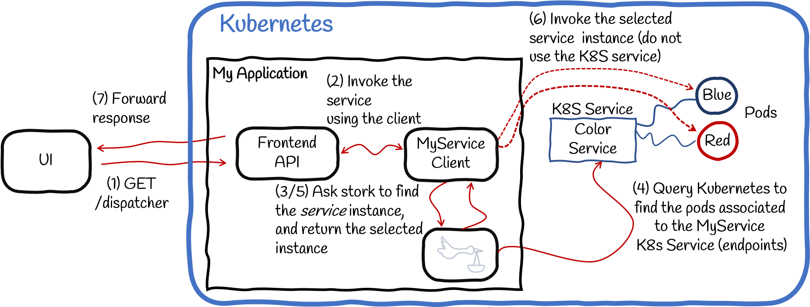

# Using Stork with Kubernetes

> **Guia oficial:** <https://quarkus.io/guides/stork-kubernetes>  
> **Fuente:** `docs/src/main/asciidoc/stork-kubernetes.adoc` en [quarkusio/quarkus@3.38.2](https://github.com/quarkusio/quarkus/blob/3.38.2/docs/src/main/asciidoc/stork-kubernetes.adoc)  
> **Version documentada:** Quarkus 3.38.2 · **Sincronizado:** 2026-08-17 · **Licencia:** Apache-2.0

This guide explains how to use Stork with Kubernetes for service discovery and load balancing.

If you are new to Stork, please read the [Stork Getting Started Guide](stork.md).

<dl><dt><strong><a name="extension-status-note"></a>📌 NOTE</strong></dt><dd>

This technology is considered preview.

## Prerequisites

To complete this guide, you need:

* Roughly 15 minutes
* An IDE
* JDK 17+ installed with `JAVA_HOME` configured appropriately
* Apache Maven 3.9.16
* A working container runtime (Docker or [Podman](https://quarkus.io/guides/podman))
* Optionally the [Quarkus CLI](../10-extras/cli-tooling.md) if you want to use it
* Optionally Mandrel or GraalVM installed and [configured appropriately](../08-rendimiento-nativo/building-native-image.md#configuring-graalvm) if you want to build a native executable (or Docker if you use a native container build)
* Access to a Kubernetes cluster (Minikube is a viable option)

## Architecture

In this guide, we will work with a few components deployed in a Kubernetes cluster:

* A simple blue service.
* A simple red service.
* The `color-service` is the Kubernetes service which is the entry point to the Blue and Red instances.
* A client service using a REST client to call the blue or the red service. Service discovery and selection are delegated to Stork.



For the sake of simplicity, everything will be deployed in the same namespace of the Kubernetes cluster.

## Solution

We recommend that you follow the instructions in the next sections and create the applications step by step.
However, you can go right to the completed example.

Clone the Git repository: `git clone https://github.com/quarkusio/quarkus-quickstarts.git`, or download an [archive](https://github.com/quarkusio/quarkus-quickstarts/archive/main.zip).

The solution is located in the `stork-kubernetes-quickstart` [directory](https://github.com/quarkusio/quarkus-quickstarts/tree/main/stork-kubernetes-quickstart).

## Discovery and selection

Before going further, we need to discuss discovery vs. selection.

* Service discovery is the process of locating service instances.
It produces a list of service instances that is potentially empty (if no service matches the request) or contains multiple service instances.
* Service selection, also called load-balancing, chooses the best instance from the list returned by the discovery process.
The result is a single service instance or an exception when no suitable instance can be found.

Stork handles both discovery and selection.
However, it does not handle the communication with the service but only provides a service instance.
The various integrations in Quarkus extract the location of the service from that service instance.

## Bootstrapping the project

Create a Quarkus project importing the quarkus-rest-client, quarkus-rest, and quarkus-smallrye-stork extensions using your favorite approach:

**CLI**

```bash
quarkus create app org.acme:stork-kubernetes-quickstart \
    --extension='quarkus-rest-client,quarkus-rest,quarkus-smallrye-stork' \
    --no-code
cd stork-kubernetes-quickstart
```

To create a Gradle project, add the `--gradle` or `--gradle-kotlin-dsl` option.

For more information about how to install and use the Quarkus CLI, see the [Quarkus CLI](../10-extras/cli-tooling.md) guide.

**Maven**

```bash
mvn io.quarkus.platform:quarkus-maven-plugin:3.38.2:create \
    -DprojectGroupId=org.acme \
    -DprojectArtifactId=stork-kubernetes-quickstart \
    -Dextensions='quarkus-rest-client,quarkus-rest,quarkus-smallrye-stork' \
    -DnoCode
cd stork-kubernetes-quickstart
```

To create a Gradle project, add the `-DbuildTool=gradle` or `-DbuildTool=gradle-kotlin-dsl` option.

For Windows users:

* If using cmd, (don’t use backward slash `\` and put everything on the same line)
* If using Powershell, wrap `-D` parameters in double quotes e.g. `"-DprojectArtifactId=stork-kubernetes-quickstart"`

In the generated project, also add the following dependencies:

**pom.xml**

```xml
<dependency>
    <groupId>io.smallrye.stork</groupId>
    <artifactId>stork-service-discovery-kubernetes</artifactId>
</dependency>
<dependency>
      <groupId>io.smallrye.stork</groupId>
      <artifactId>stork-load-balancer-random</artifactId>
</dependency>
<dependency>
    <groupId>io.quarkus</groupId>
    <artifactId>quarkus-kubernetes</artifactId>
</dependency>
<dependency>
    <groupId>io.quarkus</groupId>
    <artifactId>quarkus-kubernetes-client</artifactId>
</dependency>
<dependency>
    <groupId>io.quarkus</groupId>
    <artifactId>quarkus-container-image-jib</artifactId>
</dependency>
```

**build.gradle**

```gradle
implementation("io.smallrye.stork:stork-service-discovery-kubernetes")
implementation("io.smallrye.stork:stork-load-balancer-random")
implementation("io.quarkus:quarkus-kubernetes")
implementation("io.quarkus:quarkus-kubernetes-client")
implementation("io.quarkus:quarkus-container-image-jib")
```

`stork-service-discovery-kubernetes` provides an implementation of service discovery for Kubernetes. `stork-load-balancer-random` provides an implementation of random load balancer. `quarkus-kubernetes` enables the generation of Kubernetes manifests each time we perform a build. The `quarkus-kubernetes-client` extension enables the use of the Fabric8 Kubernetes Client in native mode. And `quarkus-container-image-jib` enables the build of a container image using [Jib](https://github.com/GoogleContainerTools/jib).

## The Blue and Red services

Let’s start with the very beginning: the service we will discover, select and call.

The Red and Blue are two simple REST services serving an endpoint responding `Hello from Red!` and `Hello from Blue!` respectively. The code of both applications has been developed following the [Getting Started Guide](../10-extras/getting-started.md).

As the goal of this guide is to show how to use Stork Kubernetes service discovery, we won’t provide the specifics steps for the Red and Blue services. Their container images are already built and available in a public registry:

* [Blue service container image](https://quay.io/repository/quarkus/blue-service)
* [Red service container image](https://quay.io/repository/quarkus/red-service)

## Deploy the Blue and Red services in Kubernetes

Now that we have our service container images available in a public registry, we need to deploy them into the Kubernetes cluster.

The following file contains all the Kubernetes resources needed to deploy the Blue and Red services in the cluster and make them accessible:

```yaml
kind: Role
apiVersion: rbac.authorization.k8s.io/v1
metadata:
  namespace: development
  name: endpoints-reader
rules:
  - apiGroups: [""] # "" indicates the core API group
    resources: ["endpoints", "pods"]
    verbs: ["get", "list"]
---
apiVersion: rbac.authorization.k8s.io/v1
kind: RoleBinding
metadata:
  name: stork-rb
  namespace: development
subjects:
  - kind: ServiceAccount
    # Reference to upper's `metadata.name`
    name: default
    # Reference to upper's `metadata.namespace`
    namespace: development
roleRef:
  kind: Role
  name: endpoints-reader
  apiGroup: rbac.authorization.k8s.io
---
apiVersion: v1
kind: Service
metadata:
  annotations:
    app.quarkus.io/commit-id: f747f359406bedfb1a39c57392a5b5a9eaefec56
    app.quarkus.io/build-timestamp: 2022-03-31 - 10:36:56 +0000
  labels:
    app.kubernetes.io/name: color-service
    app.kubernetes.io/version: "1.0"
  name: color-service //<1>
spec:
  ports:
    - name: http
      port: 80
      targetPort: 8080
  selector:
    app.kubernetes.io/version: "1.0"
    type: color-service
  type: ClusterIP
---
apiVersion: apps/v1
kind: Deployment
metadata:
  annotations:
    app.quarkus.io/commit-id: f747f359406bedfb1a39c57392a5b5a9eaefec56
    app.quarkus.io/build-timestamp: 2022-03-31 - 10:36:56 +0000
  labels:
    color: blue
    type: color-service
    app.kubernetes.io/name: blue-service
    app.kubernetes.io/version: "1.0"
  name: blue-service //<2>
spec:
  replicas: 1
  selector:
    matchLabels:
      app.kubernetes.io/name: blue-service
      app.kubernetes.io/version: "1.0"
  template:
    metadata:
      annotations:
        app.quarkus.io/commit-id: f747f359406bedfb1a39c57392a5b5a9eaefec56
        app.quarkus.io/build-timestamp: 2022-03-31 - 10:36:56 +0000
      labels:
        color: blue
        type: color-service
        app.kubernetes.io/name: blue-service
        app.kubernetes.io/version: "1.0"
    spec:
      containers:
        - env:
            - name: KUBERNETES_NAMESPACE
              valueFrom:
                fieldRef:
                  fieldPath: metadata.namespace
          image: quay.io/quarkus/blue-service:1.0
          imagePullPolicy: Always
          name: blue-service
          ports:
            - containerPort: 8080
              name: http
              protocol: TCP
---
apiVersion: apps/v1
kind: Deployment
metadata:
  annotations:
    app.quarkus.io/commit-id: 27be03414510f776ca70d70d859b33e134570443
    app.quarkus.io/build-timestamp: 2022-03-31 - 10:38:54 +0000
  labels:
    color: red
    type: color-service
    app.kubernetes.io/version: "1.0"
    app.kubernetes.io/name: red-service
  name: red-service //<2>
spec:
  replicas: 1
  selector:
    matchLabels:
      app.kubernetes.io/version: "1.0"
      app.kubernetes.io/name: red-service
  template:
    metadata:
      annotations:
        app.quarkus.io/commit-id: 27be03414510f776ca70d70d859b33e134570443
        app.quarkus.io/build-timestamp: 2022-03-31 - 10:38:54 +0000
      labels:
        color: red
        type: color-service
        app.kubernetes.io/version: "1.0"
        app.kubernetes.io/name: red-service
    spec:
      containers:
        - env:
            - name: KUBERNETES_NAMESPACE
              valueFrom:
                fieldRef:
                  fieldPath: metadata.namespace
          image: quay.io/quarkus/red-service:1.0
          imagePullPolicy: Always
          name: red-service
          ports:
            - containerPort: 8080
              name: http
              protocol: TCP
---
apiVersion: networking.k8s.io/v1
kind: Ingress //<3>
metadata:
  annotations:
    app.quarkus.io/commit-id: f747f359406bedfb1a39c57392a5b5a9eaefec56
    app.quarkus.io/build-timestamp: 2022-03-31 - 10:46:19 +0000
  labels:
    app.kubernetes.io/name: color-service
    app.kubernetes.io/version: "1.0"
    color: blue
    type: color-service
  name: color-service
spec:
  rules:
    - host: color-service.127.0.0.1.nip.io
      http:
        paths:
          - backend:
              service:
                name: color-service
                port:
                  name: http
            path: /
            pathType: Prefix

```

There are a few interesting parts in this listing:

1. The Kubernetes Service resource, `color-service`, that Stork will discover.
2. The Red and Blue service instances behind the `color-service` Kubernetes service.
3. A Kubernetes Ingress resource making the `color-service` accessible from the outside of the cluster at the `color-service.127.0.0.1.nip.io` url. Note that the Ingress is not needed for Stork however, it helps to check that the architecture is in place.

Create a file named `kubernetes-setup.yml` with the content above at the root of the project and run the following commands to deploy all the resources in the Kubernetes cluster. Don’t forget to create a dedicated namespace:

```shell script
kubectl create namespace development
kubectl apply -f kubernetes-setup.yml -n=development
```

If everything went well the Color service is accessible on http://color-service.127.0.0.1.nip.io. You should have `Hello from Red!` and `Hello from Blue!` response randomly.

**📌 NOTE**\
Stork is not limited to Kubernetes and integrates with other service discovery mechanisms.

## The REST Client interface and the front end API

So far, we didn’t use Stork; we just deployed the services we will be discovering, selecting, and calling.

We will call the services using the REST Client.
Create the `src/main/java/org/acme/MyService.java` file with the following content:

```java
package org.acme;

import org.eclipse.microprofile.rest.client.inject.RegisterRestClient;

import jakarta.ws.rs.GET;
import jakarta.ws.rs.Produces;
import jakarta.ws.rs.core.MediaType;

/**
 * The REST Client interface.
 *
 * Notice the `baseUri`. It uses `stork://` as URL scheme indicating that the called service uses Stork to locate and
 * select the service instance. The `my-service` part is the service name. This is used to configure Stork discovery
 * and selection in the `application.properties` file.
 */
@RegisterRestClient(baseUri = "stork://my-service")
public interface MyService {

    @GET
    @Produces(MediaType.TEXT_PLAIN)
    String get();
}
```

It’s a straightforward REST client interface containing a single method. However, note the `baseUri` attribute:
* the `stork://` suffix instructs the REST client to delegate the discovery and selection of the service instances to Stork,
* the `my-service` part of the URI is the service name we will be using in the application configuration.

It does not change how the REST client is used.
Create the `src/main/java/org/acme/FrontendApi.java` file with the following content:

```java
package org.acme;

import org.eclipse.microprofile.rest.client.inject.RestClient;

import jakarta.ws.rs.GET;
import jakarta.ws.rs.Path;
import jakarta.ws.rs.Produces;
import jakarta.ws.rs.core.MediaType;

/**
 * A frontend API using our REST Client (which uses Stork to locate and select the service instance on each call).
 */
@Path("/api")
public class FrontendApi {

    @RestClient MyService service;

    @GET
    @Produces(MediaType.TEXT_PLAIN)
    public String invoke() {
        return service.get();
    }

}
```

It injects and uses the REST client as usual.

## Stork configuration

Now we need to configure Stork for using Kubernetes to discover the red and blue instances of the service.

In the `src/main/resources/application.properties`, add:

```properties
quarkus.stork.my-service.service-discovery.type=kubernetes
quarkus.stork.my-service.service-discovery.k8s-namespace=development
quarkus.stork.my-service.service-discovery.application=color-service
quarkus.stork.my-service.load-balancer.type=random
```

`stork.my-service.service-discovery` indicates which type of service discovery we will be using to locate the `my-service` service.
In our case, it’s `kubernetes`.
If your access to the Kubernetes cluster is configured via Kube config file, you don’t need to configure the access to it. Otherwise, set the proper Kubernetes url using the `quarkus.stork.my-service.service-discovery.k8s-host` property.
`quarkus.stork.my-service.service-discovery.application` contains the name of the Kubernetes service Stork is going to ask for. In our case, this is the `color-service` corresponding to the kubernetes service backed by the Red and Blue instances.
Finally, `quarkus.stork.my-service.load-balancer.type` configures the service selection. In our case, we use a `random` Load Balancer.

## Deploy the REST Client interface and the front end API in the Kubernetes cluster

The system is almost complete. We only need to deploy the REST Client interface and the client service to the cluster.
In the `src/main/resources/application.properties`, add:

```properties
quarkus.container-image.registry=<public registry>
quarkus.kubernetes-client.trust-certs=true
quarkus.kubernetes.ingress.expose=true
quarkus.kubernetes.ingress.host=my-service.127.0.0.1.nip.io
```

The `quarkus.container-image.registry` contains the container registry to use.
The `quarkus.kubernetes.ingress.expose` indicates that the service will be accessible from the outside of the cluster.
The `quarkus.kubernetes.ingress.host` contains the url to access the service. We are using [nip.io](https://nip.io/) wildcard for IP address mappings.

For a more customized configuration you can check the [Deploying to Kubernetes guide](../08-rendimiento-nativo/deploying-to-kubernetes.md)

## Build and push the container image

Thanks to the extensions we are using, we can perform the build of a container image using Jib and also enabling the generation of Kubernetes manifests while building the application. For example, the following command will generate a Kubernetes manifest in the `target/kubernetes/` directory and also build and push a container image for the project:

```shell script
./mvnw package -Dquarkus.container-image.build=true -Dquarkus.container-image.push=true
```

## Deploy client service to the Kubernetes cluster

The generated manifest can be applied to the cluster from the project root using kubectl:

```shell script
kubectl apply -f target/kubernetes/kubernetes.yml -n=development
```

<dl><dt><strong>📌 NOTE</strong></dt><dd>

Please note that if you use Elliptic Curve keys with Stork and are getting exceptions like `java.lang.ClassNotFoundException: org.bouncycastle.jce.provider.BouncyCastleProvider`, then adding a BouncyCastle PKIX dependency (`org.bouncycastle:bcpkix-jdk18on`) is required.

Note that internally an `org.bouncycastle.jce.provider.BouncyCastleProvider` provider will be registered if it has not already been registered.

You can have this provider registered as described in the [BouncyCastle](https://quarkus.io/guides/security-customization#bouncy-castle) or [BouncyCastle FIPS](https://quarkus.io/guides/security-customization#bouncy-castle-fips) sections.
</dd></dl>

We’re done!
So, let’s see if it works.

Open a browser and navigate to http://my-service.127.0.0.1.nip.io/api.

Or if you prefer, in another terminal, run:

```shell script
> curl http://my-service.127.0.0.1.nip.io/api
...
> curl http://my-service.127.0.0.1.nip.io/api
...
> curl http://my-service.127.0.0.1.nip.io/api
...
```

The responses should alternate randomly between `Hello from Red!` and `Hello from Blue!`.

You can compile this application into a native executable:

**CLI**

```bash
quarkus build --native
```
**Maven**

```bash
./mvnw install -Dnative
```
**Gradle**

```bash
./gradlew build -Dquarkus.native.enabled=true
```

Then, you need to build a container image based on the native executable. For this use the corresponding Dockerfile:

```shell script
> docker build -f src/main/docker/Dockerfile.native -t quarkus/stork-kubernetes-quickstart .
```

After publishing the new image to the container registry. You can redeploy the Kubernetes manifest to the cluster.

## Going further

This guide has shown how to use SmallRye Stork to discover and select your services.
You can find more about Stork in:

* the [Stork reference guide](stork-reference.md),
* the [Stork with Consul reference guide](stork.md),
* the [SmallRye Stork website](https://smallrye.io/smallrye-stork).
