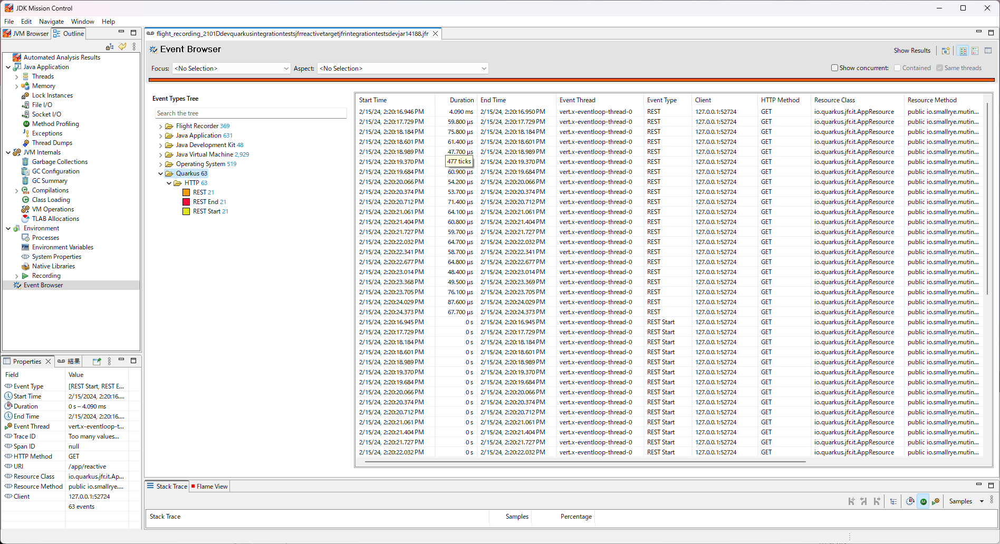
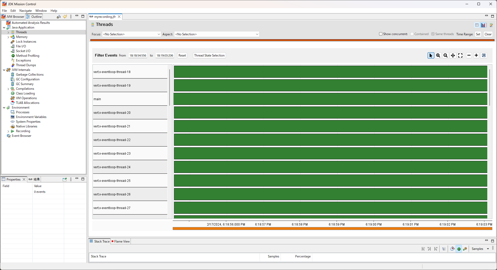
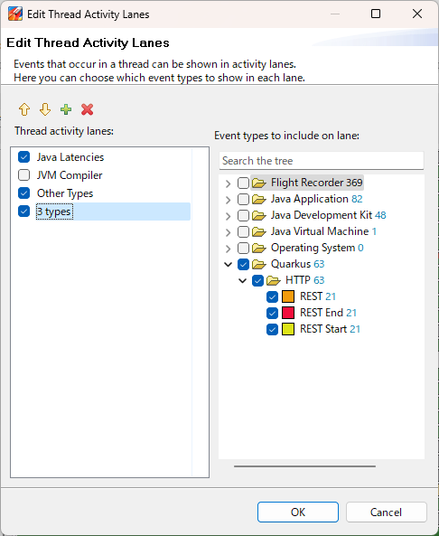
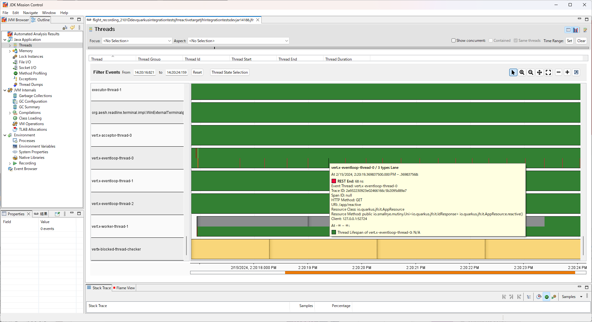

# Using JDK Flight Recorder

> **Guia oficial:** <https://quarkus.io/guides/jfr>  
> **Fuente:** `docs/src/main/asciidoc/jfr.adoc` en [quarkusio/quarkus@3.38.2](https://github.com/quarkusio/quarkus/blob/3.38.2/docs/src/main/asciidoc/jfr.adoc)  
> **Version documentada:** Quarkus 3.38.2 · **Sincronizado:** 2026-08-17 · **Licencia:** Apache-2.0

This guide explains how [Flight Recorder](https://openjdk.org/jeps/328) can be extended to provide additional insight into your Quarkus application.
JFR records various information from the Java standard API and JVM as events.
By adding the Quarkus JFR extension, you can add custom Quarkus events to JFR. This will help you solve potential problems in your application.

This document is part of the [Observability in Quarkus reference guide](observability.md) which features this and other observability related components.

JFR can be preconfigured to dump a file, and when the application exits, JFR will output the file.
The file will contain the content of the JFR event stream to which Quarkus custom events have also been added.
You can, of course, get this file at any time you want, even if your application exits unexpectedly.

## Prerequisites

To complete this guide, you need:

* Roughly 15 minutes
* An IDE
* JDK 17+ installed with `JAVA_HOME` configured appropriately
* Apache Maven 3.9.16
* Optionally the [Quarkus CLI](../10-extras/cli-tooling.md) if you want to use it
* Optionally Mandrel or GraalVM installed and [configured appropriately](../08-rendimiento-nativo/building-native-image.md#configuring-graalvm) if you want to build a native executable (or Docker if you use a native container build)

## Architecture

In this guide, we create a straightforward REST application to demonstrate JFR usage.

## Creating the Maven project

First, we need a new project. Create a new project with the following command:

**CLI**

```bash
quarkus create app org.acme:jfr-quickstart \
    --extension='quarkus-rest,quarkus-jfr' \
    --no-code
cd jfr-quickstart
```

To create a Gradle project, add the `--gradle` or `--gradle-kotlin-dsl` option.

For more information about how to install and use the Quarkus CLI, see the [Quarkus CLI](../10-extras/cli-tooling.md) guide.

**Maven**

```bash
mvn io.quarkus.platform:quarkus-maven-plugin:3.38.2:create \
    -DprojectGroupId=org.acme \
    -DprojectArtifactId=jfr-quickstart \
    -Dextensions='quarkus-rest,quarkus-jfr' \
    -DnoCode
cd jfr-quickstart
```

To create a Gradle project, add the `-DbuildTool=gradle` or `-DbuildTool=gradle-kotlin-dsl` option.

For Windows users:

* If using cmd, (don’t use backward slash `\` and put everything on the same line)
* If using Powershell, wrap `-D` parameters in double quotes e.g. `"-DprojectArtifactId=jfr-quickstart"`

This command generates the Maven project and imports the Quarkus JFR extension,
which includes the default JFR support.

If you already have your Quarkus project configured, you can add the JFR extension
to your project by running the following command in your project base directory:

**CLI**

```bash
quarkus extension add quarkus-jfr
```
**Maven**

```bash
./mvnw quarkus:add-extension -Dextensions='quarkus-jfr'
```
**Gradle**

```bash
./gradlew addExtension --extensions='quarkus-jfr'
```

This will add the following to your build file:

**pom.xml**

```xml
<dependency>
    <groupId>io.quarkus</groupId>
    <artifactId>quarkus-jfr</artifactId>
</dependency>
```

**build.gradle**

```gradle
implementation("io.quarkus:quarkus-jfr")
```

### Examine the Jakarta REST resource

Create a `src/main/java/org/acme/jfr/JfrResource.java` file with the following content:

```java
package org.acme.jfr;

import jakarta.ws.rs.GET;
import jakarta.ws.rs.Path;
import jakarta.ws.rs.Produces;
import jakarta.ws.rs.core.MediaType;

@Path("/hello")
public class JfrResource {

    @GET
    @Produces(MediaType.TEXT_PLAIN)
    public String hello() {
        return "hello";
    }
}
```

Notice that there is no JFR specific code included in the application. By default, requests sent to this
endpoint will be recorded into JFR without any required code changes.

### Running Quarkus applications and JFR

Now we are ready to run our application.
We can launch the application with JFR configured to be enabled from the startup of the Java Virtual Machine.

**CLI**

```bash
quarkus dev -Djvm.args="-XX:StartFlightRecording=name=quarkus,dumponexit=true,filename=myrecording.jfr"
```
**Maven**

```bash
./mvnw quarkus:dev -Djvm.args="-XX:StartFlightRecording=name=quarkus,dumponexit=true,filename=myrecording.jfr"
```
**Gradle**

```bash
./gradlew --console=plain quarkusDev -Djvm.args="-XX:StartFlightRecording=name=quarkus,dumponexit=true,filename=myrecording.jfr"
```

With the JDK Flight Recorder and the application running, we can make a request to the provided endpoint:

```shell
$ curl http://localhost:8080/hello
hello
```

This is all that is needed to write the information to JFR.

### Save the JFR events to a file

As mentioned above, the Quarkus application was configured to also start JFR at startup and dump it to a `myrecording.jfr` when it terminates.
So we can get the file when we hit `CTRL+C` or type `q` to stop the application.

Or, we can also dump it with the `jcmd` command.

```shell
jcmd <PID> JFR.dump name=quarkus filename=myrecording.jfr
```

<dl><dt><strong>📌 NOTE</strong></dt><dd>

Running the `jcmd` command give us a list of running Java processes and the PID of each process.
</dd></dl>

## Open JFR dump file

We can open a JFR dump using two tools: the `jfr` CLI and JDK Mission Control ([JMC](https://www.oracle.com/java/technologies/jdk-mission-control.html)).
It is also possible to read them using JFR APIs, but we won’t go into that in this guide.

### jfr CLI

The `jfr` CLI is a tool included in OpenJDK. The executable file is `$JAVA_HOME/bin/jfr`.
We can use the jfr CLI to see a list of events limited to those related to Quarkus in the dump file by running the following command:

```shell
jfr print --categories quarkus myrecording.jfr
```

### JDK Mission Control

JMC is essentially a GUI for JFR.
Some Java distributions include JMC, but if not, you need to download it manually.

To see a list of events using JMC, first we load the JFR file in JMC as follows.

```shell
jmc -open myrecording.jfr
```

After opening the JFR file, we have two options.
One is to view the events as a tabular list, and the other is to view the events on the threads in which they occurred, in chronological order.

To view Quarkus events in tabular style, select the Event Browser on the left side of JMC, then open the Quarkus event type tree on the right side of JMC.



To see Quarkus events in chronological order on a thread, select the `Java application` and `Threads` on the left side of JMC.



The standard configuration does not show Quarkus events.
We have to do three tasks to see the Quarkus events.

1. Right-click and select `Edit Thread Activity Lanes...`.
2. Select the plus button to add a new lane on the left side, then check to display that lane.
3. Select Quarkus as the event type that lane will display and press OK.



Now we can see the Quarkus events per thread.



<dl><dt><strong>📌 NOTE</strong></dt><dd>

This extension is able to records multiple JFR events concurrently (emitted by different threads or from the same thread in the case of the reactive execution model).
Thus, events might overlap in JMC.
This could make it difficult for you to see the events you want to see.
To avoid this, we recommend to use [Request IDs](#identifying-requests) to filter events so that you only see the information about the requests you want to see.
</dd></dl>

## Events

### Identifying Requests

This extension collaborates with the OpenTelemetry extension.
The events recorded by this extension have a trace ID and a span ID. These are recorded with the OpenTelemetry IDs respectively.

This means that after we identify the trace and span IDs of interest from the UI provided by the OpenTelemetry implementation, we can immediately jump to the details in JFR using those IDs.

If we have not enabled the OpenTelemetry extension, this extension creates an ID for each request and links it to JFR events as a traceId.
In this case, the span ID will be null.

For now, Quarkus only records REST events, but we plan to use this ID to link each event to each other as we add more events in the future.

### Event Implementation Policy

When JFR starts recording an event, the event does not record to JFR yet, but when it commits that event, the event is recorded.
Therefore, events that have started recording at dump time but have not yet been committed are not dumped.
This is unavoidable due to the design of JFR.
This means that events are not recorded forever if there are prolonged processing.
Therefore, you will not be aware of prolonged processing.

To solve this problem, Quarkus can also record start and end events at the beginning and end of processing.
These events are disabled by default.
However, we can enable these events in JFR, as described below.

### REST API Event

This event is recorded when either the Quarkus REST or RESTEasy extension is enabled.
The following three JFR events are recorded as soon as REST server processing is complete.

* **REST**

      Records the time period from the start of the REST server process to the end of the REST server process.
* **RestStart**

      Records the start of the REST server process.
* **RestEnd**

      Records the end of the REST server process.

These events have the following information.

* HTTP Method
* URI
* Resource Class
* Resource Method
* Client

HTTP Method records the HTTP Method accessed by the client.
This will record a string of HTTP methods such as GET, POST, DELETE, and other general HTTP methods.

URI records the URI path accessed by the client.
This does not include host names or port numbers.

Resource Class records the class that was executed.
We can check whether the Resource Class was executed as expected by the HTTP Method and URI.

Resource Method records the method that was executed.
We can check if the Resource Method was executed as expected by the HTTP Method and URI.

Client records information about the accessing client.

### Runtime Event
This event is recorded by default.
The following three JFR events are recorded in JFR chunks.

* **QuarkusRuntime**

      Records information about Quarkus running. This event includes the Quarkus version, its profiles, and the mode in which it is running.
* **QuarkusApplication**

      Records information about Quarkus application running. This event includes the name of the application and its version.
* **Extension**

      Records information about extensions included in the running Quarkus. This event includes the name of the extensions installed in Quarkus.

### Native Image

Native executables supports JDK Flight Recorder.
This extension also supports native executables.

To enable JFR on native executables, it is usually built with `--enable-monitoring`.
However, we can enable JFR in Quarkus native executables by adding `jfr` to the configuration property `quarkus.native.monitoring`.
There are two ways to set up this configuration: by including it in the `application.properties` or by specifying it at build time.

The first method is to first configure settings in `application.properties`.

```properties
quarkus.native.monitoring=jfr
```

Then build your native executable as usual:

**CLI**

```bash
quarkus build --native
```
**Maven**

```bash
./mvnw install -Dnative
```
**Gradle**

```bash
./gradlew build -Dquarkus.native.enabled=true
```

The second way is to pass `-Dquarkus.native.monitoring=jfr` at build time:

**CLI**

```bash
quarkus build --native -Dquarkus.native.monitoring=jfr
```
**Maven**

```bash
./mvnw install -Dnative -Dquarkus.native.monitoring=jfr
```
**Gradle**

```bash
./gradlew build -Dquarkus.native.enabled=true -Dquarkus.native.monitoring=jfr
```

Once you have finished building the native executable, you can run the native application with JFR as follows:

```shell
target/your-application-runner -XX:StartFlightRecording=name=quarkus,dumponexit=true,filename=myrecording.jfr
```

<dl><dt><strong>📌 NOTE</strong></dt><dd>

Note that at this time, Mandrel and GraalVM cannot record JFR for Windows native executables.
</dd></dl>

## JFR configuration

We can use the JFR CLI to configure the events that JFR will record.
The configuration file, JFC file, is in XML format, so we can modify it with a text editor.
However, it is recommended to use `jfr configure`, which is included in OpenJDK by default.

Here we create a configuration file in which REST Start and REST End events are recorded (they are not recorded by default):

```shell
jfr configure --input default.jfc +quarkus.RestStart#enabled=true +quarkus.RestEnd#enabled=true --output custom-rest.jfc
```

This creates `custom-rest.jfc` as a configuration file with recording for RestStart and RestEnd enabled.

Now we are ready to run our application with the new settings.
We launch the application with JFR configured so that it is enabled from the startup of the Java Virtual Machine.

**CLI**

```bash
quarkus dev -Djvm.args="-XX:StartFlightRecording=name=quarkus,settings=./custom-rest.jfc,dumponexit=true,filename=myrecording.jfr"
```
**Maven**

```bash
./mvnw quarkus:dev -Djvm.args="-XX:StartFlightRecording=name=quarkus,settings=./custom-rest.jfc,dumponexit=true,filename=myrecording.jfr"
```
**Gradle**

```bash
./gradlew --console=plain quarkusDev -Djvm.args="-XX:StartFlightRecording=name=quarkus,settings=./custom-rest.jfc,dumponexit=true,filename=myrecording.jfr"
```

## Adding new events

This section is for extension authors who want to add new JFR events.

### Depending on the API module

The Quarkus JFR extension separates the public API from the runtime implementation.
As a result, other extensions can implement JFR-based instrumentation by depending only on the JFR API module, without adding a dependency on the Quarkus JFR extension implementation itself.

At deployment time, an extension can detect whether the application has enabled the Quarkus JFR extension by using Quarkus capabilities:

```java
import io.quarkus.deployment.Capabilities;
import io.quarkus.deployment.Capability;
import io.quarkus.deployment.annotations.BuildStep;
import io.quarkus.deployment.annotations.BuildSteps;

@BuildSteps
class MyProcessor {

    @BuildStep
    void step(Capabilities capabilities) {
        if (capabilities.isPresent(Capability.JFR)) {
            // The Quarkus JFR extension is enabled
            // Register JFR-related build items, bytecode transformations, etc.
        }
    }
}
```

This pattern allows your extension to:
* compile against stable API types only, and
* activate JFR instrumentation only when the Quarkus JFR extension is present in the application.

### Associating events by request

We recommend that new events be associated with existing events.
Associations are useful when looking at the details of a process that is taking a long time.
For example, a general REST application retrieves the data needed for processing from a datastore.
If REST events are not associated with datastore events, it is impossible to know which datastore events were processed in each REST request.
When the two events are associated, we know immediately which datastore event was processed in each REST request.

<dl><dt><strong>📌 NOTE</strong></dt><dd>

Datastore events are not implemented yet.
</dd></dl>

The Quarkus JFR extension provides a Request ID for event association.
See [Identifying Requests](#identifying-requests) for more information on Request IDs.

In code, you typically need the following two steps.

#### 1) Add trace/span identifiers to your event

Implement `traceId` and `spanId` on the new event as follows.
The `@TraceIdRelational` and `@SpanIdRelational` annotations mark these fields as relational identifiers used for association.

```java
import io.quarkus.jfr.api.SpanIdRelational;
import io.quarkus.jfr.api.TraceIdRelational;
import jdk.jfr.Description;
import jdk.jfr.Event;
import jdk.jfr.Label;

public class NewEvent extends Event {

    @Label("Trace ID")
    @Description("Trace ID to identify the request")
    @TraceIdRelational
    protected String traceId;

    @Label("Span ID")
    @Description("Span ID to identify the request if necessary")
    @SpanIdRelational
    protected String spanId;

    // other properties which you want to add
    // setters and getters
}
```

#### 2) Populate the identifiers from the IdProducer

Obtain the values to store in the event from an `IdProducer` and set them just before committing the event.

```java
import io.quarkus.jfr.api.IdProducer;

public class NewInterceptor {

    @Inject
    IdProducer idProducer;

    private void recordedInvoke() {
        NewEvent event = new NewEvent();
        event.begin();

        // The process you want to measure

        event.end();
        if (event.shouldCommit()) {
            event.setTraceId(idProducer.getTraceId());
            event.setSpanId(idProducer.getSpanId());
            // call other setters which you want to add
            event.commit();
        }
    }
}
```

## Configuration Reference

**📌 NOTE**\
La tabla de configuracion generada `quarkus-jfr` se produce al construir la documentacion y no existe en el codigo fuente. Consulta la referencia de configuracion en https://quarkus.io/guides/all-config
