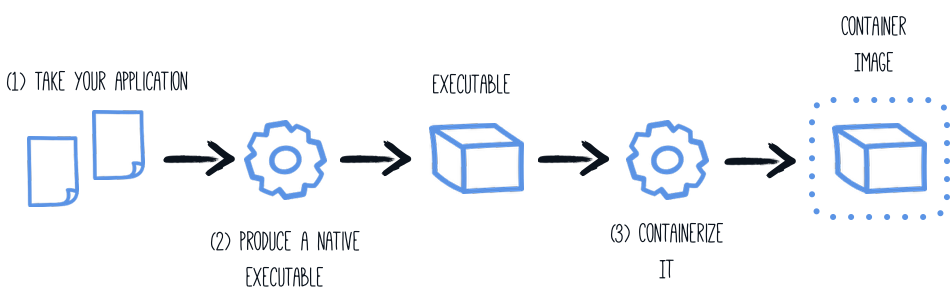

# Building a Native Executable

> **Guia oficial:** <https://quarkus.io/guides/building-native-image>  
> **Fuente:** `docs/src/main/asciidoc/building-native-image.adoc` en [quarkusio/quarkus@3.38.2](https://github.com/quarkusio/quarkus/blob/3.38.2/docs/src/main/asciidoc/building-native-image.adoc)  
> **Version documentada:** Quarkus 3.38.2 · **Sincronizado:** 2026-08-17 · **Licencia:** Apache-2.0

This guide covers:

* Compiling the application to a native executable
* Packaging the native executable in a container
* Debugging native executable

This guide takes as input the application developed in the [Getting Started Guide](../10-extras/getting-started.md).

## Prerequisites

To complete this guide, you need:

* Roughly 15 minutes
* An IDE
* JDK 17+ installed with `JAVA_HOME` configured appropriately
* Apache Maven 3.9.16
* A working container runtime (Docker or [Podman](https://quarkus.io/guides/podman))
* Optionally the [Quarkus CLI](../10-extras/cli-tooling.md) if you want to use it
* Mandrel or GraalVM installed and [configured appropriately](building-native-image.md#configuring-graalvm)
* A [working C development environment](#configuring-c-development)
* The code of the application developed in the [Getting Started Guide](../10-extras/getting-started.md).

<dl><dt><strong><a name="configuring-c-development"></a>📌 NOTE: Supporting native compilation in C</strong></dt><dd>

What does having a working C developer environment mean?

* On Linux, you will need GCC, and the glibc and zlib headers. Examples for common distributions:

  ```bash
  # dnf (rpm-based)
  sudo dnf install gcc glibc-devel zlib-devel libstdc++-static
  # Debian-based distributions:
  sudo apt-get install build-essential libz-dev zlib1g-dev
  # Arch Linux
  sudo pacman -S freetype2 gcc glibc lib32-gcc-libs zlib
  ```
* XCode provides the required dependencies on macOS:

  ```bash
  xcode-select --install
  ```
* On Windows, you will need to install the [Visual Studio 2022 Visual C++ Build Tools](https://aka.ms/vs/17/release/vs_buildtools.exe)
</dd></dl>

### Background

Building a native executable requires using a distribution of GraalVM.
There are three distributions:
Oracle GraalVM Community Edition (CE), Oracle GraalVM Enterprise Edition (EE) and Mandrel.
The differences between the Oracle and Mandrel distributions are as follows:

* Mandrel is a downstream distribution of the Oracle GraalVM CE.
Mandrel’s main goal is to provide a way to build native executables specifically designed to support Quarkus.
* Mandrel releases are built from a code base derived from the upstream Oracle GraalVM CE code base,
with only minor changes but some significant exclusions that are not necessary for Quarkus native apps.
They support the same capabilities to build native executables as Oracle GraalVM CE,
with no significant changes to functionality.
Notably, they do not include support for polyglot programming.
The reason for these exclusions is to provide a better level of support for the majority of Quarkus users.
These exclusions also mean Mandrel offers a considerable reduction in its distribution size
when compared with Oracle GraalVM CE/EE.
* Mandrel is built slightly differently to Oracle GraalVM CE, using the standard OpenJDK project.
This means that it does not profit from a few small enhancements that Oracle have added to the version of OpenJDK used to build their own GraalVM downloads.
These enhancements are omitted because upstream OpenJDK does not manage them, and cannot vouch for.
This is particularly important when it comes to conformance and security.
* Mandrel is recommended for building native executables that target Linux containerized environments.
This means that Mandrel users are encouraged to use containers to build their native executables.
If you are building native executables for macOS on amd64/x86,
you should consider using Oracle GraalVM instead,
because Mandrel does not currently target this platform.
Building native executables directly on bare metal Linux, macOS (on M processors), or Windows is possible,
with details available in the [Mandrel README](https://github.com/graalvm/mandrel/blob/default/README.md)
and [Mandrel releases](https://github.com/graalvm/mandrel/releases).

### Configuring GraalVM

<dl><dt><strong>💡 TIP</strong></dt><dd>

This step is only required for generating native executables targeting non-Linux operating systems.
For generating native executables targeting Linux, you can optionally skip this section and [use a builder image](#creating-a-linux-executable-without-graalvm-installed) instead.
</dd></dl>

<dl><dt><strong>💡 TIP</strong></dt><dd>

If you cannot install GraalVM, you can use a multi-stage Docker build to run Maven inside a Docker container that embeds GraalVM.
There is an explanation of how to do this at [the end of this guide](#using-a-multi-stage-docker-build).
</dd></dl>

GraalVM for JDK 21 is required.

1. Install GraalVM if you haven’t already. You have a few options for this:
   * Download the appropriate archive from &lt;https://github.com/graalvm/mandrel/releases> or &lt;https://github.com/graalvm/graalvm-ce-builds/releases>, and unpack it like you would any other JDK.
   * Use platform-specific installer tools like [sdkman](https://sdkman.io/jdks#graalce), [homebrew](https://github.com/graalvm/homebrew-tap), or [scoop](https://github.com/ScoopInstaller/Java).
   We recommend the _community edition_ of GraalVM. For example, install it with `sdk install java 21-graalce`.
2. Configure the runtime environment. Set `GRAALVM_HOME` environment variable to the GraalVM installation directory, for example:

   ```bash
   export GRAALVM_HOME=$HOME/Development/mandrel/
   ```

   On macOS (amd64/x86 based Macs not supported), point the variable to the `Home` sub-directory:

   ```bash
   export GRAALVM_HOME=$HOME/Development/graalvm/Contents/Home/
   ```

   On Windows, you will have to go through the Control Panel to set your environment variables.

   <dl><dt><strong>💡 TIP</strong></dt><dd>

   Installing via scoop will do this for you.
   </dd></dl>
3. (Optional) Set the `JAVA_HOME` environment variable to the GraalVM installation directory.

   ```bash
   export JAVA_HOME=${GRAALVM_HOME}
   ```
4. (Optional) Add the GraalVM `bin` directory to the path

   ```bash
   export PATH=${GRAALVM_HOME}/bin:$PATH
   ```

<dl><dt><strong><a name="graal-and-macos"></a>📌 NOTE: Issues using GraalVM with macOS</strong></dt><dd>

GraalVM binaries are not (yet) notarized for macOS as reported in this [GraalVM issue](https://github.com/oracle/graal/issues/1724). This means that you may see the following error when using `native-image`:

```bash
“native-image” cannot be opened because the developer cannot be verified
```

Use the following command to recursively delete the `com.apple.quarantine` extended attribute on the GraalVM install directory as a workaround:

-----
xattr -r -d com.apple.quarantine ${GRAALVM_HOME}/../..
-----
</dd></dl>

## Solution

We recommend that you follow the instructions in the next sections and package the application step by step. However, you can go right to the completed example.

Clone the Git repository: `git clone https://github.com/quarkusio/quarkus-quickstarts.git`, or download an [archive](https://github.com/quarkusio/quarkus-quickstarts/archive/main.zip).

The solution is located in the `getting-started` directory.

## Producing a native executable

The native executable for our application will contain the application code, required libraries, Java APIs, and a reduced version of a VM. The smaller VM base improves the startup time of the application and produces a minimal disk footprint.


If you have generated the application from the previous tutorial, you can find in the `pom.xml` the following Maven profile section:

```xml
<profiles>
    <profile>
        <id>native</id>
        <activation>
            <property>
                <name>native</name>
            </property>
        </activation>
        <properties>
            <skipITs>false</skipITs>
            <quarkus.native.enabled>true</quarkus.native.enabled>
        </properties>
    </profile>
</profiles>
```

<dl><dt><strong>💡 TIP</strong></dt><dd>

You can provide custom options for the `native-image` command using the `quarkus.native.additional-build-args` and `quarkus.native.additional-build-args-append` properties.
Multiple options may be separated by a comma.

By convention `quarkus.native.additional-build-args-append` is meant to be defined at the command line (e.g. `-Dquarkus.native.additional-build-args-append=--verbose`), while `quarkus.native.additional-build-args` may be defined either at the command line or in your `application.properties`. Note that, any arguments included in `quarkus.native.additional-build-args-append` may override those included in `quarkus.native.additional-build-args`.

You can find more information about how to configure the native image building process in the [configuration-reference](#configuration-reference) section below.
</dd></dl>

We use a profile because, you will see very soon, packaging the native executable takes a _few_ minutes. You could
just pass -Dquarkus.native.enabled=true as a property on the command line, however it is better to use a profile as
this allows native image tests to also be run.

Create a native executable using:

**CLI**

```bash
quarkus build --native
```
**Maven**

```bash
./mvnw install -Dnative
```
**Gradle**

```bash
./gradlew build -Dquarkus.native.enabled=true
```

<dl><dt><strong><a name="graal-and-windows"></a>📌 NOTE: Issues with packaging on Windows</strong></dt><dd>

The Microsoft Native Tools for Visual Studio must first be initialized before packaging.
You can do this by starting the `x64 Native Tools Command Prompt` that was installed with the Visual Studio Build Tools.
At the `x64 Native Tools Command Prompt`, you can navigate to your project folder and run `./mvnw package -Dnative`.

Another solution is to write a script to do this for you:

```bash
cmd /c 'call "C:\Program Files\Microsoft Visual Studio\2022\Enterprise\VC\Auxiliary\Build\vcvars64.bat" && mvn package -Dnative'
```
</dd></dl>

In addition to the regular files, the build also produces `target/getting-started-1.0.0-SNAPSHOT-runner`.
You can run it using: `./target/getting-started-1.0.0-SNAPSHOT-runner`.

<dl><dt><strong><a name="graal-package-preview"></a>📌 NOTE: Java preview features</strong></dt><dd>

Java code that relies on preview features requires special attention.
To produce a native executable, this means that the `--enable-preview` flag needs to be passed to the underlying native image invocation.
You can do so by prepending the flag with `-J` and passing it as additional native build argument: `-Dquarkus.native.additional-build-args=-J--enable-preview`.
</dd></dl>

### Build fully static native executables

**❗ IMPORTANT**\
Fully static native executables support is experimental.

On Linux it’s possible to package a native executable that doesn’t depend on any system shared library.
There are [some system requirements](https://www.graalvm.org/jdk21/reference-manual/native-image/guides/build-static-executables/#prerequisites-and-preparation) to be fulfilled and additional build arguments to be used along with the `native-image` invocation, a minimum is `-Dquarkus.native.additional-build-args="--static","--libc=musl"`.

Compiling fully static binaries is done by statically linking [musl](https://musl.libc.org/) instead of `glibc` and should not be used in production without rigorous testing.

## Testing the native executable

Producing a native executable can lead to a few issues, and so it’s also a good idea to run some tests against the application running in the native file. The reasoning is explained in the [Testing Guide](../09-testing/getting-started-testing.md#quarkus-integration-test).

To see the `GreetingResourceIT` run against the native executable, use `./mvnw verify -Dnative`:
```shell
$ ./mvnw verify -Dnative
...
Finished generating 'getting-started-1.0.0-SNAPSHOT-runner' in 22.0s.
[INFO] [io.quarkus.deployment.pkg.steps.NativeImageBuildRunner] docker run --env LANG=C --rm --user 1000:1000 -v /home/zakkak/code/quarkus-quickstarts/getting-started/target/getting-started-1.0.0-SNAPSHOT-native-image-source-jar:/project:z --entrypoint /bin/bash quay.io/quarkus/ubi9-quarkus-mandrel-builder-image:jdk-21 -c objcopy --strip-debug getting-started-1.0.0-SNAPSHOT-runner
[INFO] [io.quarkus.deployment.QuarkusAugmentor] Quarkus augmentation completed in 70686ms
[INFO]
[INFO] --- maven-failsafe-plugin:3.0.0-M7:integration-test (default) @ getting-started ---
[INFO] Using auto detected provider org.apache.maven.surefire.junitplatform.JUnitPlatformProvider
[INFO]
[INFO] -------------------------------------------------------
[INFO]  T E S T S
[INFO] -------------------------------------------------------
[INFO] Running org.acme.getting.started.GreetingResourceIT
Executing "/home/zakkak/code/quarkus-quickstarts/getting-started/target/getting-started-1.0.0-SNAPSHOT-runner -Dquarkus.http.port=8081 -Dquarkus.http.ssl-port=8444 -Dquarkus.log.file.path=/home/zakkak/code/quarkus-quickstarts/getting-started/target/quarkus.log -Dquarkus.log.file.enable=true -Dquarkus.log.category."io.quarkus".level=INFO"
__  ____  __  _____   ___  __ ____  ______
 --/ __ \/ / / / _ | / _ \/ //_/ / / / __/
 -/ /_/ / /_/ / __ |/ , _/ ,< / /_/ /\ \
--\___\_\____/_/ |_/_/|_/_/|_|\____/___/
2023-05-05 10:55:52,068 INFO  [io.quarkus] (main) getting-started 1.0.0-SNAPSHOT native (powered by Quarkus 3.0.2.Final) started in 0.009s. Listening on: http://0.0.0.0:8081
2023-05-05 10:55:52,069 INFO  [io.quarkus] (main) Profile prod activated.
2023-05-05 10:55:52,069 INFO  [io.quarkus] (main) Installed features: [cdi, rest, smallrye-context-propagation, vertx]
[INFO] Tests run: 2, Failures: 0, Errors: 0, Skipped: 0, Time elapsed: 0.99 s - in org.acme.getting.started.GreetingResourceIT
...
```

<dl><dt><strong>💡 TIP</strong></dt><dd>

By default, Quarkus waits for 60 seconds for the native image to start before automatically failing the native tests. This
duration can be changed using the `quarkus.test.wait-time` system property. For example, to increase the duration
to 300 seconds, use: `./mvnw verify -Dnative -Dquarkus.test.wait-time=300`.
</dd></dl>

<dl><dt><strong>⚠️ WARNING</strong></dt><dd>

This procedure was formerly accomplished using the `@NativeImageTest` annotation. `@NativeImageTest` was replaced by `@QuarkusIntegrationTest` which provides a superset of the testing
capabilities of `@NativeImageTest`. More information about `@QuarkusIntegrationTest` can be found in the [Testing Guide](../09-testing/getting-started-testing.md#quarkus-integration-test).
</dd></dl>

### Profiles
By default, integration tests both **build** and **run** the native executable using the `prod` profile.

You can override the profile the executable **runs** with during the test using the `quarkus.test.integration-test-profile` property.
Either by adding it to `application.properties` or by appending it to the command line:
`./mvnw verify -Dnative -Dquarkus.test.integration-test-profile=test`.
Your `%test.` prefixed properties will be used at the test runtime.

You can override the profile the executable is **built** with and **runs** with using the `quarkus.profile=test` property, e.g.
`./mvnw clean verify -Dnative -Dquarkus.profile=test`. This might come handy if there are test specific resources to be processed,
such as importing test data into the database.

```properties
quarkus.native.resources.includes=version.txt
%test.quarkus.native.resources.includes=version.txt,import-dev.sql
%test.quarkus.hibernate-orm.schema-management.strategy=drop-and-create
%test.quarkus.hibernate-orm.sql-load-script=import-dev.sql
```

With the aforementioned example in your `application.properties`, your Hibernate ORM managed database will be populated with test
data both during the JVM mode test run and during the native mode test run. The production
executable will contain only the `version.txt` resource, no superfluous test data.

<dl><dt><strong>⚠️ WARNING</strong></dt><dd>

The executable built with `-Dquarkus.profile=test` is not suitable for production deployment.
It contains your test resources files and settings. Once the testing is done, the executable would have to be built again,
using the default, `prod` profile.

Alternatively, if you need to specify specific properties when running tests against the native executable
built using the `prod` profile, an option is to put those properties in file `src/test/resources/application-nativeit.yaml`, and refer to it from the `failsafe` plugin configuration using the `QUARKUS_CONFIG_LOCATIONS` environment variable. For instance:

```xml
<plugin>
  <artifactId>maven-failsafe-plugin</artifactId>
  <version>${surefire-plugin.version}</version>
  <executions>
    <execution>
      <goals>
        <goal>integration-test</goal>
        <goal>verify</goal>
      </goals>
      <configuration>
        <systemPropertyVariables>
          <native.image.path>${project.build.directory}/${project.build.finalName}-runner</native.image.path>
          <java.util.logging.manager>org.jboss.logmanager.LogManager</java.util.logging.manager>
          <maven.home>${maven.home}</maven.home>
        </systemPropertyVariables>
        <environmentVariables>
          <QUARKUS_CONFIG_LOCATIONS>./src/test/resources/application-nativeit.yaml</QUARKUS_CONFIG_LOCATIONS>
        </environmentVariables>
      </configuration>
    </execution>
  </executions>
</plugin>
```
</dd></dl>

### Java preview features

<dl><dt><strong><a name="graal-test-preview"></a>📌 NOTE: Java preview features</strong></dt><dd>

Java code that relies on preview features requires special attention.
To test a native executable, this means that the `--enable-preview` flag needs to be passed to the Surefire plugin.
Adding `<argLine>--enable-preview</argLine>` to its `configuration` section is one way to do so.
</dd></dl>

### Excluding tests when running as a native executable

When running tests this way, the only things that actually run natively are your application endpoints, which
you can only test via HTTP calls. Your test code does not actually run natively, so if you are testing code
that does not call your HTTP endpoints, it’s probably not a good idea to run them as part of native tests.

If you share your test class between JVM and native executions like we advise above, you can mark certain tests
with the `@DisabledOnIntegrationTest` annotation in order to skip them when testing against a native image.

<dl><dt><strong>📌 NOTE</strong></dt><dd>

Using `@DisabledOnIntegrationTest` will also disable the test in all integration test instances, including
testing the application in JVM mode, in a container image, and native image.
</dd></dl>

### Testing an existing native executable

It is also possible to re-run the tests against a native executable that has already been built. To do this run
`./mvnw test-compile failsafe:integration-test -Dnative`. This will discover the existing native image and run the tests against it using failsafe.

If the process cannot find the native image for some reason, or you want to test a native image that is no longer in the
target directory you can specify the executable with the `-Dnative.image.path=` system property.

## Creating a Linux executable without GraalVM installed

**❗ IMPORTANT**\
Before going further, be sure to have a working container runtime (Docker, podman) environment. If you use Docker
on Windows you should share your project’s drive at Docker Desktop file share settings and restart Docker Desktop.

Quite often one only needs to create a native Linux executable for their Quarkus application (for example in order to run in a containerized environment) and would like to avoid
the trouble of installing the proper GraalVM version in order to accomplish this task (for example, in CI environments it’s common practice
to install as little software as possible).

To this end, Quarkus provides a very convenient way of creating a native Linux executable by leveraging a container runtime such as Docker or podman.
The easiest way of accomplishing this task is to execute:

**CLI**

```bash
quarkus build --native --no-tests -Dquarkus.native.container-build=true
# The --no-tests flag is required only on Windows and macOS.
```
**Maven**

```bash
./mvnw install -Dnative -DskipTests -Dquarkus.native.container-build=true
```
**Gradle**

```bash
./gradlew build -Dquarkus.native.enabled=true -Dquarkus.native.container-build=true
```

<dl><dt><strong>💡 TIP</strong></dt><dd>

By default, Quarkus automatically detects the container runtime.
If you want to explicitly select the container runtime, you can do it with:

For Docker:

**CLI**

```bash
quarkus build --native -Dquarkus.native.container-build=true -Dquarkus.native.container-runtime=docker
```
**Maven**

```bash
./mvnw install -Dnative -Dquarkus.native.container-build=true -Dquarkus.native.container-runtime=docker
```
**Gradle**

```bash
./gradlew build -Dquarkus.native.enabled=true -Dquarkus.native.container-build=true -Dquarkus.native.container-runtime=docker
```

For podman:

**CLI**

```bash
quarkus build --native -Dquarkus.native.container-build=true -Dquarkus.native.container-runtime=podman
```
**Maven**

```bash
./mvnw install -Dnative -Dquarkus.native.container-build=true -Dquarkus.native.container-runtime=podman
```
**Gradle**

```bash
./gradlew build -Dquarkus.native.enabled=true -Dquarkus.native.container-build=true -Dquarkus.native.container-runtime=podman
```

These are regular Quarkus config properties, so if you always want to build in a container
it is recommended you add these to your `application.properties` in order to avoid specifying them every time.
</dd></dl>

Executable built that way with the container runtime will be a 64-bit Linux executable, so depending on your operating system, it may no longer be runnable.

<dl><dt><strong>❗ IMPORTANT</strong></dt><dd>

Starting with Quarkus 3.19+, the _builder_ image used to build the native executable is based on UBI 9.
It means that the native executable produced by the container build will be based on UBI 9 as well.
So, if you plan to build a container, make sure that the base image in your `Dockerfile` is compatible with UBI 9.
The native executable will not run on UBI 8 base images.

You can configure the builder image used for the container build by setting the `quarkus.native.builder-image` property.
For example, to switch back to an UBI8 _builder image_ you can use:

`quarkus.native.builder-image=quay.io/quarkus/ubi-quarkus-mandrel-builder-image:jdk-21`

You can see the available tags for UBI8 [here](https://quay.io/repository/quarkus/ubi-quarkus-mandrel-builder-image?tab=tags)
and for UBI9 [here (UBI 9)](https://quay.io/repository/quarkus/ubi9-quarkus-mandrel-builder-image?tab=tags))

</dd></dl>

<dl><dt><strong><a name="tip-quarkus-native-remote-container-build"></a>💡 TIP</strong></dt><dd>

If you see the following invalid path error for your application JAR when trying to create a native executable using a container build, even though your JAR was built successfully, you’re most likely using a remote daemon for your container runtime.
```
Error: Invalid Path entry getting-started-1.0.0-SNAPSHOT-runner.jar
Caused by: java.nio.file.NoSuchFileException: /project/getting-started-1.0.0-SNAPSHOT-runner.jar
```
In this case, use the parameter `-Dquarkus.native.remote-container-build=true` instead of `-Dquarkus.native.container-build=true`.

The reason for this is that the local build driver invoked through `-Dquarkus.native.container-build=true` uses volume mounts to make the JAR available in the build container, but volume mounts do not work with remote daemons. The remote container build driver copies the necessary files instead of mounting them. Note that even though the remote driver also works with local daemons, the local driver should be preferred in the local case because mounting is usually more performant than copying.
</dd></dl>

<dl><dt><strong>💡 TIP</strong></dt><dd>

Building with GraalVM instead of Mandrel requires a custom builder image parameter to be passed additionally:

**CLI**

```bash
quarkus build --native -Dquarkus.native.container-build=true -Dquarkus.native.builder-image=graalvm
```
**Maven**

```bash
./mvnw install -Dnative -Dquarkus.native.container-build=true -Dquarkus.native.builder-image=graalvm
```
**Gradle**

```bash
./gradlew build -Dquarkus.native.enabled=true -Dquarkus.native.container-build=true -Dquarkus.native.builder-image=graalvm
```

Please note that the above command points to a floating tag.
It is highly recommended to use the floating tag,
so that your builder image remains up-to-date and secure.
If you absolutely must, you may hard-code to a specific tag
(see [here (UBI 8)](https://quay.io/repository/quarkus/ubi-quarkus-mandrel-builder-image?tab=tags)
and  [here (UBI 9)](https://quay.io/repository/quarkus/ubi9-quarkus-mandrel-builder-image?tab=tags) for available tags),
but be aware that you won’t get security updates that way and it’s unsupported.
</dd></dl>

## Creating a container

### Using the container-image extensions

By far the easiest way to create a container-image from your Quarkus application is to leverage one of the container-image extensions.

If one of those extensions is present, then creating a container image for the native executable is essentially a matter of executing a single command:

```bash
./mvnw package -Dnative -Dquarkus.native.container-build=true -Dquarkus.container-image.build=true
```

* `quarkus.native.container-build=true` allows for creating a Linux executable without GraalVM being installed (and is only necessary if you don’t have GraalVM installed locally or your local operating system is not Linux)

<dl><dt><strong>📌 NOTE</strong></dt><dd>

If you’re running a remote Docker daemon, you need to replace `quarkus.native.container-build=true` with `quarkus.native.remote-container-build=true`.

See [Creating a Linux executable without GraalVM installed](#tip-quarkus-native-remote-container-build) for more details.
</dd></dl>

* `quarkus.container-image.build=true` instructs Quarkus to create a container-image using the final application artifact (which is the native executable in this case)

See the [Container Image guide](container-image.md) for more details.

### Manually using the micro base image

You can run the application in a container using the JAR produced by the Quarkus Maven Plugin.
However, in this section, we focus on creating a container image using the produced native executable.



When using a local GraalVM installation, the native executable targets your local operating system (Linux, macOS, Windows etc).
However, as a container may not use the same _executable_ format as the one produced by your operating system,
we will instruct the Maven build to produce an executable by leveraging a container runtime (as described in [this section](#creating-a-linux-executable-without-graalvm-installed)):

The produced executable will be a 64-bit Linux executable, so depending on your operating system, it may no longer be runnable.
However, it’s not an issue as we are going to copy it to a container.
The project generation has provided a `Dockerfile.native-micro` in the `src/main/docker` directory with the following content:

```dockerfile
FROM quay.io/quarkus/ubi9-quarkus-micro-image:2.0
WORKDIR /work/
RUN chown 1001 /work \
    && chmod "g+rwX" /work \
    && chown 1001:root /work
COPY --chown=1001:root --chmod=755 target/*-runner /work/application

EXPOSE 8080
USER 1001

ENTRYPOINT ["./application", "-Dquarkus.http.host=0.0.0.0"]
```

<dl><dt><strong>📌 NOTE: Quarkus Micro Image?</strong></dt><dd>

The Quarkus Micro Image is a small container image providing the right set of dependencies to run your native application.
It is based on [UBI Micro](https://catalog.redhat.com/software/containers/ubi9-micro/61832b36dd607bfc82e66399?container-tabs=overview).
This base image has been tailored to work perfectly in containers.

You can read more about UBI images on:

* [Introduction to Universal Base Image](https://www.redhat.com/en/blog/introducing-red-hat-universal-base-image)
* [Red Hat Universal Base Image 9](https://catalog.redhat.com/software/containers/ubi9/ubi/615bcf606feffc5384e8452e)

UBI images can be used without any limitations.

[This page](https://quarkus.io/guides/quarkus-runtime-base-image) explains how to extend the `quarkus-micro` image when your application has specific requirements.
</dd></dl>

Then, if you didn’t delete the generated native executable, you can build the docker image with:

```bash
docker build -f src/main/docker/Dockerfile.native-micro -t quarkus-quickstart/getting-started .
```

And finally, run it with:

```bash
docker run -i --rm -p 8080:8080 quarkus-quickstart/getting-started
```

### Manually using the minimal base image

The project generation has also provided a `Dockerfile.native` in the `src/main/docker` directory with the following content:

```dockerfile
FROM registry.access.redhat.com/ubi9/ubi-minimal:9.6
WORKDIR /work/
RUN chown 1001 /work \
    && chmod "g+rwX" /work \
    && chown 1001:root /work
COPY --chown=1001:root --chmod=0755 target/*-runner /work/application

EXPOSE 8080
USER 1001

CMD ["./application", "-Dquarkus.http.host=0.0.0.0"]
```

The UBI minimal image is bigger than the micro one mentioned above.
It contains more utilities such as the `microdnf` package manager.

### Using a multi-stage Docker build

The previous section showed you how to build a native executable using Maven or Gradle, but it requires you to have created the native executable first.
In addition, this native executable must be a Linux 64 bits executable.

You may want to build the native executable directly in a container without having a final container containing the build tools.
That approach is possible with a multi-stage Docker build:

1. The first stage builds the native executable using Maven or Gradle
2. The second stage is a minimal image copying the produced native executable

<dl><dt><strong>⚠️ WARNING</strong></dt><dd>

Before building a container image from the Dockerfiles shown below, you need to update the default `.dockerignore` file, as it filters everything except the `target` directory. In order to build inside a container, you need to copy the `src` directory. Thus, edit your `.dockerignore` and remove the `*` line.
</dd></dl>

Such a multi-stage build can be achieved as follows:

Sample Dockerfile for building with Maven:
```dockerfile
## Stage 1 : build with maven builder image with native capabilities
FROM quay.io/quarkus/ubi9-quarkus-mandrel-builder-image:jdk-21 AS build
COPY --chown=quarkus:quarkus --chmod=0755 mvnw /code/mvnw
COPY --chown=quarkus:quarkus .mvn /code/.mvn
COPY --chown=quarkus:quarkus pom.xml /code/
USER quarkus
WORKDIR /code
RUN ./mvnw -B org.apache.maven.plugins:maven-dependency-plugin:3.8.1:go-offline
COPY src /code/src
RUN ./mvnw package -Dnative

## Stage 2 : create the docker final image
FROM quay.io/quarkus/ubi9-quarkus-micro-image:2.0
WORKDIR /work/
COPY --from=build /code/target/*-runner /work/application

# set up permissions for user `1001`
RUN chmod 775 /work /work/application \
  && chown -R 1001 /work \
  && chmod -R "g+rwX" /work \
  && chown -R 1001:root /work

EXPOSE 8080
USER 1001

CMD ["./application", "-Dquarkus.http.host=0.0.0.0"]
```

**📌 NOTE**\
This multi-stage Docker build copies the Maven wrapper from the host machine.
The Maven wrapper (or the Gradle wrapper) is a convenient way to provide a specific version of Maven/Gradle.
It avoids having to create a base image with Maven and Gradle.
To provision the Maven Wrapper in your project, use: `mvn wrapper:wrapper`.

Save this file in `src/main/docker/Dockerfile.multistage` as it is not included in the getting started quickstart.

Sample Dockerfile for building with Gradle:
```dockerfile
## Stage 1 : build with maven builder image with native capabilities
FROM quay.io/quarkus/ubi9-quarkus-mandrel-builder-image:jdk-21 AS build
USER root
RUN microdnf install findutils -y
COPY --chown=quarkus:quarkus gradlew /code/gradlew
COPY --chown=quarkus:quarkus gradle /code/gradle
COPY --chown=quarkus:quarkus build.gradle /code/
COPY --chown=quarkus:quarkus settings.gradle /code/
COPY --chown=quarkus:quarkus gradle.properties /code/
USER quarkus
WORKDIR /code
COPY src /code/src
RUN ./gradlew build -Dquarkus.native.enabled=true

## Stage 2 : create the docker final image
FROM quay.io/quarkus/ubi9-quarkus-micro-image:2.0
WORKDIR /work/
COPY --from=build /code/build/*-runner /work/application
RUN chmod 775 /work
EXPOSE 8080
CMD ["./application", "-Dquarkus.http.host=0.0.0.0"]
```

If you are using Gradle in your project, you can use this sample Dockerfile.  Save it in `src/main/docker/Dockerfile.multistage`.

```bash
docker build -f src/main/docker/Dockerfile.multistage -t quarkus-quickstart/getting-started .
```

And, finally, run it with:

```bash
docker run -i --rm -p 8080:8080 quarkus-quickstart/getting-started
```

<dl><dt><strong>💡 TIP</strong></dt><dd>

If you need SSL support in your native executable, you can easily include the necessary libraries in your Docker image.

Please see [our Using SSL With Native Executables guide](https://quarkus.io/guides/native-and-ssl#working-with-containers) for more information.
</dd></dl>

<dl><dt><strong>📌 NOTE</strong></dt><dd>

To use GraalVM CE instead of Mandrel, update the `FROM` clause to: `FROM quay.io/quarkus/ubi9-quarkus-graalvmce-builder-image:jdk-21 AS build`.
</dd></dl>

### Using a Distroless base image

**❗ IMPORTANT**\
Distroless image support is experimental.

If you are looking for small container images, the [distroless](https://github.com/GoogleContainerTools/distroless) approach reduces the size of the base layer.
The idea behind _distroless_ is the usage of a single and minimal base image containing all the requirements, and sometimes even the application itself.

Quarkus provides a distroless base image that you can use in your `Dockerfile`.
You only need to copy your application, and you are done:

```dockerfile
FROM quay.io/quarkus/quarkus-distroless-image:2.0
COPY target/*-runner /application

EXPOSE 8080
USER nonroot

CMD ["./application", "-Dquarkus.http.host=0.0.0.0"]
```

Quarkus provides the `quay.io/quarkus/quarkus-distroless-image:2.0` image.
It contains the required packages to run a native executable and is only ***9Mb***.
Just add your application on top of this image, and you will get a tiny container image.

Distroless images should not be used in production without rigorous testing.

### Build a container image from scratch

**❗ IMPORTANT**\
Scratch image support is experimental.

Building fully statically linked binaries enables the usage of a [scratch image](https://hub.docker.com/_/scratch) containing solely the resulting native executable.

Sample multistage Dockerfile for building an image from `scratch`:

```dockerfile
## Stage 1 : build with maven builder image with native capabilities
FROM quay.io/quarkus/ubi9-quarkus-graalvmce-builder-image:jdk-21 AS build
USER root
RUN microdnf install make gcc -y
COPY --chown=quarkus:quarkus mvnw /code/mvnw
COPY --chown=quarkus:quarkus .mvn /code/.mvn
COPY --chown=quarkus:quarkus pom.xml /code/
RUN mkdir /musl && \
    curl -L -o musl.tar.gz https://more.musl.cc/11.2.1/x86_64-linux-musl/x86_64-linux-musl-native.tgz && \
    tar -xvzf musl.tar.gz -C /musl --strip-components 1 && \
    curl -L -o zlib.tar.gz https://github.com/madler/zlib/releases/download/v1.2.13/zlib-1.2.13.tar.gz && \
    mkdir zlib && tar -xvzf zlib.tar.gz -C zlib --strip-components 1 && \
    cd zlib && ./configure --static --prefix=/musl && \
    make && make install && \
    cd .. && rm -rf zlib && rm -f zlib.tar.gz && rm -f musl.tar.gz
ENV PATH="/musl/bin:${PATH}"
USER quarkus
WORKDIR /code
RUN ./mvnw -B org.apache.maven.plugins:maven-dependency-plugin:3.8.1:go-offline
COPY src /code/src
RUN ./mvnw package -Dnative -DskipTests -Dquarkus.native.additional-build-args="--static","--libc=musl"

## Stage 2 : create the final image
FROM scratch
COPY --from=build /code/target/*-runner /application
EXPOSE 8080
ENTRYPOINT [ "/application" ]
```

Scratch images should not be used in production without rigorous testing.

**📌 NOTE**\
The versions of musl and zlib may need to be updated to meet the native-image executable requirements (and UPX if you use native image compression).

### Compress native images

Quarkus can compress the produced native executable using UPX.
More details on [UPX Compression documentation](https://quarkus.io/guides/upx).

### Separating Java and native image compilation

In certain circumstances, you may want to build the native image in a separate step.
For example, in a CI/CD pipeline, you may want to have one step to generate the source that will be used for the native image generation and another step to use these sources to actually build the native executable.
For this use case, you can set the additional flag `quarkus.native.sources-only=true`.
This will execute the java compilation as if you had started native compilation (`-Dnative`), but stops before triggering the actual call to GraalVM’s `native-image`.

```bash
$ ./mvnw clean package -Dnative -Dquarkus.native.sources-only=true
```

After compilation has finished, you find the build artifact in `target/native-sources`:

```bash
$ cd target/native-sources
$ ls
getting-started-1.0.0-SNAPSHOT-runner.jar  graalvm.version  lib  native-image.args
```

From the output above one can see that, in addition to the produced jar file and the associated lib directory, a text file named `native-image.args` was created.
This file holds all parameters (including the name of the JAR to compile) to pass along to GraalVM’s `native-image` command.
A text file named `graalvm.version` was also created and holds the GraalVM version that should be used.
If you have GraalVM installed and it matches this version, you can start the native compilation by executing:

```bash
$ cd target/native-sources
$ native-image $(cat native-image.args)
...
$ ls
native-image.args
getting-started-1.0.0-SNAPSHOT-runner
getting-started-1.0.0-SNAPSHOT-runner.build_artifacts.txt
getting-started-1.0.0-SNAPSHOT-runner.jar
```

The process for Gradle is analogous.

Running the build process in a container is also possible:

```bash
$ ./mvnw clean package -Dquarkus.native.enabled=true -Dquarkus.native.sources-only=true -Dquarkus.native.container-build=true
```

`-Dquarkus.native.container-build=true` will produce an additional text file named `native-builder.image` holding the docker image name to be used to build the native image.

```bash
cd target/native-sources
docker run \
  -it \
  --user $(id -ur):$(id -gr) \
  --rm \
  -v $(pwd):/work \# ①
  -w /work \# ②
  --entrypoint /bin/sh \
  $(cat native-builder.image) \# ③
  -c "native-image $(cat native-image.args) -J-Xmx4g"# ④
```

1. Mount the host’s directory `target/native-image` to the container’s `/work`. Thus, the generated binary will also be written to this directory.
2. Switch the working directory to `/work`, which we have mounted in &lt;1>.
3. Use the docker image from the file `native-builder.image`.
4. Call `native-image` with the content of file `native-image.args` as arguments. We also supply an additional argument to limit the process’s maximum memory to 4 Gigabytes (this may vary depending on the project being built and the machine building it).

<dl><dt><strong>⚠️ WARNING</strong></dt><dd>

If you are running on a Windows machine, please keep in mind that the binary was created within a Linux docker container.
Hence, the binary will not be executable on the host Windows machine.
</dd></dl>

A high level overview of what the various steps of a CI/CD pipeline would look is the following:

1. Register the output of the step executing `./mvnw ...` command (i.e. directory `target/native-image`) as a build artifact,
2. Require this artifact in the step executing the `native-image ...` command, and
3. Register the output of the step executing the `native-image ...` command (i.e. files matching `target/*runner`) as build artifact.

The environment executing step `1` only needs Java and Maven (or Gradle) installed, while the environment executing step `3` only needs a GraalVM installation (including the `native-image` feature).

Depending on what the final desired output of the CI/CD pipeline is, the generated binary might then be used to create a container image.

## Debugging native executable

Native executables can be debugged using tools such as `gdb`.
For this to be possible native executables need to be generated with debug symbols.

<dl><dt><strong>📌 NOTE</strong></dt><dd>

Debug symbol generation is only supported on Linux.
Windows support is still under development, while macOS is not supported.
</dd></dl>

To generate debug symbols,
add `-Dquarkus.native.debug.enabled=true` flag when generating the native executable.
You will find the debug symbols for the native executable in a `.debug` file next to the native executable.

<dl><dt><strong>📌 NOTE</strong></dt><dd>

The generation of the `.debug` file depends on `objcopy`.
As a result, when using a local GraalVM installation on common Linux distributions, you will need to install the `binutils` package:

```bash
# dnf (rpm-based)
sudo dnf install binutils
# Debian-based distributions
sudo apt-get install binutils
```

When `objcopy` is not available, debug symbols are embedded in the executable.
</dd></dl>

Aside from debug symbols,
setting `-Dquarkus.native.debug.enabled=true` flag generates a cache of source files
for any JDK runtime classes, GraalVM classes, and application classes resolved during native executable generation.
This source cache is useful for native debugging tools,
to establish the link between the symbols and the matching source code.
It provides a convenient way of making just the necessary sources available to the debugger/IDE when debugging a native executable.

Sources for third party jar dependencies, including Quarkus source code,
are not added to the source cache by default.
To include those, make sure you invoke `mvn dependency:sources` first.
This step is required in order to pull the sources for these dependencies,
and get them included in the source cache.

The source cache is located in the `target/sources` folder.

<dl><dt><strong>💡 TIP</strong></dt><dd>

If running `gdb` from a different directory than `target`, then the sources can be loaded by running:

```bash
directory path/to/target
```

in the `gdb` prompt.

Or start `gdb` with:

```bash
gdb -ex 'directory path/to/target' path/to/target/{project.name}-{project.version}-runner
```

e.g.,
```bash
gdb -ex 'directory ./target' ./target/getting-started-1.0.0-SNAPSHOT-runner
```
</dd></dl>

For a more detailed guide about debugging native images please refer to the [Native Reference Guide](native-reference.md).

## Using Monitoring Options

Monitoring options such as JDK flight recorder, jvmstat, heap dumps, NMT (starting with Mandrel 24.1 for JDK 23), and remote JMX
can be added to the native executable build. Simply supply a comma separated list of the monitoring options you wish to
include at build time.
```bash
-Dquarkus.native.monitoring=<comma separated list of options>
```

| Monitoring Option | Description | Availability As Of |
| --- | --- | --- |
| jcmd | Include JCMD support | GraalVM CE for JDK 24 Mandrel 24.2 |
| jfr | Include JDK Flight Recorder support | GraalVM CE 21.3 Mandrel 21.3 |
| jvmstat | Adds jvmstat support | GraalVM 22.3, GraalVM CE 17.0.7 Mandrel 22.3 Mandrel 23.0 (17.0.7) |
| heapdump | Adds support for generating heap dumps | GraalVM 22.3, GraalVM CE 17.0.7 Mandrel 22.3 Mandrel 23.0 (17.0.7) |
| jmxclient | Adds support for connections to JMX servers. | GraalVM for JDK 17/20 Mandrel 23.0 |
| jmxserver | Adds support for accepting connections from JMX clients. | GraalVM for JDK 17/20 Mandrel 23.0 (17.0.7) |
| nmt | Adds support for native memory tracking. | GraalVM for JDK 23 Mandrel 24.1 |
| threaddump | Adds support for dumping thread stacks on SIGQUIT/SIGBREAK. | GraalVM for JDK 22 Mandrel 24.0 |
| none | Disables support for all monitoring options that would be enabled by default in Quarkus | Pseudo option used by Quarkus |
| all | Adds all monitoring options. | GraalVM 22.3, GraalVM CE 17.0.7 Mandrel 22.3 Mandrel 23.0 (17.0.7) |

Please see the Quarkus Native Reference Guide for more detailed information on these monitoring options.

## Creating a Native Image Bundle

A native image bundle containing everything required to build a native image can be generated.
This is useful to inspect the build inputs and configuration.

The generation of the bundle can be activated by setting any of the following parameters:

| Parameter | Description | Default |
| --- | --- | --- |
| quarkus.native.bundle.enabled | Enables the native-image bundle generation | `false` |
| quarkus.native.bundle.dry-run | Generates the bundle without building the native executable | `false` |
| quarkus.native.bundle.name | Sets the name of the bundle |  |

To use this feature, run:

```bash
./mvnw package -Dnative -Dquarkus.native.bundle.enabled=true
```

This command will generate all the files and configuration needed for the native image build in `target/{project.name}-{project.version}-runner.nib`.

<dl><dt><strong>📌 NOTE</strong></dt><dd>

More details on the GraalVM native-image bundle are available in the [GraalVM documentation](https://www.graalvm.org/jdk21/reference-manual/native-image/overview/Bundles).
</dd></dl>

## Configuring the Native Executable

There are a lot of different configuration options that can affect how the native executable is generated.
These are provided in `application.properties` the same as any other config property.

The properties are shown below:

**📌 NOTE**\
La tabla de configuracion generada `quarkus-core_quarkus.native` se produce al construir la documentacion y no existe en el codigo fuente. Consulta la referencia de configuracion en https://quarkus.io/guides/all-config

## What’s next?

This guide covered the creation of a native (binary) executable for your application.
It provides an application exhibiting a swift startup time and consuming less memory.
However, there is much more.

We recommend continuing the journey with the [deployment to Kubernetes and OpenShift](deploying-to-kubernetes.md).
