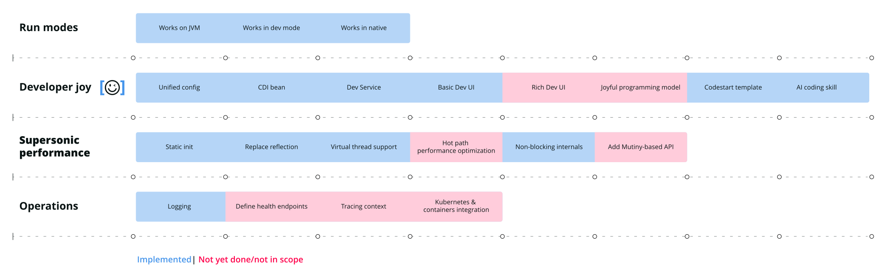

# A maturity matrix for Quarkus extensions

> **Guia oficial:** <https://quarkus.io/guides/extension-maturity-matrix>  
> **Fuente:** `docs/src/main/asciidoc/extension-maturity-matrix.adoc` en [quarkusio/quarkus@3.38.2](https://github.com/quarkusio/quarkus/blob/3.38.2/docs/src/main/asciidoc/extension-maturity-matrix.adoc)  
> **Version documentada:** Quarkus 3.38.2 · **Sincronizado:** 2026-08-17 · **Licencia:** Apache-2.0

What makes a good Quarkus extension? What capabilities is a Quarkus extension expected to provide? Of course, it depends on the extension you are building. But, we found a set of attributes common to many extensions. This document explains what they are. We can arrange these charactertistics into a maturity matrix. Here’s what the filled-in matrix might look like for a (made up) extension:

This isn’t defining an exact order, even within a single row. Different extensions have different goals, and different developers will have different views on what capabilities are most important. You may wish to (for example) prioritise a fantastic programming model over enhancing your extension’s Dev UI tile. That’s fine!

Also, not every step will apply to every extension. For example, you don’t need a Dev Service if your extension doesn’t depend on external services.

It’s completely OK to publish a first version of an extension that doesn’t handle everything. In fact, it’s OK if your extension _never_ gets to the more advanced features. This is a suggested pathway, not a minimum feature set.

Also note that this list only includes the technical features of your extension.
You might also want to think about how you share your extension, and how it presents itself to the world.
The [new extension checklist](https://hub.quarkiverse.io/checklistfornewprojects/) on the Quarkiverse Hub has a useful list of ways extensions can participate in the ecosystem.
It’s also a good idea to spend some time on the metadata in the [`quarkus-extension.yaml` file](https://quarkus.io/guides/extension-metadata#quarkus-extension-yaml), which is used by Quarkus tooling.

Here are some pointers on how to achieve those capabilities.

## Run modes

Quarkus applications can be run as a normal jar-based JVM application,
or live-coded in dev mode, or compiled to a native binary.
Each environment places different demands on framework extensions.

### Works in JVM mode

For most extensions, this is the minimum expectation.
When wrapping an existing library, this is usually trivial to achieve; if an extension is providing net-new capability, it might be a bit more work. Quarkus provides tools for [unit testing and integration testing](https://quarkus.io/guides/writing-extensions#testing-extensions) extensions.

### Works in dev mode

In some cases, extra work may be needed to ensure any wrapped libraries can tolerate
dev mode, since the classloading is different and hot reloading can break some assumptions. Extensions may also wish to add some
[special handling for dev mode](https://quarkus.io/guides/writing-extensions#integrating-with-development-mode).
To add automated tests which validate dev mode, you can [add tests which extend the `QuarkusDevModeTest`](https://quarkus.io/guides/writing-extensions#testing-hot-reload).

### Works as a native application

For many libraries, native mode support is the primary motivation for creating an extension. See [the guide on native executable support](https://quarkus.io/guides/writing-extensions#native-executable-support) for more discussion about some of the adaptations that might be needed.

## Developer Joy

Developer Joy is an important Quarkus principle.
Here are some extension capabilities that contribute to joyful development.

### Configuration support

Extensions should support Quarkus’s unified configuration, by [integrating with the Quarkus configuration model](https://quarkus.io/guides/writing-extensions#configuration).
The Writing Extensions guide has more guidance on [the Quarkus configuration philosophy](https://quarkus.io/guides/writing-extensions#how-to-expose-configuration).

### CDI Beans

Quarkus extensions should aim to [expose components via CDI](https://quarkus.io/guides/writing-extensions#expose-your-components-via-cdi), so that they can be consumed in a frictionless way by user applications.
Having everything injectable as CDI beans also helps testing, especially [mocking](../09-testing/getting-started-testing.md#mock-support).

### Dev Service

Dev Services are generally relevant for extensions that "connect" to something, such as databases for datasources, a keycloak instance for security, an Apache Kafka instance for messaging, etc.

To provide a Dev Service, use the `DevServicesResultBuildItem` build item. See the [Dev Services how-to](https://quarkus.io/guides/extension-writing-dev-service) for more information.

### Basic Dev UI

Every extension gets a tile in the Dev UI. The default tile pulls information from the [extension metadata](https://quarkus.io/guides/extension-metadata), which is another reason to spend a bit of time getting the metadata right.

Extensions also use Dev UI hooks to present extra information to users. For example, the tile could include a link to an external console, or an internal page which presents simple text metrics. See the [Dev UI for extension developers](../09-testing/dev-ui.md) guide.

### Rich Dev UI

Some extensions provide extremely sophisticated Dev UIs.
For example, they might allow users to interact with the running application (in dev mode), [respond to reloads](../09-testing/dev-ui.md#hot-reload), visualise application metrics, or [stream an application-specific log](../09-testing/dev-ui.md#footer).
The [Dev UI](../09-testing/dev-ui.md) guide also explains these more advanced options.

### Joyful programming model

Quarkus’s build-time philosophy means extensions can tidy up API boilerplate and make programming models more concise and expressive.
A good starting point is usually to use
   [Jandex](https://quarkus.io/guides/writing-extensions#scanning-deployments-using-jandex) to scan user code for annotations and other markers.
Although providing new, joyful, ways to do things is good,
it’s important to not break the normal patterns that users may be familiar with.

For some inspiration in this area, have a look at [simplified logging](../07-observabilidad/logging.md#simplified-logging), [simplified Hibernate ORM with Panache](https://quarkus.io/guides/hibernate-orm-panache), the [`@RestQuery` annotation](../02-web-http/rest-client.md#query-parameters), or the way Quarkus allows test containers to be used [without any configuration](../09-testing/getting-started-dev-services.md).

### Codestart application template

Codestarts are templates which can be used to generate applications for users.
Extensions can [provide their own codestart templates](https://quarkus.io/guides/extension-codestart).

### AI coding skill

Extensions can provide AI coding agents with extension-specific patterns, testing guidelines, and common pitfalls by shipping a `quarkus-skill.md` file.
This is a simple markdown file placed in the deployment module at `META-INF/quarkus-skill.md` — no build configuration is needed.
See [the Agent MCP guide](https://quarkus.io/guides/agent-mcp#extension-skills) for what to include and how skill files are composed with extension metadata.

## Supersonic subatomic performance

Extensions should use build-time application knowledge to eliminate wasteful runtime code paths. We call this supersonic subatomic performance.
Because Quarkus moves work to the build stage, Quarkus applications should have fast startup, high throughput, and low memory requirements. Performance tuning is a large subject, but extensions should use build-time application knowledge to eliminate wasteful runtime code paths at runtime.

### Static initialization

Do as much initialization as much as possible statically.
This avoid runtime overhead.

### Replace reflection with generated bytecode

Many Java libraries make heavy use of reflection to delay decisions to run-time. Quarkus aims to improve performance by moving logic to build time, reducing unnecessary dynamism.
Extensions should aim to replace reflection with build-time code.
This is enabled by
   [Jandex](https://quarkus.io/guides/writing-extensions#scanning-deployments-using-jandex), an "offline reflection" library. It may also be necessary to do some bytecode transformation of existing libraries.

For a case study of how to eliminate reflection and what the performance benefits turned out to be, see [reflectionless Jackson serialization](https://quarkus.io/blog/quarkus-metaprogramming/)

### Virtual thread support

Not every library is suitable for using with virtual threads, out of the box.
["Why not virtual threads everywhere?"](../01-fundamentos/virtual-threads.md#why-not) explains why.

To get your library working properly with virtual threads, you should make sure the library is not pinning the carrier thread.
 Quarkus has [test helpers to do these checks in an automated way](../01-fundamentos/virtual-threads.md#testing-virtual-thread-applications).
 For dispatching work, you should use the [virtual executor managed by Quarkus](../01-fundamentos/virtual-threads.md#inject-the-virtual-thread-executor). The [WebSockets-next extension](https://quarkus.io/extensions/io.quarkus/quarkus-websockets-next/) uses the virtual dispatcher and smart dispatch, and is a good example to follow.

### Hot path performance optimization

Although Quarkus offers some unique opportunities for extension performance, extension developers shouldn’t forget [the basics of performance optimization](https://www.linkedin.com/pulse/how-optimize-software-performance-efficiency-subcodevs/).

### Non-blocking internals

Quarkus’s reactive core is a key contributor to its excellent throughput and scalability. Extensions should consider adopting this model for their own internal operations.

### Add Mutiny-based APIs

For maximum scalability, go beyond the reactive core and enable fully reactive programming, using Mutiny. Most projects that support a reactive programming model offer two distinct extensions, a `-reactive` and a plain one.
See, for example, the [Hibernate ORM](https://quarkus.io/extensions/io.quarkus/quarkus-hibernate-orm/) and [Hibernate Reactive](https://quarkus.io/extensions/io.quarkus/quarkus-hibernate-reactive/) extensions.

## Operations

Developer joy is important, but so are observability, maintainability, and other operational considerations.
Many of these characteristics come by default with the Quarkus framework or [observability-focussed extensions](https://quarkus.io/extensions/io.quarkus/quarkus-opentelemetry/). But extensions can do more.

### Logging

Quarkus uses JBoss Logging as its logging engine, and [supports several logging APIs](../07-observabilidad/logging.md). (This is normal Java logging, not OpenTelemetry logging.)

Avoid using errors and warnings for conditions that will not affect normal operation. These outputs can cause false alarms in user monitoring systems.

### Define health endpoints

Extensions may wish to [define library-specific endpoints](https://quarkus.io/guides/writing-extensions#extension-defined-endpoints) for health criteria which are specific to that extension. To add a new endpoint, extensions should produce a `NonApplicationRootPathBuildItem`.

### Tracing context

You should test that OpenTelemetry output for applications using your extension have properly-defined spans. You may need to do extra work to ensure spans are created with the right tracing ID.
For example, extensions which have reactive internals should support [duplicated contexts](../01-fundamentos/duplicated-context.md) for correct context propagation.

### Advanced Kubernetes and containers integration

Quarkus is designed to be a Kubernetes-native runtime.
Extensions can continue this philosophy by adding library-specific integration points with Kubernetes.
Being Kubernetes-native implies being container-native. At a minimum, extensions should always work well in containers, but extensions may also have opportunities to integrate with the lower levels of the container stack.

## References

* [Writing your own extension](https://quarkus.io/guides/writing-extensions) guide
* [Building your first extension](https://quarkus.io/guides/building-my-first-extension)
* [The Quarkiverse Hub documentation](https://hub.quarkiverse.io.adoc)
