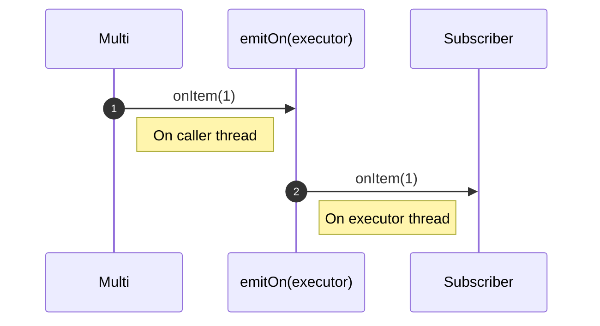
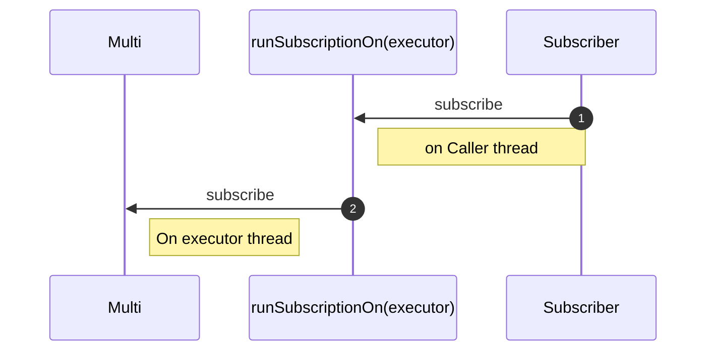

# What is the difference between emitOn and runSubscriptionOn?

> **Documentacion oficial:** <https://smallrye.io/smallrye-mutiny/latest/guides/emit-on-vs-run-subscription-on>  
> **Fuente:** `documentation/docs/guides/emit-on-vs-run-subscription-on.md` en [smallrye/smallrye-mutiny@3.3.0](https://github.com/smallrye/smallrye-mutiny/blob/3.3.0/documentation/docs/guides/emit-on-vs-run-subscription-on.md)  
> **Version documentada:** Mutiny 3.3.0 · **Sincronizado:** 2026-08-17 · **Licencia:** Apache-2.0

The `emitOn` and `runSubscriptionOn` are 2 operators influencing on which threads the event are dispatched.
However, they target different types of events and different directions.

## The case of emitOn

`emitOn` takes events coming from upstream (items, completion, failure) and replays them downstream on a thread from the given executor.
Consequently, it affects where the subsequent operators execute (until another `emitOn` is used):

```java
Multi.createFrom().items(this::retrieveItemsFromSource)
        .emitOn(executor)
        .onItem().transform(this::applySomeOperation)
        .subscribe().with(
        item -> System.out.println("Item: " + item),
        Throwable::printStackTrace,
        () -> completed.set(true)
);
```

The previous code produces the following sequence:



> **⚠️ AVISO**
>
> Be careful as this operator can lead to concurrency problems with non thread-safe objects such as CDI request-scoped beans.
> It might also break reactive-streams semantics with items being emitted concurrently.

## The case of runSubscriptionOn

`runSubscriptionOn` applies to the subscription process.
It requests the upstream to run its subscription (call of the `subscribe` method on its own upstream) on a thread from the given executor:

```java
Multi.createFrom().items(() -> {
    // called on a thread from the executor
    return retrieveItemsFromSource();
})
        .onItem().transform(this::applySomeOperation)
        .runSubscriptionOn(executor)
        .subscribe().with(
        item -> System.out.println("Item: " + item),
        Throwable::printStackTrace,
        () -> completed.set(true)
);
```

So, if we consider the previous code snippet, it produces the following sequence:


