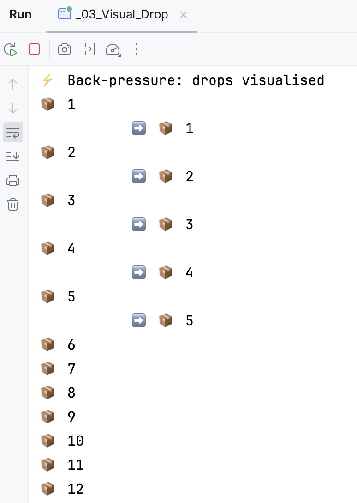

# Go further with the Mutiny workshop!

> **Documentacion oficial:** <https://smallrye.io/smallrye-mutiny/latest/tutorials/mutiny-workshop>  
> **Fuente:** `documentation/docs/tutorials/mutiny-workshop.md` en [smallrye/smallrye-mutiny@3.3.0](https://github.com/smallrye/smallrye-mutiny/blob/3.3.0/documentation/docs/tutorials/mutiny-workshop.md)  
> **Version documentada:** Mutiny 3.3.0 · **Sincronizado:** 2026-08-17 · **Licencia:** Apache-2.0

One great option to teach yourself Mutiny is to go through the [Mutiny workshop examples](https://github.com/smallrye/smallrye-mutiny/tree/main/workshop-examples).

These self-contained [JBang](https://jbang.dev/) scripts cover the main parts of the Mutiny APIs.

It's a fun and easy way to discover Mutiny!

Check out [https://github.com/smallrye/smallrye-mutiny/tree/main/workshop-examples](https://github.com/smallrye/smallrye-mutiny/tree/main/workshop-examples) to learn more.

{ width="400" }
