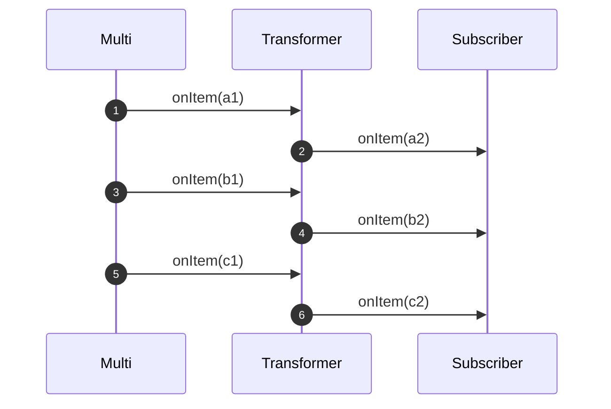

# Transforming items

> **Documentacion oficial:** <https://smallrye.io/smallrye-mutiny/latest/tutorials/transforming-items>  
> **Fuente:** `documentation/docs/tutorials/transforming-items.md` en [smallrye/smallrye-mutiny@3.3.0](https://github.com/smallrye/smallrye-mutiny/blob/3.3.0/documentation/docs/tutorials/transforming-items.md)  
> **Version documentada:** Mutiny 3.3.0 · **Sincronizado:** 2026-08-17 · **Licencia:** Apache-2.0

Both `Unis` and `Multis` emit _items_.

One of the most common operations you will do is transforming these items using a _synchronous_ 1-to-1 function.

To achieve this, you use `onItem().transform(Function<T, U>)`.
It calls the passed function for each item and produces the result as an item which is propagated downstream.



## Transforming items produced by a Uni

Let's imagine you have a `Uni<String>,` and you want to capitalize the received `String`.
Implementing this transformation is done as follows:

```java
Uni<String> someUni = Uni.createFrom().item("hello");
someUni
        .onItem().transform(i -> i.toUpperCase())
        .subscribe().with(
                item -> System.out.println(item)); // Print HELLO
```

## Transforming items produced by a Multi

The only difference for `Multi` is that the function is called for each item:

```java
Multi<String> m = multi.onItem().transform(i -> i.toUpperCase());
```

The produced items are passed to the downstream subscriber:

```java
Multi<String> someMulti = Multi.createFrom().items("a", "b", "c");
someMulti
        .onItem().transform(i -> i.toUpperCase())
        .subscribe().with(
                item -> System.out.println(item)); // Print A B C
```

## What if the transformation failed?

If the transformation throws an exception, that exception is caught and passed to the downstream subscriber as a _failure_ event.
It also means that the subscriber won't get further item after that failure.

## Chaining multiple transformations

You can chain multiple transformations:

```java
Uni<String> u = uni
        .onItem().transform(i -> i.toUpperCase())
        .onItem().transform(i -> i + "!");
```
